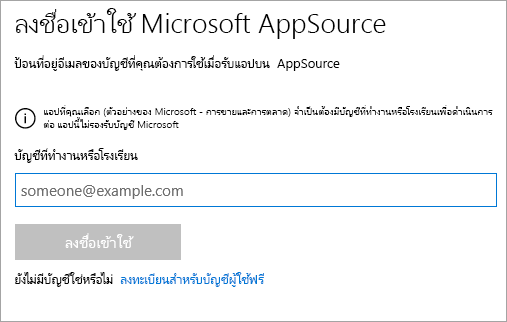
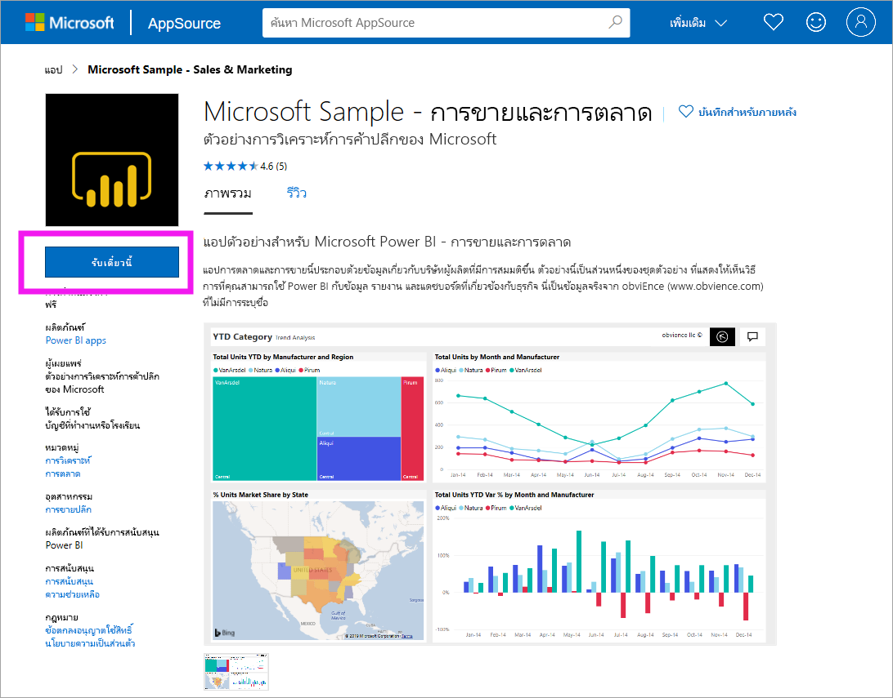
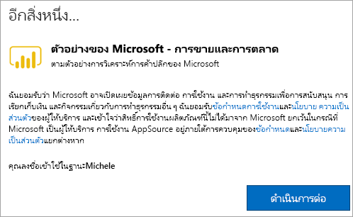
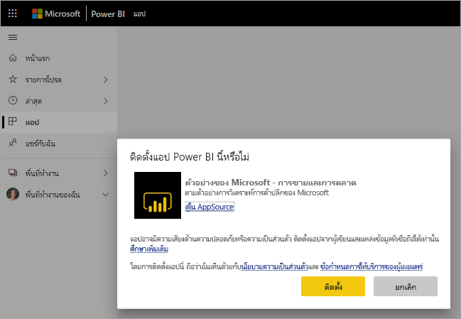
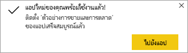
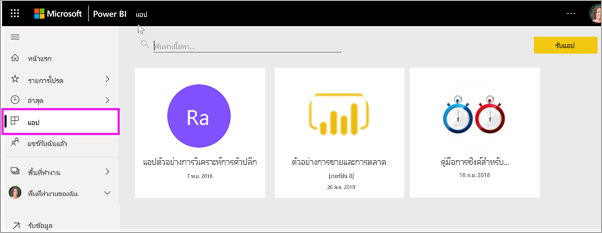
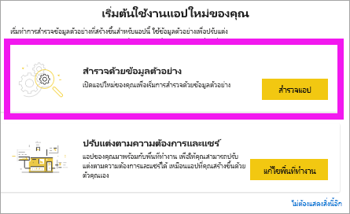
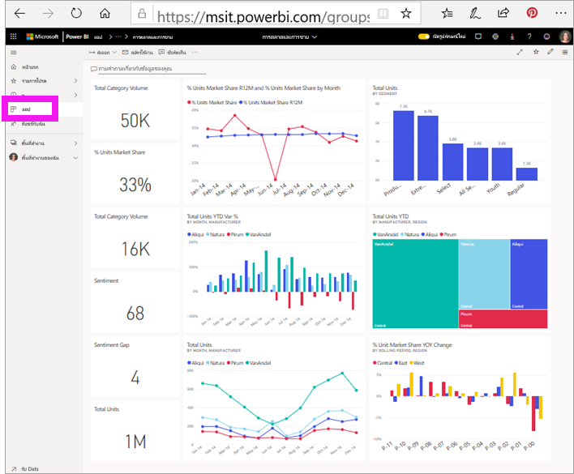

# ติดตั้งและใช้แอปตัวอย่างการขายและการตลาดในบริการของ Power BI

[!INCLUDE[consumer-appliesto-yyny](../includes/consumer-appliesto-yyny.md)]

ในตอนนี้คุณมี[ความเข้าใจพื้นฐานเกี่ยวกับวิธีการรับเนื้อหา Power BI](end-user-app-view.md) แล้ว เราจะดาวน์โหลดแอปการขายและการตลาดจาก Microsoft AppSource (appsource.com) กัน 

## Microsoft AppSource (appsource.com)
ต่อไปนี้คือลิงก์ไปยังแอป: [แอปการตลาดและการขาย](https://appsource.microsoft.com/product/power-bi/microsoft-retail-analysis-sample.salesandmarketingsample?tab=Overview) การเลือกลิงก์นี้จะเปิดหน้าดาวน์โหลดสำหรับแอปนี้บน Microsoft AppSource 

1. คุณอาจต้องลงชื่อเข้าใช้ก่อนจึงจะสามารถดาวน์โหลดแอปได้ ลงชื่อเข้าใช้ด้วยอีเมลแอดเดรสเดียวกันกับที่คุณใช้สำหรับ Power BI 

    

2. เลือก**รับทันที** 

    

3. หากคุณลงชื่อเข้าใช้ AppSource เป็นครั้งแรก คุณจะต้องยอมรับข้อกำหนดการใช้งาน 

    

4. บริการของ Power BI เปิดขึ้นมา ยืนยันว่าคุณต้องการติดตั้งแอปนี้

    

5. บริการของ Power BI จะแสดงข้อความความสำเร็จเมื่อมีการติดตั้งแอปแล้ว เลือก**ไปที่แอป**เพื่อเปิดแอป แดชบอร์ดของแอปหรือรายงานแอปจะแสดงขึ้นตามวิธีการที่นักออกแบบสร้างแอป

    

    คุณยังสามารถเปิดแอปได้โดยตรงจากรายการเนื้อหาแอปของคุณโดยการเลือก**แอป** และเลือก **Sales & Marketing**

    

6. เลือกว่าจะสำรวจหรือกำหนดค่าและแชร์แอปใหม่ของคุณหรือไม่ เนื่องจากเราได้เลือกแอปตัวอย่าง Microsoft มาเริ่มต้นด้วยการสำรวจ 

    

7.  แอปใหม่ของคุณเปิดขึ้นพร้อมกับแดชบอร์ด *นักออกแบบ*แอปสามารถตั้งค่าแอปเพื่อเปิดรายงานแทนได้  

    

## โต้ตอบกับแดชบอร์ดและรายงานในแอป
ใช้เวลาสักครู่เพื่อสำรวจข้อมูลในแดชบอร์ดและรายงานที่สร้างแอป คุณสามารถเข้าถึงการโต้ตอบของ Power BI แบบมาตรฐานทั้งหมดเช่น การกรอง การเน้น การเรียงลำดับ และการดูรายละเอียดแนวลึก  ยังสับสนเล็กน้อยจากความแตกต่างระหว่างแดชบอร์ดและรายงานหรือไม่  อ่าน[บทความเกี่ยวกับแดชบอร์ด](end-user-dashboards.md)และ[บทความเกี่ยวกับรายงาน](end-user-reports.md)  

## ขั้นตอนถัดไป
* [กลับไปยังภาพรวมของแอป](end-user-apps.md)
* [ดูรายงาน Power BI](end-user-report-open.md)
* [มีการแชร์เนื้อหาด้วยวิธีอื่นกับคุณ](end-user-shared-with-me.md)
