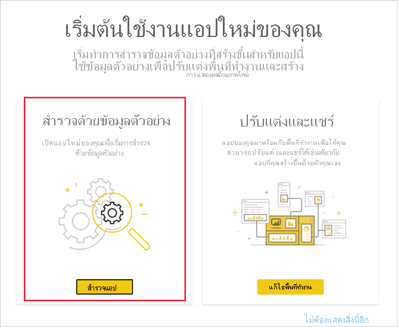

# ติดตั้งและใช้แอปตัวอย่างการขายและการตลาดในบริการของ Power BI

[!INCLUDE[consumer-appliesto-yyny](../includes/consumer-appliesto-yyny.md)]

ในตอนนี้คุณมี[ความเข้าใจพื้นฐานเกี่ยวกับวิธีการรับเนื้อหา Power BI](end-user-app-view.md) แล้ว เราจะดาวน์โหลดแอปการขายและการตลาดจาก Microsoft AppSource (appsource.com) กัน 

## รับแอปจากตลาดสินค้าแอป Power BI

1. [ลงชื่อเข้าใช้บริการของ Power BI](./end-user-sign-in.md) หากคุณยังไม่ได้ลงชื่อเข้าใช้ 

1. เมื่อคุณอยู่ใน Power BI ให้เลือก **แอป > รับแอป** 

    

1. ตลาดสินค้าแอป Power BI จะเปิดขึ้น ค้นหาแอปการขายและการตลาด หากคุณไม่เห็น ให้ลองพิมพ์ "การขาย" ในกล่องค้นหา

    

1. คลิกที่ไทล์ของแอป ข้อเสนอของแอป AppSource จะเปิดขึ้น คลิก **รับทันที**

   

1. ยืนยันว่าคุณต้องการติดตั้งแอปนี้

   

5. บริการของ Power BI จะแสดงข้อความยืนยันเมื่อมีการติดตั้งแอปแล้ว เลือก**ไปที่แอป**เพื่อเปิดแอป แดชบอร์ดของแอปหรือรายงานแอปจะแสดงขึ้นตามวิธีการที่นักออกแบบสร้างแอป

    

    คุณยังสามารถเปิดแอปได้โดยตรงจากรายการเนื้อหาแอปของคุณโดยการเลือก**แอป** และเลือก **Sales & Marketing**

    

6. เลือกว่าจะสำรวจหรือกำหนดค่าและแชร์แอปใหม่ของคุณหรือไม่ เนื่องจากเราได้เลือกแอปตัวอย่าง Microsoft มาเริ่มต้นด้วยการสำรวจ 

    

7.  แอปใหม่ของคุณเปิดขึ้นพร้อมกับแดชบอร์ด *นักออกแบบ*แอปสามารถตั้งค่าแอปเพื่อเปิดรายงานแทนได้  

    

## โต้ตอบกับแดชบอร์ดและรายงานในแอป
ใช้เวลาสักครู่เพื่อสำรวจข้อมูลในแดชบอร์ดและรายงานที่สร้างแอป คุณสามารถเข้าถึงการโต้ตอบของ Power BI แบบมาตรฐานทั้งหมดเช่น การกรอง การเน้น การเรียงลำดับ และการดูรายละเอียดแนวลึก  ยังสับสนเล็กน้อยจากความแตกต่างระหว่างแดชบอร์ดและรายงานหรือไม่  อ่าน[บทความเกี่ยวกับแดชบอร์ด](end-user-dashboards.md)และ[บทความเกี่ยวกับรายงาน](end-user-reports.md)  

## ขั้นตอนถัดไป
* [กลับไปยังภาพรวมของแอป](end-user-apps.md)
* [ดูรายงาน Power BI](end-user-report-open.md)
* [มีการแชร์เนื้อหาด้วยวิธีอื่นกับคุณ](end-user-shared-with-me.md)
