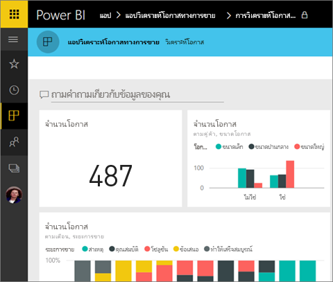
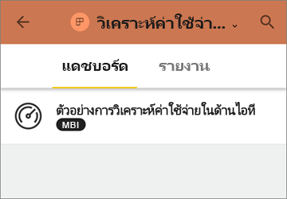
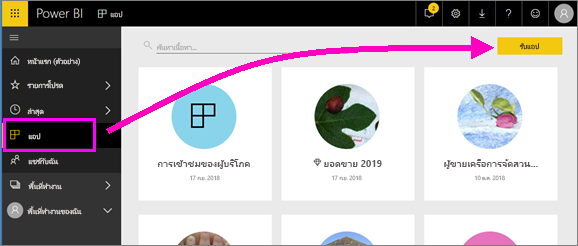
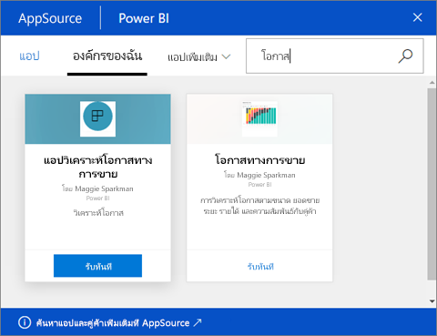
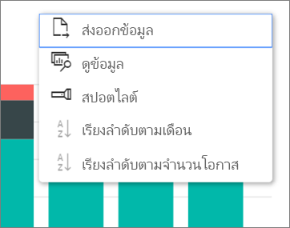

# ติดตั้งและใช้แอปกับแดชบอร์ดและรายงาน
ตอนนี้คุณมี [ความเข้าใจพื้นฐานของแอป](end-user-apps.md) มาเรียนรู้วิธีเปิดและโต้ตอบกับแอป 

## วิธีรับแอปใหม่
อย่าลืม มีหลายวิธีในการรับแอปใหม่ เพื่อนร่วมงานนักออกแบบรายงานสามารถติดตั้งแอปโดยอัตโนมัติในบัญชี Power BI หรือส่งคุณลิงก์โดยตรงไปยังแอป และ คุณสามารถไปที่ AppSource และค้นหาแอปที่มีให้คุณทั้งภายในและภายนอกบริษัทของคุณ 

ใน Power BI บนอุปกรณ์เคลื่อนที่ของคุณ คุณสามารถเติดตั้งแอปได้ จากลิงก์โดยตรงเท่านั้น และไม่สามารถตัดตั้งจาก AppSource ถ้าผู้สร้างแอปติดตั้งแอปโดยอัตโนมัติ คุณจะเห็นได้ในรายการของแอป

### ติดตั้งแอปจากลิงก์โดยตรง
วิธีง่ายที่สุดในการติดตั้งแอปใหม่ด้วยตัวคุณเอง เพื่อรับลิงก์ในอีเมลโดยตรงจากผู้เขียนแอป  

**บนคอมพิวเตอร์ของคุณ** 

เมื่อคุณเลือกที่ลิงก์ในอีเมล บริการของ Power BI ([https://powerbi.com](https://powerbi.com)) จะเปิดขึ้นในเบราว์เซอร์ ยืนยันว่าคุณต้องการติดตั้งแอป และ Power BI จะเปิดขึ้นในหน้ารับของแอป

**บน iOS หรืออุปกรณ์เคลื่อนที่ Android ของคุณ** 

เมื่อคุณเลือกลิงก์ในอีเมลบนอุปกรณ์เคลื่อนที่ของคุณ แอปจะติดตั้งโดยอัตโนมัติและเปิดรายการเนื้อหาของแอปในแอปบนมือถือ 

### ดาวน์โหลดแอปจาก Microsoft AppSource
นอกจากนี้คุณยังสามารถค้นหาและติดตั้งแอปจาก Microsoft AppSource ได้ เฉพาะแอปที่คุณเข้าถึง (เช่น ผู้เขียนแอปให้สิทธิ์แก่คุณหรืออนุญาตให้ทุกคน) จะปรากฎขึ้น

1. เลือก**แอป**  > **รับแอป** 
   
     
2. ใน AppSource ภายใต้**องค์กรของฉัน**คุณสามารถค้นหาเพื่อจำกัดขอบเขตผลลัพธ์ และค้นหาแอปที่คุณกำลังค้นหาได้
   
     
3. เลือก**รับทันที**เพื่อเพิ่มลงในรายการเนื้อหาแอปของคุณ 

## โต้ตอบกับแดชบอร์ดและรายงานในแอป
ในตอนนี้ คุณสามารถสำรวจข้อมูลในแดชบอร์ดและรายงานในแอป คุณสามารถเข้าถึงโต้ตอบกับ Power BI แบบมาตรฐานทั้งหมดเช่นการกรอง เน้น เรียงลำดับ และดริลดาวน์ คุณยังสามารถ[ส่งออกข้อมูลไปยัง Excel](end-user-export-data.md) จากตารางหรือภาพอื่นๆ ในรายงานได้ อ่านเกี่ยวกับ[โต้ตอบกับรายงานใน Power BI](end-user-reading-view.md) 

## ขั้นตอนถัดไป
* [แอป Power BI สำหรับบริการภายนอก](end-user-connect-to-services.md)
* มีคำถามหรือไม่ [ลองถามชุมชน Power BI](http://community.powerbi.com/)

