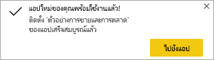

# ติดตั้งและใช้แอปกับแดชบอร์ดและรายงาน
ตอนนี้คุณมี [ความเข้าใจพื้นฐานของแอป](end-user-apps.md) มาเรียนรู้วิธีเปิดและโต้ตอบกับแอป 

## วิธีรับแอปใหม่
มีหลายวิธีในการรับแอปใหม่ เพื่อนร่วมงานนักออกแบบรายงานสามารถติดตั้งแอปโดยอัตโนมัติในบัญชี Power BI หรือส่งคุณลิงก์โดยตรงไปยังแอป และ คุณสามารถไปที่ AppSource และค้นหาแอปที่มีให้คุณจากนักออกแบบแอป ทั้งภายในและภายนอกบริษัทของคุณ 

ใน Power BI บนอุปกรณ์เคลื่อนที่ของคุณ คุณสามารถเติดตั้งแอปได้ จากลิงก์โดยตรงเท่านั้น และไม่สามารถตัดตั้งจาก AppSource ถ้าผู้ออกแบบแอปติดตั้งแอปโดยอัตโนมัติ คุณจะเห็นได้ในรายการของแอป

## ติดตั้งแอปจากลิงก์โดยตรง
วิธีง่ายที่สุดในการติดตั้งแอปใหม่ด้วยตัวคุณเอง เพื่อรับลิงก์ในอีเมลโดยตรงจากนักออกแบบแอป  

**บนคอมพิวเตอร์ของคุณ** 

เมื่อคุณเลือกที่ลิงก์ในอีเมล บริการของ Power BI ([https://powerbi.com](https://powerbi.com)) จะเปิดแอปในเบราว์เซอร์ของคุณ 

**บน iOS หรืออุปกรณ์เคลื่อนที่ Android ของคุณ** 

เมื่อคุณเลือกลิงก์ในอีเมลบนอุปกรณ์เคลื่อนที่ของคุณ แอปจะติดตั้งโดยอัตโนมัติและเปิดในแอปสำหรับอุปกรณ์เคลื่อนที่ คุณอาจต้องลงชื่อเข้าใช้ก่อน 

## ดาวน์โหลดแอปจาก Microsoft AppSource
นอกจากนี้คุณยังสามารถค้นหาและติดตั้งแอปจาก Microsoft AppSource ได้ เฉพาะแอปที่คุณเข้าถึง (เช่น ผู้เขียนแอปให้สิทธิ์แก่คุณหรืออนุญาตให้ทุกคน) จะปรากฎขึ้น

1. เลือก**แอป**  >  **รับแอป** 
   
        
2. ใน AppSource ภายใต้**องค์กรของฉัน**คุณสามารถค้นหาเพื่อจำกัดขอบเขตผลลัพธ์ และค้นหาแอปที่คุณกำลังค้นหาได้
   
    
3. เลือก**รับทันที**เพื่อเพิ่มลงในรายการเนื้อหาแอปของคุณ 

## รับแอปจากเว็บไซต์ Microsoft AppSource (https://appsource.microsoft.com)
ในตัวอย่างนี้ เราจะเปิดหนึ่งในแอปตัวอย่างของ Microsoft บน AppSource คุณจะพบแอปสำหรับบริการหลายอย่างที่คุณใช้เพื่อเรียกใช้ธุรกิจของคุณ  บริการเช่น Salesforce, Microsoft Dynamics, Google Analytics, GitHub, Zendesk, Marketo และอื่น ๆ อีกมากมาย เมื่อต้องการเรียนรู้เพิ่มเติม ดู[แอปสำหรับบริการที่คุณใช้กับ Power BI](../service-connect-to-services.md) 

1. ในเบราว์เซอร์ เปิด https://appsource.microsoft.com และเลือก**แอป Power BI**

    

2. เลือก**ดูทั้งหมด**เพื่อแสดงรายการของแอป Power BI ทั้งหมดที่พร้อมใช้งานใน AppSource ขณะนี้ เลื่อนหรือค้นหาแอปที่มีชื่อว่า **Microsoft Sample - Sales & Marketing**

    

3. เลือก**รับทันที**และเห็นด้วยกับข้อกำหนดการใช้

    

4. ยืนยันว่าคุณต้องการติดตั้งแอปนี้

    

5. บริการของ Power BI จะแสดงข้อความความสำเร็จเมื่อมีการติดตั้งแอปแล้ว เลือก**ไปที่แอป**เพื่อเปิดแอป แดชบอร์ดของแอปหรือรายงานแอปจะแสดงขึ้นตามวิธีการที่นักออกแบบสร้างแอป

    

    คุณยังสามารถเปิดแอปได้โดยตรงจากรายการเนื้อหาแอปของคุณโดยการเลือก**แอป** และเลือก **Sales & Marketing**

    

6. เลือกว่าจะสำรวจหรือกำหนดค่าและแชร์แอปใหม่ของคุณหรือไม่ เนื่องจากเราได้เลือกแอปตัวอย่าง Microsoft มาเริ่มต้นด้วยการสำรวจ 

    

7.  แอปใหม่ของคุณเปิดขึ้นพร้อมกับแดชบอร์ด *นักออกแบบ*แอปจะไม่สามารถตั้งค่าแอปเพื่อเปิดรายงานแทนได้  

    

## โต้ตอบกับแดชบอร์ดและรายงานในแอป
ใช้เวลาสักครู่เพื่อสำรวจข้อมูลในแดชบอร์ดและรายงานที่สร้างแอป คุณสามารถเข้าถึงการโต้ตอบของ Power BI แบบมาตรฐานทั้งหมดเช่น การกรอง การเน้น การเรียงลำดับ และการดูรายละเอียดแนวลึก  ยังสับสนเล็กน้อยจากความแตกต่างระหว่างแดชบอร์ดและรายงานหรือไม่  อ่าน[บทความเกี่ยวกับแดชบอร์ด](end-user-dashboards.md)และ[บทความเกี่ยวกับรายงาน](end-user-reports.md)  

## ขั้นตอนถัดไป
* [กลับไปยังภาพรวมของแอป](end-user-apps.md)
* [ดูรายงาน Power BI](end-user-report-open.md)
* [มีการแชร์เนื้อหาด้วยวิธีอื่นกับคุณ](end-user-shared-with-me.md)
