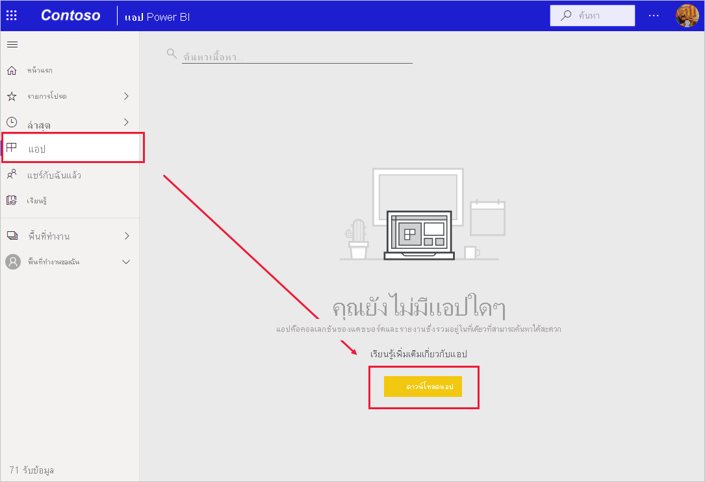

# ติดตั้งและใช้แอปกับแดชบอร์ดและรายงาน

[!INCLUDE[consumer-appliesto-ynny](../includes/consumer-appliesto-ynny.md)]

[!INCLUDE [power-bi-service-new-look-include](../includes/power-bi-service-new-look-include.md)]

ตอนนี้คุณมี [ความเข้าใจพื้นฐานของแอป](end-user-apps.md) มาเรียนรู้วิธีเปิดและโต้ตอบกับแอป 

## วิธีรับแอปใหม่
มีหลายวิธีในการรับแอปใหม่:
* คุณสามารถรับได้จาก marketplace ของแอป Power BI ใน Power BI
* คุณสามารถใช้ลิงก์โดยตรงไปยังแอปที่คุณได้รับจากผู้สร้างแอป 
* ตัวออกแบบรายงานในองค์กรของคุณสามารถติดตั้งแอปโดยอัตโนมัติในบัญชี Power BI ของคุณ

ในแอป Power BI สำหรับอุปกรณ์เคลื่อนที่ของคุณคุณสามารถติดตั้งแอปจากลิงก์โดยตรงเท่านั้น ถ้าผู้ออกแบบแอปติดตั้งแอปโดยอัตโนมัติ คุณจะเห็นได้ในรายการของแอป

## แอปและสิทธิ์การใช้งาน
ไม่ใช่ว่าผู้ใช้ Power BI ทั้งหมดจะสามารถดูและโต้ตอบกับแอปได้ 
- ถ้าคุณมีสิทธิ์การใช้งานฟรี คุณสามารถเปิดแอปที่แชร์กับคุณได้ และแอปเหล่านั้นถูกจัดเก็บไว้ในพื้นที่ทำงานในความจุระดับพรีเมียม
- หากคุณมีสิทธิ์การใช้งาน Pro คุณสามารถเปิดแอปที่แชร์กับคุณได้

## รับแอปจาก marketplace ของแอป Power BI

คุณสามารถค้นหาและติดตั้งแอปจาก marketplace ของแอป Power BI ได้ ในแอป marketplace คุณสามารถรับทั้งแอปเทมเพลตและแอปแบบองค์กรได้

1. [ลงชื่อเข้าใช้บริการของ Power BI](./end-user-sign-in.md) ถ้าคุณยังไม่ได้ลงชื่อเข้าระบบ 

1. เมื่อคุณอยู่ใน Power BI ให้เลือก **แอป > รับแอป** 

    

1. Power BI apps marketplace จะเปิดขึ้น

   

   มีสามแท็บที่พร้อมให้คุณได้ใช้:
   * **แอปทั้งหมด** - เรียกดูทั้งแอปแบบเทมเพลตและแอปแบบองค์กรทั้งหมดที่พร้อมใช้งานสำหรับคุณ แอปเทมเพลตนั้นโดดเด่นด้วยไอคอนถุงช็อปปิ้งที่มุมขวาบนของไทล์
   * **แอปขององค์กร** - เรียกดูแอปขององค์กรที่มีการแชร์กับคุณ 
   * **แอปแบบเทมเพลต** - เรียกดูแอปแบบเทมเพลตที่โฮสต์บน AppSource

   อีกวิธีหนึ่งคือ คุณสามารถใช้กล่องค้นหาเพื่อรับการเลือกแอปพลิเคชันที่กรองแล้ว การพิมพ์ส่วนหนึ่งของชื่อแอป หรือประเภทเช่น การเงิน การวิเคราะห์ การตลาด และอื่นๆ จะช่วยให้ง่ายต่อการค้นหารายการที่คุณกำลังมองหา 

   กล่องค้นหามีความสำคัญกับแท็บที่คุณมีแอปที่เปิดอย่างเดียวของชนิดที่เลือกเท่านั้นที่จะถูกส่งกลับ ถ้าแท็บ **แอปทั้งหมด** เปิดอยู่ทั้งแอปองค์กรและแบบเทมเพลตจะถูกส่งกลับ ซึ่งสามารถทำให้เกิดความสับสนได้เมื่อแอปองค์กรและแอปแบบเทมเพลตมีชื่อเดียวกัน โปรดจำไว้ว่าไทล์แอปแบบเทมเพลตจะมีไอคอนถุงช้อปปิ้งในมุมบนขวา

เมื่อคุณพบแอปที่คุณต้องการให้คลิก **รับทันที** เพื่อติดตั้ง
* หากคุณกำลังติดตั้งแอปองค์กร มันจะถูกเพิ่มลงในรายการแอปของคุณทันที
* ถ้าคุณกำลังติดตั้งแอปแบบเทมเพลต คุณจะถูกนำไปยังแอปแบบเทมเพลตที่เสนอใน AppSource ดู [ตัวอย่าง](end-user-app-marketing.md) ของวิธีการดาวน์โหลดและติดตั้งแอปแบบเทมเพลตตัวอย่างจาก Power BI apps marketplace 

   > [!NOTE]
   > หากคุณกำลังใช้สิทธิ์การใช้งานฟรี คุณจะสามารถดาวน์โหลดแอปได้ แต่จะไม่สามารถดูไฟล์เหล่านั้นได้ เว้นแต่ว่าคุณอัปเกรดเป็นบัญชี Power BI Pro หรือเว้นแต่ว่าแอปจะถูกจัดเก็บไว้ในความจุระดับพรีเมียม สำหรับข้อมูลเพิ่มเติม ให้ดู [สิทธิ์การใช้งานสำหรับผู้ใช้](end-user-license.md)

## ติดตั้งแอปจากลิงก์โดยตรง
คุณยังสามารถติดตั้งแอปแบบองค์กรจากลิงก์โดยตรงในอีเมลจากตัวออกแบบแอป  

**บนคอมพิวเตอร์ของคุณ** 

เมื่อคุณเลือกที่ลิงก์ในอีเมล บริการของ Power BI ([https://powerbi.com](https://powerbi.com)) จะเปิดแอปในเบราว์เซอร์ของคุณ 

**บน iOS หรืออุปกรณ์เคลื่อนที่ Android ของคุณ** 

เมื่อคุณเลือกลิงก์ในอีเมลบนอุปกรณ์เคลื่อนที่ของคุณ แอปจะติดตั้งโดยอัตโนมัติและเปิดในแอปสำหรับอุปกรณ์เคลื่อนที่ คุณอาจต้องลงชื่อเข้าใช้ก่อน 

## โต้ตอบกับแดชบอร์ดและรายงานในแอป
ใช้เวลาสักครู่เพื่อสำรวจข้อมูลในแดชบอร์ดและรายงานที่สร้างแอป คุณสามารถเข้าถึงการโต้ตอบของ Power BI แบบมาตรฐานทั้งหมดเช่น การกรอง การเน้น การเรียงลำดับ และการดูรายละเอียดแนวลึก  ยังสับสนเล็กน้อยจากความแตกต่างระหว่างแดชบอร์ดและรายงานหรือไม่  อ่าน[บทความเกี่ยวกับแดชบอร์ด](end-user-dashboards.md)และ[บทความเกี่ยวกับรายงาน](end-user-reports.md)  

## อัปเดตแอป 

ในบางครั้ง ผู้สร้างแอปอาจเผยแพร่แอปเวอร์ชันใหม่ของพวกเขา การค้นหาเวอร์ชันใหม่จะขึ้นอยู่กับวิธีการที่คุณได้รับเวอร์ชันเดิม 

* หากคุณได้รับแอปมาจากองค์กรของคุ การอัปเดตเป็นเวอร์ชันใหม่จะเป็นไปอย่างโปร่งใสอย่างยิ่ง และคุณไม่จำเป็นต้องทำอะไรเลย 

* ถ้าคุณมีแอปจาก AppSource ในครั้งถัดไปที่คุณเปิดแอปคุณจะเห็นแบนเนอร์การแจ้งเตือน การแจ้งเตือนช่วยให้คุณทราบว่าเวอร์ชันใหม่พร้อมใช้งานแล้ว 

    1. เลือก**รับทันที**เพื่ออัปเดต  

        <!-- -->

    2. เมื่อได้รับพร้อมท์ ให้ติดตั้งแอปที่อัปเดตแล้วเลือก **ติดตั้ง** 

         

    3. เนื่องจากคุณมีเวอร์ชันของแอปนี้อยู่แล้ว ให้ตัดสินใจว่าจะแทนที่เวอร์ชันที่มีอยู่หรือจะติดตั้งแอปที่อัปเดตแล้วในพื้นที่ทำงานใหม่   

         

    > [!NOTE] 
    > การติดตั้งเวอร์ชั่นใหม่จะเป็นการเขียนทับการเปลี่ยนแปลงใด ๆ ที่คุณมีกับรายงานดังกล่าวและแดชบอร์ด เพื่อให้คุณได้เก็บรายงานและแดชบอร์ดล่าสุด คุณจะสามารถบันทึกไว้ในชื่อหรือตำแหน่งอื่นก่อนทำการติดตั้ง 

    4. เมื่อคุณติดตั้งเวอร์ชันอัปเดตแล้ว ให้เลือก**อัปเดตแอป** เพื่อดำเนินกระบวนการอัปเดตให้เสร็จสมบูรณ์ 

## ขั้นตอนถัดไป
* [กลับไปยังภาพรวมของแอป](end-user-apps.md)
* [ดูรายงาน Power BI](end-user-report-open.md)
* [มีการแชร์เนื้อหาด้วยวิธีอื่นกับคุณ](end-user-shared-with-me.md)

