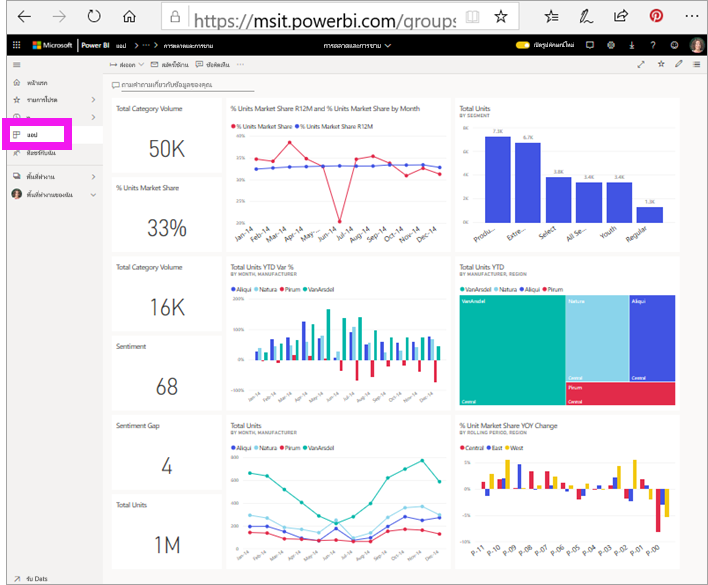

# ติดตั้งและใช้แอปกับแดชบอร์ดและรายงาน

[!INCLUDE[consumer-appliesto-ynny](../includes/consumer-appliesto-ynny.md)]

[!INCLUDE [power-bi-service-new-look-include](../includes/power-bi-service-new-look-include.md)]

ตอนนี้คุณมี [ความเข้าใจพื้นฐานของแอป](end-user-apps.md) มาเรียนรู้วิธีเปิดและโต้ตอบกับแอป 

## วิธีรับแอปใหม่
มีหลายวิธีในการรับแอปใหม่ เพื่อนร่วมงานนักออกแบบรายงานสามารถติดตั้งแอปโดยอัตโนมัติในบัญชี Power BI หรือส่งคุณลิงก์โดยตรงไปยังแอป และ คุณสามารถไปที่ AppSource และค้นหาแอปที่มีให้คุณจากนักออกแบบแอป ทั้งภายในและภายนอกบริษัทของคุณ 

ใน Power BI บนอุปกรณ์เคลื่อนที่ของคุณ คุณสามารถเติดตั้งแอปได้ จากลิงก์โดยตรงเท่านั้น และไม่สามารถตัดตั้งจาก AppSource ถ้าผู้ออกแบบแอปติดตั้งแอปโดยอัตโนมัติ คุณจะเห็นได้ในรายการของแอป

## แอปและสิทธิ์การใช้งาน
ไม่ใช่ว่าผู้ใช้ Power BI ทั้งหมดจะสามารถดูและโต้ตอบกับแอปได้ 
- ถ้าคุณมีสิทธิ์การใช้งานฟรี คุณสามารถเปิดแอปที่แชร์กับคุณได้ และแอปเหล่านั้นถูกจัดเก็บไว้ในพื้นที่ทำงานในความจุระดับพรีเมียม
- หากคุณมีสิทธิ์การใช้งาน Pro คุณสามารถเปิดแอปที่แชร์กับคุณได้

## ติดตั้งแอปจากลิงก์โดยตรง
วิธีง่ายที่สุดในการติดตั้งแอปใหม่ด้วยตัวคุณเอง เพื่อรับลิงก์ในอีเมลโดยตรงจากนักออกแบบแอป  

**บนคอมพิวเตอร์ของคุณ** 

เมื่อคุณเลือกที่ลิงก์ในอีเมล บริการของ Power BI ([https://powerbi.com](https://powerbi.com)) จะเปิดแอปในเบราว์เซอร์ของคุณ 

**บน iOS หรืออุปกรณ์เคลื่อนที่ Android ของคุณ** 

เมื่อคุณเลือกลิงก์ในอีเมลบนอุปกรณ์เคลื่อนที่ของคุณ แอปจะติดตั้งโดยอัตโนมัติและเปิดในแอปสำหรับอุปกรณ์เคลื่อนที่ คุณอาจต้องลงชื่อเข้าใช้ก่อน 

## ดาวน์โหลดแอปจาก Microsoft AppSource
นอกจากนี้คุณยังสามารถค้นหาและติดตั้งแอปจาก Microsoft AppSource ได้ เฉพาะแอปที่คุณเข้าถึง (เช่น ผู้เขียนแอปให้สิทธิ์แก่คุณหรืออนุญาตให้ทุกคน) จะปรากฎขึ้น 

> [!NOTE]
> หากคุณกำลังใช้สิทธิ์การใช้งานฟรี คุณจะสามารถดาวน์โหลดแอปได้ แต่จะไม่สามารถดูไฟล์เหล่านั้นได้ เว้นแต่ว่าคุณอัปเกรดเป็นบัญชี Power BI Pro หรือเว้นแต่ว่าแอปจะถูกจัดเก็บไว้ในความจุระดับพรีเมียม สำหรับข้อมูลเพิ่มเติม ให้ดู [สิทธิ์การใช้งานสำหรับผู้ใช้](end-user-license.md)

1. เลือก**แอป**  >  **รับแอป** 
   
        
2. ใน AppSource ภายใต้ **องค์กรของฉัน** ค้นหาผลให้แคบลงและหาแอปที่คุณกำลังมองหา
   
    
3. เลือก**รับทันที**เพื่อเพิ่มลงในรายการเนื้อหาแอปของคุณ 

## ดาวน์โหลดแอปจากเว็บไซต์ Microsoft AppSource 

ในตัวอย่างนี้ เราจะเปิดหนึ่งในแอปตัวอย่างของ Microsoft บน AppSource คุณจะพบแอปสำหรับบริการหลายอย่างที่คุณใช้เพื่อเรียกใช้ธุรกิจของคุณ  บริการเช่น Salesforce, Microsoft Dynamics, Google Analytics, GitHub, Zendesk, Marketo และอื่น ๆ อีกมากมาย เมื่อต้องการเรียนรู้เพิ่มเติม ดู[แอปสำหรับบริการที่คุณใช้กับ Power BI](../service-connect-to-services.md) 

1. ในเบราว์เซอร์ เปิด [https://appsource.microsoft.com](https://appsource.microsoft.com) และเลือก **แอป Power BI**

    

2. เลือก**ดูทั้งหมด**เพื่อแสดงรายการของแอป Power BI ทั้งหมดที่พร้อมใช้งานใน AppSource ขณะนี้ เลื่อนหรือค้นหาแอปที่มีชื่อว่า **Microsoft Sample - Sales & Marketing**

    

3. เลือก**รับทันที**และเห็นด้วยกับข้อกำหนดการใช้

    

4. ยืนยันว่าคุณต้องการติดตั้งแอปนี้

    

5. บริการของ Power BI จะแสดงข้อความความสำเร็จเมื่อมีการติดตั้งแอปแล้ว เลือก**ไปที่แอป**เพื่อเปิดแอป แดชบอร์ดของแอปหรือรายงานแอปจะแสดงขึ้นตามวิธีการที่นักออกแบบสร้างแอป

    

    > [!NOTE]
    > หากคุณกำลังใช้สิทธิ์การใช้งานฟรี คุณจะสามารถดาวน์โหลดแอปได้ แต่จะไม่สามารถดูไฟล์เหล่านั้นได้ เว้นแต่ว่าคุณอัปเกรดเป็นบัญชี Power BI Pro 

    คุณยังสามารถเปิดแอปได้โดยตรงจากรายการเนื้อหาแอปของคุณโดยการเลือก**แอป** และเลือก **Sales & Marketing**

    

6. เลือกว่าจะสำรวจหรือกำหนดค่าและแชร์แอปใหม่ของคุณหรือไม่ เนื่องจากเราได้เลือกแอปตัวอย่าง Microsoft มาเริ่มต้นด้วยการสำรวจ 

    

7.  แอปใหม่ของคุณเปิดขึ้นพร้อมกับแดชบอร์ด *นักออกแบบ*แอปจะไม่สามารถตั้งค่าแอปเพื่อเปิดรายงานแทนได้  

    

## โต้ตอบกับแดชบอร์ดและรายงานในแอป
ใช้เวลาสักครู่เพื่อสำรวจข้อมูลในแดชบอร์ดและรายงานที่สร้างแอป คุณสามารถเข้าถึงการโต้ตอบของ Power BI แบบมาตรฐานทั้งหมดเช่น การกรอง การเน้น การเรียงลำดับ และการดูรายละเอียดแนวลึก  ยังสับสนเล็กน้อยจากความแตกต่างระหว่างแดชบอร์ดและรายงานหรือไม่  อ่าน[บทความเกี่ยวกับแดชบอร์ด](end-user-dashboards.md)และ[บทความเกี่ยวกับรายงาน](end-user-reports.md)  

## อัปเดตแอป 

ในบางครั้ง ผู้สร้างแอปอาจเผยแพร่แอปเวอร์ชันใหม่ของพวกเขา การค้นหาเวอร์ชันใหม่จะขึ้นอยู่กับวิธีการที่คุณได้รับเวอร์ชันเดิม 

* หากคุณได้รับแอปมาจากองค์กรของคุ การอัปเดตเป็นเวอร์ชันใหม่จะเป็นไปอย่างโปร่งใสอย่างยิ่ง และคุณไม่จำเป็นต้องทำอะไรเลย 

* ถ้าคุณมีแอปจาก AppSource ในครั้งถัดไปที่คุณเปิดแอปคุณจะเห็นแบนเนอร์การแจ้งเตือน การแจ้งเตือนช่วยให้คุณทราบว่าเวอร์ชันใหม่พร้อมใช้งานแล้ว 

    1. เลือก**รับทันที**เพื่ออัปเดต  

        <!-- -->

    2. เมื่อได้รับพร้อมท์ ให้ติดตั้งแอปที่อัปเดตแล้วเลือก **ติดตั้ง** 

         

    3. เนื่องจากคุณมีเวอร์ชันของแอปนี้อยู่แล้ว ให้ตัดสินใจว่าจะแทนที่เวอร์ชันที่มีอยู่หรือจะติดตั้งแอปที่อัปเดตแล้วในพื้นที่ทำงานใหม่   

         

    > [!NOTE] 
    > การติดตั้งเวอร์ชั่นใหม่จะเป็นการเขียนทับการเปลี่ยนแปลงใด ๆ ที่คุณมีกับรายงานดังกล่าวและแดชบอร์ด เพื่อให้คุณได้เก็บรายงานและแดชบอร์ดล่าสุด คุณจะสามารถบันทึกไว้ในชื่อหรือตำแหน่งอื่นก่อนทำการติดตั้ง 

    4. เมื่อคุณติดตั้งเวอร์ชันอัปเดตแล้ว ให้เลือก**อัปเดตแอป** เพื่อดำเนินกระบวนการอัปเดตให้เสร็จสมบูรณ์ 

## ขั้นตอนถัดไป
* [กลับไปยังภาพรวมของแอป](end-user-apps.md)
* [ดูรายงาน Power BI](end-user-report-open.md)
* [มีการแชร์เนื้อหาด้วยวิธีอื่นกับคุณ](end-user-shared-with-me.md)
