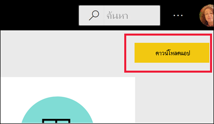
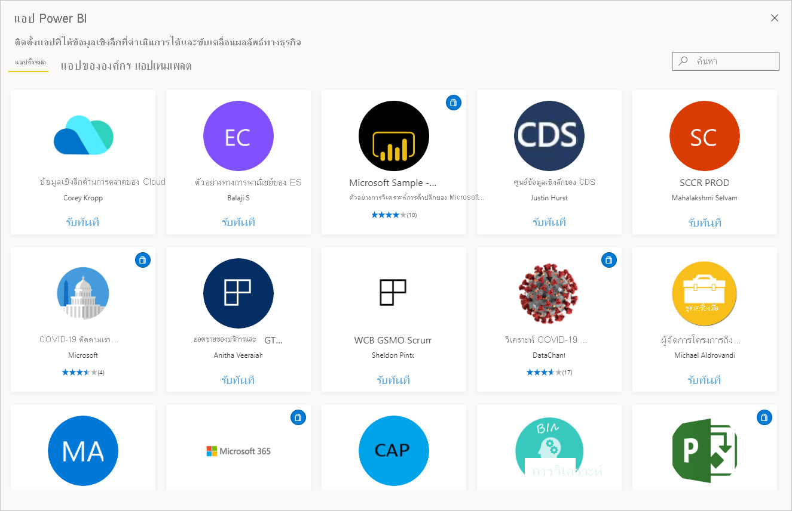

# แอปใน Power BI

[!INCLUDE[consumer-appliesto-ynny](../includes/consumer-appliesto-ynny.md)]

[!INCLUDE [power-bi-service-new-look-include](../includes/power-bi-service-new-look-include.md)]

## แอป Power BI คืออะไร?
*แอป* เป็นประเภทเนื้อหา Power BI ที่รวมแดชบอร์ดและรายงานที่เกี่ยวข้องทั้งหมดไว้ในที่เดียวกัน แอปสามารถมีแดชบอร์ดอย่างน้อยหนึ่งรายการและรายงานอย่างน้อยหนึ่งรายงานทั้งหมดรวมเข้าด้วยกัน แอปถูกสร้างโดย Power BI *นักออกแบบ* ซึ่งเป็นผู้แจกจ่ายและแบ่งปันแอปกับ *ผู้บริโภค* เช่นคุณ 

แอปของคุณจัดอยู่ในรายการเนื้อหา **แอป** เพียงแค่เลือก**แอป**เพื่อแสดงแอปของคุณ วางเมาส์เหนือแอปเพื่อดูวันที่อัปเดตล่าสุดและเจ้าของ 

การใช้งานคุณลักษณะของแอปจะต้องมีสิทธิ์ใช้งาน Power BI Pro หรือสำหรับแอปที่จะจัดเก็บไว้ในความจุระดับพรีเมียมและแชร์กับคุณ หากต้องการเรียนรู้เพิ่มเติมเกี่ยวกับสิทธิ์การใช้งานและความจุระดับพรีเมียม ให้ดู [สิทธิ์การใช้งานสำหรับผู้ใช้](end-user-license.md)

## *นักออกแบบ*แอป และ*ผู้บริโภค*แอป
คุณอาจเป็นผู้ที่สร้างแอป (*นักออกแบบ*) เพื่อใช้งานด้วยตนเอง หรือเพื่อแชร์กับเพื่อนร่วมงาน ทั้งนี้ขึ้นอยู่กับบทบาทของคุณ หรือคุณอาจเป็นคนที่รับและดาวน์โหลดแอป (*ผู้บริโภค*) ที่สร้างโดยผู้อื่น บทความนี้เหมาะสำหรับ*ลูกค้า*ของคุณ!

## ข้อดีของแอป
แอปจะเป็นวิธีง่าย ๆ ในการแชร์เนื้อหาชนิดต่าง ๆ ในครั้งเดียว *นักออกแบบ*แอปจะสร้างแดชบอร์ดและรายงานและรวมเข้าด้วยกันในแอป *นักออกแบบ*จะแชร์หรือเผยแพร่แอปไปยังตำแหน่งที่ตั้งที่คุณ ซึ่งเป็น*ผู้บริโภค*สามารถเข้าถึงได้ เนื่องจากแดชบอร์ดและรายงานที่เกี่ยวข้องจะรวมกัน ซึ่งเป็นเรื่องง่ายสำหรับคุณในการค้นหาและติดตั้งทั้งในบริการของ Power BI ([https://powerbi.com](https://powerbi.com)) และบนอุปกรณ์เคลื่อนที่ของคุณ หลังจากที่คุณติดตั้งแอป คุณไม่จำเป็นต้องจำชื่อของรายงานหรือแดชบอร์ดต่าง ๆ มากมายเนื่องจากแดชบอร์ดมารวมกันในหนึ่งแอป ในเบราว์เซอร์ของคุณ หรือบนอุปกรณ์เคลื่อนที่ของคุณ

ด้วยแอป เมื่อใดก็ตามที่ผู้สร้างแอปออกการอัปเดต คุณเห็นการเปลี่ยนแปลงโดยอัตโนมัติ ผู้เขียนยังควบคุมความถของการรีเฟรชข้อมูล ดังนั้นคุณไม่จำเป็นต้องกังวลเกี่ยวกับการทำให้ล่าสุด 

<!-- add conceptual art -->
## รับแอปใหม่
มีแนวทางหลายวิธีในการรับแอปใหม่: คุณสามารถเสิร์ช ค้นหา และติดตั้งแอปและผู้สร้างแอปสามารถแชร์แอปกับคุณได้ 

### ค้นหาและติดตั้งแอปจาก marketplace ของแอป Power BI ได้
วิธีหนึ่งในการค้นหาแอปคือเลือก **รับแอป** จากหน้าจอแอป Power BI 

เรียกดูรายการของแอปใน marketplace ของแอป Power BI จนกว่าคุณจะพบการติดตั้ง เลือกจาก **แอปองค์กร** ซึ่งมีให้เฉพาะบุคคลในบริษัทของคุณ หรือ **แอปเทมเพลต** ซึ่งเผยแพร่โดย Microsoft และชุมชนเพื่อให้ผู้ใช้ Power BI สามารถติดตั้งได้ 

มีวิธีอีกสองสามวิธีในการรับแอป วิธีการดังกล่าวจะแสดงอยู่ด้านล่าง แต่สำหรับคำแนะนำทีละขั้นตอนโดยละเอียดสำหรับการรับและสำรวจแอป ให้ดู [เปิดและโต้ตอบกับแอป](end-user-app-view.md)

* นักออกแบบแอปสามารถติดตั้งแอปโดยอัตโนมัติในบัญชี Power BI ของคุณ และในครั้งต่อไปที่คุณเปิดบริการของ Power BI คุณจะเห็นแอปใหม่ในรายการเนื้อหาของ **แอป** 
* ผู้ออกแบบแอปสามารถส่งอีเมลลิงก์โดยตรงไปยังแอปให้กับคุณได้ การเลือกลิงก์จะเปิดแอปในบริการของ Power BI
* ใน Power BI บนอุปกรณ์เคลื่อนที่ของคุณ คุณสามารถเติดตั้งแอปได้ จากลิงก์โดยตรงเท่านั้น และไม่สามารถตัดตั้งจาก marketplace ของแอป ถ้าผู้สร้างแอปติดตั้งแอปโดยอัตโนมัติ คุณจะเห็นได้ในรายการของแอป 

## ขั้นตอนถัดไป
* [เปิดและโต้ตอบกับแอป](end-user-app-view.md)
* [วิธีอื่น ๆ ในการแชร์เนื้อหา](end-user-shared-with-me.md)

