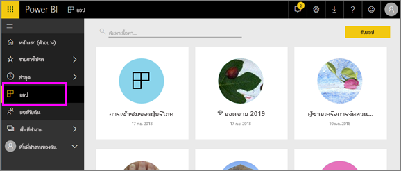

# แอปใน Power BI
## แอป Power BI คืออะไร?
*แอป* เป็นประเภทเนื้อหา Power BI ที่รวมแดชบอร์ดและรายงานที่เกี่ยวข้องทั้งหมดไว้ในที่เดียวกัน แอปสามารถมีแดชบอร์ดอย่างน้อยหนึ่งรายการและรายงานอย่างน้อยหนึ่งรายงานทั้งหมดรวมเข้าด้วยกัน แอปถูกสร้างโดย Power BI *นักออกแบบ* ซึ่งเป็นผู้แจกจ่ายและแบ่งปันแอปกับ *ผู้บริโภค* เช่นคุณ 

แอปของคุณจัดอยู่ในรายการเนื้อหา **แอป**

> [!NOTE]
> การใช้ฟีเจอร์แอปจำเป็นต้องมีสิทธิ์การใช้งาน Power BI Pro <!-- add link to how to figure out your license -->

## ***นักออกแบบ***แอป และ***ผู้บริโภค***แอป
ขึ้นอยู่กับบทบาทของคุณ คุณอาจเป็นคนที่สร้างแอป (*designer*) สำหรับการใช้งานของคุณเอง หรือ เพื่อแชร์กับเพื่อนร่วมงานได้ หรือ คุณอาจเป็นบุคคลที่ได้รับ และดาวน์โหลดแอป (*ผู้บริโภค*) สร้าง โดยผู้อื่น บทความนี้เหมาะสำหรับ*ลูกค้า*ของคุณ!

## ข้อดีของแอป
สามารถค้นหาและติดตั้งแอปได้ง่าย ๆ ในบริการของ Power BI ([https://powerbi.com](https://powerbi.com)) และบนอุปกรณ์เคลื่อนที่ของคุณ หลังจากที่คุณติดตั้งแอป คุณไม่จำเป็นต้องจำชื่อของแดชบอร์ดต่างๆ มากมายเนื่องจากแดชบอร์ดมารวมกันในหนึ่งแอป ในเบราว์เซอร์ของคุณ หรือบนอุปกรณ์เคลื่อนที่ของคุณ

ด้วยแอป เมื่อใดก็ตามที่ผู้สร้างแอปออกการอัปเดต คุณเห็นการเปลี่ยนแปลงโดยอัตโนมัติ ผู้เขียนยังควบคุมความถของการรีเฟรชข้อมูล ดังนั้นคุณไม่จำเป็นต้องกังวลเกี่ยวกับการทำให้ล่าสุด 

<!-- add conceptual art -->
## รับแอปใหม่
คุณสามารถรับแอปในสองสามวิธีที่แตกต่างกัน 
- ผู้เขียนแอปสามารถติดตั้งแอปโดยอัตโนมัติในบัญชี Power BI ของคุณ และในครั้งต่อไปที่คุณเปิด Power BI คุณจะเห็นแอปใหม่ในรายการเนื้อหาของ **แอป** 
- ผู้เขียนแอปสามารถส่งลิงก์ตรงไปยังแอปให้คุณทางอีเมล การเลือกลิงค์จะเปิดแอปใน Power BI
- คุณสามารถค้นหาแอปใน AppSource ที่ซึ่งคุณจะเห็นแอปทั้งหมดที่คุณสามารถเข้าถึงได้ AppSource ประกอบด้วยแอปที่เผยแพร่ โดยนักออกแบบรายงานทั้งภายในและ ภายนอกบริษัทของคุณ คุณอาจพบแอปบน AppSource สำหรับบริการที่คุณใช้อยู่แล้วเช่น Google Analytics, GitHub หรือ Microsoft Dynamics 
- ใน Power BI บนอุปกรณ์เคลื่อนที่ของคุณ คุณสามารถเติดตั้งแอปได้ จากลิงก์โดยตรงเท่านั้น และไม่สามารถตัดตั้งจาก AppSource ถ้าผู้สร้างแอปติดตั้งแอปโดยอัตโนมัติ คุณจะเห็นได้ในรายการของแอป

## ขั้นตอนถัดไป
* [เปิดและโต้ตอบกับแอป](end-user-app-view.md)

