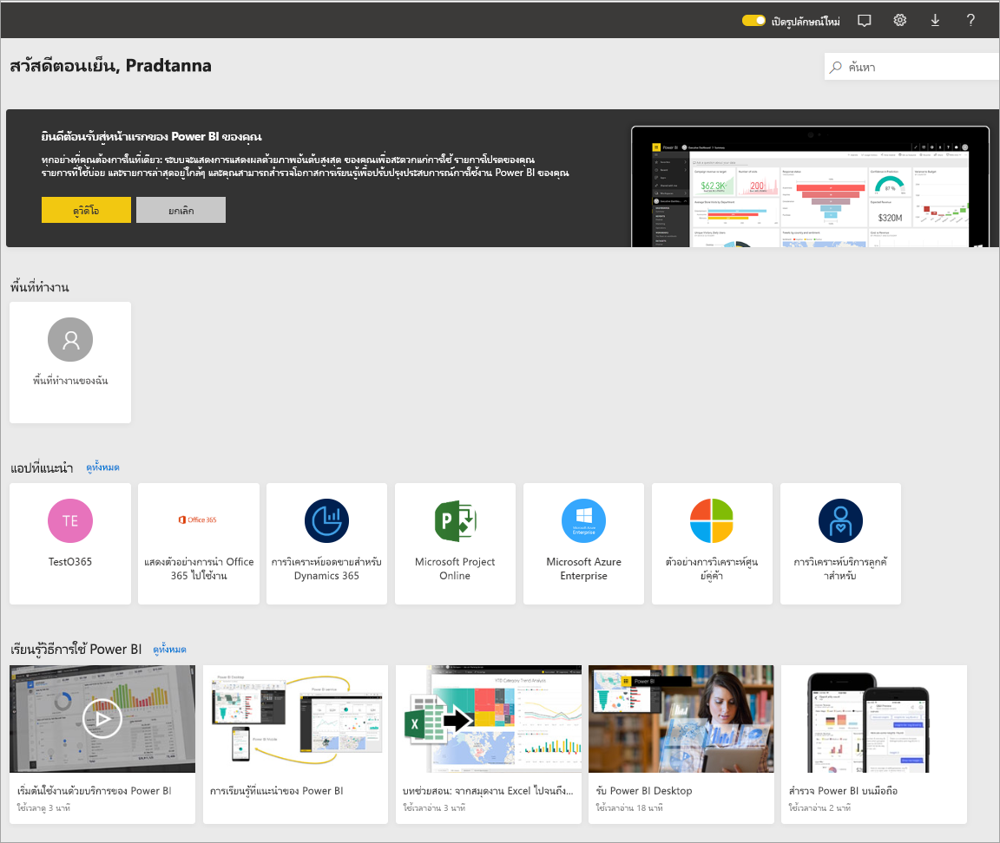
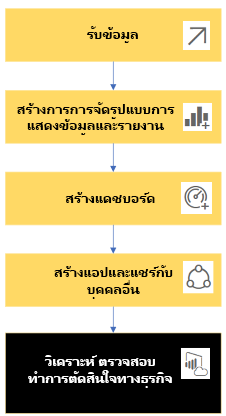
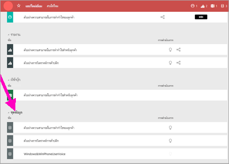
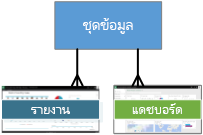
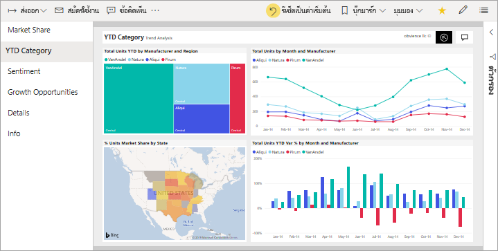
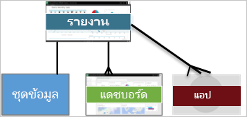
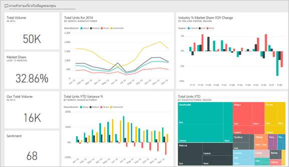
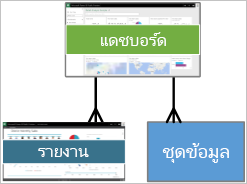
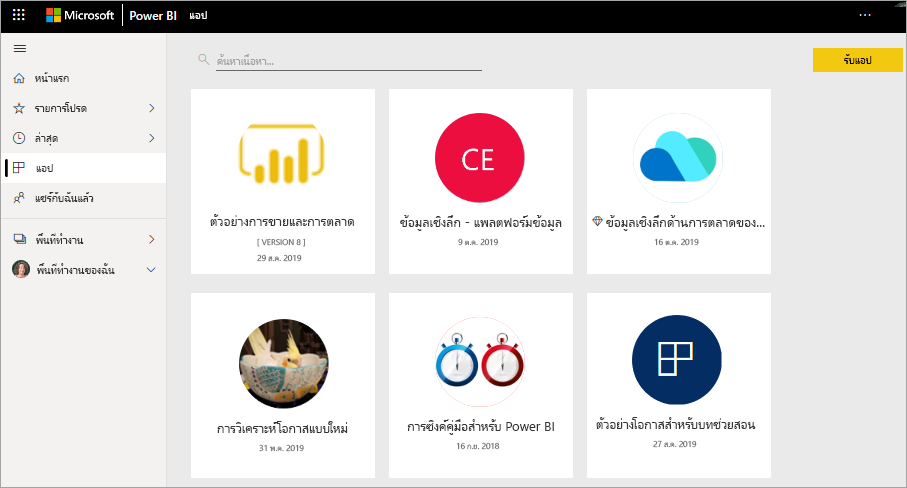
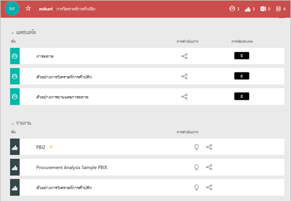

# แนวคิดพื้นฐานสำหรับลูกค้าที่ใช้บริการ Power BI

บทความนี้อนุมานว่าคุณได้อ่าน [ภาพรวม Power BI](../power-bi-overview.md) และได้ระบุว่าตัวเองเป็น[ลูกค้า***ที่ใช้บริการ Power BI***](end-user-consumer.md) ลูกค้าได้รับเนื้อหา Power BI เช่น แดชบอร์ดและรายงานจากเพื่อนร่วมงาน ลูกค้าใช้บริการ Power BI ซึ่งเป็น Power BI เวอร์ชันที่ทำงานบนเว็บไซต์

คุณจะได้ยินคำว่า "Power BI Desktop" หรือแค่ "Desktop" เป็นเครื่องมือแบบสแตนด์อโลนใช้งานโดย*นักออกแบบ*ที่สร้างและแชร์แดชบอร์ดและรายงานกับคุณ สิ่งสำคัญคือต้องทราบว่ายังมีเครื่องมือ Power BI อื่นๆ อีก ตราบใดที่คุณเป็นผู้บริโภค คุณจะทำงานกับเฉพาะบริการ Power BI เท่านั้น บทความนี้นำไปใช้กับบริการ Power BI เท่านั้น

## คำศัพท์และแนวคิด

บทความนี้ไม่ได้นำเสนอภาพของ Power BI หรือมีบทช่วยสอนแบบลงมือทำ แต่เรานำเสนอเป็นบทความภาพรวมซึ่งจะทำให้คุณเข้าใจคำศัพท์และแนวคิดเกี่ยวกับ Power BI การนำเสนอจะสอนคุณเกี่ยวกับคำศัพท์และลักษณะทั่วไป สำหรับการแนะนำของบริการ Power BI และการนำทาง ให้ไปที่[เริ่มต้นใช้งานด่วน - ทัวร์ในบริการ Power BI](end-user-experience.md)

## เปิดบริการ Power BI เป็นครั้งแรก

ลูกค้า Power BI ส่วนใหญ่จะได้รับบริการ Power BI เนื่องจาก 1)บริษัทซื้อใบอนุญาตและ 2)ผู้ดูแลระบบมอบหมายใบอนุญาตแก่พนักงานอย่างเช่นคุณ

เมื่อต้องเริ่มต้นใช้งาน เปิดเบราว์เซอร์และพิมพ์ **app.powerbi.com** ในครั้งแรกที่คุณเปิดบริการ Power BI คุณจะเห็นสิ่งนี้:

เมื่อคุณใช้ Power BI คุณจะต้องปรับเปลี่ยนสิ่งที่คุณเห็นเมื่อเปิดเว็บไซต์ในแต่ละครั้ง ตัวอย่างเช่น บางคนชอบ Power BI เพื่อเปิดไปยัง**หน้าแรก**ในขณะที่คนอื่นมีแดชบอร์ดที่ชื่นชอบที่พวกเขาต้องการเห็นเป็นอันดับแรก ไม่ต้องกังวล บทความนี้จะสอนวิธีการปรับแต่งประสบการณ์การใช้งานของคุณ

- [ขอแนะนำหน้าแรกของ Power BI และการค้นหาในส่วนกลาง](https://powerbi.microsoft.com/blog/introducing-power-bi-home-and-global-search)

- [แดชบอร์ดแนะนำใน Power BI service](end-user-featured.md)

แต่ก่อนที่เราจะได้รับประโยชน์มากขึ้น ลองกลับมาพูดคุยเกี่ยวกับบล็อกการสร้างที่ประกอบเป็นบริการ Power BI

_______________________________________________________

## เนื้อหา Power BI

### ความรู้เบื้องต้นเกี่ยวกับบล็อกการสร้าง

สำหรับลูกค้าของ Power BI บล็อกการสร้าง 5 กลุ่มคือ ***การแสดงภาพข้อมูล***, ***แดชบอร์ด***, ***รายงาน***, ***แอป*** และ ***ชุดข้อมูล*** สิ่งเหล่านี้บางครั้งเรียกว่า***เนื้อหา*** *Power BI* *เนื้อหา* อยู่ใน ***พื้นที่ทำงาน*** เวิร์กโฟลว์ทั่วไปที่เกี่ยวข้องกับบล็อกการสร้างทั้งหมด: *ผู้ออกแบบ* Power BI (สีเหลืองในแผนภาพด้านล่าง) จะรวบรวมข้อมูลจาก *ชุดข้อมูล* นำมาสู่ Power BI เพื่อการวิเคราะห์ สร้าง*รายงาน*ที่เต็มไปด้วย*การแสดงภาพข้อมูล*ที่เน้นข้อเท็จจริงและข้อมูลเชิงลึกที่น่าสนใจ ปักหมุดการแสดงภาพข้อมูลจากรายงานไปยังแดชบอร์ด และแชร์รายงานและแดชบอร์ดกับ*ผู้บริโภค*เช่นคุณ (สีดำในแผนภาพด้านล่าง) *ผู้ออกแบบ*จะใช้ร่วมกันในรูปแบบ*แอป*หรือแชร์เนื้อหาชนิดอื่นๆ

สำหรับคุณสมบัติพื้นฐานที่สุด:

-  การ***แสดงภาพ*** (หรือ*วิชวล*), เป็นชนิดของแผนภูมิที่สร้างขึ้น โดย*ผู้ออกแบบ* Power BI ภาพแสดงข้อมูลจาก*รายงาน*และ*ชุดข้อมูล* โดยทั่วไปแล้ว *ผู้ออกแบบ*จะสร้างวิชวลใน Power BI Desktop

    สำหรับรายละเอียดเพิ่มเติม ให้ดูที่ [โต้ตอบกับการแสดงภาพในรายงาน แดชบอร์ด และแอป](end-user-visualizations.md)

-  *ชุดข้อมูล*คือที่เก็บข้อมูล ตัวอย่างเช่น อาจเป็นไฟล์ Excel จากองค์กรอนามัยโลก อาจเป็นฐานข้อมูลของบริษัทของลูกค้า หรืออาจเป็นไฟล์ Salesforce  

-  *แดชบอร์ด* เป็นหน้าจอเดียวที่มีภาพ ข้อความ และกราฟฟิคแบบโต้ตอบ หน้าแดชบอร์ดจะเก็บรวบรวมเมตริกที่สำคัญที่สุดของคุณในหนึ่งหน้าจอเพื่อบอกเล่าเรื่องราวหรือตอบคำถาม เนื้อหาในหน้าแดชบอร์ดมาจากรายงานอย่างน้อยหนึ่งรายการและชุดข้อมูลอย่างน้อยหนึ่งชุด

    สำหรับข้อมูลเพิ่มเติม ให้ดูที่[แดชบอร์ดสำหรับ Power BI บริการผู้บริโภค](end-user-dashboards.md)

-  *รายงาน* คือหน้าของภาพ ข้อความ และกราฟฟิคแบบโต้ตอบอย่างน้อยหนึ่งหน้าซึ่งรวมกันเป็นรายงานเดียว Power BI สร้างรายงานโดยอ้างอิงจากชุดข้อมูลเดียว บ่อยครั้งที่หน้ารายงานถูกจัดอยู่ในที่อยู่แต่ละแห่งที่น่าสนใจตรงกลางหรือตอบคำถามเดียว

    สำหรับข้อมูลเพิ่มเติม ให้ดูที่[รายงานใน Power BI](end-user-reports.md)

-  *แอป*เป็นอีกวิธีหนึ่งสำหรับ*ผู้ออกแบบ*ในการจัดกลุ่มและแบ่งปันหน้าแดชบอร์ดและรายงานที่เกี่ยวข้องกัน *ลูกค้า* ได้รับแอปบางอย่างโดยอัตโนมัติ แต่สามารถไปหาแอปอื่น ๆ ที่เพื่อนร่วมงานหรือชุมชนสร้างขึ้นได้ ยกตัวอย่างเช่น บริการภายนอก คุณอาจใช้่ เช่น Google Analytics และ Microsoft Dynamics CRM นอกจากนี้ยังนำเสนอแอป Power BI

เพื่อความชัดเจน หากคุณเป็นผู้ใช้ใหม่ และคุณลงชื่อเข้าใช้ Power BI เป็นครั้งแรก คุณจะยังไม่เห็นแดชบอร์ด แอปพลิเคชัน หรือรายงาน

_______________________________________________________

## ชุดข้อมูล

*ชุดข้อมูล* คือคอลเลกชันข้อมูลที่*ผู้ออกแบบ*นำเข้าหรือเชื่อมต่อและใช้เพื่อสร้างรายงานและแดชบอร์ด ในฐานะลูกค้า คุณจะไม่โต้ตอบกับชุดข้อมูลโดยตรง แต่ก็ยังดีที่จะเรียนรู้ว่าชุดข้อมูลพอดีกับภาพที่ใหญ่ขึ้นอย่างไร  

ชุดข้อมูลแต่ละชุดแสดงมาจากแหล่งข้อมูลเดียว ตัวอย่างเช่น แหล่งข้อมูลอาจเป็นสมุดงาน Excel บน OneDrive, ชุดข้อมูลแบบตาราง SQL Server Analysis Services ภายในองค์กร หรือชุดข้อมูล Salesforce Power BI สนับสนุนแหล่งข้อมูลต่าง ๆ มากมาย

เมื่อผู้ออกแบบแชร์แอปกับคุณ คุณจะเห็นว่าชุดข้อมูลใดบ้างที่นักออกแบบใส่ไว้ในแอป

หนึ่งชุดข้อมูล...

- ตัวออกแบบรายงานเพื่อสร้างแดชบอร์ดและรายงานสามารถใช้ซ้ำได้เรื่อยๆ

- สามารถใช้ในการสร้างรายงานต่าง ๆ ได้มากมาย

- การแสดงภาพจากชุดข้อมูลเดียวสามารถแสดงในหลายๆ แดชบอร์ดได้

  

ไปที่บล็อกการสร้างถัดไป - การแสดงภาพข้อมูล

_______________________________________________________

## การแสดงผลข้อมูลด้วยภาพ

การแสดงภาพ (หรือที่รู้จักกันในนามวิชวล) แสดงข้อมูลเชิงลึกที่ Power BI ค้นพบแล้วในข้อมูล การแสดงภาพข้อมูลทำให้เข้าใจได้ง่ายขึ้นเนื่องจากสมองของคุณสามารถเข้าใจภาพได้เร็วกว่ากระดาษคำนวณตัวเลข

เพียงบางส่วนของการแสดงภาพข้อมูลที่คุณพบใน Power BI ได้แก่ น้ำตก ริบบิ้น แผนที่ต้นไม้ พาย กรวย การ์ด กระจาย และเกจวัด

   

ดู [รายการทั้งหมดของการแสดงภาพที่มาพร้อมกับ Power BI](../power-bi-visualization-types-for-reports-and-q-and-a.md)

การแสดงภาพข้อมูลที่เรียกว่า*ภาพแบบกำหนดเอง*ยังสามารถเรียกใช้งานได้จากชุมชน หากคุณได้รับรายงานด้วยภาพที่คุณไม่รู้จัก เป็นไปได้ว่าอาจเป็นภาพแบบกำหนดเอง หากคุณต้องการความช่วยเหลือในการแปลภาพแบบกำหนดเองค้นหาชื่อ *ผู้ออกแบบ*ของรายงานหรือแดชบอร์ด และติดต่อเขา

หนึ่งจากการแสดงภาพในรายงาน...

- สามารถปรากฏหลายครั้งในรายงานเดียวกันได้

- สามารถปรากฏบนแดชบอร์ดที่แตกต่างกันได้

_______________________________________________________

## รายงาน

รายงาน Power BI คือหน้าเพจที่แสดงภาพ กราฟิก และข้อความอย่างน้อยหนึ่งหน้า การแสดงภาพทั้งหมดในรายงานมาจากชุดข้อมูลเดียว *ผู้ออกแบบ*แชร์รายงานกับ*ลูกค้า*ที่[โต้ตอบกับรายงานใน{6 มุมมอง*การอ่าน* ](end-user-reading-view.md)

หนึ่งรายงาน...

- สามารถเชื่อมโยงกับหลายแดชบอร์ดได้ (ไทล์ที่ปักหมุดจากรายงานนั้นอาจปรากฏบนหลายแดชบอร์ด)

- สามารถสร้างได้โดยใช้ข้อมูลจากชุดเดียวเท่านั้น  

- สามารถเป็นส่วนหนึ่งของแอปได้หลายแอป

  

_______________________________________________________

## แดชบอร์ด

แดชบอร์ดรายการแสดงมุมมองแบบกำหนดเองของชุดย่อยบางรายการของชุดข้อมูลเบื้องต้น *ผู้ออกแบบ*สร้างหน้าแดชบอร์ดและแชร์ให้กับ*ลูกค้า*; เป็นรายบุคคลหรือเป็นส่วนหนึ่งของแอปพลิเคชัน แดชบอร์ดเป็นพื้นที่ทำงานเดี่ยวที่มี *ไทล์* กราฟิก และข้อความ

  

ไทล์เป็นการแสดงผลภาพที่ *ผู้ออกแบบ* *ปัดหมุด* ตัวอย่างเช่น จากรายงานไปยังแดชบอร์ด แต่ละไทล์ที่ปักหมุดจะแสดง [การแสดงภาพ](end-user-visualizations.md) ที่ผู้ออกแบบ สร้างขึ้นจากชุดข้อมูลและปักหมุดลงบนแดชบอร์ด ไทล์อาจประกอบด้วยทั้งหน้ารายงาน และสามารถประกอบด้วยข้อมูลการสตรีมแบบสดหรือวิดีโอ มีหลายวิธีที่*ผู้ออกแบบ*เพิ่มไทล์ไปยังแดชบอร์ด มีมากเกินไปที่จะครอบคลุมภาพรวมในบทความนี้ เมื่อต้องการเรียนรู้เพิ่มเติม ดู[ไทล์แดชบอร์ดใน Power BI](end-user-tiles.md)

ผู้ใช้ไม่สามารถแก้ไขแดชบอร์ด อย่างไรก็ตามคุณสามารถเพิ่มความคิดเห็น ดูข้อมูลที่เกี่ยวข้อง ตั้งค่าเป็นรายการโปรด สมัครรับข้อมูล และอื่น ๆ ได้

จุดประสงค์บางส่วนสำหรับแดชบอร์ดคืออะไร  ต่อไปนี้เป็นเพียงตัวอย่างเล็กน้อย:

- เพื่อดูข้อมูลทั้งหมดที่จำเป็นสำหรับการตัดสินใจอย่างรวดเร็ว

- เพื่อตรวจสอบข้อมูลที่สำคัญมากที่สุดเกี่ยวกับธุรกิจของคุณ

- เพื่อให้แน่ใจว่าเพื่อนร่วมงานทั้งหมดเข้าใจตรงกัน ดู และใช้ข้อมูลเดียวกัน

- เพื่อการตรวจสอบสถานภาพของธุรกิจ หรือผลิตภัณฑ์ หรือหน่วยธุรกิจ หรือแคมเปญการตลาด และอื่น ๆ

- เพื่อสร้างมุมมองส่วนบุคคลของแดชบอร์ดที่ใหญ่กว่า เมตริกทั้งหมดที่เกี่ยวข้องกับคุณ

**หนึ่ง**แดชบอร์ด...

- สามารถแสดงภาพจากหลายชุดข้อมูลที่แตกต่างกันได้

- สามารถแสดงภาพจากหลายรายงานที่แตกต่างกันได้

- สามารถแสดงภาพที่ปักหมุดจากเครื่องมืออื่น ๆ ได้ (ตัวอย่างเช่น Excel)

  

_______________________________________________________

## แอป

คอลเลกชันเหล่านี้ของแดชบอร์ดและรายงานจัดระเบียบเนื้อหาที่เกี่ยวข้องเข้าด้วยกันเป็นแพคเกจเดียว *ผู้ออกแบบ* Power BI สร้างและแชร์ให้กับบุคคล กลุ่ม บริษัท ทั้งองค์กรหรือประชาชน ในฐานะลูกค้า คุณสามารถมั่นใจได้ว่าคุณและเพื่อนร่วมงานของคุณกำลังทำงานกับข้อมูลเดียวกัน เวอร์ชันของความจริงที่เชื่อถือได้เพียงเวอร์ชันเดียว

สามารถหาแอปจากใน[บริการของ Power BI](https://powerbi.com) และจากอุปกรณ์มือถือของคุณและติดตั้งได้ง่ายๆ หลังจากที่คุณติดตั้งแอป คุณไม่จำเป็นต้องจำชื่อของแดชบอร์ดต่าง ๆ มากมาย ทุกอย่างรวมกันอยู่ในแอปเดียว ในเบราว์เซอร์ของคุณ หรือ บนอุปกรณ์เคลื่อนที่ของคุณ

แอปนี้มีแดชบอร์ดที่เกี่ยวข้องสามรายการและรายงานที่เกี่ยวข้องสามชุดซึ่งประกอบกันเป็นแอปเดียว

ด้วยแอป เมื่อใดก็ตามที่ผู้สร้างแอปออกการอัปเดต คุณเห็นการเปลี่ยนแปลงโดยอัตโนมัติ ผู้เขียนยังสามารถควบคุมกำหนดการสำหรับจำนวนครั้งที่ Power BI รีเฟรชข้อมูล คุณไม่ต้องกังวลเกี่ยวกับการอัปเดต

คุณสามารถรับแอปในสองสามวิธีที่แตกต่างกัน

- ตัวออกแบบแอปสามารถติดตั้งแอปโดยอัตโนมัติในบัญชี Power BI ของคุณ

- ผู้ออกแบบแอปสามารถส่งลิงก์โดยตรงไปยังแอปฯได้ให้กับคุณได้

- คุณสามารถค้นหาแอปใน [Microsoft AppSource](https://appsource.microsoft.com/marketplace/apps?product=power-bi) ที่ซึ่งคุณจะเห็นแอปทั้งหมดที่คุณสามารถใช้งานได้

ใน Power BI บนอุปกรณ์เคลื่อนที่ของคุณ คุณสามารถเติดตั้งแอปได้ จากลิงก์โดยตรงเท่านั้น และไม่สามารถตัดตั้งจาก AppSource ถ้าผู้ออกแบบแอปติดตั้งแอปโดยอัตโนมัติ คุณจะเห็นได้ในรายการของแอป

เมื่อติดตั้งแอปแล้ว เพียงเลือกแอปจากรายการแอปของคุณ และเลือกหน้าแดชบอร์ดหรือรายงานที่จะเปิดและสำรวจก่อน

ฉันหวังว่าบทความนี้จะทำให้คุณเข้าใจเกี่ยวกับบล็อกการสร้างที่ประกอบกันเป็นบริการ Power BI สำหรับผู้บริโภค

## ขั้นตอนถัดไป

- ตรวจทานและบุ๊กมาร์ก[อภิธานศัพท์](end-user-glossary.md)

- ชม[การแนะนำบริการของ Power BI](end-user-experience.md)

- อ่าน [ภาพรวมของ Power BI ที่เขียนขึ้นโดยเฉพาะสำหรับลูกค้า](end-user-consumer.md)

- ดูวิดีโอที่จะตรวจทานแนวคิดพื้นฐานและให้คำแนะนำของบริการ Power BI

    <iframe width="560" height="315" src="https://www.youtube.com/embed/B2vd4MQrz4M" frameborder="0" allowfullscreen></iframe>
