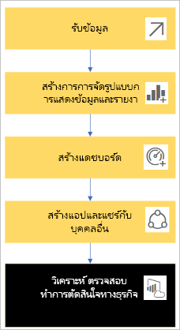
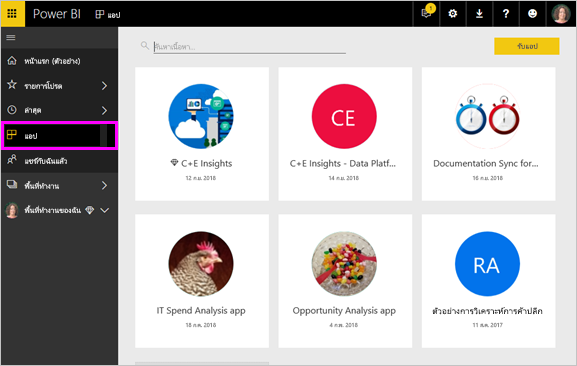

# แนวคิดพื้นฐานสำหรับ***ลูกค้า***ที่ใช้บริการ Power BI

## *ลูกค้า*และ*ผู้ออกแบบ* Power BI
บทความนี้อนุมานว่าคุณได้อ่าน [ภาพรวม Power BI](../power-bi-overview.md) และได้ระบุว่าตัวเองเป็น***ลูกค้า***ที่ใช้บริการ Power BI ลูกค้าได้รับเนื้อหา Power BI เช่น แดชบอร์ดและรายงานจากเพื่อนร่วมงาน ลูกค้าใช้บริการ Power BI ซึ่งเป็น Power BI เวอร์ชันที่ทำงานบนเว็บไซต์

คุณจะสงสัยคำว่า "Power BI Desktop" หรือแค่ "Desktop" และนี่เป็นเครื่องมือแบบสแตนด์อะโลนที่ใช้โดย *ผู้ออกแบบ* ผู้สร้างและแบ่งปันแดชบอร์ดและรายงานกับคุณ สิ่งสำคัญคือต้องรู้ว่ามีเครื่องมือ Power BI ตัวอื่นอยู่ในเครื่อง แต่ตราบเท่าที่คุณเป็นลูกค้า คุณจะใช้งานได้เฉพาะบริการ Power BI เท่านั้น และบทความนี้นำไปใช้กับบริการ Power BI เท่านั้น

## คำศัพท์และแนวคิด
บทความนี้ไม่ได้นำเสนอภาพของ Power BI หรือมีบทช่วยสอนแบบลงมือทำ แต่เรานำเสนอเป็นบทความภาพรวมที่เราหวังว่าจะทำให้คุณเข้าใจคำศัพท์และแนวคิดเกี่ยวกับ Power BI เราสอนคุณเกี่ยวกับคำศัพท์และลักษณะทั่วไป สำหรับการสำรวจและการนำทางบริการ BI Power ให้ไปที่ [ชมการแนะนำ](end-user-experience.md)

## เปิดบริการ Power BI เป็นครั้งแรก
ลูกค้า Power BI ส่วนใหญ่จะได้รับบริการ Power BI เนื่องจาก 1)บริษัทซื้อใบอนุญาตและ 2)ผู้ดูแลระบบมอบหมายใบอนุญาตเหล่านี้แก่พนักงานอย่างเช่นคุณ

เมื่อต้องเริ่มต้นใช้งาน เพียงแค่เปิดเบราว์เซอร์และพิมพ์ **app.powerbi.com** ในครั้งแรกที่คุณเปิดบริการ Power BI คุณจะเห็นสิ่งนี้

เมื่อคุณใช้ Power BI คุณจะต้องปรับเปลี่ยนสิ่งที่คุณเห็นเมื่อเปิดเว็บไซต์ในแต่ละครั้ง  ตัวอย่างเช่น บางคนชอบ Power BI เพื่อเปิดไปยังหน้าแรกในขณะที่คนอื่นมีแดชบอร์ดที่ชื่นชอบที่พวกเขาต้องการเห็นเป็นอันดับแรก ไม่ต้องกังวล เราจะสอนวิธีการทำเช่นนี้
- [ตัวอย่างหน้าแรก](https://powerbi.microsoft.com/blog/introducing-power-bi-home-and-global-search)    
- [ตั้งค่าเนื้อหาเป็น**แนะนำ**](end-user-featured.md)

แต่ก่อนที่เราจะได้รับประโยชน์มากขึ้น ลองกลับมาพูดคุยเกี่ยวกับบล็อกการสร้างที่ประกอบเป็นบริการ Power BI

## ***เนื้อหา*** Power BI
### ความรู้เบื้องต้นเกี่ยวกับบล็อกการสร้าง
สำหรับลูกค้าของ Power BI บล็อกการสร้าง 5 กลุ่มคือ ***การแสดงภาพข้อมูล***, ***แดชบอร์ด***, ***รายงาน***, ***แอป*** และ ***ชุดข้อมูล*** สิ่งเหล่านี้บางครั้งเรียกว่า***เนื้อหา*** *Power BI* และ *เนื้อหา* อยู่ใน ***พื้นที่ทำงาน*** เวิร์กโฟลว์ทั่วไปที่เกี่ยวข้องกับบล็อกการสร้างเหล่านี้ทั้งหมด:  *ผู้ออกแบบ* Power BI (สีเหลืองในแผนภาพด้านล่าง) จะรวบรวมข้อมูลจาก *ชุดข้อมูล* นำมาสู่ Power BI เพื่อการวิเคราะห์ สร้าง*รายงาน*ที่เต็มไปด้วย*การแสดงภาพข้อมูล*ที่เน้นข้อเท็จจริงและข้อมูลเชิงลึกที่น่าสนใจ ปักหมุดการแสดงภาพข้อมูลจากรายงานไปยังแดชบอร์ด และแชร์รายงานและแดชบอร์ดกับ*ผู้บริโภค*เช่นคุณ (สีดำในแผนภาพด้านล่าง) ในรูปแบบของ*แอป* หรือเนื้อหาที่แชร์ประเภทอื่น ๆ

สำหรับคุณสมบัติพื้นฐานที่สุด
*  (หรือ***ภาพ***) เป็นแผนภูมิชนิดที่สร้างขึ้น โดย*ตัวออกแบบ*ของ *Power BI* โดยใช้ข้อมูลใน*รายงาน*และ *ชุดข้อมูล* โดยทั่วไปแล้ว *ผู้ออกแบบ*จะสร้างวิชวลใน Power BI Desktop

    สำหรับข้อมูลเพิ่มเติม ดู [การแสดงภาพสำหรับผู้ใช้ *Power BI*](end-user-visualizations.md)

*  *ชุดข้อมูล*เป็นที่เก็บข้อมูล ตัวอย่างเช่นอาจเป็นไฟล์ Excel จากองค์การอนามัยโลกหรืออาจเป็นฐานข้อมูลลูกค้าของ บริษัทหรืออาจเป็นไฟล์ Salesforce  

*  *แดชบอร์ด* เป็นหน้าจอเดียวที่มีภาพ ข้อความ และกราฟฟิคแบบโต้ตอบ หน้าแดชบอร์ดจะเก็บรวบรวมเมตริกที่สำคัญที่สุดของคุณในหนึ่งหน้าจอเพื่อบอกเล่าเรื่องราวหรือตอบคำถาม เนื้อหาในหน้าแดชบอร์ดมาจากรายงานอย่างน้อยหนึ่งรายการและชุดข้อมูลอย่างน้อยหนึ่งชุด

    สำหรับข้อมูลเพิ่มเติม ดู [แดชบอร์ดสำหรับผู้ใช*้ Power BI*](end-user-dashboards.md)

* *รายงาน* คือหน้าของภาพ ข้อความ และกราฟฟิคแบบโต้ตอบอย่างน้อยหนึ่งหน้าซึ่งรวมกันเป็นรายงานเดียว รายงานจะขึ้นอยู่กับชุดข้อมูลเดียว บ่อยครั้งที่หน้ารายงานถูกจัดอยู่ในที่อยู่แต่ละแห่งที่น่าสนใจตรงกลางหรือตอบคำถามเดียว

    สำหรับข้อมูลเพิ่มเติม ดู [รายงานสำหรับผู้ใช้ *Power BI*](end-user-reports.md)

*  *แอป*เป็นอีกวิธีหนึ่งสำหรับ*ผู้ออกแบบ*ในการจัดกลุ่มและแบ่งปันหน้าแดชบอร์ดและรายงานที่เกี่ยวข้องกัน *ลูกค้า* ได้รับแอปบางอย่างโดยอัตโนมัติ แต่สามารถไปหาแอปอื่น ๆ ที่เพื่อนร่วมงานหรือชุมชนสร้างขึ้นได้ ยกตัวอย่างเช่น บริการภายนอก คุณอาจใช้่ เช่น Google Analytics และ Microsoft Dynamics CRM นอกจากนี้ยังนำเสนอแอป Power BI

เพื่อความชัดเจน หากคุณเป็นผู้ใช้ใหม่ และคุณลงชื่อเข้าใช้ Power BI เป็นครั้งแรก คุณจะยังไม่มีแดชบอร์ด แอปพลิเคชัน หรือรายงาน
_______________________________________________________

## ชุดข้อมูล
*ชุดข้อมูล* คือคอลเลกชันข้อมูลที่*ผู้ออกแบบ*นำเข้าหรือเชื่อมต่อและใช้เพื่อสร้างรายงานและแดชบอร์ด ในฐานะลูกค้า คุณจะไม่โต้ตอบกับชุดข้อมูลโดยตรง แต่ก็ยังดีที่จะเข้าใจว่าชุดข้อมูลพอดีกับภาพที่ใหญ่ขึ้นอย่างไร  

ชุดข้อมูลแสดงถึงแหล่งข้อมูลหนึ่งแหล่ง ตัวอย่างเช่น เวิร์กบุ๊ก Excel ใน OneDrive หรือชุดข้อมูลแบบตาราง SSAS ภายในองค์กร หรือชุดข้อมูล Salesforce มีแหล่งข้อมูลต่าง ๆ มากมายที่ได้รับการสนับสนุน

เมื่อผู้ออกแบบแชร์แอปกับคุณ คุณจะเห็นว่าชุดข้อมูลใดบ้างที่มีอยู่ในแอป

**หนึ่ง**ชุดข้อมูล...

* สามารถใช้ซ้ำได้
* สามารถใช้ในรายงานต่าง ๆ ได้มากมาย
* การแสดงภาพจากชุดข้อมูลหนึ่งสามารถแสดงบนหลายแดชบอร์ดได้

  

นอกจากนี้ ชุดข้อมูลจากพื้นที่ทำงานอื่นๆ สามารถใช้เพื่อสร้างเนื้อหา (รายงาน แดชบอร์ด) ในพื้นที่ทำงานของคุณ ชุดข้อมูลเหล่านี้จะแสดงโดยใช้ไอคอนชุดข้อมูลอ้างอิง:

ไปที่บล็อกการสร้างถัดไป - การแสดงภาพข้อมูล
__________________________________________________________

## การจัดรูปแบบการแสดงข้อมูล
การแสดงภาพ (หรือวิชวล) แสดงข้อมูลเชิงลึกค้นพบแล้วในข้อมูล การแสดงภาพข้อมูลทำให้เข้าใจได้ง่ายขึ้นเนื่องจากสมองของคุณสามารถเข้าใจภาพได้เร็วกว่ากระดาษคำนวณตัวเลข เป็นต้น

เพียงบางส่วนของการแสดงภาพข้อมูลที่คุณพบใน Power BI ได้แก่ น้ำตก ริบบิ้น แผนที่ต้นไม้ พาย กรวย การ์ด กระจาย และเกจวัด ดู [รายการทั้งหมดของการแสดงภาพที่มาพร้อมกับ Power BI](../power-bi-visualization-types-for-reports-and-q-and-a.md)

   

นอกจากนี้ยังมีการแสดงภาพข้อมูลจากชุมชนและเรียกว่า *ภาพแบบกำหนดเอง* หากคุณได้รับรายงานด้วยภาพที่คุณไม่รู้จัก เป็นไปได้ว่าอาจเป็นภาพแบบกำหนดเอง ถ้าคุณต้องการความช่วยเหลือในการแปลวิชวลแบบกำหนดเอง <!--[look up the name of the report or dashboard *designer*](end-user-owner.md)-->ค้นหาชื่อของรายงานหรือแดชบอร์ด*designer*และติดต่อเขาหรือเธอ

**หนึ่ง** จากการแสดงภาพในรายงาน...

* สามารถใช้ซ้ำได้ในรายงานเดียวกันโดยใช้การคัดลอก/วาง
* สามารถใช้บนแดชบอร์ดต่างที่แตกต่างกันได้
__________________________________________________
## รายงาน
รายงาน Power BI คือหน้าเพจที่แสดงภาพ กราฟิก และข้อความอย่างน้อยหนึ่งหน้า การแสดงภาพทั้งหมดในรายงานมาจากชุดข้อมูลเดียว *ผู้ออกแบบ*แชร์รายงานกับ*ลูกค้า*ที่[โต้ตอบกับรายงานใน{6 มุมมอง*การอ่าน* ](end-user-reading-view.md)

**หนึ่ง**รายงาน...

* สามารถเชื่อมโยงกับหลายแดชบอร์ดได้ (ไทล์ที่ปักหมุดจากรายงานนั้นอาจปรากฏบนหลายแดชบอร์ด)
* สามารถสร้างได้โดยใช้ข้อมูลจากชุดเดียวเท่านั้น  
* สามารถเป็นส่วนหนึ่งของแอปได้หลายแอป

  

________________________________________________

## แดชบอร์ด
แดชบอร์ดรายการแสดงมุมมองแบบกำหนดเองของชุดย่อยบางรายการของชุดข้อมูลเบื้องต้น *ผู้ออกแบบ*สร้างหน้าแดชบอร์ดและแชร์ให้กับ*ลูกค้า*; เป็นรายบุคคลหรือเป็นส่วนหนึ่งของแอปพลิเคชัน แดชบอร์ดเป็นพื้นที่ทำงานเดี่ยวที่มี *ไทล์* กราฟิก และข้อความ

  

ไทล์เป็นการแสดงผลภาพที่ *ผู้ออกแบบ* *ปัดหมุด* ตัวอย่างเช่น จากรายงานไปยังแดชบอร์ด  แต่ละไทล์ที่ปักหมุดจะแสดง [การแสดงภาพ](end-user-visualizations.md) ที่สร้างขึ้นจากชุดข้อมูลและปักหมุดลงบนแดชบอร์ด ไทล์อาจประกอบด้วยทั้งหน้ารายงาน และสามารถประกอบด้วยข้อมูลการสตรีมแบบสดหรือวิดีโอ มีหลายวิธีที่ *ผู้ออกแบบ* เพิ่มไทล์ลงในแดชบอร์ด แต่มีจำนวนมากที่จะครอบคลุมในหัวข้อภาพรวมนี้ เมื่อต้องการเรียนรู้เพิ่มเติม ดู[ไทล์แดชบอร์ดใน Power BI](end-user-tiles.md)

จากมุมมองของลูกค้า หน้าแดชบอร์ดไม่สามารถแก้ไขได้ อย่างไรก็ตามคุณสามารถเพิ่มความคิดเห็น ดูข้อมูลที่เกี่ยวข้อง ตั้งค่าเป็นรายการโปรด สมัครรับข้อมูล และอื่น ๆ ได้

จุดประสงค์บางส่วนสำหรับแดชบอร์ดคืออะไร  ต่อไปนี้เป็นเพียงตัวอย่างเล็กน้อย:

* เพื่อดูข้อมูลทั้งหมดที่จำเป็นสำหรับการตัดสินใจอย่างรวดเร็ว
* เพื่อตรวจสอบข้อมูลที่สำคัญมากที่สุดเกี่ยวกับธุรกิจของคุณ
* เพื่อให้แน่ใจว่าเพื่อนร่วมงานทั้งหมดเข้าใจตรงกัน ดู และใช้ข้อมูลเดียวกัน
* เพื่อการตรวจสอบสถานภาพของธุรกิจ หรือผลิตภัณฑ์ หรือหน่วยธุรกิจ หรือแคมเปญการตลาด และอื่น ๆ
* เพื่อสร้างมุมมองส่วนบุคคลของแดชบอร์ดที่ใหญ่กว่า เมตริกทั้งหมดที่เกี่ยวข้องกับคุณ

**หนึ่ง**แดชบอร์ด...

* สามารถแสดงภาพจากหลายชุดข้อมูลที่แตกต่างกันได้
* สามารถแสดงภาพจากหลายรายงานที่แตกต่างกันได้
* สามารถแสดงภาพที่ปักหมุดจากเครื่องมืออื่น ๆ ได้ (เช่น Excel)

  

________________________________________________

## แอป
คอลเลกชันเหล่านี้ของแดชบอร์ดและรายงานจัดระเบียบเนื้อหาที่เกี่ยวข้องเข้าด้วยกันเป็นแพคเกจเดียว *ผู้ออกแบบ* Power BI สร้างและแชร์ให้กับบุคคล กลุ่ม บริษัท ทั้งองค์กรหรือประชาชน ในฐานะลูกค้า คุณสามารถมั่นใจได้ว่าคุณและเพื่อนร่วมงานของคุณกำลังทำงานกับข้อมูลเดียวกัน เวอร์ชันของความจริงที่เชื่อถือได้เพียงเวอร์ชันเดียว

สามารถค้นหาและติดตั้งแอปได้ง่าย ๆ ในบริการของ Power BI (https://powerbi.com) และบนอุปกรณ์เคลื่อนที่ของคุณ หลังจากที่คุณติดตั้งแอป คุณไม่จำเป็นต้องจำชื่อของแดชบอร์ดต่างๆ มากมายเนื่องจากแดชบอร์ดมารวมกันในหนึ่งแอป ในเบราว์เซอร์ของคุณ หรือบนอุปกรณ์เคลื่อนที่ของคุณ

แอปนี้มีแดชบอร์ดที่เกี่ยวข้องสามรายการและรายงานที่เกี่ยวข้องสามชุดซึ่งประกอบกันเป็นแอปเดียว

ด้วยแอป เมื่อใดก็ตามที่ผู้สร้างแอปออกการอัปเดต คุณเห็นการเปลี่ยนแปลงโดยอัตโนมัติ ผู้เขียนยังควบคุมความถของการรีเฟรชข้อมูล ดังนั้นคุณไม่จำเป็นต้องกังวลเกี่ยวกับการทำให้ล่าสุด

คุณสามารถรับแอปในสองสามวิธีที่แตกต่างกัน ผู้ออกแบบแอปสามารถติดตั้งแอปโดยอัตโนมัติในบัญชี Power BI ของคุณหรือส่งคุณลิงก์โดยตรงไปยังแอป หรือคุณสามารถค้นหาได้ใน Microsoft AppSource ที่คุณเห็นแอปทั้งหมดที่คุณสามารถเข้าถึงได้ ใน Power BI บนอุปกรณ์เคลื่อนที่ของคุณ คุณสามารถเติดตั้งแอปได้ จากลิงก์โดยตรงเท่านั้น และไม่สามารถตัดตั้งจาก AppSource ถ้าผู้ออกแบบแอปติดตั้งแอปโดยอัตโนมัติ คุณจะเห็นได้ในรายการของแอป

เมื่อติดตั้งแอปแล้ว เพียงเลือกแอปจากรายการแอปของคุณ และเลือกหน้าแดชบอร์ดหรือรายงานที่จะเปิดและสำรวจก่อน   

ฉันหวังว่าบทความนี้จะทำให้คุณเข้าใจเกี่ยวกับบล็อกการสร้างที่ประกอบกันเป็นบริการ Power BI สำหรับผู้บริโภค

## ขั้นตอนถัดไป
- ตรวจทานและบุ๊กมาร์ก[อภิธานศัพท์](end-user-glossary.md)    
- ใช้ [แนะนำของบริการ Power BI](end-user-experience.md)
- อ่าน [ภาพรวมของ Power BI ที่เขียนขึ้นโดยเฉพาะสำหรับลูกค้า](end-user-consumer.md)    
- ดูวิดีโอที่จะตรวจทานแนวคิดพื้นฐานและให้คำแนะนำของบริการ Power BI <iframe width="560" height="315" src="https://www.youtube.com/embed/B2vd4MQrz4M" frameborder="0" allowfullscreen></iframe>
