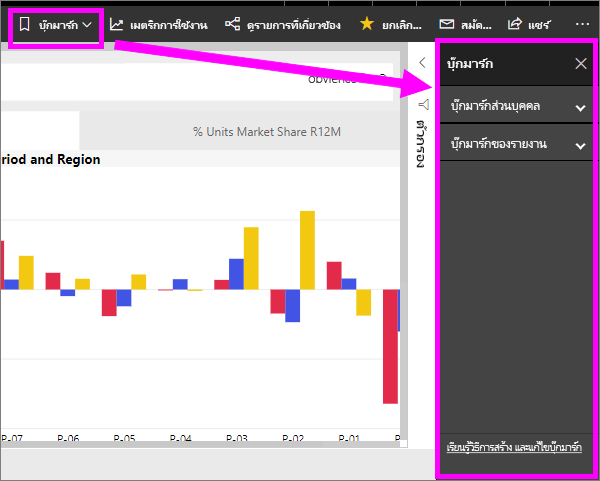
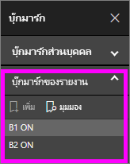
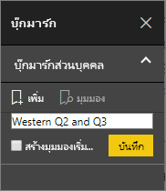
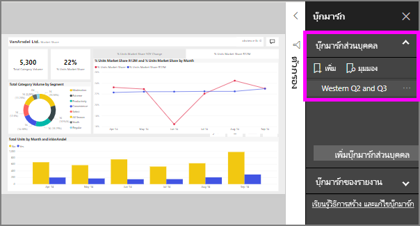

# มีอะไรบ้างที่คั่นหน้า
บุ๊กมาร์กจับภาพมุมมองที่กำหนดค่าไว้ในปัจจุบันของหน้ารายงาน รวมถึงตัวกรอง ตัวแบ่งส่วนข้อมูล และสถานะของวิชวล เมื่อคุณเลือกบุ๊กมาร์ก Power BI นำคุณกลับไปยังมุมมองนั้น มีสองชนิดของบุ๊กมาร์ก - ที่ที่คุณสร้างด้วยตนเองและสร้างรายงาน*นัก*

## ใช้บุ๊กมาร์กเพื่อแชร์ข้อมูลเชิงลึก และสร้างเรื่องราวใน Power BI 
ใช้มากมายสำหรับบุ๊กมาร์กได้ สมมติว่า คุณค้นหาข้อมูลเชิงลึกน่าสนใจ และต้องการเก็บรักษางาน--สร้างบุ๊กมาร์กเพื่อให้คุณสามารถกลับในภายหลัง จำเป็นต้องออกจาก และต้องการเก็บรักษางานปัจจุบันของคุณ สร้างบุ๊กมาร์ก คุณสามารถทำให้คั่นหน้าของคุณมุมมองเริ่มต้นของรายงาน ดังนั้นทุกครั้งที่คุณส่งกลับ ว่า มุมมองของหน้ารายงานเปิดก่อน 

คุณยังสามารถสร้างคอลเลกชันของบุ๊กมาร์ก จัดเรียงตามลำดับคุณต้อง และลำดับขั้นตอนแต่ละบุ๊กมาร์กในงานนำเสนอชุดของข้อมูลเชิงลึกที่บอกเล่าเรื่องราวได้  

## การใช้บุ๊กมาร์ก
เมื่อต้องเปิดบานหน้าต่างที่คั่นหน้า เลือก**บุ๊กมาร์ก**จากแถบเมนู เมื่อต้องกลับไปยังมุมมองต้นฉบับเผยแพร่รายงาน เลือก**รีเซ็ตเป็นค่าเริ่มต้น**

### ที่คั่นหน้ารายงาน
ถ้ารายงาน*designer*รวมที่คั่นหน้ารายงาน คุณจะค้นหาภายใต้การ**รายงานบุ๊กมาร์ก**หัวเรื่อง 

เลือกบุ๊กมาร์กเพื่อเปลี่ยนเป็นมุมมองรายงานนั้น 

### ที่คั่นหน้าส่วนบุคคล

เมื่อคุณสร้างบุ๊กมาร์ก องค์ประกอบต่อไปนี้จะถูกบันทึกพร้อมบุ๊กมาร์ก:

* หน้าปัจจุบัน
* ตัวกรอง
* ตัวแบ่งส่วนข้อมูล รวมถึงชนิดตัวแบ่งส่วนข้อมูล (เช่น รายการดรอปดาวน์หรือรายการ) และสถานะของตัวแบ่งส่วนข้อมูล
* สถานะการเลือกการแสดงผลด้วยภาพ (เช่น ตัวกรองการไฮไลต์เชื่อมโยง)
* ลำดับการจัดเรียง
* ตำแหน่งที่ดูรายละเอียด
* การมองเห็น (ของวัตถุ โดยใช้บานหน้าต่าง**เลือก**)
* โหมดโฟกัส หรือ**สปอตไลต์**ของวัตถุใด ๆ ที่มองเห็นได้

กำหนดค่าหน้ารายงานตามที่คุณต้องการให้ปรากฏในบุ๊กมาร์ก เมื่อหน้ารายงานของคุณและวิชวล ถูกจัดเรียงในแบบที่คุณต้องการแล้ว เลือก**เพิ่ม**จากบานหน้าต่าง**บุ๊กมาร์ก**เพื่อเพิ่มบุ๊กมาร์ก ในตัวอย่างนี้ เราได้เพิ่มตัวกรองบางตัวสำหรับภูมิภาคและวัน 

**Power BI**สร้างบุ๊กมาร์ก และช่วยให้คุณใส่ชื่อหรือชื่อทั่วไป คุณสามารถ*เปลี่ยนชื่อ*, *ลบ*หรือ*อัปเด*บุ๊กมาร์ก โดยการเลือกจุดไข่ปลาที่อยู่ถัดจากชื่อบุ๊กมาร์ก จาก นั้นเลือกการดำเนินการจากเมนูที่ปรากฏขึ้น

เมื่อคุณมีบุ๊กมาร์ก คุณสามารถแสดงได้ โดยการเลือกคั่นหน้าในการ**บุ๊กมาร์ก**บานหน้าต่างได้ 

<!--
## Arranging bookmarks
As you create bookmarks, you might find that the order in which you create them isn't necessarily the same order you'd like to present them to your audience. No problem, you can easily rearrange the order of bookmarks.

In the **Bookmarks** pane, simply drag-and-drop bookmarks to change their order, as shown in the following image. The yellow bar between bookmarks designates where the dragged bookmark will be placed.

The order of your bookmarks can become important when you use the **View** feature of bookmarks, as described in the next section. 

-->

## ใช้บุ๊กมาร์กนำเสนอภาพนิ่ง
เมื่อต้องการนำเสนอ หรือดูบุ๊กมาร์ก ลำดับ เลือก**มุมมอง**จากการ**บุ๊กมาร์ก**บานหน้าต่างเพื่อเริ่มการนำเสนอภาพนิ่ง

เมื่ออยู่ในโหมด**มุมมอง** มีบางคุณสมบัติที่สังเกตได้:

1. ชื่อบุ๊กมาร์กปรากฏในแถบชื่อเรื่องบุ๊กมาร์ก ซึ่งอยู่ด้านล่างของพื้นที่ทำงาน
2. แถบชื่อเรื่องบุ๊กมาร์ก มีลูกศรที่ช่วยให้คุณสามารถไปยังบุ๊กมาร์กถัดไป หรือก่อนหน้าได้
3. คุณสามารถออกจากโหมด**มุมมอง** โดยการเลือก**ออกจาก**จากบานหน้าต่าง**บุ๊กมาร์ก** หรือโดยการเลือก **X** ในแถบชื่อเรื่องบุ๊กมาร์กได้ 

เมื่อคุณอยู่ในโหมด**มุมมอง** คุณสามารถปิดบานหน้าต่าง**บุ๊กมาร์ก** (โดยการคลิก X บนบานหน้าต่างนั้น) เพื่อให้มีพื้นที่เพิ่มเติมสำหรับงานนำเสนอของคุณได้ และ ขณะที่อยู่ในโหมด**มุมมอง** วิชวลทั้งหมดเป็นแบบโต้ตอบ และพร้อมสำหรับการไฮไลต์แบบเชื่อมโยง เหมือนกับทีโต้ตอบกับวิชวลเหล่านั้นตามปกติ 

<!--
## Visibility - using the Selection pane
With the release of bookmarks, the new **Selection** pane is also introduced. The **Selection** pane provides a list of all objects on the current page and allows you to select the object and specify whether a given object is visible. 

You can select an object using the **Selection** pane. Also, you can toggle whether the object is currently visible by clicking the eye icon to the right of the visual. 

When a bookmark is added, the visible status of each object is also saved based on its setting in the **Selection** pane. 

It's important to note that **slicers** continue to filter a report page, regardless of whether they are visible. As such, you can create many different bookmarks, with different slicer settings, and make a single report page appear very different (and highlight different insights) in various bookmarks.

## Bookmarks for shapes and images
You can also link shapes and images to bookmarks. With this feature, when you click on an object, it will show the bookmark associated with that object. This can be especially useful when working with buttons; you can learn more by reading the article about [using buttons in Power BI](desktop-buttons.md). 

To assign a bookmark to an object, select the object, then expand the **Action** section from the **Format Shape** pane, as shown in the following image.

Once you turn the **Action** slider to **On** you can select whether the object is a back button, a bookmark, or a Q&A command. If you select bookmark, you can then select which of your bookmarks the object is linked to.

There are all sorts of interesting things you can do with object-linked bookmarking. You can create a visual table of contents on your report page, or you can provide different views (such as visual types) of the same information, just by clicking on an object.

When you are in editing mode you can use ctrl+click to follow the link, and when not in edit mode, simply click the object to follow the link. 

## Bookmark groups

Beginning with the August 2018 release of **Power BI Desktop**, you can create and use bookmark groups. A bookmark group is a collection of bookmarks that you specify, which can be shown and organized as a group. 

To create a bookmark group, hold down the CTRL key and select the bookmarks you want to include in the group, then click the ellipses beside any of the selected bookmarks, and select **Group** from the menu that appears.

**Power BI Desktop** automatically names the group *Group 1*. Fortunately, you can just double-click on the name and rename it to whatever you want.

With any bookmark group, clicking on the bookmark group's name only expands or collapses the group of bookmarks, and does not represent a bookmark by itself. 

When using the **View** feature of bookmarks, the following applies:

* If the selected bookmark is in a group when you select **View** from bookmarks, only the bookmarks *in that group* are shown in the viewing session. 

* If the selected bookmark is not in a group, or is on the top level (such as the name of a bookmark group), then all bookmarks for the entire report are played, including bookmarks in any group. 

To ungroup bookmarks, just select any bookmark in a group, click the ellipses, and then select **Ungroup** from the menu that appears. 

Note that selecting **Ungroup** for any bookmark from a group takes all bookmarks out of the group (it deletes the group, but not the bookmarks themselves). So to remove a single bookmark from a group, you need to **Ungroup** any member from that group, which deletes the grouping, then select the members you want in the new group (using CTRL and clicking each bookmark), and select **Group** again. 
-->

## ข้อจำกัดและข้อควรพิจารณา
ในการเผยแพร่นี้ **บุ๊กมาร์ก**มีข้อจำกัดและข้อควรพิจารณาบางอย่าง

* วิชวลแบบกำหนดเองส่วนใหญ่ควรทำงานได้ดีกับการบุ๊กมาร์ก ถ้าคุณพบปัญหากับการบุ๊กมาร์กและการแสดงภาพแบบกำหนดเอง ให้ติดต่อผู้สร้างภาพนั้น และขอให้พวกเขาจะเพิ่มการสนับสนุนบุ๊กมาร์กให้กับภาพ 
* ถ้าคุณเพิ่มวิชวลบนหน้ารายงานหลังจากการสร้างบุ๊กมาร์ก วิชวลจะแสดงในสถานะเริ่มต้น ซึ่งหมายความว่า ถ้าคุณเพิ่มตัวแบ่งส่วนข้อมูลลงในหน้าที่คุณเคยสร้างบุ๊กมาร์กไว้ก่อน ตัวแบ่งส่วนข้อมูลจะทำงานในสถานะเริ่มต้น
* การย้ายวิชวลหลังจากการสร้างบุ๊กมาร์ก จะมีผลในบุ๊กมาร์ก 
* โดยทั่วไปแล้ว คั่นหน้าของคุณจะไม่ได้รับผลกระทบถ้ารายงาน*designer*อัปเดต หรือ republishes รายงาน อย่างไรก็ตาม ถ้าตัวออกแบบทำการเปลี่ยนแปลงหลักรายงาน เช่นการนำออกใช้บุ๊กมาร์ก เขตข้อมูลแล้วคุณจะได้รับข้อผิดพลาดในครั้งถัดไปที่คุณพยายามเปิดที่คั่นหน้านั้น 

<!--
## Next steps
spotlight?
-->
