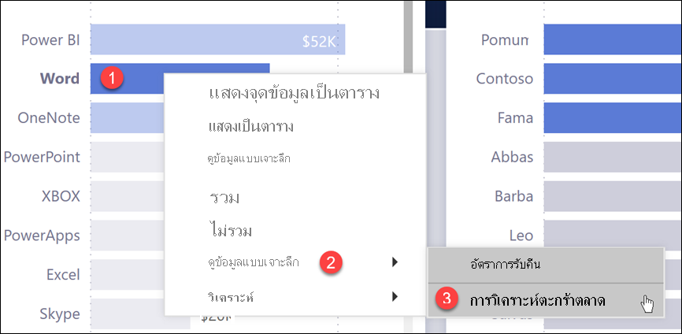
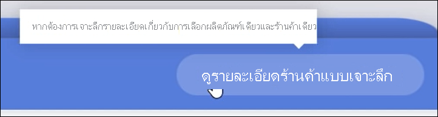
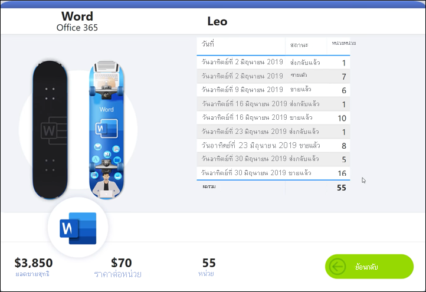
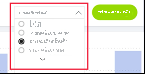

# ปุ่มในบริการ Power BI
ในรายงานที่คุณได้รับจากเพื่อนร่วมงาน คุณอาจสังเกตเห็นปุ่มต่าง ๆ และสงสัยว่าจะใช้งานอย่างไร บางปุ่มมีคำศัพท์ บางปุ่มมีลูกศร บางปุ่มมีกราฟิก และบางปุ่มยังมีเมนูแบบดรอปดาวน์ด้วย บทความนี้จะสอนวิธีการรับรู้ปุ่มและวิธีการที่จะคิดออกว่าจะทำอย่างไรกับปุ่มดังกล่าว

## วิธีการรับรู้ปุ่ม
ปุ่มสามารถมีลักษณะได้มากมาย เช่น รูปร่าง รูปภาพ หรือไอคอนในหน้ารายงาน แต่ถ้ามีการดำเนินการเกิดขึ้นเมื่อคุณเลือก (คลิก) วัตถุดังกล่าว อาจเป็นไปได้ว่าวัตถุนั้นอาจเป็นปุ่ม

## ชนิดของปุ่ม
ผู้สร้างรายงานจะเพิ่มปุ่มในรายงานเพื่อช่วยให้คุณสามารถนำทางและสำรวจได้ ชนิดของปุ่มคือ: **ย้อนกลับ**, **บุ๊กมาร์ก**, **การเข้าถึงรายละเอียด**, **การนำทางของเพจ**, **Q&A**, และ **URL ของเว็บ** 

### ปุ่ม ย้อนกลับ 
ปุ่ม ย้อนกลับ อาจมีไอคอนลูกศรและเมื่อคุณเลือก Power BI จะนำคุณกลับไปยังหน้าก่อนหน้า  ปุ่มย้อนกลับมักจะใช้กับการเข้าถึงรายละเอียด นี่คือตัวอย่างของปุ่มย้อนกลับที่ใช้กับการเข้าถึงรายละเอียด

1. เลือก **Word** ในแผนภูมิแท่ง
1. เลือก **เจาะลึกข้อมูลผ่าน** และเลือก **การวิเคราะห์ตะกร้าการตลาด**

    

    โดยการเลือก **การวิเคราะห์ตะกร้าสินค้า** Power BI จะเปิดหน้ารายงาน *การวิเคราะห์ตะกร้าสินค้า* และใช้การเลือกที่สร้างขึ้นบนหน้าต้นทางเพื่อกรองสิ่งที่จะแสดงบนหน้าปลายทาง

    

    ตอนนี้ คุณอยู่ในหน้ารายงาน **การวิเคราะห์ตะกร้าตลาด** ซึ่งถูกกรองสำหรับ Word หากต้องการกลับไปที่หน้าก่อนหน้านี้ ให้เลือกปุ่ม ย้อนกลับ 

## ปุ่ม บุ๊กมาร์ก
ผู้ออกแบบรายงานมักจะมีบุ๊กมาร์กพร้อมรายงาน คุณสามารถดูรายการบุ๊กมาร์กรายงานโดยเลือก **ดู** > **บุ๊กมาร์ก** จากมุมขวาบน เมื่อผู้ออกแบบรายงานเพิ่ม*ปุ่ม*บุ๊กมาร์ก ซึ่งเป็นเพียงอีกวิธีหนึ่งในการนำทางไปยังหน้ารายงานเฉพาะที่เกี่ยวข้องกับบุ๊กมาร์กนั้น หน้านี้จะมีตัวกรองและการตั้งค่าที่ใช้งานอยู่ ซึ่งคั่นหน้าด้วยบุ๊กมาร์ก [เรียนรู้เพิ่มเติมเกี่ยวกับบุ๊กมาร์กใน Power BI](end-user-bookmarks.md) 

ในตัวอย่างนี้ ปุ่มมีไอคอนบุ๊กมาร์กและชื่อของบุ๊กมาร์ก คือ *เมือง* 

ด้วยการเลือกปุ่ม บุ๊กมาร์ก Power BI จะนำคุณไปยังตำแหน่งที่ตั้งและการตั้งค่าตามที่กำหนดไว้สำหรับบุ๊กมาร์กนั้น  ในกรณีนี้ บุ๊กมาร์กอยู่บนหน้ารายงาน *โอกาสการเติบโต* และหน้านั้นจะถูกกรองข้ามสำหรับ **เมือง**

## ปุ่มการเข้าถึงรายละเอียด
มีแนวทางสองวิธีในการเจาะลึกรายละเอียดผ่านในบริการ Power BI การเข้าถึงรายละเอียดจะนำคุณไปยังหน้ารายงานอื่นและข้อมูลในหน้าปลายทางนั้นจะแสดงตามตัวกรองและการเลือกที่คุณได้ทำบนหน้าต้นทาง

วิธีหนึ่งในการเข้าถึงรายละเอียดในรายงานคือคลิกขวาที่จุดข้อมูลในวิชวล ให้เลือก **เจาะลึกข้อมูลผ่าน** และเลือกปลายทาง วิธีการนี้อธิบายไว้ข้างต้นในส่วนที่ชื่อ **ปุ่มย้อนกลับ** แต่บางครั้งผู้ออกแบบรายงานใช้ *ปุ่ม* การเข้าถึงรายละเอียดแทน เพื่อให้การดำเนินการชัดเจนมากขึ้น และเรียกความสนใจไปยังข้อมูลเชิงลึกที่สำคัญ  

ปุ่ม การเข้าถึงรายละเอียด สามารถมีข้อกำหนดเบื้องต้นได้มากกว่าหนึ่งรายการ หากคุณไม่ปฏิบัติตามข้อกำหนดเบื้องต้นทั้งหมด ปุ่มจะไม่ทำงาน มาลองดูตัวอย่างกัน

ต่อไปนี้คือปุ่ม การเข้าถึงรายละเอียด ที่จะนำเราไปยังหน้า *รายละเอียดร้านค้า* การวางเมาส์เหนือปุ่มจะแสดงคำแนะนำเครื่องมือที่ช่วยให้เราทราบว่าเราต้องเลือกทั้งร้านค้าและผลิตภัณฑ์ จนกว่าเราจะเลือกหนึ่งรายการ ปุ่มก็ยังคงไม่ทำงาน

ตอนนี้เราได้เลือกผลิตภัณฑ์หนึ่งรายการ (**Word**) และร้านค้าหนึ่งรายการ (**ลีโอ**) ปุ่มจะเปลี่ยนสีเพื่อแจ้งให้เราทราบว่าขณะนี้มีการใช้งานอยู่

การเลือกปุ่ม การเข้าถึงรายละเอียด จะนำเราไปยังหน้ารายงาน *Store* หน้า *ร้านค้า* ถูกกรองสำหรับการเลือก **Word** และ **Leo** ของเรา

ปุ่ม การเข้าถึงรายละเอียดข้อมูล ยังสามารถมีเมนูแบบดรอปดาวน์ที่ให้คุณเลือกจุดหมายปลายทางได้ เมื่อคุณทำการเลือกในหน้ารายงานต้นทางแล้ว ให้เลือกหน้ารายงานปลายทางสำหรับการเข้าถึงรายละเอียดข้อมูล ในตัวอย่างด้านล่าง เรากำลังทำการเปลี่ยนแปลงการเลือกของเราเพื่อดูรายละเอียดเจาะลึกในหน้ารายงานของ *รายละเอียดตลาด* 

## การนำทางเพจ

ปุ่มการนำทางของหน้าจะนำคุณไปยังหน้าอื่นในรายงานเดียวกัน ผู้ออกแบบรายงานมักสร้างปุ่มการนำทางเพื่อเล่าเรื่องราวหรือแนะนำคุณผ่านข้อมูลเชิงลึกของรายงาน ในตัวอย่างด้านล่าง ผู้ออกแบบรายงานเพิ่มปุ่มบนหน้ารายงานแต่ละหน้าที่นำคุณไปยังหน้าแรก หน้าสรุประดับบนสุด ในรายงาน ปุ่มการนำทางของหน้านี้มีประโยชน์เนื่องจากมีหลายหน้าในรายงานนี้

## ปุ่ม Q&A 
การเลือกปุ่ม Q&A จะเปิดหน้าต่าง Power BI Q&A Explorer หน้าต่าง Q&A ปรากฏที่ด้านบนของหน้ารายงานและสามารถปิดได้โดยเลือก X [เรียนรู้เกี่ยวกับ Q&A](end-user-q-and-a.md)

## URL ของเว็บ
ปุ่ม URL ของเว็บเปิดหน้าต่างเบราว์เซอร์ใหม่ ผู้ออกแบบรายงานอาจเพิ่มปุ่มประเภทนี้เป็นแหล่งอ้างอิง เพื่อเชื่อมโยงไปยังเว็บไซต์ขององค์กร หรือแม้กระทั่งเป็นลิงก์ไปยังรายงานหรือแดชบอร์ดอื่น ในตัวอย่างด้านล่าง ปุ่ม URL ของเว็บช่วยให้คุณดาวน์โหลดไฟล์ต้นฉบับสำหรับรายงาน 

เนื่องจากหน้าจะเปิดขึ้นในหน้าต่างแยกต่าง ให้ปิดหน้าต่างหรือเลือกแท็บ Power BI ของคุณเพื่อกลับไปที่รายงาน Power BI

## ขั้นตอนถัดไป
[บุ๊กมาร์ก](end-user-bookmarks.md)    
[เจาะดูข้อมูลลึกขึ้น เจาะดูรายละเอียดแนวลึก](end-user-drill.md)
