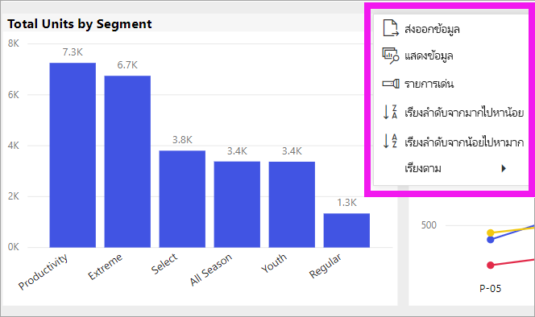
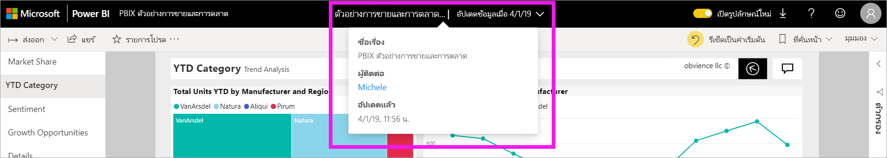

# เปลี่ยนวิธีการเรียงลำดับแผนภูมิในรายงาน Power BI

[!INCLUDE [power-bi-service-new-look-include](../includes/power-bi-service-new-look-include.md)]

> [!IMPORTANT]
> **บทความนี้มีไว้สำหรับผู้ใช้ Power BI ที่ไม่มีสิทธิ์ในการแก้ไขรายงานหรือชุดข้อมูล สำหรับคำแนะนำโดยละเอียดเพิ่มเติมสำหรับการเรียงลำดับ โปรดอ่าน [เรียงลำดับตามคอลัมน์ใน Power BI Desktop](../desktop-sort-by-column.md)**

ในบริการของ Power BI คุณสามารถเปลี่ยนลักษณะของวิชวล โดยเรียงลำดับตามเขตข้อมูลที่แตกต่างกันได้ โดยการเปลี่ยนวิธีการเรียงลำดับวิชวล คุณสามารถไฮไลท์ข้อมูลที่คุณต้องการถ่ายทอดไป

ไม่สามารถเรียงลำดับวิชวลบนแดชบอร์ดได้ แต่ในรายงาน Power BI คุณสามารถเรียงลำดับการแสดงผลข้อมูลด้วยภาพส่วนใหญ่ได้ 

ไม่ว่าคุณจะใช้ข้อมูลเชิงตัวเลข (เช่น ตัวเลขยอดขาย) หรือข้อมูลแบบข้อความ (เช่น ชื่อรัฐ) คุณสามารถเรียงลำดับการแสดงผลข้อมูลด้วยภาพตามที่คุณต้องการได้ Power BI มีความยืดหยุ่นมากมายสำหรับการรียงลำดับ และเมนูด่วนให้คุณใช้ 

## เริ่มใช้งาน

หากต้องการเริ่มต้นใช้งาน ให้เลือกวิชวลใดก็ตามและเลือก **การดำเนินการเพิ่มเติม** (...)  มีตัวเลือกสำหรับการเรียงลำดับสามตัวเลือก: **เรียงลำดับจากมากไปหาน้อย** **เรียงลำดับจากน้อยไปหามาก** และ **เรียงลำดับตาม** 
    

### เรียงลำดับตามตัวอักษรหรือตามตัวเลข

คุณสามารถเรียงลำดับวิชวลตามตัวอักษรโดยชื่อของหมวดหมู่ในวิชวล หรือโดยค่าตัวเลขของแต่ละหมวดหมู่ได้ ตัวอย่างเช่น แผนภูมินี้จะเรียงตาม **ชื่อ** ร้านค้าของหมวดหมู่บนแกน x โดยเรียงลำดับตัวอักษร

เป็นเรื่องง่ายเมื่อต้องเปลี่ยนการเรียงลำดับจากประเภท (ชื่อร้าน) เป็นค่า(ยอดขายสำหรับแต่ละตารางฟุต) แทน เลือก **การดำเนินการเพิ่มเติม** (...) และเลือก **เรียงลำดับตาม** เลือกค่าเชิงตัวเลขที่ใช้ในวิชวล  ในตัวอย่างนี้ เราได้เลือก **ยอดขายต่อตารางฟุต (Sales Per Sq Ft)**

ถ้าจำเป็น ให้เปลี่ยนลำดับการจัดเรียงระหว่างจากน้อยไปหามากและจากมากไปหาน้อย  เลือก**การดำเนินการเพิ่มเติม** (...) อีกครั้ง และเลือก**เรียงลำดับจากมากไปน้อย** หรือ **เรียงลำดับจากน้อยไปมาก** เขตข้อมูลที่ใช้ในการเรียงลำดับจะเป็นตัวหนาและมีแถบสีเหลือง

   

> [!NOTE]
> ภาพไม่สามารถเรียงลำดับได้ทั้งหมด ตัวอย่างเช่น ไม่สามารถจัดเรียงวิชวลต่อไปนี้ แผนภาพต้นไม้ แผนที่ แผนที่กรอกข้อมูล แผนภูมิกระจาย หน้าปัด บัตร น้ำตก

## บันทึกการเปลี่ยนแปลงที่คุณทำกับการเรียงลำดับ
รายงาน Power BI จะคงตัวกรอง, ตัวแบ่งส่วนข้อมูล, การเรียงลำดับ และ การเปลี่ยนแปลงอื่น ๆ ในมุมมองที่คุณทำไว้ ดังนั้นถ้าคุณนำทางออกจากรายงาน และกลับไปในภายหลัง การเปลี่ยนแปลงการเรียงลำดับของคุณก็ยังถูกบันทึกไว้  ถ้าคุณต้องการย้อนกลับการเปลี่ยนแปลงของคุณ ให้กลับไปยังการตั้งค่าของนักออกแบบรายงาน และเลือก**รีเซ็ตเป็นค่าเริ่มต้น**จากแถบเมนูด้านบน 

อย่างไรก็ตาม ถ้าปุ่ม**รีเซ็ตเป็นค่าเริ่มต้น**เป็นสีเทา แสดงว่า*ผู้ออกแบบ*รายงานได้ปิดใช้งานความสามารถในการบันทึก (คงอยู่) การเปลี่ยนแปลงของคุณ

## ข้อควรพิจารณาและการแก้ไขปัญหา

### เรียงลำดับโดยใช้เกณฑ์อื่น
บางครั้ง คุณต้องการเรียงลำดับวิชวลของคุณโดยใช้เขตข้อมูลที่แตกต่างกัน (ที่ไม่รวมอยู่ในวิชวล) หรือเกณฑ์อื่น ๆ  ตัวอย่างเช่น คุณอาจต้องการเรียงลำดับตามเดือนตามลำดับต่อเนื่องกัน
 (และไม่ได้อยู่ในลำดับตัวอักษร) หรือคุณอาจต้องการเรียงลำดับตามตัวเลขทั้งหมด แทนที่เรียงด้วยตัวเลข (ตัวอย่าง 0, 1, 9, 20 และไม่ 0, 1, 20, 9)  เฉพาะผู้ที่ออกแบบรายงานเท่านั้นที่สามารถทำการเปลี่ยนแปลงเหล่านี้ให้คุณได้ คุณสามารถค้นหาข้อมูลการติดต่อสำหรับ*ผู้ออกแบบ*ได้โดยการเลือกชื่อรายงานจากแถบส่วนหัว

## ขั้นตอนถัดไป
อ่านเพิ่มเติมเกี่ยวกับ[การแสดงภาพในรายงาน Power BI](end-user-visualizations.md)

[Power BI แนวคิดพื้นฐาน](end-user-basic-concepts.md)
