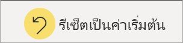

# เปลี่ยนวิธีการเรียงลำดับแผนภูมิในรายงาน Power BI
ในรายงาน Power BI คุณสามารถเรียงลำดับการแสดงภาพส่วนใหญ่ตามลำดับตัวอักษร โดยชื่อของประเภทในแผนภูมิ หรือค่าตัวเลขของแต่ละประเภท ตัวอย่างเช่น แผนภูมินี้จะเรียงตามประเภทของ **ชื่อร้านค้า**

เป็นเรื่องง่ายเมื่อต้องเปลี่ยนการเรียงลำดับจากประเภท (ชื่อร้าน) เป็นค่า(ยอดขายสำหรับแต่ละตารางฟุต) แทน

1. เลือกจุดไข่ปลา (...) แล้วเลือก**เรียงลำดับตาม > ยอดขายต่อ Sq Ft**
2. ถ้าจำเป็น ให้เลือกจุดไข่ปลาอีกครั้งและเลือก**เรียงลำดับจากมากไปน้อย**

   

> [!NOTE]
> ภาพไม่สามารถเรียงลำดับได้ทั้งหมด ตัวอย่างเช่น ไม่สามารถจัดเรียงวิชวลต่อไปนี้ แผนภาพต้นไม้ แผนที่ แผนที่กรอกข้อมูล แผนภูมิกระจาย หน้าปัด บัตร น้ำตก

## บันทึกการเปลี่ยนแปลงที่คุณทำกับการเรียงลำดับ
รายงาน Power BI จะคงตัวกรอง, ตัวแบ่งส่วนข้อมูล, การเรียงลำดับ และ การเปลี่ยนแปลงอื่น ๆ ในมุมมองที่คุณทำไว้ ดังนั้นถ้าคุณนำทางออกจากรายงาน และกลับไปทีหลัง การเปลี่ยนแปลงของคุณก็ยังบันทึกไว้  ถ้าคุณต้องการย้อนกลับการเปลี่ยนแปลงของคุณ ให้กลับไปยังการตั้งค่าของนักออกแบบรายงาน และเลือก**รีเซ็ตเป็นค่าเริ่มต้น**จากแถบเมนูด้านบน 

แต่ถ้าปุ่ม**รีเซ็ตเป็นค่าเริ่มต้น**เป็นสีเทา แสดงว่านักออกแบบรายงานได้ปิดใช้งานความสามารถในการบันทึก (คงอยู่) การเปลี่ยนแปลงของคุณ

## เรียงลำดับโดยใช้เกณฑ์อื่น
บางครั้ง คุณต้องการเรียงภาพของคุณโดยใช้เขตข้อมูลที่แตกต่างกันหรือเงื่อนไขอื่น  ตัวอย่างเช่น คุณอาจต้องการเรียงลำดับตามเดือน (และไม่ได้อยู่ในลำดับตัวอักษร) หรือคุณอาจต้องการเรียงลำดับตามตัวเลขทั้งหมด แทนที่เรียงด้วยตัวเลข (ตัวอย่าง 0, 1, 9, 20 และไม่ 0, 1, 20, 9)  

ในบางกรณี คุณอาจสามารถเรียงลำดับภาพที่คุณต้องการ ตัวอย่างเช่น ตามเดือน  แต่ถ้าไม่ใช่ อาจเนื่องมาจากชุดข้อมูลเบื้องหลังรายงานขาดบางอย่าง ขอให้นักออกแบบรายงานอัปเดตชุดข้อมูล

## ขั้นตอนถัดไป
อ่านเพิ่มเติมเกี่ยวกับ[การแสดงภาพในรายงาน Power BI](end-user-visualizations.md)

[Power BI แนวคิดพื้นฐาน](end-user-basic-concepts.md)
