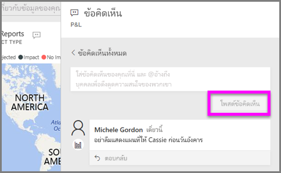
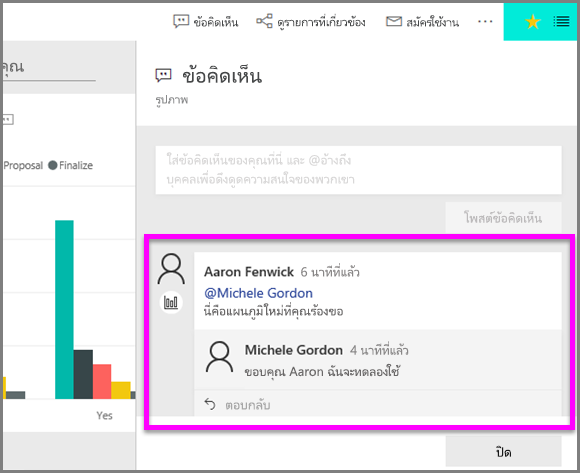

# เพิ่มข้อคิดเห็นในการแสดงผลด้วยภาพ
เพิ่มข้อคิดเห็นส่วนบุคคล หรือเริ่มการสนทนาเกี่ยวกับภาพกับเพื่อนร่วมงานของคุณ คุณลักษณะ**ข้อคิดเห็น**มีเพียงหนึ่งในหลายวิธีการที่*ผู้ใช้*สามารถโต้ตอบด้วยภาพได้ 

## วิธีการใช้คุณลักษณะข้อคิดเห็น

1. เลื่อนเคอร์เซอร์เหนือการแสดงผลด้วยภาพและเลือกจุดไข่ปลา (...)    
2. จากรายการแบบเลื่อนลง เลือก**เพิ่มข้อคิดเห็น**

      

3.  เพิมพ์ข้อคิดเห็นของคุณ และเลือก**โพสต์ข้อคิดเห็น** นี้คือข้อคิดเห็นหนึ่งถึงตัวฉันเอง กรอกข้อมูลด้วยคำที่สะกดผิด

      

4. นี่คือการสนทนาที่ฉันมีด้วย*นักออกแบบ*การแสดงผลด้วยภาพ เขาใช้สัญลักษณ์ @ เพื่อให้แน่ใจว่าฉันเห็นข้อคิดเห็น ฉันรู้ว่าข้อคิดเห็นนี้มีไว้สำหรับฉัน เมื่อฉันเปิดแดชบอร์ดบนแอปใน Power BI ฉันเลือก**ข้อคิดเห็น**จากส่วนหัว บานหน้าต่าง**ข้อคิดเห็น**แสดงการสนทนาของเรา 

      

5. คลิก**ปิด**เพื่อกลับไปยังแดชบอร์ดหรือรายงาน

## ขั้นตอนถัดไป
กลับไปยัง[การแสดงผลด้วยภาพสำหรับผู้ใช้](end-user-visualizations.md)    
<!--[Select a visualization to open a report](end-user-open-report.md)-->