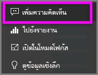
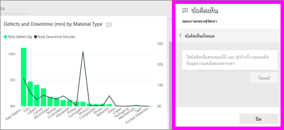
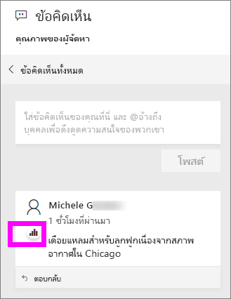
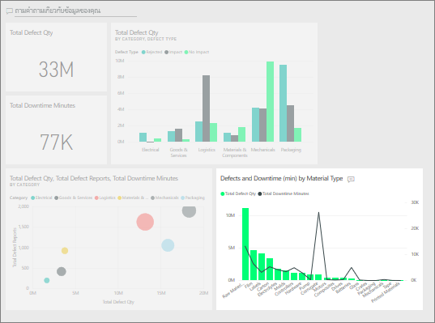

# เพิ่มข้อคิดเห็นในแดชบอร์ด
เพิ่มข้อคิดเห็นส่วนบุคคล หรือเริ่มการสนทนาเกี่ยวกับแดชบอร์ดกับเพื่อนร่วมงานของคุณ คุณลักษณะ**ข้อคิดเห็น**มีเพียงหนึ่งในหลายวิธีการที่*ผูบริโภค*สามารถทำงานร่วมกับผู้อื่นได้ 

## วิธีการใช้คุณลักษณะข้อคิดเห็น
คุณสามารถเพิ่มข้อคิดเห็นไปยังแดชบอร์ดทั้งหมด หรือแต่ละภาพบนแดชบอร์ด เพิ่มความคิดเห็นทั่วไปหรือความคิดเห็นที่กำหนดเป้าหมายที่เพื่อนร่วมงานที่เฉพาะเจาะจง  

### เพิ่มความคิดเห็นแดชบอร์ดทั่วไป
1. เปิดแดชบอร์ด Power BI และเลือกไอคอน **ความคิดเห็น** ซึ่งเปิดกล่องโต้ตอบความคิดเห็น

    

    ที่นี่เราเห็นว่าผู้สร้างแดชบอร์ดได้เพิ่มความคิดเห็นทั่วไปแล้ว  ทุกคนที่สามารถเข้าถึงแดชบอร์ดนี้สามารถเห็นความคิดเห็นนี้

    

2. เมื่อต้องตอบกลับ เลือก **ตอบกลับ** พิมพ์การตอบกลับของคุณ และเลือก **โพสต์**  

    

    ตามค่าเริ่มต้น Power BI นำการตอบกลับของคุณไปยังเพื่อนร่วมงานที่เริ่มเธรดความคิดเห็นในกรณีนี้ Aaron F. 

    

 3. หากคุณต้องการเพิ่มความคิดเห็นแดชบอร์ดที่ไม่ได้เป็นส่วนหนึ่งของเธรดที่มีอยู่ ให้ป้อนความคิดเห็นของคุณในฟิลด์ข้อความด้านบน

    

    ตอนนี้ความคิดเห็นสำหรับแดชบอร์ดนี้มีลักษณะดังนี้

    

### เพิ่มข้อคิดเห็นไปยังภาพแดชบอร์ดที่เฉพาะเจาะจง
1. เลื่อนเคอร์เซอร์เหนือภาพและเลือกจุดไข่ปลา (...)    
2. จากรายการแบบเลื่อนลง เลือก**เพิ่มข้อคิดเห็น**

      

3.  กล่องโต้ตอบ**ความคิดเห็น**เปิดขึ้น ภาพนี้ยังไม่มีความคิดเห็นใด ๆ 

      

4. เพิมพ์ข้อคิดเห็นของคุณ และเลือก**โพสต์**

      

    ไอคอนแผนภูมิ  ช่วยให้เราทราบว่าความคิดเห็นนี้เชื่อมโยงกับภาพเฉพาะ เลือกไอคอนเพื่อเน้นภาพที่เกี่ยวข้องบนแดชบอร์ด

    

5. เลือก**ปิด**เพื่อกลับไปยังแดชบอร์ดหรือรายงาน

### ดึงดูดความสนใจเพื่อนร่วมงานของคุณ โดยใช้เครื่องหมาย @
ไม่ว่าคุณจะสร้างความคิดเห็นแดชบอร์ดหรือแสดงความคิดเห็นในภาพใดภาพหนึ่ง ดึงดูดความสนใจของเพื่อนร่วมงานโดยใช้สัญลักษณ์ "\@"  เมื่อคุณพิมพ์สัญลักษณ์ "\@" Power BI จะเปิดรายการแบบเลื่อนลงซึ่งคุณสามารถค้นหาและเลือกบุคคลจากองค์กรของคุณ ชื่อที่ถูกตรวจสอบไว้ล่วงหน้าซึ่งมีสัญลักษณ์ "\@" จะปรากฏเป็นตัวอักษรสีน้ำเงิน 

นี่คือการสนทนาที่ฉันมีด้วย*นักออกแบบ*การแสดงผลด้วยภาพ เขาใช้สัญลักษณ์ @ เพื่อให้แน่ใจว่าฉันเห็นข้อคิดเห็น ฉันรู้ว่าข้อคิดเห็นนี้มีไว้สำหรับฉัน เมื่อฉันเปิดแดชบอร์ดบนแอปใน Power BI ฉันเลือก**ข้อคิดเห็น**จากส่วนหัว บานหน้าต่าง**ข้อคิดเห็น**แสดงการสนทนาของเรา

  

## ขั้นตอนถัดไป
กลับไปยัง[การแสดงผลด้วยภาพสำหรับผู้ใช้](end-user-visualizations.md)    
<!--[Select a visualization to open a report](end-user-open-report.md)-->
