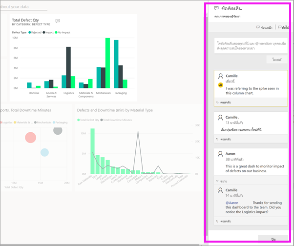

# เพิ่มความคิดเห็นในแดชบอร์ดหรือรายงาน

[!INCLUDE[consumer-appliesto-ynny](../includes/consumer-appliesto-ynny.md)]

[!INCLUDE [power-bi-service-new-look-include](../includes/power-bi-service-new-look-include.md)]

เพิ่มข้อคิดเห็นส่วนบุคคล หรือเริ่มการสนทนาเกี่ยวกับแดชบอร์ดหรือรายงานกับเพื่อนร่วมงานของคุณ คุณลักษณะ**ข้อคิดเห็น**มีเพียงหนึ่งในหลายวิธีการที่*ผูบริโภค*สามารถทำงานร่วมกับผู้อื่นได้ 

> [!NOTE]
> การทำงานร่วมกับบุคคลอื่น รวมถึงการเพิ่มข้อคิดเห็นไปยังรายงานที่แชร์ จำเป็นต้องมีสิทธิการใช้งาน Power BI Pro หรือ Premium [ประเภทสิทธิการใช้งานใดที่ฉันมี](end-user-license.md)

## วิธีการใช้คุณลักษณะข้อคิดเห็น
คุณสามารถเพิ่มข้อคิดเห็นลงในแดชบอร์ดทั้งหมด ลงในภาพแต่ละภาพบนแดชบอร์ด ลงในหน้ารายงาน ลงในรายงานที่มีการแบ่งหน้า และลงในการแสดงผลด้วยภาพของแต่ละบุคคลบนหน้ารายงานได้ เพิ่มความคิดเห็นทั่วไปหรือความคิดเห็นที่กำหนดเป้าหมายที่เพื่อนร่วมงานที่เฉพาะเจาะจง  

เมื่อคุณเพิ่มข้อคิดเห็นไปยังรายงาน Power BI จับภาพฟิลเตอร์ปัจจุบันและค่าตัวแบ่งส่วนข้อมูล ซึ่งหมายความว่าเมื่อคุณเลือกหรือตอบกลับข้อคิดเห็นหน้ารายงานหรือภาพรายงานอาจเปลี่ยนแปลงเพื่อแสดงตัวเลือกและตัวแบ่งส่วนข้อมูลที่ใช้งานอยู่เมื่อมีการเพิ่มข้อคิดเห็นครั้งแรก  

ทำไมจึงเป็นสิ่งสำคัญ? บอกให้เพื่อนร่วมงานใช้ตัวกรองที่เปิดเผยข้อมูลเชิงลึกที่น่าสนใจที่พวกเขาต้องการแชร์กับทีม หากไม่มีตัวกรองที่เลือกไว้ข้อคิดเห็นอาจไม่เป็นที่เข้าใจ

หากคุณกำลังใช้รายงานที่มีการแบ่งหน้า คุณอาจสามารถทำได้แค่ให้ข้อคิดเห็นทั่วไปเกี่ยวกับรายงานของคุณเท่านั้น  โดยจะไม่สามารถแสดงข้อคิดเห็นลงบนภาพรายงานแบบแบ่งหน้าแต่ละภาพได้

### เพิ่มข้อคิดเห็นทั่วไปไปยังแดชบอร์ดหรือรายงาน
กระบวนการสำหรับการเพิ่มข้อคิดเห็นไปยังแดชบอร์ดหรือรายงานจะคล้ายกัน  ในตัวอย่างนี้ เรากำลังใช้แดชบอร์ด 

1. เปิดแดชบอร์ด Power BI หรือรายงาน และเลือกไอคอน **ความคิดเห็น** ซึ่งเปิดกล่องโต้ตอบความคิดเห็น

    

    ที่นี่เราเห็นว่าผู้สร้างแดชบอร์ดได้เพิ่มความคิดเห็นทั่วไปแล้ว  ทุกคนที่สามารถเข้าถึงแดชบอร์ดนี้สามารถเห็นความคิดเห็นนี้

    

2. เมื่อต้องตอบกลับ เลือก **ตอบกลับ** พิมพ์การตอบกลับของคุณ และเลือก **โพสต์**  

    

    ตามค่าเริ่มต้น Power BI นำการตอบกลับของคุณไปยังเพื่อนร่วมงานที่เริ่มเธรดความคิดเห็นในกรณีนี้ Aaron. 

    

 3. หากคุณต้องการเพิ่มความคิดเห็นแดชบอร์ดที่ไม่ได้เป็นส่วนหนึ่งของเธรดที่มีอยู่ ให้ป้อนความคิดเห็นของคุณในฟิลด์ข้อความด้านบน

    

    ตอนนี้ความคิดเห็นสำหรับแดชบอร์ดนี้มีลักษณะดังนี้

    

### เพิ่มข้อคิดเห็นไปยังการแสดงผลภาพแดชบอร์ดหรือรายงานที่เฉพาะเจาะจง
นอกเหนือจากการเพิ่มข้อคิดเห็นไปยังแดชบอร์ดทั้งหมดหรือไปยังหน้ารายงานทั้งหมด คุณสามารถเพิ่มข้อคิดเห็นไปยังไทล์แดชบอร์ดแต่ละรายการและการแสดงผลด้วยภาพของแต่ละรายงานได้ กระบวนการนี้จะคล้ายกันและในตัวอย่างนี้เรากำลังใช้รายงาน

1. วางเมาส์เหนือวิชวล และเลือก**ตัวเลือกเพิ่มเติม** (...)    
2. จากรายการแบบดรอบดาวน์ เลือก**เปิดการแสดงข้อคิดเห็น**

      

3.  กล่องโต้ตอบ **ข้อคิดเห็น** เปิดขึ้นและการแสดงผลภาพอื่นๆ บนหน้าจะเป็นสีเทา ภาพนี้ยังไม่มีความคิดเห็นใด ๆ 

      

4. เพิมพ์ข้อคิดเห็นของคุณ และเลือก**โพสต์**

      

    - บนหน้ารายงาน ให้เลือกข้อคิดเห็นที่สร้างขึ้นด้วยการแสดงผลภาพ ไฮไลต์ภาพแสดงผลภาพนั้น (ดูข้างบน)

    - บนแดชบอร์ด ไอคอนแผนภูมิ  ช่วยให้เราทราบว่าความคิดเห็นนี้เชื่อมโยงกับการแสดงภาพเฉพาะ ข้อคิดเห็นที่นำไปใช้กับทั้งแดชบอร์ดไม่มีไอคอนพิเศษ การเลือกไอคอนแผนภูมิจะไฮไลท์การแสดงผลด้วยภาพที่เกี่ยวข้องบนแดชบอร์ด
    

    

5. เลือก**ปิด**เพื่อกลับไปยังแดชบอร์ดหรือรายงาน

### ดึงดูดความสนใจเพื่อนร่วมงานของคุณ โดยใช้เครื่องหมาย @
ไม่ว่าคุณจะสร้างแดชบอร์ด รายงาน ไทล์ หรือความคิดเห็นในภาพใดภาพหนึ่ง ให้ดึงดูดความสนใจของเพื่อนร่วมงานโดยใช้สัญลักษณ์ "\@"  เมื่อคุณพิมพ์สัญลักษณ์ "\@" Power BI จะเปิดรายการแบบเลื่อนลงซึ่งคุณสามารถค้นหาและเลือกบุคคลจากองค์กรของคุณ ชื่อที่ถูกตรวจสอบไว้ล่วงหน้าซึ่งมีสัญลักษณ์ "\@" จะปรากฏเป็นตัวอักษรสีน้ำเงิน 

นี่คือการสนทนาที่ฉันมีด้วย*นักออกแบบ*การแสดงผลด้วยภาพ โดยใช้สัญลักษณ์ @ เพื่อให้แน่ใจว่าฉันเห็นข้อคิดเห็น ฉันรู้ว่าข้อคิดเห็นนี้มีไว้สำหรับฉัน เมื่อฉันเปิดแดชบอร์ดบนแอปใน Power BI ฉันเลือก**ข้อคิดเห็น**จากส่วนหัว บานหน้าต่าง**ข้อคิดเห็น**แสดงการสนทนาของเรา

  

## ขั้นตอนถัดไป
กลับไปยัง[การแสดงผลด้วยภาพสำหรับผู้ใช้](end-user-visualizations.md)    
<!--[Select a visualization to open a report](end-user-open-report.md)-->
