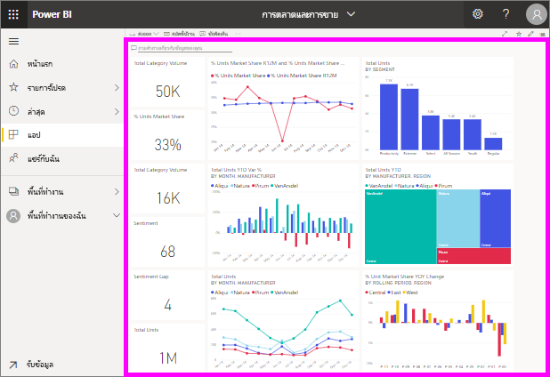

# ดูแดชบอร์ด
*ลูกค้า*ของ Power BI ใช้เวลาในการดูแดชบอร์ดมาก แดชบอร์ดออกแบบมาเพื่อเน้นข้อมูลเฉพาะจากรายงานและชุดข้อมูลที่จำเป็น และผู้ใช้ Power BI ใช้ข้อมูลดังกล่าวสำหรับการติดตาม ตรวจสอบ ตอบคำถาม ทดสอบ และอื่นๆ -- เพื่อตัดสินใจทางธุรกิจโดยใช้ข้อมูล

Power BI Pro จำเป็นสำหรับทั้งการแชร์แดชบอร์ด และดูแดชบอร์ดที่แชร์

## เปิดแดชบอร์ด

|              |         |
|------------|--------------------------------|
|      |คุณสามารถเปิดแดชบอร์ดได้จากตำแหน่งต่าง ๆ ในบริการของ Power BI   เพียงแค่มองหาไอคอนแดชบอร์ดนี้ หลังจากที่คุณระบุ  แดชบอร์ด การเปิดมันเป็นเรื่องง่าย เพียงแค่เลือกและแดชบอร์ดจะเติม  พื้นที่ทำงานของ Power BI |
|                    |          |

คุณอาจพบแดชบอร์ดในที่บรรจุทั้งหมดในแถบนำทางด้านซ้าย 

- **หน้าแรก** 
- **รายการโปรด** - หากคุณได้[ตั้งค่าแดชบอร์ดเป็นรายการโปรด](end-user-favorite.md)
- **ล่าสุด**- หากคุณเพิ่งเข้าชมแดชบอร์ด
- **แอป**-แอปส่วนใหญ่ประกอบด้วยทั้งแดชบอร์ดและรายงาน
- **แชร์กับฉัน** - หากเพื่อนร่วมงาน[ได้แชร์แดชบอร์ดกับคุณ](end-user-shared-with-me.md)
- **พื้นที่ทำงานของฉัน** - หากคุณได้ดาวน์โหลด[ตัวอย่าง Power BI](../sample-datasets.md) ใดๆ

## ขั้นตอนถัดไป
* สร้างความคุ้นเคยกับแดชบอร์ดโดยเข้าดูหนึ่งใน[ตัวอย่าง](../sample-tutorial-connect-to-the-samples.md)ของเรา
* เรียนรู้เกี่ยวกับ[ไทล์แดชบอร์ด](end-user-tiles.md)และสิ่งที่จะเกิดขึ้นเมื่อคุณเลือกหนึ่งแดชบอร์ด