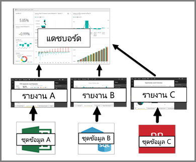

# แดชบอร์ดสำหรับผู้บริโภคบริการของ Power BI

[!INCLUDE[consumer-appliesto-ynny](../includes/consumer-appliesto-ynny.md)]

[!INCLUDE [power-bi-service-new-look-include](../includes/power-bi-service-new-look-include.md)]

***แดชบอร์ด*** Power BI เป็นแบบหน้าเดียว ซึ่งมักเรียกว่าพื้นที่ว่างเปล่าที่ใช้การแสดภาพเพื่อบอกเล่าเรื่องราวหนึ่ง ๆ ได้ เนื่องจากจำกัดอยู่เพียงหนึ่งหน้า แดชบอร์ดทีี่ออกแบบมาอย่างดีจะประกอบด้วยองค์ประกอบที่สำคัญที่สุดของเรื่องราวเท่านั้น

การแสดงผลข้อมูลด้วยภาพที่คุณเห็นบนแดชบอร์ดเรียกว่า*ไทล์* และจะถูก*ปักหมุด*ไปยังแดชบอร์ดโดยรายงานของ*ผู้ออกแบบ* ในกรณีส่วนใหญ่ การเลือกไทล์ที่จะนำคุณไปยังหน้ารายงานที่การแสดงภาพถูกสร้างขึ้น ถ้าคุณไม่คุ้นเคยกับ Power BI คุณสามารถเรียนรู้ข้อมูลพื้นฐานได้โดยการอ่าน[แนวคิดพื้นฐานของ Power BI](end-user-basic-concepts.md)

> [!NOTE]
> เราสามารถ[ดูและแชร์แดชบอร์ดบนมือถือได้](mobile/mobile-apps-view-dashboard.md)
>
> Power BI Pro จำเป็นสำหรับการดูแดชบอร์ดที่มีการแชร์กับคุณ
> 

การแสดงภาพบนแดชบอร์ดมาจากรายงาน และแต่ละรายงานจะยึดตามชุดข้อมูลชุดเดียว อันที่จริง วิธีหนึ่งในการนึกภาพแดชบอร์ดคือ ทางเข้าไปยังรายงานและชุดข้อมูลพื้นฐาน การเลือกการแสดงภาพนำคุณไปยังรายงาน (และชุดข้อมูล) ที่ใช้เพื่อสร้างการแสดงภาพดังกล่าว

## ข้อดีของแดชบอร์ด
แดชบอร์ดเป็นวิธีที่ยอดเยี่ยมในการตรวจดูธุรกิจของคุณ ในการค้นหาคำตอบ และดูเมตริกที่สำคัญที่สุดของคุณอย่างรวดเร็ว การแสดงภาพบนแดชบอร์ดอาจมาจากหนึ่งหรือหลายชุดข้อมูลพื้นฐาน และจากรายงานหนึ่งหรือหลายรายงานพื้นฐาน แดชบอร์ดสามารถรวมข้อมูลภายในองค์กรและข้อมูลบนระบบคลาวด์ ให้มุมมองแบบรวมโดยไม่คำนึงถึงตำแหน่งที่ข้อมูลอยู่

แดชบอร์ดไม่ได้เป็นเพียงภาพที่สวยงาม เนื่องจากแดชบอร์ดสามารถโต้ตอบได้และมีการอัปเดตไทล์เมื่อมีการเปลี่ยนแปลงข้อมูลพื้นฐาน

## แดชบอร์ดและรายงานสำหรับ Power BI***ผู้บริโภค***
เรามักสับสนระหว่างแดชบอร์ดเนื่องจากทั้งสองเป็นพื้นที่ที่กรอกข้อมูลด้วยการแสดงภาพเหมือนกัน แต่ก็มีความแตกต่างที่สำคัญบางประการจากมุมมองของ *ลูกค้า* Power BI

| **ขีดความสามารถ** | **แดชบอร์ด** | **รายงาน** |
| --- | --- | --- |
| หน้า |หนึ่งหน้า |อย่างน้อยหนึ่งหน้า |
| แหล่งข้อมูล |อย่างน้อยหนึ่งรายงานและอย่างน้อยหนึ่งชุดข้อมูลต่อแดชบอร์ด |ชุดข้อมูลเดียวต่อรายงาน |
| การกรอง |ไม่สามารถกรองหรือแบ่งส่วนได้ |มีหลายวิธีในการกรอง ทำไฮไลท์ และแบ่งส่วน |
| ตั้งค่าการแจ้งเตือน |สามารถสร้างการแจ้งเตือนไปยังอีเมลของคุณเมื่อเป็นไปตามเงื่อนไขบางประการ |ไม่ใช่ |
| รายการเด่น |สามารถตั้งค่าแดชบอร์ดหนึ่งเป็นแดชบอร์ด "แนะนำ" ของคุณได้ |ไม่สามารถสร้างรายงานที่แนะนำได้ |
| สามารถดูตารางชุดข้อมูลพื้นฐานและพื้นที่ข้อมูลได้ |ไม่ สามารถส่งออกข้อมูล แต่ไม่สามารถมองเห็นตารางและช่องข้อมูลในแดชบอร์ด |ได้ สามารถดูตารางชุดข้อมูล ช่องข้อมูล และค่าได้ |

## สำหรับผู้ออกแบบแดชบอร์ดและผู้บริโภคแดชบอร์ด
ในฐานะที่เป็น ***ลูกค้า*** ของ Power BI คุณได้รับแดชบอร์ดจาก*ผู้ออกแบบ* สามารถเรียนรู้เกี่ยวกับแดชบอร์ดตที่มีหัวข้อเหล่านี้:

* [ดูแดชบอร์ด](end-user-dashboard-open.md)
* เรียนรู้เกี่ยวกับ[ไทล์แดชบอร์ด](end-user-tiles.md)และสิ่งที่จะเกิดขึ้นเมื่อคุณเลือกหนึ่งแดชบอร์ด
* ต้องการติดตามไทล์แดชบอร์ดแต่ละรายการและได้รับอีเมลเมื่อถึงขีดจำกัดหนึ่งหรือไม่? [สร้างการแจ้งเตือนบนไทล์](end-user-alerts.md)
* เพลิดเพลินกับการถามคำถามเกี่ยวกับแดชบอร์ดของคุณ เรียนรู้วิธีใช้ [การถามตอบ Power BI](end-user-q-and-a.md) เพื่อถามคำถามเกี่ยวกับข้อมูลของคุณและรับคำตอบในรูปแบบการแสดงภาพ

> [!TIP]
> ถ้าคุณไม่พบสิ่งที่คุณกำลังค้นหาที่นี่ ใช้สารบัญทางด้านซ้าย
> 

## ขั้นตอนถัดไป
[ดูแดชบอร์ด](end-user-dashboard-open.md) 