# โหมดการดูรายละเอียดแนวลึกในการแสดงภาพใน Power BI

## การดูรายละเอียดแนวลึก จำเป็นต้องมีลำดับชั้น
เมื่อวิชวลมีลำดับชั้น คุณสามารถเจาะลงไปเพื่อดูรายละเอียดเพิ่มเติม ตัวอย่างเช่น คุณอาจมีการแสดงภาพที่นับจำนวนเหรียญรางวัลโอลิมปิก โดยมีลำดับชั้นที่สร้างขึ้นจาก ชนิดกีฬา ประเภทกีฬา และรายการแข่งขัน ตามค่าเริ่มต้น การแสดงภาพจะแสดงจำนวนเหรียญรางวัลตามชนิดกีฬา - ยิมนาสติก, สกี, กีฬาทางน้ำ และอื่น ๆ แต่เนื่องจากมีลำดับชั้น เลือกองค์ประกอบหนึ่งของวิชวล (เช่น แท่ง เส้น หรือฟอง) จะแสดงรูปภาพที่มีรายละเอียดเพิ่มขึ้นเรื่อย ๆ เลือกองค์ประกอบ**กีฬาทางน้ำ** เพื่อดูข้อมูลสำหรับประเภทกีฬา ว่ายน้ำ กระโดดน้ำ และโปโลน้ำ  เลือกองค์ประกอบ**กระโดดน้ำ** เพื่อดูรายละเอียดสำหรับการแข่งขัน กระดานสปริงบอร์ด แพลตฟอร์ม และ กระโดดน้ำซิงโครไนซ์

คุณสามารถเพิ่มลำดับชั้นให้กับรายงานที่คุณเป็นเจ้าของ แต่ไม่สามาถทำได้กับรายงานที่แชร์ให้กับคุณ
ไม่แน่ใจว่าการแสดงภาพ Power BI ไหนมีลำดับชั้น?  โฮเวอร์เหนือการแสดงภาพ และถ้าคุณเห็นตัวควบคุมเพื่อดูรายละเอียดเหล่านี้ การแสดงภาพของคุณมีลำดับชั้น

    
   

วันที่ เป็นลำดับชั้นที่แตกต่างจากชนิดอื่น เมื่อคุณเพิ่มเขตข้อมูลวันที่ให้กับการแสดงภาพ Power BI จะเพิ่มลำดับชั้นเวลา ที่มี ปี, ไตรมาส, เดือน, วัน โดยอัตโนมัติ สำหรับข้อมูลเพิ่มเติม ดู[ลำดับชั้นในวิชวล และลักษณะการทำงานการดูรายละเอียดแนวลึก](../guided-learning/visualizations.yml?tutorial-step=18) หรือดูวิดีโอด้านล่างนี้

  <iframe width="560" height="315" src="https://www.youtube.com/embed/MNAaHw4PxzE?list=PL1N57mwBHtN0JFoKSR0n-tBkUJHeMP2cP" frameborder="0" allowfullscreen></iframe>

> [!NOTE]
> เพื่อเรียนรู้วิธีการสร้างลำดับชั้นโดยใช้ Power BI Desktop ดูวิดีโอ[วิธีการสร้าง และเพิ่มลำดับชั้น](https://youtu.be/q8WDUAiTGeU)
> 

## ข้อกำหนดเบื้องต้น

1. ในบริการของ Power BI หรือ Desktop การดูรายละเอียดต้องการการแสดงภาพที่มีลำดับชั้น 
   
2. เพื่อทดลองทำตาม [ตัวอย่างการวิเคราะห์ด้านการขายปลีก](../sample-datasets.md) และสร้างแผนที่ต้นไม้ ที่ดูค่า **Total Units This Year** (หน่วยรวมปีนี้) (ค่า) ตามกลุ่ม **Territory** (ดินแดน), **City** (เมือง), **PostalCode** (รหัสไปรษณีย์) และ **Name** (ชื่อร้าน)  แผนที่ต้นไม้มีลำดับชั้นที่สร้างขึ้นจากดินแดน, เมือง, รหัสไปรษณีย์ และชื่อ แต่ละดินแดน มีหนึ่งหรือหลายเมือง แต่ละเมือง มีหนึ่งหรือหลายรหัสไปรษณีย์ และต่อไปเรื่อย ๆ ตามค่าเริ่มต้น การแสดงภาพจะแสดงเฉพาะข้อมูลดินแดน เนื่องจาก*ดินแดน*ปรากฏเป็นรายการแรกในลำดับชั้น
   
   

2. ทำความเข้าใจว่าไอคอนดูรายละเอียดทั้งหลายทำงานร่วมกันอย่างไรทำให้สับสนได้ง่าย ดังนั้นเราจะมากรองแผนที่ต้นไม้เพื่อแสดงเฉพาะ 2 ดินแดนขนาดเล็กก่อน: **KY** (รัฐ Kentucky) และ **TN** (รัฐ Tennessee) เลือกแผนที่ต้นไม้ และภายใต้**ตัวกรองระดับการแสดงภาพ** ขยาย **Territory** แล้วเลือก **KY** และ **TN**

    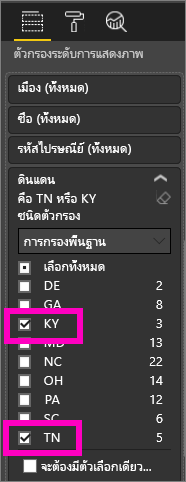    

   ตอนนี้ มีเฉพาะสองดินแดนเท่านั้นที่แสดงในแผนที่ต้นไม้

   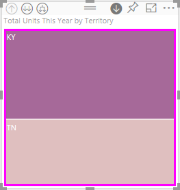

## สามวิธีในการเข้าถึงคุณลักษณะการดูรายละเอียด
คุณมีหลายตัวเลือกสำหรับการเข้าถึงคุณลักษณะ การดูรายละเอียด ดูข้อมูลสรุป และขยาย สำหรับการแสดงภาพที่มีลำดับชั้น บทความนี้จะแสดงวิธีการใช้ตัวเลือกแรกทางด้านล่าง เมื่อคุณทำความเข้าใจพื้นฐานของการดูรายละเอียด และการขยาย ทั้งสามวิธีนี้ให้ผลเหมือนกัน ลองทำดู และเลือกวิธีที่คุณชอบที่สุด

- โฮเวอร์เหนือการแสดงภาพเพื่อดู และใช้ไอคอน  

    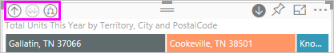

- คลิกขวาที่การแสดงภาพเพื่อเปิดเผย และใช้เมนู
    
    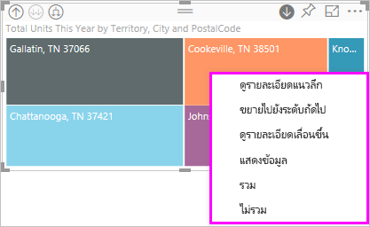

- จากแถบเมนู Power BI เลือกปุ่ม**สำรวจ**

   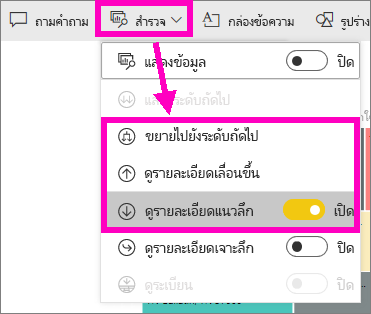

## เส้นทางการดูรายละเอียด
### ดูรายละเอียดแนวลึก
คุณมีหลายวิธีที่จะดูรายละเอียดการแสดงภาพของคุณ ***ดูรายละเอียดแนวลึก*** นำคุณไปยังระดับถัดไปในลำดับชั้น ดังนั้นถ้าคุณกำลังดูระดับ**ดินแดน** คุณสามารถเข้าถึงรายละเอียดระดับเมือง จากนั้นระดับรหัสไปรษณีย์ และสุดท้ายคือระดับชื่อได้ แต่ละขั้นตอนในเส้นทางจะแสดงข้อมูลใหม่ให้คุณ

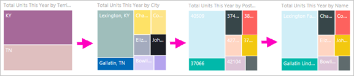

### ขยาย

***ขยาย*** เป็นการเพิ่มระดับของลำดับชั้นในมุมมองปัจจุบัน ดังนั้นถ้าคุณกำลังดูระดับ**ดินแดน** คุณสามารถขยาย และเพิ่มรายละเอียดของเมือง รหัสไปรษณีย์ และชื่อลงในแผนที่ต้นไม้ของคุณ แต่ละขั้นตอนในเส้นทางแสดงข้อมูลเดียวกัน และเพิ่มข้อมูลใหม่อีกหนึ่งระดับ

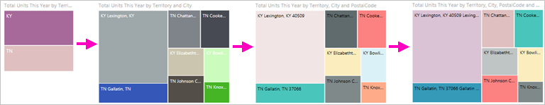

คุณยังสามารถเลือกว่าจะดูรายละเอียดแนวลึก หรือขยายทีละหนึ่งเขตข้อมูล หรือทุกเขตข้อมูลพร้อมกันก็ได้ 

## ดูรายละเอียดแนวลึกทุกเขตข้อมูลพร้อมกัน

1. เริ่มต้นที่ระดับบนสุดของแผนที่ต้นไม้ที่แสดงข้อมูลสำหรับ KY และ TN ขยายทรีแมปของคุณ โดยการเลือกจุดจับจุดหนึ่ง แล้วลากไปด้านขวา 

    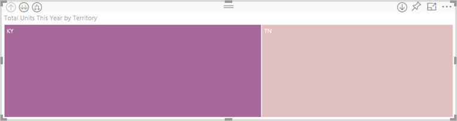 .

2. เพื่อดูรายละเอียดแนวลึก***ทุกเขตข้อมูลพร้อมกัน*** เลือกลูกศรคู่ที่มุมบนซ้ายของการแสดงภาพ  แผนที่ต้นไม้ของคุณตอนนี้ แสดงข้อมูลเมืองสำหรับ Kentucky และ Tennessee 

    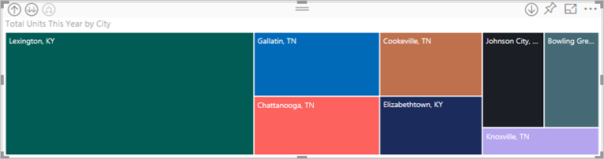
   
5. ดูรายละเอียดอีกครั้งไปยังระดับรหัสไปรษณีย์ของลำดับชั้น

    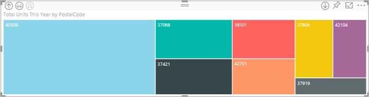

3. เพื่อดูข้อมูลสรุป เลือกลูกศรชี้ขึ้นที่มุมบนซ้ายของการแสดงภาพ 

## ดูรายละเอียดแนวลึกทีละเขตข้อมูล
วิธีนี้ใช้ไอคอนดูรายละเอียดแนวลึกที่มุมบนขวาของการแสดงภาพ 

1. เลือกไอคอนดูรายละเอียดเพื่อเปิดใช้งาน  ในตอนนี้คุณมีตัวเลือกที่จะดูรายละเอียด***ทีละเขตข้อมูล*** 
   
   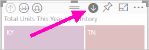

   ถ้าคุณไม่เปิดใช้งานดูลายละเอียดแนวลึก การเลือกองค์ประกอบวิชวล (เช่น แถบ ฟอง หรือใบไม้) จะไม่ดูรายละเอียดแนวลึก แต่จะกรองข้ามแผนภูมิอื่น ๆ บนหน้ารายงานแทน

2. เลือก*ใบไม้*สำหรับ **TN** แผนที่ต้นไม้ของคุณจะแสดงเมืองทั้งหมดในรัฐ Tennessee ที่มีร้านค้า 

    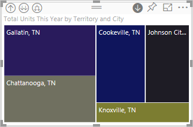

2. ในตอนนี้ คุณสามารถดูรายละเอียดแนวลึกต่อสำหรับ Tennesee หรือคุณสามารถดูรายละเอียดแนวลึกสำหรับเมืองใน Tennesee ที่ระบุ หรือคุณสามารถขยายแทน (ดู**ขยายเขตข้อมูลทั้งหมดพร้อมกัน**ที่ด้านล่าง) ลองดูรายละเอียดแนวลึกทีละเขตข้อมูล  เลือก **Knoxville, TN** (เมือง Knoxville รัฐ Tennessee) แผนที่ต้นไม้ของคุณขณะนี้ แสดงรหัสไปรษณีย์สำหรับร้านค้าของคุณใน Knoxville 

   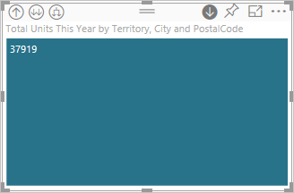

    สังเกตว่า ชื่อเรื่องเปลี่ยนไปขณะที่คุณเจาะลึกลงรายละเอียด และย้อนกลับขึ้นมาอีกครั้ง  

## ขยายทั้งหมด และขยายหนึ่งทีละเขตข้อมูล
มีแผนที่ต้นไม้ที่แสดงเฉพาะรหัสไปรษณีย์ไม่ได้สื่อความหมายเท่าไหร่  ดังนั้นเรามาขยายลงหนึ่งระดับในลำดับชั้น  

1. ด้วยแผนที่ต้นไม้ที่ถูกเลือกไว้ก่อนแล้ว เลือกไอคอน*ขยายลง*  แผนที่ต้นไม้ของคุณตอนนี้แสดง 2 ระดับของลำดับชั้นของเรา: รหัสไปรษณีย์และชื่อร้าน 

    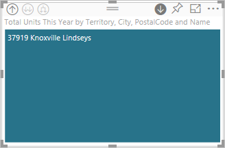

2. เมื่อต้องการดูทั้ง 4 ระดับลำดับชั้นของข้อมูลสำหรับ Tennesee เลือกลูกศรขึ้นจนกว่าคุณไปถึงระดับที่สอง **Total units this year by territory and city** (จำนวนหน่วยปีนี้ตามดินแดนและเมือง) ของแผนที่ต้นไม้ของคุณ 

    

3. ตรวจสอบให้แน่ใจว่าดูรายละเอียดแนวลึกจะยังคงเปิดใช้งานอยู่  และเลือกไอคอน*ขยายลง*  แผนที่ต้นไม้ของคุณตอนนี้ แสดงรายละเอียดเพิ่มเติม แทนที่จะแสดงแค่เมืองและรัฐ ตอนนี้ยังแสดงรหัสไปรษณีย์ด้วย 

    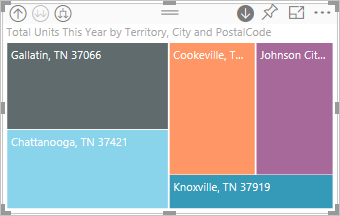

4. เลือกไอคอน*ขยายลง*อีกครั้งเพื่อแสดงระดับลำดับชั้นทั้ง 4 ชั้นของรายละเอียดสำหรับ Tennesee บนแผนที่ต้นไม้ของคุณ โฮเวอร์เหนือเป็นใบไม้เพื่อดูรายละเอียดเพิ่มเติม

   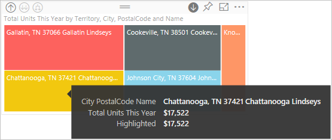

## การดูรายละเอียดกรองวิชวลอื่น ๆ
เมื่อคุณทำงานในโหมดดูรายละเอียด คุณสามารถตัดสินใจว่า การดูรายละเอียดและการขยาย มีผลกับการแสดงภาพอื่นบนหน้าอย่างไร 

ตามค่าเริ่มต้น การดูรายละเอียดจะไม่กรองวิชวลอื่น ๆ ในรายงาน แต่คุณสมบัตินี้สามารถเปิดใช้งานใน Power BI Desktop และบริการของ Power BI ได้ 

1. ใน Desktop เลือกแท็บ**รูปแบบ** และเลือกกล่องกาเครื่องหมายสำหรับ**กำลังกรองภาพอื่นๆ อย่างละเอียด**

    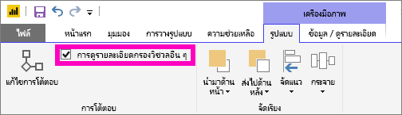

2. ตอนนี้ เมื่อคุณดูรายละเอียดแนวลึก (หรือดูข้อมูลสรุป หรือขยาย) ในวิชวลที่มีลำดับชั้น การดำเนินการนั้นจะกรองวิชวลอื่น ๆ บนหน้าด้วย 

    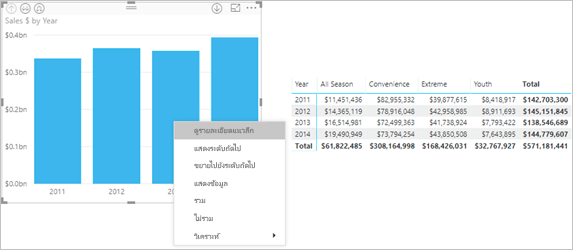

    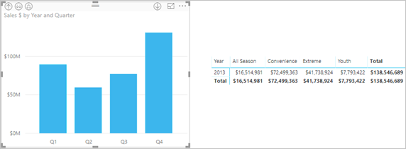

> [!NOTE]
> เพื่อเปิดใช้งานในบริการของ Power BI จากแถบเมนูด้านบน เลือก **การโต้ตอบกับภาพ > กำลังกรองภาพอื่นๆ อย่างละเอียด**
>
> 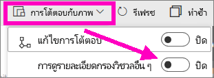

## ทำความเข้าใจแกนลำดับชั้นและกลุ่มลำดับชั้น
คุณสามารถนึกถึง แกนลำดับชั้นและกลุ่มลำดับชั้น ว่าเป็นกลไกที่คุณสามารถเพิ่มและลด ความละเอียดของข้อมูลที่คุณต้องการดู ข้อมูลใด ๆ ที่สามารถจัดเป็นประเภทและประเภทย่อย สามารถมีลำดับชั้นได้ ซึ่งแน่นอน รวมไปถึงวันที่และเวลา

คุณสามารถสร้างการแสดงภาพใน Power BI ที่มีลำดับชั้น โดยการเลือกหนึ่งหรือหลายเขตข้อมูล เพื่อเพิ่มไปยัง**แกน**หรือ**กลุ่ม** พร้อมกับข้อมูลคุณที่ต้องการตรวจสอบ เป็นเขตข้อมูลใน**ค่า** คุณจะทราบว่าข้อมูลของคุณมีลำดับชั้น ถ้าไอคอน*โหมดดูรายละเอียด* ปรากฎบนมุมบนซ้ายและขวาของการแสดงภาพของคุณ 

โดยหลัก ๆ แล้ว สามารถคิดว่าลำดับชั้นของข้อมูลมีสองชนิด:
- ข้อมูลวันที่และเวลา - ถ้าคุณมีเขตข้อมูลชนิด วันที่เวลา คุณมีข้อมูลที่มีลำดับชั้นอยู่แล้ว Power BI สร้างลำดับชั้นสำหรับเขตข้อมูลใดก็ได้ ถ้าข้อมูลมีค่าที่สามารถแยกให้มีโครงสร้าง [วันที่เวลา](https://msdn.microsoft.com/library/system.datetime.aspx) คุณเพียงแค่เพิ่มเขตข้อมูล วันที่เวลา ไปยัง**แกน**หรือ**กลุ่ม**
- ข้อมูลประเภท - ถ้าข้อมูลของคุณมาจากคอลเลกชันที่ประกอบด้วยคอลเลกชันย่อย หรือมิฉะนั้น มีแถวของข้อมูลที่มีค่าร่วมกัน คุณมีข้อมูลแบบลำดับชั้น

Power BI ให้คุณสามารถขยายทีละหนึ่งชุดย่อย หรือชุดย่อยทั้งหมด คุณสามารถดูรายละเอียดข้อมูลของคุณ เพื่อดูชุดย่อยเดียวในแต่ละระดับ หรือดูทุกชุดย่อยพร้อมกันในแต่ละระดับ ตัวอย่างเช่น คุณสามารถดูรายละเอียดสำหรับปีที่ระบุ หรือดูผลลัพธ์ทั้งหมดสำหรับแต่ละปีเมื่อคุณลงมาตามลำดับชั้น ในทางกลับกัน คุณสามารถดูข้อมูลสรุปในลักษณะเดียวกัน

ส่วนต่อไปนี้อธิบายการดูรายละเอียดข้อมูล จากมุมมองสูงสุด มุมมองตรงกลาง และมุมมองต่ำสุด

### ข้อมูลลำดับชั้น วันที่และเวลา
สำหรับตัวอย่างนี้ ทดลองทำตามด้วย[ตัวอย่างการวิเคราะห์การค้าปลีก](../sample-datasets.md) และสร้างการแสดงภาพแผนภูมิคอลัมน์แบบเรียงซ้อน ที่ดู**เดือน** (แกน) ตาม**ยอดขายรวม** (ค่า)  

แม้ว่าเขตข้อมูลของแกนจะเป็น**เดือน** ประเภท**ปี**ก็ยังถูกสร้างใน**แกน**ด้วย เนื่องจาก Power BI สร้างโครงสร้างวันที่และเวลาแบบเต็มสำหรับทุกค่าที่อ่าน ด้านบนสุดของลำดับชั้นแสดงข้อมูลสำหรับปี

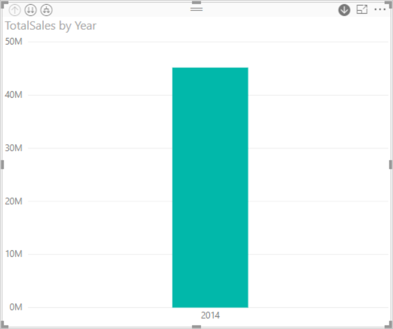

ด้วยโหมดดูรายละเอียด คลิกที่แท่งในแผนภูมิจะลงไปตามลำดับชั้นหนึ่งระดับ คุณจะเห็นแท่งสามแท่ง สำหรับข้อมูลของไตรมาส จากนั้น ที่กลุ่มไอคอนมุมบนซ้าย เลือก**ขยายทั้งหมดลงหนึ่งระดับในลำดับชั้น** แล้วทำเหมือนเดิมอีกครั้ง เพื่อลงไปถึงระดับต่ำสุดของลำดับชั้น ซึ่งแสดงผลลัพธ์สำหรับแต่ละเดือน

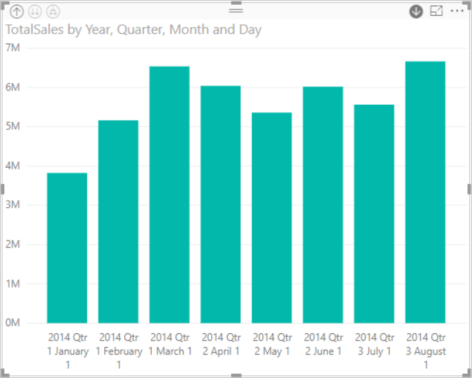

นอกเหนือจากการแสดงภาพ เราสามารถเห็นลำดับชั้นในข้อมูลที่แสดงสำหรับแต่ละรายงานได้ ตารางต่อไปนี้แสดงผลลัพธ์ของ**ดูข้อมูล** ในรายงานที่ดูรายละเอียดเดือนเดียวหรือทุกเดือน 

สังเกตว่า ข้อมูลเหมือนกันทั้งรายงานไตรมาสและรายงานปี แต่เพื่อคุณดูรายละเอียดถึงระดับที่กำหนดใน**ค่า** คุณจะเห็นว่ารายงานมีความเฉพาะเจาะจงมากขึ้น และรายงาน "ทุกเดือน" มีข้อมูลมากกว่า

|โหมดขยาย|ปี|ไตรมาส|เดือน|วัน|
| ---|:---:|:---:|:---:|---|
|เดียว|||||
|ทั้งหมด|||||

### ข้อมูลลำดับชั้น ประเภท
ข้อมูลที่มีรูปแบบจากคอลเลกชันและคอลเลกชันย่อย มีลำดับชั้น ตัวอย่างที่ดีตัวอย่างหนึ่งคือ ข้อมูลตำแหน่งที่ตั้ง พิจารณาตารางในแหล่งข้อมูลที่มีคอลัมน์ ประเทศ รัฐ เมือง และรหัสไปรษณีย์ ข้อมูลที่มี ประเทศ รัฐ และเมือง เหมือนกัน ถือว่ามีลำดับขั้น

สำหรับตัวอย่างนี้ ลองทำตามด้วย[ตัวอย่างการวิเคราะห์การค้าปลีก](../sample-datasets.md) สร้างภาพแผนภูมิคอลัมน์แบบเรียงซ้อน ที่ดู**หน่วยรวมปีนี้** (ค่า) ตาม**ดินแดน**, **เมือง**, **รหัสไปรษณีย์** และ**ชื่อ** (กลุ่ม)  

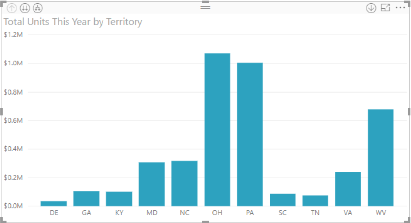

เมื่อเปิดโหมดดูรายละเอียด จากกลุ่มไอคอนที่ด้านซ้ายบน เลือก**ขยายทั้งหมดลงหนึ่งระดับในลำดับชั้น**สามครั้ง
คุณควรอยู่ในระดับต่ำสุดของลำดับชั้น ซึ่งแสดงผลลัพธ์สำหรับ ดินแดน เมือง และ รหัสไปรษณีย์

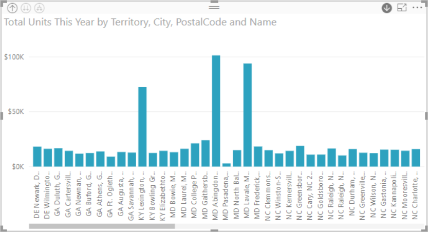

นอกเหนือจากการแสดงภาพ เราสามารถเห็นลำดับชั้นในข้อมูลที่แสดงสำหรับแต่ละรายงานได้ ตารางต่อไปนี้แสดงผลลัพธ์ของ**แสดงข้อมูล** ในรายงานที่ดูรายละเอียดสำหรับดินแดนเดียว หรือทุกดินแดน เมื่อคุณเจาะลึกลงในรายละเอียด คุณจะเห็นว่ารายงานมีความเฉพาะเจาะจงมากขึ้น และรายงาน "ดินแดนทั้งหมด" มีข้อมูลมากกว่า

| โหมดขยาย|ดินแดน|เมือง|รหัสไปรษณีย์|ชื่อ|
| ---|:---:|:---:|:---:|---|
|เดียว|||||
|ทั้งหมด|||||

## ข้อควรพิจารณาและข้อจำกัด
* ถ้าการเพิ่มเขตข้อมูลวันที่ ไม่สร้างลำดับชั้น เป็นไปได้ว่าเขตข้อมูล "วันที่" ไม่ได้ถูกบันทึกเป็นชนิดวันที่จริง ๆ ถ้าคุณเป็นเจ้าของชุดข้อมูล เปิดในมุมมอง*ข้อมูล*ใน Power BI Desktop เลือกคอลัมน์ที่มีวันที่ และในแท็บการวางรูปแบบ เปลี่ยน**ชนิดข้อมูล**เป็น**วันที่** หรือ**วันที่/เวลา** ถ้ารายงานมีแชร์ให้กับคุณ ติดต่อเจ้าของเพื่อขอให้เปลี่ยนแปลง  
  
  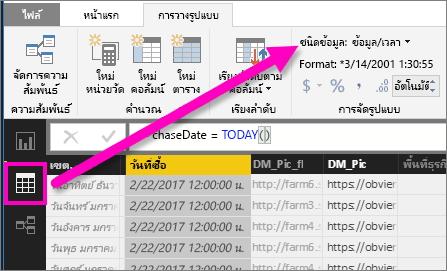

## ขั้นตอนถัดไป
[การแสดงภาพในรายงาน Power BI](../visuals/power-bi-report-visualizations.md)

[รายงาน Power BI](end-user-reports.md)

[Power BI - แนวคิดพื้นฐาน](end-user-basic-concepts.md)

มีคำถามเพิ่มเติมหรือไม่ [ลองไปที่ชุมชน Power BI](http://community.powerbi.com/)

