# เริ่มต้นใช้งานด่วน - ทำความรู้จักบริการของ Power BI

ขณะนี้คุณทราบพื้นฐานของ Power BI แล้ว เรามาดู **บริการของ Power BI** กันบ้าง ตามที่กล่าวไว้ก่อนหน้านี้ บางคนในทีมของคุณอาจใช้เวลาทั้งหมดใน **Power BI Desktop** เพื่อรวมข้อมูลและสร้างรายงานสำหรับบุคคลอื่น ในทางกลับกัน คุณอาจใช้เวลาทั้งหมดของคุณในบริการของ Power BI เพื่อดูและโต้ตอบกับเนื้อหาที่สร้างโดยบุคคลอื่น (ประสบการณ์ **การใช้งาน**) ในการเริ่มต้นด่วนนี้ คุณจะนำเข้าข้อมูลตัวอย่างและใช้ข้อมูลดังกล่าวเพื่อเรียนรู้วิธีการใช้งานบริการของ Power BI ของคุณ 
 
## ข้อกำหนดเบื้องต้น

- ถ้าคุณไม่ได้ลงทะเบียน Power BI ให้[ลงทะเบียนรุ่นทดลองใช้ฟรี](https://app.powerbi.com/signupredirect?pbi_source=web)ก่อนที่คุณจะเริ่มต้นใช้งาน

- อ่าน [แนวคิดพื้นฐานเกี่ยวกับบริการของ Power BI](end-user-basic-concepts.md)

## เปิดบริการของ Power BI และรับข้อมูลบางส่วน
เราจะนำข้อมูลตัวอย่างบางส่วนไปใช้สำหรับการนำเสนอบริการของ Power BI ของเรา มีข้อมูลตัวอย่างทุกชนิดที่เราให้คุณไว้ค้นหา และในครั้งนี้ เราจะใช้ข้อมูลเกี่ยวกับร้านค้าปลีก    
1. เปิด app.powerbi.com และเลือกลิงก์สำหรับ **ตัวอย่าง** 

    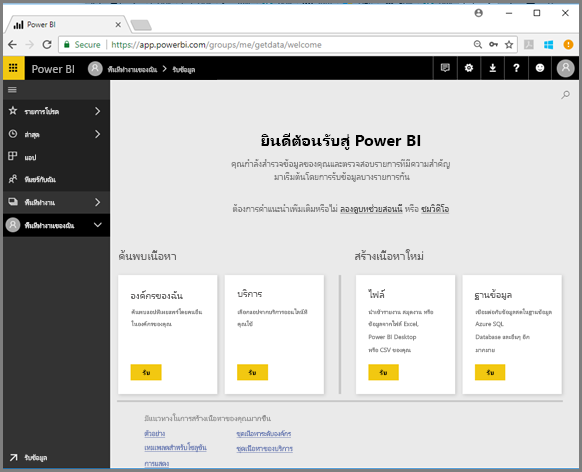

2. เลือก **ตัวอย่างการวิเคราะห์ด้านการขายปลีก > เชื่อมต่อ**

    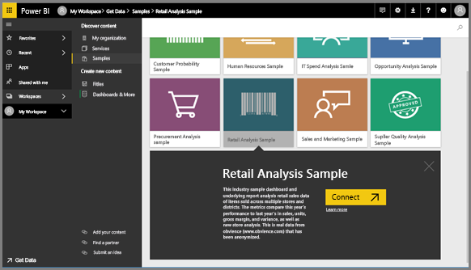

    บริการของ Power BI จะนำเข้าตัวอย่างและแสดงแดชบอร์ด แดชบอร์ดคือสิ่งที่ทำให้บริการของ Power BI แตกต่างจาก Power BI Desktop ตัวอย่างยังมีรายงานและชุดข้อมูล ซึ่งเราจะพาชมในภายหลัง

    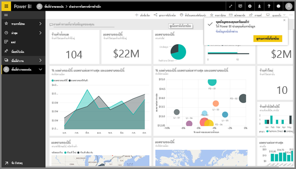

ดู Amanda การแนะนำระบบการนำทางของ Power BI service  แล้ว ทำตามคำแนะนำทีละขั้นตอนด้านล่างวิดีโอเพื่อสำรวจด้วยตัวคุณเอง

<iframe width="560" height="315" src="https://www.youtube.com/embed/G26dr2PsEpk" frameborder="0" allowfullscreen></iframe>

## ดูเนื้อหา (แดชบอร์ด รายงาน เวิร์กบุ๊ก ชุดข้อมูล พื้นที่ทำงาน แอป)
มาเริ่มต้น ด้วยการดูวิธีการจัดระเบียบเนื้อหาพื้นฐาน (แดชบอร์ด รายงาน ชุดข้อมูล เวิร์กบุ๊ก) เนื้อหาถูกแสดงภายในบริบทขิงพื้นที่ทำงาน ตรงนี้ คุณมีพื้นที่ทำงานเดียวเท่านั้นและเรียกว่า **พื้นที่ทำงานของฉัน** โดยทั่วไปแล้ว ผู้ใช้ไม่จำเป็นต้องใช้พื้นที่ทำงานอื่น ๆ พื้นที่ทำงานของฉันจัดเก็บเนื้อหาทั้งหมดที่คุณเป็นเจ้าของ ให้คิดว่าเป็น sandbox ส่วนบุคคลของคุณหรือพื้นที่ทำงานสำหรับเนื้อหาของคุณเอง พื้นที่ทำงานของฉันที่เป็นตัวอย่างการวิเคราะห์ด้านการขายปลีกซึ่งคุณเพิ่งดาวน์โหลดจะถูกบันทึกไว้ 

ภายในพื้นที่ทำงานของฉัน เนื้อหาของคุณถูกจัดเป็น 4 แท็บ: แดชบอร์ด รายงาน สมุดงาน และชุดข้อมูล

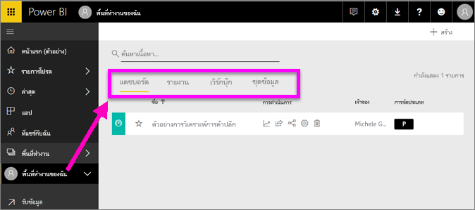

เลือกพื้นที่ทำงานจากบานหน้าต่างนำทางด้านซ้าย (แถบนำทางด้านซ้าย) และแท็บสำหรับเนื้อหาที่เกี่ยวข้อง (แดชบอร์ด รายงาน เวิร์กบุ๊ก ชุดข้อมูล) เติมพื้นที่ทางด้านขวาของ Power BI

ถ้าคุณเป็นผู้ใช้ใหม่ คุณจะเห็นแค่พื้นที่ทำงานเดียวเท่านั้น -- **พื้นที่ทำงานของฉัน**

ภายในแท็บเหล่านั้น (หรือที่เรียกว่า *มุมมองเนื้อหา*) คุณจะเห็นข้อมูลเกี่ยวกับเนื้อหาและการดำเนินการที่คุณทำกับเนื้อหานั้น  ตัวอย่างเช่น จากแท็บแดชบอร์ด คุณสามารถเปิดแดชบอร์ด ค้นหา เรียงลำดับ และอื่นๆ

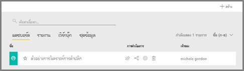

เปิดแดชบอร์ดโดยเลือกชื่อแดชบอร์ด

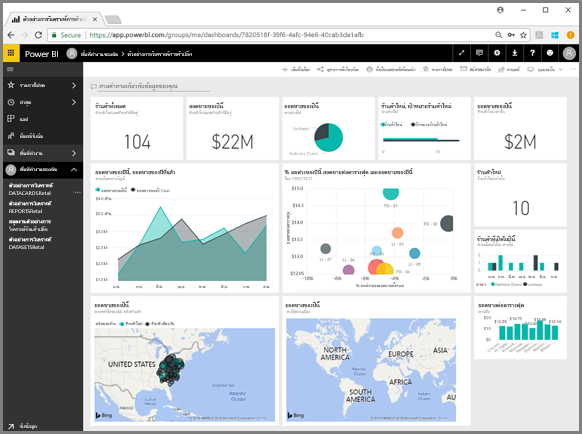

## เพิ่มแดชบอร์ดและรายการเป็นรายการโปรด
**รายการโปรด**ช่วยให้คุณเข้าถึงเนื้อหาที่สำคัญที่สุดสำหรับคุณได้อย่างรวดเร็ว  

1. เมื่อแดชบอร์ดเปิดขึ้น ให้เลือก **รายการโปรด** จากมุมบนขวา
   
   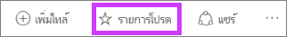
   
   เพิ่ม**รายการโปรด**เมื่อต้องการเปลี่ยนแปลง **ยกเลิกรายการโปรด**และไอคอนเครื่องหมายดอกจันจะกลายเป็นสีเหลือง
   
   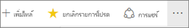

2. เมื่อต้องการแสดงรายการของเนื้อหาทั้งหมดที่คุณเพิ่มเป็นรายการโปรด ใน navpane ด้านซ้าย ให้เลือกลูกศรทางด้านขวาของ**รายการโปรด** เนื่องจากหน้าต่างนำทางด้านซ้ายจะเป็นฟีเจอร์แบบถาวรของ Power BI service คุณสามารถเข้าถึงรายการนี้จากที่ใดก็ได้ใน Power BI service
   
    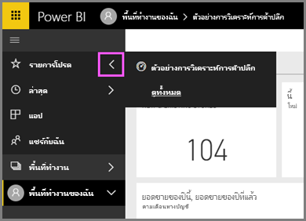
   
    เราเพียงรายการโปรดเดียวเท่านั้นจนถึงตอนนี้ รายการโปรดอาจเป็นแดชบอร์ด รายงาน หรือแอป  

1. อีกวิธีหนึ่งในการทำเครื่องหมายแดชบอร์ดหรือรายงานให้เป็นรายการโปรดจาก **แดชบอร์ด** หรือแท็บมุมมองเนื้อหา **รายงาน**  เปิดแท็บ **รายงาน** แล้วเลือกไอคอนรูปดาวทางด้านซ้ายของชื่อรายงาน
   
   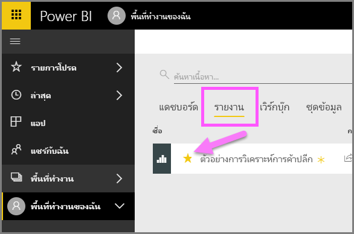

3. เปิด *บานหน้าต่าง* **รายการโปรด** โดยเลือก **รายการโปรด** จากบานหน้าต่างนำทางด้านซ้ายหรือโดยเลือกไอคอนรูปดาว
   
   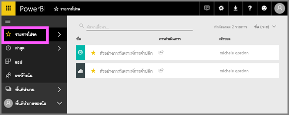
   
   ขณะนี้ คุณมีสองรายการโปรด รายการหนึ่งคือแดชบอร์ดและรายการหนึ่งคือรายงาน จากตรงนี้ คุณสามารถเปิด ค้นหา ยกเลิกรายการโปรด หรือแชร์เนื้อหากับผู้ร่วมงานได้

4. เลือกชื่อรายงานเพื่อเปิดในตัวแก้ไขรายงาน

    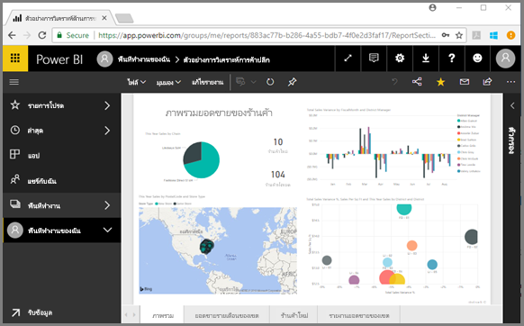

เรียนรู้เพิ่มเติม ให้ดู[รายการโปรด](end-user-favorite.md)

## ระบุตำแหน่งเนื้อหาล่าสุดของคุณ

1. คล้ายกับรายการโปรด ดูเนื้อหาที่เข้าถึงล่าสุดของคุณได้อย่างรวดเร็วจากทุกที่ในบริการของ Power BI โดยเลือกลูกศรที่อยู่ถัดจาก **ล่าสุด** ในบานหน้าต่างนำทางด้านซ้าย

   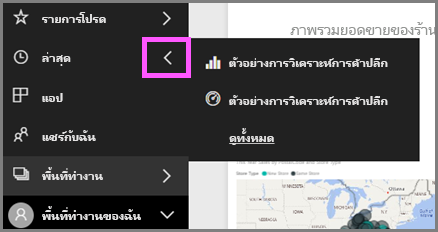

    จากเมนูลอย ให้เลือกเนื้อหาเพื่อเปิด

2. บางครั้งคุณไม่ต้องการเพียงแค่เปิดเนื้อหาล่าสุด แต่ต้องการดูข้อมูลหรือดำเนินการสิ่งอื่น เช่น ดูข้อมูลเชิงลึก หรือส่งออกไปยัง Excel อีกด้วย ในกรณีเช่นนี้ ให้เปิดบานหน้าต่าง **ล่าสุด** โดยเลือก **ล่าสุด** หรือไอคอนของบานหน้าต่างจากบานหน้าต่างนำทางด้านซ้าย ถ้าคุณมีพื้นที่ทำงานมากกว่าหนึ่งรายการ รายการนี้จะมีเนื้อหาจากพื้นที่ทำงานทั้งหมดของคุณ

   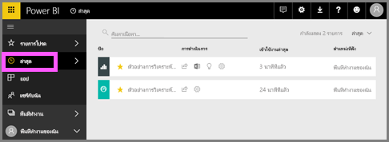

เมื่อต้องการเรียนรู้เพิ่มเติม ให้ดู[ล่าสุดใน Power BI](end-user-recent.md)

### ค้นหาและเรียงลำดับเนื้อหา
มุมมองเนื้อหาทำให้ง่ายต่อการค้นหา กรอง และเรียงลำดับเนื้อหาของคุณ เมื่อต้องการค้นหาแดชบอร์ด รายงาน หรือเวิร์กบุ๊ก ให้พิมพ์ในพื้นที่การค้นหา Power BI กรองเฉพาะเนื้อหาที่มีสตริงการค้นหาของคุณเป็นส่วนหนึ่งของชื่อ

เนื่องจากคุณมีเพียงตังอย่างเดียว การค้นหาและเรียงลำดับจึงไม่จำเป็น  แต่เมื่อคุณมีรายการแดชบอร์ด รายงาน เวิร์กบุ๊ก และชุดข้อมูลยาวๆ คุณจะพบว่าการค้นหาและเรียงลำดับมีประโยชน์มาก

นอกจากนี้คุณยังสามารถเรียงลำดับเนื้อหาตามชื่อหรือเจ้าของ สังเกตลูกศรชี้ขึ้นที่ด้านขวาของ **ชื่อ** ขณะนี้เรากำลังจัดเรียงชื่อ 83 รายการตามตัวอักษรจากน้อยไปหามาก หากต้องการเปลี่ยนลำดับการจัดเรียงให้เป็นจากมากไปน้อย ให้เลือก **ชื่อ** ลูกศรชี้ขึ้นจะเปลี่ยนเป็นลูกศรชี้ลง

ไม่ใช่ทุกคอลัมน์ที่จะสามารถจัดเรียงได้ วางเมาส์เหนือส่วนหัวของคอลัมน์เพื่อค้นหาว่าสามารถเรียงลำดับได้หรือไม่

เมื่อต้องการเรียนรู้เพิ่มเติม ให้ดู [การนำทางใน Power BI: ค้นหาและจัดเรียง](end-user-search-sort.md)

## เพิ่มพื้นที่ทรัพยากร
หลังจากที่คุณเสร็จการเริ่มต้นด่วนนี้ คุณสามารถลบแดชบอร์ด, รายงาน และชุดข้อมูลตัวอย่างการวิเคราะห์ด้านการขายปลีก ถ้าคุณต้องการ

1. เปิดบริการ Power BI (app.powerbi.com) และลงชื่อเข้าใช้    
2. ในบานหน้าต่างนำทางด้านซ้าย เลือก **พื้นที่ทำงาน > พื้นที่ทำงานของฉัน**  
    สังเกตเห็นดาวสีเหลืองที่ระบุว่าเป็นรายการโปรดหรือไม่?    
3. บนแท็บ**แดชบอร์ด** เลือกไอคอนถังขยะ**ลบ**ถัดจากแดชบอร์ดการวิเคราะห์ด้านการขายปลีก    

    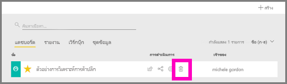

4. เลือกแท็บ**รายงาน** และทำสิ่งเดียวกันสำหรับรายงานการวิเคราะห์ด้านการขายปลีก
1. เลือกแท็บ**ชุดข้อมูล** และทำสิ่งเดียวกันสำหรับชุดข้อมูลการวิเคราะห์ด้านการขายปลีก

## ขั้นตอนถัดไป

> [!div class="nextstepaction"]
> [มุมมองการอ่านในบริการของ Power BI](end-user-reading-view.md)
