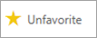

# เริ่มต้นใช้งานด่วน - ทำความรู้จักบริการของ Power BI

[!INCLUDE [power-bi-service-new-look-include](../includes/power-bi-service-new-look-include.md)]

ขณะนี้คุณทราบพื้นฐานของ Power BI แล้ว เรามาดู **บริการของ Power BI** กันบ้าง ตามที่กล่าวไว้ก่อนหน้านี้ บางคนในทีมของคุณอาจใช้เวลาทั้งหมดใน **Power BI Desktop** เพื่อรวมข้อมูลและสร้างรายงานสำหรับบุคคลอื่น ในทางกลับกัน คุณอาจใช้เวลาทั้งหมดของคุณในบริการของ Power BI เพื่อดูและโต้ตอบกับเนื้อหาที่สร้างโดยบุคคลอื่น (ประสบการณ์ **การใช้งาน**) ในการเริ่มต้นด่วนนี้ คุณจะนำเข้าข้อมูลตัวอย่างและใช้ข้อมูลดังกล่าวเพื่อเรียนรู้วิธีการใช้งานบริการของ Power BI ของคุณ 
 
## ข้อกำหนดเบื้องต้น

- ถ้าคุณไม่ได้ลงทะเบียน Power BI ให้[ลงทะเบียนรุ่นทดลองใช้ฟรี](https://app.powerbi.com/signupredirect?pbi_source=web)ก่อนที่คุณจะเริ่มต้นใช้งาน

- อ่าน [แนวคิดพื้นฐานเกี่ยวกับบริการของ Power BI](end-user-basic-concepts.md)

## เปิดบริการ Power BI

หากต้องการเริ่มต้น ให้เปิดบริการ Power BI (app.powerbi.com) และไปที่ **หน้าแรก** 
1. ถ้าบานหน้าต่างการนำทางด้านซ้ายถูกยุบ ให้เลือกไอคอนบานหน้าต่างการนำทาง  เพื่อขยายบานหน้าต่าง 

1. เลือก **หน้าแรก** ถ้ายังไม่ได้เปิด 

1. รับข้อมูลตัวอย่าง เราจะนำข้อมูลตัวอย่างบางส่วนไปใช้สำหรับการนำเสนอบริการของ Power BI ของเรา มีข้อมูลตัวอย่างทุกชนิดที่เราให้คุณไว้ค้นหา และในครั้งนี้ เราจะใช้ข้อมูลเกี่ยวกับการตลาดและการขาย 

    หากต้องการทำตาม ให้ใช้คำแนะนำเหล่านี้เพื่อติดตั้ง[แอปตัวอย่างการขายและการตลาด](end-user-app-marketing.md)

1. หลังจากที่ติดตั้งแอปแล้ว จากบานหน้าต่างการนำทาง ให้เลือก **แอป** 

   

2. บนหน้าจอ **แอป** ให้เลือกแอป **ตัวอย่างการขายและการตลาด**

    

2. เลือก **สำรวจแอป**

    

3. บริการ Power BI เปิดแดชบอร์ดของแอป แดชบอร์ดคือสิ่งที่ทำให้บริการของ Power BI แตกต่างจาก Power BI Desktop ตัวอย่างยังมีรายงานและชุดข้อมูล 

    

    ในฐานะที่เป็น *ผู้บริโภค* แอปส่วนใหญ่ที่คุณได้รับจะไม่มีสิทธิ์เข้าถึงชุดข้อมูลพื้นฐานโดยตรง เนื่องจากตัวอย่าง Power BI ถูกสร้างขึ้นสำหรับลูกค้า Power BI ทั้งหมด จึงมีการรวมชุดข้อมูลไว้ เพื่อนร่วมงาน*ผู้ออกแบบ*ของคุณใช้ชุดข้อมูลเพื่อเรียนรู้วิธีสร้างแดชบอร์ดและรายงานใหม่ 

## ดูเนื้อหา (แดชบอร์ดและรายงาน)
มาเริ่มต้น ด้วยการดูวิธีการจัดระเบียบเนื้อหาพื้นฐาน (แดชบอร์ด รายงาน แอป) เนื้อหาถูกแสดงภายในบริบทขิงพื้นที่ทำงาน ผู้บริโภคทุกคนมีพื้นที่ทำงานอย่างน้อยหนึ่งแห่งและเรียกว่า **พื้นที่ทำงานของฉัน** แต่ละครั้งที่คุณติดตั้งแอป พื้นที่ทำงานจะถูกสร้างขึ้นสำหรับแอปนั้น  เนื่องจากเราติดตั้งแอปตัวอย่างการขายและการตลาดแล้ว ตอนนี้เรามีพื้นที่ทำงานสองแห่ง 

ตรวจสอบด้วยตัวคุณเองโดยการเลือก **พื้นที่ทำงาน** จากการนำทางด้านซ้าย 

**พื้นที่ทำงานของฉัน**จัดเก็บเนื้อหาทั้งหมดที่คุณเป็นเจ้าของและสร้าง ให้คิดว่าเป็น sandbox ส่วนบุคคลของคุณหรือพื้นที่ทำงานสำหรับเนื้อหาของคุณเอง สำหรับ *ผู้บริโภค* Power BI จำนวนมาก **พื้นที่ทำงานของฉัน** ยังว่างเปล่าเพราะงานของคุณไม่เกี่ยวข้องกับการสร้างเนื้อหาใหม่  *ผู้บริโภค* โดยข้อกำหนด ใช้ข้อมูลที่สร้างขึ้นโดยผู้อื่นและใช้ข้อมูลนั้นเพื่อตัดสินใจทางธุรกิจ ถ้าคุณพบว่าคุณกำลังสร้างเนื้อหาลองอ่านบทความ [Power BI สำหรับ*ผู้ออกแบบ*](../power-bi-creator-landing.md) แทน

**พื้นที่ทำงานของแอป** ประกอบด้วยเนื้อหาทั้งหมดสำหรับแอปที่ระบุ  เมื่อ *ผู้ออกแบบ* สร้างแอป พวกเขาจะรวมเนื้อหาทั้งหมดที่จำเป็นสำหรับการใช้แอปนั้นเข้าด้วยกัน  เลือกพื้นที่ทำงานการขายและการตลาดเพื่อดูว่า *ผู้ออกแบบ* รวมอยู่ในแอปใด 

พื้นที่ทำงานการขายและการตลาดประกอบด้วยแดชบอร์ดหนึ่งรายการ รายงานหนึ่งรายการ และชุดข้อมูลหนึ่งชุด ไม่ใช่ทุกแอปจะมีเนื้อหาสามอย่างนี้ แอปอาจมีแดชบอร์ดเดียวเท่านั้น หรือเนื้อหาแต่ละประเภทสามรายการ หรือแม้แต่รายงานยี่สิบรายการ ทุกอย่างขึ้นอยู่กับสิ่งที่ *ผู้ออกแบบ* รวมอยู่ในแอป เนื่องจากข้อมูลการขายและการตลาดเป็นตัวอย่าง จึงมีชุดข้อมูลเดียว แต่โดยปกติแล้ว พื้นที่ทำงานของแอปสำหรับ *ผู้บริโภค* จะไม่รวมชุดข้อมูลใดก็ตามไว้เลย 

พื้นที่ทำงานมีจำนวนมากกว่ารายการของเนื้อหาแบบง่ายอย่างมาก ในหน้านี้ คุณสามารถเรียนรู้มากมายเกี่ยวกับแดชบอร์ดและรายงานของพื้นที่ทำงาน ใช้เวลาสักครู่เพื่อระบุเจ้าของเนื้อหา วันที่รีเฟรชครั้งล่าสุด เนื้อหาที่เกี่ยวข้อง และการประทับรับรอง หากพื้นที่ทำงานมีคำอธิบาย คำอธิบายนั้นอาจช่วยให้คุณเข้าใจเป้าหมายของพื้นที่ทำงานและวิธีใช้งานเพื่อจุดประสงค์ทางธุรกิจของคุณได้ดีขึ้น และถ้าพื้นที่ทำงานมีเนื้อหาจำนวนมาก ให้ใช้ตัวเลือกการค้นหาและเรียงลำดับเพื่อค้นหาสิ่งที่คุณต้องการได้อย่างรวดเร็ว

พื้นที่ทำงานเป็นหนึ่งในเส้นทางของข้อมูลของคุณ เปิดแดชบอร์ดหรือรายงานโดยการเลือกจากรายการ  สร้างรายการโปรดแดชบอร์ดหรือรายงานโดยการวางเมาส์เหนือและเลือกไอคอนรูปดาว หาก*ผู้ออกแบบ*ให้[สิทธิ์การแชร์](end-user-shared-with-me.md)แก่คุณ การวางเมาส์เหนือวัตถุจะแสดงการดำเนินการนั้นด้วย 

เปิดแดชบอร์ดโดยเลือกชื่อแดชบอร์ด

## เพิ่มแดชบอร์ดและรายการเป็นรายการโปรด
**รายการโปรด**ช่วยให้คุณเข้าถึงเนื้อหาที่สำคัญที่สุดสำหรับคุณได้อย่างรวดเร็ว คุณเพิ่งเรียนรู้วิธีการสร้างรายการโปรดแดชบอร์ดจากพื้นที่ทำงาน คุณยังสามารถสร้างรายการโปรดได้โดยตรงจากแดชบอร์ดหรือรายงาน

1. เมื่อแดชบอร์ดเปิดขึ้น ให้เลือก **รายการโปรด** จากแถบเมนู
   
   
   
   เพิ่ม**รายการโปรด**เมื่อต้องการเปลี่ยนแปลง **ยกเลิกรายการโปรด**และไอคอนเครื่องหมายดอกจันจะกลายเป็นสีเหลือง
   
   

2. เมื่อต้องการแสดงรายการของเนื้อหาทั้งหมดที่คุณเพิ่มเป็นรายการโปรด ให้เลือกลูกศรทางด้านขวาของ**รายการโปรด** ในบานหน้าต่างนำทาง เนื่องจากบานหน้าต่างนำทางจะเป็นฟีเจอร์แบบถาวรของ Power BI service คุณสามารถเข้าถึงรายการนี้จากที่ใดก็ได้ใน Power BI service
   
    
   
    เท่าที่ผ่านมาผู้ใช้ Power BI รายนี้มีรายการโปรดสี่รายการ รายการโปรดอาจเป็นแดชบอร์ด รายงาน หรือแอป  

เรียนรู้เพิ่มเติม ให้ดู[รายการโปรด](end-user-favorite.md)

## ระบุตำแหน่งเนื้อหาล่าสุดของคุณ

1. คล้ายกับรายการโปรด ดูเนื้อหาที่เข้าถึงล่าสุดของคุณได้อย่างรวดเร็วจากทุกที่ในบริการของ Power BI โดยเลือกลูกศรที่อยู่ถัดจาก **ล่าสุด** ในบานหน้าต่างนำทาง

   

    จากเมนูลอย ให้เลือกเนื้อหาเพื่อเปิด

2. บางครั้งคุณไม่ต้องการเพียงแค่เปิดเนื้อหาล่าสุด แต่ต้องการดูข้อมูลหรือดำเนินการสิ่งอื่น เช่น ดูข้อมูลเชิงลึก หรือส่งออกไปยัง Excel อีกด้วย ในกรณีเช่นนี้ ให้เปิดบานหน้าต่าง **ล่าสุด** โดยเลือก **ล่าสุด** หรือไอคอนของบานหน้าต่างจากบานหน้าต่างนำทาง ในตัวอย่างนี้ ผู้ใช้ Power BI มีพื้นที่ทำงานมากกว่าหนึ่งรายการ ดังนั้นรายการนี้สามารถรวมเนื้อหาจากพื้นที่ทำงานทั้งหมดได้

   

เมื่อต้องการเรียนรู้เพิ่มเติม ให้ดู[ล่าสุดใน Power BI](end-user-recent.md)

### ค้นหาและเรียงลำดับเนื้อหา
เมื่อคุณเพิ่งเริ่มใช้บริการ Power BI คุณจะมีเนื้อหาเพียงไม่กี่ชิ้น แต่ในขณะที่เพื่อนร่วมงานเริ่มแบ่งปันเนื้อหากับคุณ และคุณเริ่มดาวน์โหลดแอปคุณอาจจบลงด้วยรายการเนื้อหาที่ยาว นั่นคือเวลาที่คุณจะพบการค้นหาและการเรียงลำดับที่เป็นประโยชน์อย่างยิ่ง

การค้นหาพร้อมใช้งานจากเกือบทุกส่วนของบริการ Power BI เพียงแค่มองหากล่องค้นหาหรือเลือกไอคอนแว่นขยายการค้นหา    

ในเขตข้อมูลการค้นหา ให้พิมพ์ชื่อทั้งหมดหรือบางส่วนของแดชบอร์ด รายงาน สมุดงาน แอป หรือเจ้าของ Power BI ค้นหาเนื้อหาทั้งหมดของคุณ

นอกจากนี้ยังมีหลายวิธีในการเรียงลำดับเนื้อหา วางเมาส์เหนือส่วนหัวของคอลัมน์ และค้นหาลูกศรที่ระบุว่าคอลัมน์สามารถเรียงลำดับได้ ไม่ใช่ทุกคอลัมน์ที่จะสามารถจัดเรียงได้ 

หรือมองหาตัวควบคุมการเรียงลำดับใกล้กับมุมขวาบนของพื้นที่ทำงานของคุณ เลือกว่าจะเรียงลำดับจากน้อยไปมากหรือจากมากไปน้อยตามวันที่ ชื่อ หรือเจ้าของ  

เมื่อต้องการเรียนรู้เพิ่มเติม ให้ดู [การนำทางใน Power BI: ค้นหาและจัดเรียง](end-user-search-sort.md)

## หน้าแรกของ Power BI
และเราจะจบการใช้งานด่วนที่เราเริ่มต้น; **หน้าแรก**ของ Power BI 

หน้าแรกรวบรวมเครื่องมือค้นหาและเรียงลำดับ บานหน้าต่างการนำทาง และพื้นที่การทำงานพร้อม *การ์ด* ที่คุณสามารถเลือกเพื่อเปิดแดชบอร์ด รายงาน และแอปของคุณเข้าด้วยกัน ในตอนแรก คุณอาจไม่มีการ์ดจำนวนมากบนพื้นที่ทำงานของคุณ แต่จะเปลี่ยนไปเมื่อคุณเริ่มใช้ Power BI กับเพื่อนร่วมงานของคุณ พื้นที่ทำงานของหน้าแรกของคุณจะมีการอัปเดตเนื้อหาที่แนะนำและแหล่งข้อมูลการเรียนรู้ให้ด้วย

สำหรับข้อมูลเพิ่มเติม โปรดดูที่ [หน้าแรกของ Power BI](end-user-home.md)

## ล้างแหล่งข้อมูล
หลังจากที่คุณดำเนินการเริ่มต้นด่วนนี้เสร็จสิ้นแล้ว คุณสามารถลบแดชบอร์ดตัวอย่าง รายงาน และชุดข้อมูลได้หากต้องการ

1. เปิดบริการ Power BI (app.powerbi.com) และลงชื่อเข้าใช้    
2. เปิดหน้าแรกของ Power BI เลื่อนลงไปยัง **พื้นที่ทำงาน** และเลือก*การขายและการตลาด*      

3. วางเมาส์เหนือแดชบอร์ด รายงาน หรือชุดข้อมูล และเลือก **ตัวเลือกเพิ่มเติม (...)**  > **ลบ** ทำซ้ำจนกว่าลบรายการทั้งสามออกหมด

    

## ขั้นตอนถัดไป

> [!div class="nextstepaction"]
> [มุมมองการอ่านในบริการของ Power BI](end-user-reading-view.md)
