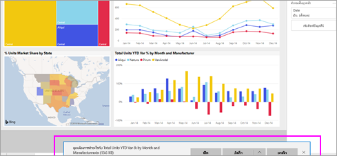

# ส่งออกข้อมูลจากการแสดงผลด้วยภาพ
ถ้าคุณต้องการดูข้อมูลที่ใช้ในการสร้างการแสดงผลด้วยภาพ [คุณสามารถแสดงข้อมูลนั้นใน Power BI](end-user-show-data.md) หรือส่งออกข้อมูลนั้นไปยัง Excel ได้ ตัวเลือกในการส่งออกข้อมูลต้องมีประเภทเฉพาะบางอย่างหรือสิทธิ์การใช้งาน และแก้ไขสิทธิ์ในชุดข้อมูลและรายงาน หากคุณไม่ต้องการส่งออก ให้ตรวจสอบกับผู้ดูแลระบบ Power BI ของคุณ 

## จากการแสดงผลด้วยภาพบนแดชบอร์ด Power BI

1. เริ่มต้นที่จากแดชบอร์ด Power BI ในส่วนนี้เราใช้แดชบอร์ดจากแอป***ตัวอย่างการตลาดและการขาย*** คุณสามารถ[ดาวน์โหลดแอปนี้ได้จาก AppSource.com](https://appsource.microsoft.com/en-us/product/power-bi/microsoft-retail-analysis-sample.salesandmarketingsample-preview?flightCodes=e2b06c7a-a438-4d99-9eb6-4324ce87f282)

    

2. วางเมาส์เหนือการแสดงผลด้วยภาพเพื่อแสดงจุดไข่ปลา (...) แล้วคลิกเพื่อแสดงเมนูการดำเนินการ

    

3. เลือก **ส่งออกไปยัง Excel**

4. สิ่งที่จะเกิดขึ้นต่อไปนั้นขึ้นอยู่กับเบราว์เซอร์ที่คุณกำลังใช้ คุณอาจได้รับการแจ้งเตือนให้บันทึกไฟล์หรือคุณอาจเห็นลิงก์ไปยังไฟล์ที่ส่งออกอยู่ที่ด้านล่างของเบราว์เซอร์ 

    

5. เปิดไฟล์ใน Excel  

    

## จากการแสดงผลด้วยภาพในรายงาน
คุณสามารถส่งออกข้อมูลจากการแสดงผลด้วยภาพในรายงานที่มีรูปแบบ .csv หรือ .xlsx (Excel) ได้ 

1. บนแดชบอร์ด ให้เลือกไทล์เพื่อเปิดรายงานเบื้องต้น  ในตัวอย่างนี้ เรากำลังเลือกการแสดงผลด้วยภาพเดียวกันกับที่แสดงข้างต้น *% ความแตกต่างของผลรวมหน่วยตั้งแต่ต้นปี* 

    

    เนื่องจากไทล์นี้สร้างจากรายงาน*ตัวอย่างการขายและการตลาด* ซึ่งเป็นรายงานที่เปิดอยู่ และจะเปิดไปยังหน้าที่มีการแสดงผลด้วยภาพของไทล์ที่เลือกไว้ 

2. เลือกไทล์ในรายงาน สังเกตบานหน้าต่าง**ตัวกรอง**ทางด้านขวา การแสดงผลด้วยภาพนี้มีการใช้ตัวกรอง หากต้องการเรียนรู้เพิ่มเติมเกี่ยวกับตัวกรอง ให้ดูที่ [ใช้ตัวกรองในรายงาน](end-user-report-filter.md)

    

3. เลือกจุดไข่ปลาที่มุมขวาด้านบนของการแสดงภาพ เลือก **ส่งออกข้อมูล**

    

4. คุณจะเห็นตัวเลือกในการส่งออกข้อมูลสรุปหรือข้อมูลเบื้องต้น หากคุณใช้แอป*ตัวอย่างการขายและการตลาด* **ข้อมูลเบื้องต้น**จะถูกปิดใช้งาน แต่คุณอาจพบรายงานที่มีการเปิดใช้งานทั้งสองตัวเลือก ต่อไปนี้คือคำอธิบายความแตกต่าง

    **ข้อมูลสรุป**: เลือกตัวเลือกนี้ถ้าคุณต้องการส่งออกข้อมูลสำหรับสิ่งที่คุณเห็นในภาพนั้น  การส่งออกชนิดนี้แสดงเฉพาะข้อมูลที่คุณเลือกเพื่อสร้างการแสดงผลด้วยภาพ หากการแสดงผลด้วยภาพมีการใช้ตัวกรอง ข้อมูลที่คุณส่งออกก็จะถูกกรองด้วยเช่นกัน ตัวอย่างเช่น สำหรับการแสดงผลด้วยภาพนี้ การส่งออกของคุณจะรวมเฉพาะข้อมูลสำหรับปี 2014 และภาคกลาง รวมถึงข้อมูลสำหรับผู้ผลิตสี่รายเท่านั้น: VanArsdel, Natura, Aliqui และ Pirum
  

    **ข้อมูลเบื้องต้น**: เลือกตัวเลือกนี้ หากคุณต้องการส่งออกข้อมูลสำหรับสิ่งที่คุณเห็นในการแสดงผลด้วยภาพ**เสริมด้วย**ข้อมูลเพิ่มเติมจากชุดข้อมูลเบื้องต้น  ซึ่งอาจรวมถึงข้อมูลที่มีอยู่ในชุดข้อมูล แต่ไม่ได้ใช้ในการแสดงผลด้วยภาพ 

    

5. สิ่งที่จะเกิดขึ้นต่อไปนั้นขึ้นอยู่กับเบราว์เซอร์ที่คุณกำลังใช้ คุณอาจได้รับการแจ้งเตือนให้บันทึกไฟล์ หรือคุณอาจเห็นลิงก์ไปยังไฟล์ที่ส่งออกอยู่ที่ด้านล่างของเบราว์เซอร์ 

    

6. เปิดไฟล์ใน Excel เปรียบเทียบจำนวนข้อมูลที่ส่งออกกับข้อมูลที่เราส่งออกจากการแสดงผลด้วยภาพเดียวกันบนแดชบอร์ด ความแตกต่างก็คือการส่งออกนี้รวม**ข้อมูลเบื้องต้น**ด้วย 

    

## ขั้นตอนถัดไป

[แสดงข้อมูลที่ใช้เพื่อสร้างวิชวล](end-user-show-data.md)