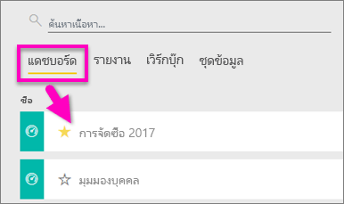
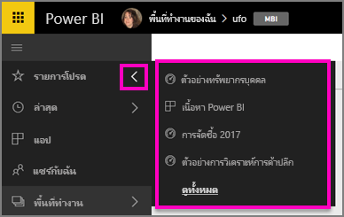

# เพิ่มรายการโปรด แดชบอร์ด รายงาน และแอปใน Power BI service
เมื่อคุณทำให้เนื้อหาให้เป็น*รายการโปรด*คุณจะสามารถเข้าถึงได้จากพื้นที่ทำงานของคุณทั้งหมด  รายการโปรดโดยทั่วไปแล้วเป็นเนื้อหาที่คุณเยี่ยมชมบ่อยที่สุด

> [!NOTE]
> หัวข้อนี้นำไปใช้กับ Power BI service และไม่ Power BI Desktop
> 
> 

คุณยังสามารถเลือกแดชบอร์ดเดียวเป็นแบบ[เด่นแดชบอร์ด](end-user-featured.md)ใน Power BI service ได้

## เพิ่มแดชบอร์ด หรือรายงานเป็นแบบ*รายการโปรด*
ดู Amanda เพิ่มรายการโปรดในพื้นที่ทำงานของเธอ แล้วทำตามคำแนะนำทีละขั้นตอนด้านล่างวิดีโอเพื่อลองทำด้วยตนเอง

<iframe width="560" height="315" src="https://www.youtube.com/embed/G26dr2PsEpk" frameborder="0" allowfullscreen></iframe>

1. เปิดแดชบอร์ดหรือรายงานที่คุณใช้บ่อย แม้แต่เนื้อหาที่ถูกแชร์กับคุณสามารถเป็น*รายการโปรด*ได้
2. จากมุมบนขวา Power BI service ให้เลือก**รายการโปรด**หรือรูปดาวไอคอน
   
   
   
   คุณยังสามารถเพิ่มแดชบอร์ดหรือรายงานจากพื้นที่ทำงานของคุณเป็นรายการโปรดได้ **แดชบอร์ด**หรือแท็บมุมมองเนื้อหา**รายงาน**
   
   

## เพิ่มแอปเป็นแบบ*รายการโปรด*

1. จากแถบนำทางด้านซ้าย ให้เลือก**Apps**

   

2. เลื่อนเคอร์เซอร์เหนือแอปเมื่อต้องแสดงรายละเอียดเพิ่มเติม  เลือกกรูปดาว   ไอคอนการตั้งค่าเป็นรายการโปรด
   
   

## ทำงานกับ*รายการโปรด*
1. เมื่อต้องการเข้าไปยังรายการโปรดของคุณ จากพื้นที่ทำงานใด ๆ เลือกลูกศรลอยทางด้านขวาของ**รายการโปรด**  จากที่นี่ คุณสามารถเลือกเปิดรายการโปรด ห้ารายการโปรดเท่านั้นจะอยู่ในรายการ (ตามตัวอักษร) ถ้าคุณมีมากกว่าห้า ให้เลือก**ดูทั้งหมด**เพื่อเปิดหน้าจอรายการโปรด (ดู #2 ด้านล่าง) 
   
   
2. เพื่อดูเนื้อหา**ทั้งหมด**ที่คุณเพิ่มเป็นรายการโปรด ใน navpane ด้านซ้าย ให้เลือก**รายการโปรด**หรือรายการโปรดไอคอน  
   
    
   
   จากตรงนี้ คุณจะสามารถ: เปิด ระบุผู้เป็นเจ้าของ และกระทั่งแชร์ให้เพื่อนร่วมงานของคุณได้

## ยกเลิกเนื้อหาโปรด
ไม่ใช้รายงานได้บ่อยอีกต่อไป  คุณสามารถยกเลิกรายการโปรดนั้นได้ เมื่อคุณยกเลิกเนื้อหาโปรด มันจะถูกเอาออกจากรายการโปรดของคุณ แต่ไม่ใชออกจาก Power BI

1. ในบานหน้าต่างนำทางด้านซ้าย ให้เลือก**รายการโปรด**เพื่อเปิดจอ**รายการโปรด**
   
   
2. เลือกรูปดาวสีเหลืองอยู่ถัดจากเนื้อหาเพื่อยกเลิกรายการโปรด

> **หมายเหตุ**: คุณยังสามารถยกเลิกแดชบอร์ดรายการโปรด ส่งรายงาน หรือแอปได้เช่นกัน เพียงแค่เปิดและยกเลิกการเลือกไอคอนสีเหลือง   
> 
> 

## ขั้นตอนถัดไป
[Power BI คืออะไร](../power-bi-overview.md)

[Power BI แนวคิดพื้นฐาน](end-user-basic-concepts.md)

มีคำถามเพิ่มเติมหรือไม่ [ลองไปที่ชุมชน Power BI](http://community.powerbi.com/)

