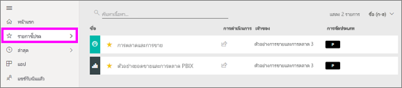
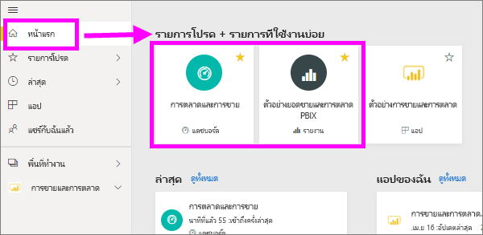
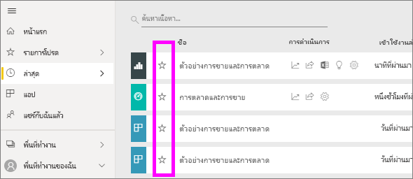
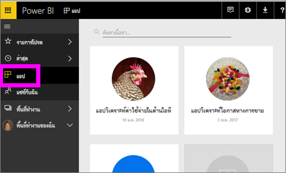
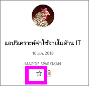
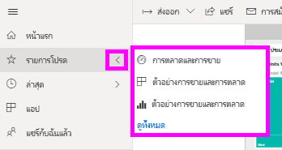
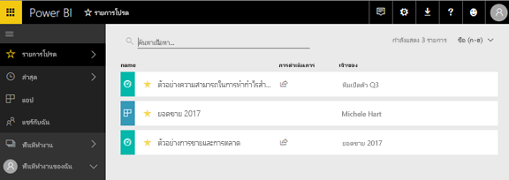
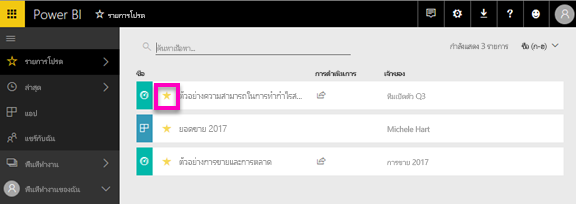

# เพิ่มรายการโปรด แดชบอร์ด รายงาน และแอปใน Power BI service
เมื่อคุณทำให้เนื้อหา*โปรด*คุณจะสามารถเข้าถึงได้อย่างรวดเร็วจากการ**รายการโปรด**รายการเนื้อหา และจาก**Power BI Home**  >   **รายการโปรด และรายการที่ใช้บ่อย**  รายการโปรดเป็นเนื้อหาโดยทั่วไปที่คุณเยี่ยมชมบ่อยที่สุด และจะถูกระบุ ด้วยดาวสีเหลือง

   

   

คุณยังสามารถเลือกแดชบอร์ดเดียวเป็นตัว[เด่นแดชบอร์ด](end-user-featured.md)ในบริการ Power BI ได้

## เพิ่มแดชบอร์ด หรือรายงานเป็นแบบ*รายการโปรด*

1. เปิดแดชบอร์ดหรือรายงานที่คุณใช้บ่อย แม้แต่เนื้อหาที่ถูกแชร์กับคุณสามารถเป็น*รายการโปรด*ได้

2. จาก ribbon ด้านบนของบริการ Power BI เลือก**โปรด**หรือดาวไอคอน
   
   
   
   คุณสามารถยังโปรดแดชบอร์ดหรือรายงานจากทุกที่ คุณเห็นไอคอนรูปดาว เช่นหน้าแรก ล่าสุด แอป และแชร์กับฉันได้ 
   
   

## เพิ่มแอปเป็นแบบ*รายการโปรด*

1. จากบานหน้าต่างนำทาง เลือก**แอ**

   

2. เลื่อนเคอร์เซอร์เหนือแอปเมื่อต้องแสดงรายละเอียดเพิ่มเติม  เลือกกรูปดาว   ไอคอนการตั้งค่าเป็นรายการโปรด
   
   

## ทำงานกับ*รายการโปรด*
1. เมื่อต้องการเข้าถึงรายการโปรดของคุณ ให้เลือกลูกศรลอยทางด้านขวาของ**รายการโปรด**  จากที่นี่ คุณสามารถเลือกเปิดรายการโปรด ห้ารายการโปรดเท่านั้นจะอยู่ในรายการ (ตามตัวอักษร) ถ้าคุณมีมากกว่าห้า เลือก**ดูทั้งหมด**เพื่อเปิด รายการโปรดเนื้อหารายการ (ดู #2 ด้านล่าง) 
   
   
2. เมื่อต้องดู**ทั้งหมด**เนื้อหาที่คุณเพิ่มเป็นรายการโปรด ในบานหน้าต่างนำทาง เลือก**รายการโปรด**หรือรายการโปรดไอคอน  
   
    
   
   จากตรงนี้ คุณจะสามารถ: เปิด ระบุผู้เป็นเจ้าของ และกระทั่งแชร์ให้เพื่อนร่วมงานของคุณได้

## ยกเลิกเนื้อหาโปรด
ไม่ใช้รายงานได้บ่อยอีกต่อไป  คุณสามารถยกเลิกรายการโปรดนั้นได้ เมื่อคุณยกเลิกเนื้อหาโปรด มันจะถูกเอาออกจากรายการโปรดของคุณ แต่ไม่ใชออกจาก Power BI

1. ในบานหน้าต่างนำทางด้านซ้าย ให้เลือก**รายการโปรด**เพื่อเปิดจอ**รายการโปรด**
   
   
2. เลือกรูปดาวสีเหลืองอยู่ถัดจากเนื้อหาเพื่อยกเลิกรายการโปรด

> [!NOTE]
> คุณยังสามารถยกเลิกแดชบอร์ดรายการโปรด ส่งรายงาน หรือแอปได้เช่นกัน เพียงแค่เปิดและยกเลิกการเลือกไอคอนสีเหลือง   
> 
> 
## ข้อจำกัดและข้อควรพิจารณา
ในเวลาปัจจุบัน คุณสามารถรายการโปรดแอ และนี้โดยอัตโนมัติโปรดรายงานทั้งหมด และแดชบอร์ดสำหรับแอปนั้น ไม่สามารถปทีละแอปโปรดรายงานหรือแดชบอร์ด 

## ขั้นตอนถัดไป
[Power BI แนวคิดพื้นฐาน](end-user-basic-concepts.md)

มีคำถามเพิ่มเติมหรือไม่ [ลองไปที่ชุมชน Power BI](http://community.powerbi.com/)

