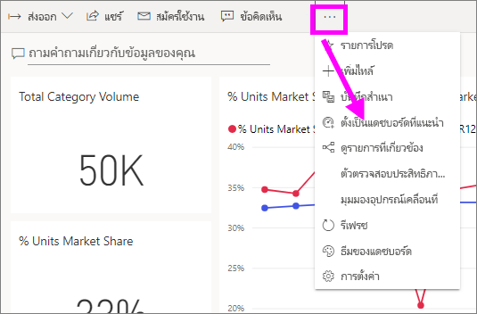
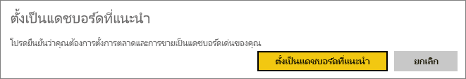
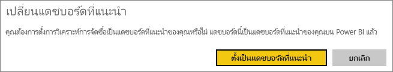
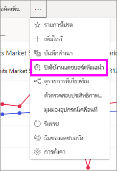

# แดชบอร์ดแนะนำใน Power BI service

[!INCLUDE [power-bi-service-new-look-include](../includes/power-bi-service-new-look-include.md)]

พวกเราหลายคนมีแดชบอร์ดหนึ่งที่เราเยี่ยมชมมากกว่าผู้อื่น อาจเป็นแดชบอร์ดที่เราใช้เพื่อรองรับธุรกิจของเรา หรืออาจเป็นแดชบอร์ดที่ประกอบด้วยการรวมของไทล์จากรายงานและแดชบอร์ดมากมาย

## สร้างแดชบอร์ดแนะนำ
เมื่อคุณเลือกแดชบอร์ดเป็น*เด่น* ทุกครั้งที่คุณเปิดบริการของ Power BI แดชบอร์ดนั้นจะเปิดขึ้นพร้อมกับแดชบอร์ดที่แสดงขึ้นมา 

นอกจากนี้คุณสามารถเลือกแดชบอร์ดสัก และตั้งค่าเหล่านั้นเป็นรายการโปรด ดู[แดชบอร์ดโปรด](end-user-favorite.md)

ถ้าคุณยังไม่ได้ตั้งค่าแดชบอร์ดเด่น Power BI จะเปิดแดชบอร์ดล่าสุดที่คุณใช้หรือ**หน้าแรก**ของ Power BI 

### กำหนดให้นำเสนอแดชบอร์ด
รับชม Amanda จัดทำแดชบอร์ดนำเสนอในวิดีโอ ตามด้วยขั้นตอนเพื่อให้คุณทดลองด้วยตัวเอง

<iframe width="560" height="315" src="https://www.youtube.com/embed/G26dr2PsEpk" frameborder="0" allowfullscreen></iframe>

1. เปิดแดชบอร์ดที่คุณต้องการนำเสนอ 
2. ในแถบเมนูด้านบนสุด เลือก**ตัวเลือกเพิ่มเติม** (...) แล้วเลือก**ตั้งเป็นรายการที่แนะนำ** 
   
    
3. ยืนยันการเลือกของคุณ
   
    

## เปลี่ยนแดชบอร์ดแนะนำ
ถ้าคุณเปลี่ยนใจในภายหลัง คุณสามารถตั้งแดชบอร์ดใหมให้่เป็นแดชบอร์ดแนะนำ

1. ทำตามขั้นตอนที่ 1 และ 2 ก่อนหน้า
   
    
2. เลือก **กำหนดเป็นแดชบอร์ดที่นำเสนอ** เลิกแดชบอร์ดไม่ลบออกจาก Power BI 
   
    

## ลบแดชบอร์ดแนะนำ
ถ้าคุณตัดสินใจว่า คุณไม่ต้องการแดชบอร์ดใดๆ เมื่อต้องได้รับการมอบหมายเป็นแบบี่แนะนำ นี่คือวิธีการยกเลิกการแนะนำแดชบอร์ด

1. เปิดแดชบอร์ดที่นำเสนอในปัจจุบัน
2. ในแถบเมนูด้านบนสุด เลือก**ตัวเลือกเพิ่มเติม** (...) แล้วเลือก **ปิดใช้งานรายการที่แนะนำ**

    
   
## ขั้นตอนถัดไป
- [เพิ่มแดชบอร์ดรายการโปรด](end-user-favorite.md)
- มีคำถามเพิ่มเติมหรือไม่ ลองไปที่ [ชุมชน Power BI](https://community.powerbi.com/)

