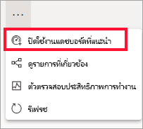

# แดชบอร์ดแนะนำใน Power BI service
## สร้างแดชบอร์ดแนะนำ
พวกเราหลายคนมีแดชบอร์ดหนึ่งที่เราเยี่ยมชมมากกว่าผู้อื่น  อาจเป็นแดชบอร์ดที่เราใช้เพื่อดำเนินธุรกิจ หรืออาจเป็นแดชบอร์ดที่ประกอบด้วยการรวมของไทล์จากรายงานและแดชบอร์ดมากมาย

เมื่อคุณเลือกแดชบอร์ดเป็น*ฟีเจอร์* แต่ละครั้งที่คุณเปิด Power BI service ซึ่งจะเปิดขึ้นพร้อมกับแดชบอร์ดที่แสดงนั้น  

นอกจากนี้คุณสามารถเลือกแดชบอร์ดสัก และตั้งค่าเหล่านั้นเป็น*รายการโปรด* ดู[แดชบอร์ดโปรด](end-user-favorite.md)

> [!NOTE] 
>หัวข้อนี้นำไปใช้กับ Power BI service และไม่ Power BI Desktop

ถ้าคุณยังไม่ได้ตั้งค่าแดชบอร์ดแนะนำ Power BI จะเปิดแดชบอร์ดล่าสุดที่คุณใช้  

### เพื่อตั้งค่าแดชบอร์ดเป็น**ฟีเจอร์**
ดู Amanda สร้างแดชบอร์ดแนะนำ และจากนั้นทำตามคำแนะนำด้านล่างวิดีโอเพื่อลองใช้ด้วยตนเอง

<iframe width="560" height="315" src="https://www.youtube.com/embed/G26dr2PsEpk" frameborder="0" allowfullscreen></iframe>

1. เปิดแดชบอร์ดที่คุณต้องการตั้งค่าให้เป็น*ฟีเจอร์* 
2. ในแถบเมนูด้านบน คุณจะเห็น **ตั้งค่าเป็นตัวแนะนำ** หรือแนะนำไอคอน  เลือกตัวใดตัวหนึ่ง
   
    
3. ยืนยันการเลือกของคุณ
   
    

## เปลี่ยนแดชบอร์ดแนะนำ
แน่นอน ถ้าคุณเปลี่ยนใจในภายหลัง คุณสามารถตั้งแดชบอร์ดใหมให้่เป็นแดชบอร์ดแนะนำ

1. ทำตามขั้นตอนที่ 1 และ 2 จากด้านบน
   
    
2. เลือก**ตั้งเป็นฟีเจอร์** เลิกแดชบอร์ดไม่ลบออกจากพื้นที่ทำงานของคุณ  
   
    

## ลบแดชบอร์ดแนะนำ
ถ้าคุณตัดสินใจว่า คุณไม่ต้องการแดชบอร์ดใดๆ เมื่อต้องได้รับการมอบหมายเป็นแบบี่แนะนำ นี่คือวิธีการยกเลิกการแนะนำแดชบอร์ด

1. เปิดแดชบอร์ดที่แนะนำในขณะนี้
2. ในแถบเมนูด้านบน ให้เลือก**ปิดใช้การแนะนำ**
   
    

Power BI จะเปิดแดชบอร์ดล่าสุดที่คุณใช้  

## ขั้นตอนถัดไป
[เพิ่มแดชบอร์ดรายการโปรด](end-user-favorite.md)

มีคำถามเพิ่มเติมหรือไม่ [ลองไปที่ชุมชน Power BI](http://community.powerbi.com/)

