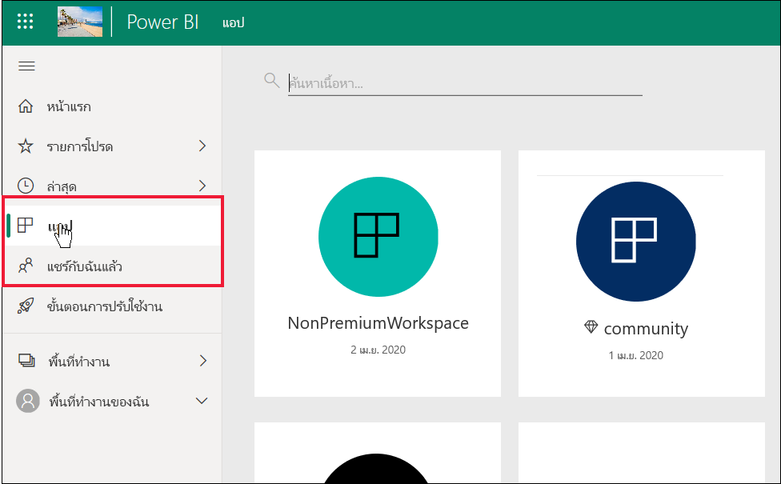
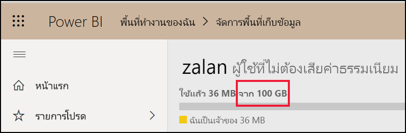
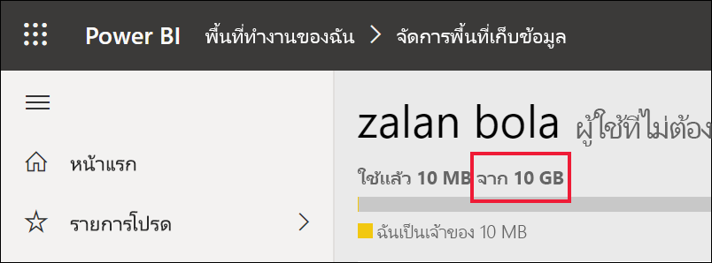

# รายการคุณลักษณะของ Power BI สำหรับ*ผู้บริโภค*และผู้ใช้แบบฟรีอื่น ๆ

[!INCLUDE[consumer-appliesto-ynnn](../includes/consumer-appliesto-ynnn.md)]

ในฐานะ *ผู้บริโภค* คุณใช้บริการ Power BI เพื่อสำรวจรายงานและแดชบอร์ดเพื่อตัดสินใจทางธุรกิจ รายงานและแดชบอร์ดเหล่านั้นถูกสร้างขึ้นโดย *นักออกแบบ* ที่มีสิทธิการใช้งาน Power BI *Pro* ผู้ใช้ระดับ Pro มีความสามารถในการแบ่งปันเนื้อหากับเพื่อนร่วมงานและเพื่อควบคุมสิ่งที่เพื่อนร่วมงานสามารถทำได้และไม่สามารถทำอะไรกับเนื้อหานั้น บางครั้งนักออกแบบแบ่งปันเนื้อหาโดยส่งลิงก์ถึงคุณ และบางครั้งเนื้อหาจะติดตั้งโดยอัตโนมัติและปรากฏใน Power BI ภายใต้ **แอป** หรือ **แบ่งปันกับฉัน**

มีหลายวิธีที่นักออกแบบสามารถแชร์เนื้อหาได้ แต่บทความนี้มีไว้สำหรับ*ผู้บริโภค* Power BI และอธิบายเฉพาะวิธีที่ผู้บริโภครับและโต้ตอบกับเนื้อหา สำหรับข้อมูลเพิ่มเติมเกี่ยวกับวิธีอื่นในการแบ่งปันเนื้อหา โปรดดู [วิธีแบ่งปันงานของคุณใน Power BI](../collaborate-share/service-how-to-collaborate-distribute-dashboards-reports.md)

ใน[บทความก่อนหน้านี้](end-user-license.md) คุณได้เรียนรู้ว่าสิ่งที่คุณสามารถทำได้ด้วยแดชบอร์ด รายงาน และแอป (เนื้อหา) ในบริการของ Power BI จะขึ้นอยู่กับสามสิ่ง: สิทธิ์การใช้งาน บทบาทและสิทธิ์ของคุณ และตำแหน่งที่จัดเก็บเนื้อหา

บทความนี้แสดงรายการคุณลักษณะในบริการของ Power BI ที่มีให้แก่*ผู้บริโภค*เช่นเดียวกับคุณ ตามนิยามแล้ว *ผู้บริโภค*ใช้สิทธิการใช้งานแบบฟรีเพื่อทำงานในบริการของ Power BI (ไม่ใช่บน Power BI Desktop) และเป็นสมาชิกขององค์กรที่มีความจุแบบพรีเมียม

<art>

## การทบทวนคำศัพท์อย่างรวดเร็ว
ลองทบทวนแนวคิด Power BI ก่อนที่เราจะไปที่รายการ นี่จะเป็นการทบทวนอย่างรวดเร็วและหากคุณต้องการรายละเอียดเพิ่มเติม ให้ไปที่ [สิทธิการใช้งานสำหรับผู้บริโภค](end-user-license.md) หรือ [แนวคิดพื้นฐานของ Power BI](end-user-basic-concepts.md)

### พื้นที่ทำงานและบทบาท
มีพื้นที่ทำงานสองชนิด: **พื้นที่ทำงานของฉัน**และพื้นที่ทำงานของแอป เฉพาะคุณเท่านั้นที่สามารถเข้าถึง**พื้นที่ทำงานของฉัน** (My Workspace) ของคุณเองได้ การทำงานร่วมกันและการแชร์จำเป็นต้องมี*ผู้ออกแบบเนื้อหา*ที่มีสิทธิการใช้งานแบบ Pro เพื่อใช้พื้นที่ทำงานของแอป 

ภายในพื้นที่ทำงานของแอป ผู้ออกแบบจะเป็นผู้กำหนด*บทบาท*เพื่อจัดการว่าใผู้มดสามารถทำสิ่งใดในพื้นที่ดำเนินการนั้นได้ *ผู้บริโภค* ได้รับมอบหมายบทบาท**ผู้ชม** 

### ความจุแบบพรีเมียม
เมื่อองค์กรมีการสมัครใช้งานความจุ Premium ผู้ดูแลระบบและผู้ใช้งานแบบ Pro สามารถกำหนดพื้นที่ทำงานเป็น*ความจุเฉพาะ*ได้ พื้นที่ทำงานในความจุเฉพาะคือพื้นที่ที่ผู้ใช้ Pro สามารถแชร์และทำงานร่วมกับผู้ใช้ฟรีได้ โดยผู้ใช้ฟรีไม่จำเป็นต้องที่มีสิทธิการใช้งาน Pro ภายในพื้นที่ทำงานเหล่านั้น ผู้ใช้ฟรีมีสิทธิ์การยกระดับ (ดูรายการด้านล่าง) 

### สิทธิ์การใช้งาน 
ผู้ใช้ Power BI แต่ละรายมีสิทธิ์การใช้งานฟรีหรือสิทธิ์การใช้งาน Pro *ผู้บริโภค*มีสิทธิการใช้งานฟรี

- **สิทธิการใช้งานฟรี** - โดยทั่วไปมอบหมายให้กับ *ผู้บริโภค* ภายในองค์กร (ดูภาพแรกที่อยู่ด้านล่าง) นอกจากนี้ยังมอบหมายให้กับทุกคนที่ลงทะเบียนสำหรับ Power BI เป็นรายบุคคลและต้องการลองใช้[บริการ Power BI ในโหมดแบบสแตนด์อโลน](../fundamentals/service-self-service-signup-for-power-bi.md) (ดูภาพแรกที่สองที่อยู่ด้านล่าง) 

    

    สำหรับผู้ใช้ฟรี การเป็นสมาชิกขององค์กรที่มีความจุแบบ Premium เป็นสิ่งที่จะช่วยคุณอย่างมากมาย ตราบใดที่เพื่อนร่วมงาน Pro ของคุณใช้พื้นที่ทำงานที่มีความจุ Premium ในการแชร์เนื้อหา ผู้ใช้แบบฟรีสามารถดูและทำงานร่วมกับเพื่อนร่วมงานแบบ Pro เหล่านั้นได้  **ด้วยวิธีนี้ผู้ใช้ฟรีกลายเป็น*ผู้บริโภค* Power BI พร้อมความสามารถในการรับและแบ่งปันเนื้อหาเพื่อทำการตัดสินใจทางธุรกิจ** 
 
    

   

## รายการคุณลักษณะ Power BI สำหรับ*ผู้บริโภค*และผู้ใช้แบบฟรี
แผนภูมิต่อไปนี้จะแสดงงานที่*ผู้บริโภค*สามารถดำเนินการโต้ตอบกับเนื้อหาในความจุ Premium และในความจุที่ใช้ร่วมกันได้    

คอลัมน์แรกแสดงถึงผู้ใช้ฟรีที่ทำงานกับเนื้อหาใน **พื้นที่ทำงานของฉัน** ผู้ใช้นี้ไม่สามารถทำงานร่วมกับเพื่อนร่วมงานในบริการ Power BI ได้ เพื่อนร่วมงานไม่สามารถแบ่งปันเนื้อหาโดยตรงกับผู้ใช้นี้ และผู้ใช้นี้ไม่สามารถแบ่งปันจาก **พื้นที่ทำงานของฉัน** 

คอลัมน์ที่สองแสดง*ผู้บริโภค*  ผู้บริโภค:

- มีสิทธิการใช้งานผู้ใช้แบบฟรี
- เป็นส่วนหนึ่งขององค์กรที่มีการสมัครใช้งานความจุ Premium
- รับเนื้อหา (แอป แดชบอร์ด รายงาน) จากผู้ใช้ Pro ที่แชร์เนื้อหานั้นโดยใช้พื้นที่ทำงานของแอปในความจุแบบเฉพาะ
- ได้รับมอบหมายบทบาท **ผู้ชม** ให้กับพื้นที่ทำงานของแอปเหล่านั้น 

### คำอธิบายแผนภูมิ
คุณลักษณะพร้อมใช้งานในสถานการณ์ปัจจุบัน    
คุณลักษณะ ไม่พร้อมใช้งานในสถานการณ์ปัจจุบัน    
 ความพร้อมใช้งานของคุณลักษณะ ****จะถูกจำกัดไว้ที่ **พื้นที่ทำงานของฉัน** เนื้อหาใน **พื้นที่ทำงานของฉัน** มีไว้สำหรับการใช้งานส่วนตัวของเจ้าของและไม่สามารถแชร์หรือดูโดยบุคคลอื่นใน Power BI ได้    
 \* การเข้าถึงคุณลักษณะนี้สามารถเปิดหรือปิดโดยผู้ใช้ Pro หรือผู้ดูแลระบบได้    
   

### รายการคุณลักษณะ

|คุณลักษณะ   | สถานการณ์ที่ 1: ผู้ใช้ Power BI แบบฟรีที่ไม่มีสิทธิเข้าถึงเนื้อหาที่โฮสต์ในความจุแบบเฉพาะ    | สถานการณ์ที่ 2: ผู้ใช้ Power BI แบบฟรีที่มีสิทธิ **ผู้ชม** สำหรับเนื้อหาที่จัดเก็บไว้ในความจุแบบเฉพาะ บุคคลนี้เป็น*ผู้บริโภค* Power BI |
|---|---|---|
|**แอปฯ** 
|ติดตั้งโดยอัตโนมัติ |  | *| 
|เปิด |  |   | 
|รายการโปรด |  |   |
 |แก้ไข อัปเดต แชร์ต่อ เผยแพร่อีกครั้ง |  |   |
 |สร้างแอปใหม่ |  |   |
 |Appsource: ดาวน์โหลดและเปิด |   | | 
|ที่เก็บองค์กร: ดาวน์โหลดและเปิด|  |  |
 |**พื้นที่ทำงานแอป**
| สร้าง แก้ไข หรือลบพื้นที่ทำงานหรือเนื้อหา  |   | |
|เพิ่มการรับรอง |   | | 
|เปิดและดู  |   |    | 
| อ่านข้อมูลที่จัดเก็บไว้ในพื้นที่ทำงานกระแสข้อมูล | ||
|**แดชบอร์ด**
|รับ ดู และโต้ตอบกับแดชบอร์ดจากเพื่อนร่วมงาน |  |    | 
| เพิ่มการแจ้งเตือนไปยังไทล์  |   |    | 
| ดูและตอบสนองต่อความคิดเห็นจากผู้อื่น: เพิ่มข้อคิดเห็นของคุณเอง  |   |  *  | 
| บันทึกสำเนา |  | | 
|คัดลอกวิชวลเป็นรูปภาพหรือไม่ | ||
|สร้าง แก้ไข อัปเดต ลบ |  | | 
|ส่งออกไทล์ไปยัง Excel | | |
|รายการโปรด || |
|ฟีเจอร์ | ||
|โหมดเต็มหน้าจอและโฟกัส | | |
|การค้นหาส่วนกลาง |* |* |
|ข้อมูลเชิงลึกบนไทล์ |     | *|
|  ถามตอบ: ใช้บนแดชบอร์ด  |* |* |
|ถามตอบ: เพิ่มคำถามที่แนะนำและบันทึกไว้ |   | |
|ถามตอบ: ตรวจสอบคำถามที่ถาม |   | |  
|ตัวตรวจสอบประสิทธิภาพการทำงาน |  | |
|ปักหมุดไทล์จากถามตอบหรือรายงาน |  | | 
|พิมพ์ |* |* |
|รีเฟรช |  | | 
|แชร์ต่อ |   | | 
|สมัครใช้งานด้วยตัวคุณเอง |* |*  |
|สมัครใช้งานสำหรับผู้อื่น |   | | 
|**ชุดข้อมูล**
|  เพิ่ม ลบ แก้ไข  |    |   |   
| สร้างรายงานในพื้นที่ทำงานอื่นโดยยึดตามชุดข้อมูลในพื้นที่ทำงานนี้ |   | |  
|  ข้อมูลเชิงลึกบนชุดข้อมูล  |   || 
|กำหนดตารางเวลาการรีเฟรช |  || 
|**รายงาน**
|รับรายงานจากเพื่อนร่วมงาน |  |    | 
| ทำงานร่วมกับเพื่อนร่วมงานบนรายงานเวอร์ชันเดียวกัน | |    | 
| วิเคราะห์รายงานใน Excel  |*  |*  | 
| ดูบุ๊กมาร์กที่สร้างโดยผู้อื่น และเพิ่มบุ๊กมาร์กของคุณเอง  | |  |
| ดูและตอบสนองต่อความคิดเห็นจากผู้อื่น: เพิ่มข้อคิดเห็นใหม่  | |  |
|เปลี่ยนขนาดการแสดง   |  |   | 
| บันทึกสำเนา | |*  
|คัดลอกวิชวลเป็นรูปภาพ* |
| วิชวลรายงานกรองแบบไขว้และข้ามไฮไลท์   | |  |
|  ดูรายละเอียดแบบเจาะลึก   |  |  |
| ดูรายละเอียดเจาะลึก |* |* |
|  ฝัง (เผยแพร่ทางเว็บสาธารณะ)) | * | |  
|  ส่งออกข้อมูลสรุปจากวิชวลรายงาน*  | | |
|ส่งออกข้อมูลเบื้องต้นจากวิชวลรายงาน* |  |  | 
|  ทำให้เป็นรายงานโปรด  | | |
|  ตัวกรอง: เปลี่ยนชนิด  |* |* |
|  ตัวกรอง: โต้ตอบ   || |
|  ตัวกรอง: ถาวร  |* |* |
| ค้นหาในบานหน้าต่างตัวกรอง |* |* |
| โหมดเต็มหน้าจอและโฟกัส   | | |
|  ข้อมูลเชิงลึกเกี่ยวกับรายงาน1  |   || 
| มุมมองสายข้อมูล  | | |
|PDF: สร้างจากหน้ารายงาน | |  |
|ตัวตรวจสอบประสิทธิภาพการทำงาน || |
| PowerPoint: สร้างจากหน้ารายงาน*   | | |
|  เลื่อนระดับเนื้อหาไปยังหน้าแรก  |   | | 
| พิมพ์หน้ารายงาน* | | |
|โต้ตอบกับวิชวลถามตอบ | | |
|คิวอาร์โค้ด | | |
|  รีเฟรช  | | |
|  แชร์เนื้อหาไปยังผู้ใช้ภายนอก  |   | | 
| แชร์: อนุญาตให้ผู้อื่นแชร์รายการต่อ |   | | 
|แสดงเป็นตาราง (แสดงข้อมูล)| | |
|  ตัวแบ่งส่วนข้อมูล: เพิ่มหรือลบ  | | |
| โต้ตอบกับตัวแบ่งส่วนข้อมูล | | |
|  จัดเรียงวิชวลรายงาน  | | |
|  สมัครใช้งานรายงานด้วยตัวคุณเอง | | |
|  สมัครใช้งานรายงานสำหรับผู้อื่น  |   | | 
|  ดูรายการที่เกี่ยวข้อง | | |
|  วิชวล: เปลี่ยนชนิดในรายงาน  |* |* |
|  เปลี่ยนการโต้ตอบกับวิชวล  |  | |
|  วิชวล: เพิ่มใหม่  |  | |
|  วิชวล: เพิ่มเขตข้อมูลใหม่  |   | |
|วิชวล: เปลี่ยนประเภท |  | |
| วิชวล: วางเมาส์เพื่อแสดงรายละเอียดและคำแนะนำเครื่องมือ  |  | |

1. มีให้จากมุมมองเนื้อหา **แบ่งปันกับฉัน** เท่านั้น 

## ขั้นตอนถัดไป
[Power BI สำหรับ*ผู้บริโภค*](end-user-consumer.md)    
