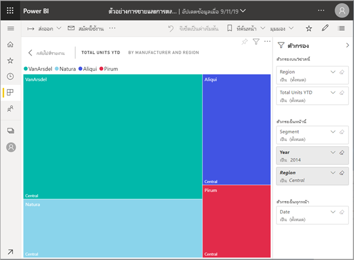

# แสดงเนื้อหาในรายละเอียดที่มากขึ้น: โหมดโฟกัสและโหมดเต็มหน้าจอ

[!INCLUDE [power-bi-service-new-look-include](../includes/power-bi-service-new-look-include.md)]    

<iframe width="560" height="315" src="https://www.youtube.com/embed/dtdLul6otYE" frameborder="0" allowfullscreen></iframe>

โหมดโฟกัสและโหมดเต็มหน้าจอเป็นสองวิธีที่ใช้ดูรายละเอียดที่มากขึ้นในวิชวล รายงานและแดชบอร์ด  ความแตกต่างหลักคือโหมดเต็มหน้าจอจะเอาแผงทั้งหมดที่อยู่รอบเนื้อหาออกไป ในขณะที่โหมดโฟกัสจะให้คุณยังโต้ตอบกับวิชวลของคุณได้ มาดูความเหมือนและความต่างให้มากกว่านี้กัน  

|เนื้อหา    | โหมดโฟกัส  |โหมดเต็มหน้าจอ  |
|---------|---------|----------------------|
|แดชบอร์ด     |   ทำไม่ได้     | ใช่ |
|หน้ารายงาน   | ทำไม่ได้  | ใช่|
|ส่วนการแสดงผลรายงาน | ใช่    | ใช่ |
|แดชบอร์ดไทล์ | ใช่    | ใช่ |
|มือถือ Windows 10 | ทำไม่ได้ | ใช่ |

## โหมดเต็มหน้าจอคืออะไร

แสดงเนื้อหาบริการของ Power BI ของคุณ (แดชบอร์ด, หน้ารายงาน, ไทล์ และการแสดงภาพวิชวล) โดยไม่มีเมนูและแถบนำทางรบกวน  คุณสามารถดูในมุมมองไม่เปลี่ยนได้แบบเต็มรูปแบบเนื้อหาของคุณได้อย่างรวดเร็ว ตลอดเวลา ซึ่งในบางครั้งจะเรียกว่าโหมดโทรทัศน์   

ในการเปิดโหมดเต็มหน้าจอ ให้คุณเลือกไอคอน**เต็มหน้าจอ**  จากแถบเมนูบริการของ Power BI ที่อยู่เหนือแดชบอร์ด รายงาน ไทล์ ในโหมดโฟกัส หรือวิชวลในโหมดโฟกัส  เนื้อหาที่คุณเลือกจะเต็มทั้งหน้าจอ
ถ้าคุณกำลังใช้ Power BI บนมือถือ [หน้าจอแบบเต็มพร้อมใช้งานสำหรับแอป Windows 10 สำหรับอุปกรณ์เคลื่อนที่](./mobile/mobile-windows-10-app-presentation-mode.md) 

การใช้งานบางอย่างในโหมดเต็มหน้าจอเช่น

* นำเสนอแดชบอร์ด ไทล์ รูปภาพ หรือรายงานการประชุมหรือการประชุมของคุณ
* แสดงในที่ทำงานบนหน้าจอขนาดใหญ่แบบเฉพาะหรือใช้เครื่องฉายภาพ
* การดูบนหน้าจอขนาดเล็ก
* การตรวจทานในโหมดล็อก คุณสามารถสัมผัสหน้าจอหรือใช้เมาส์เหนือไทล์โดยไม่ต้องเปิดรายงานหรือแดชบอร์ดพื้นฐาน

## โหมดโฟกัสคืออะไร

โหมด***โฟกัส*** จะให้คุณได้ขยาย (ป๊อปเอาต์) วิชวลหรือไทล์เพื่อดูรายละเอียดที่มากขึ้น  บางทีคุณอาจมีแดชบอร์ดหรือรายงานที่เนื้อหาค่อนข้างจะเบียดเสียด และคุณต้องการขยายวิชวลเพียงวิชวลเดียว  การใช้งานโหมดโฟกัสจะเหมาะสมที่สุด  

ขณะที่อยู่ในโหมดโฟกัส *ลูกค้า*ของ Power BI สามารถโต้ตอบกับตัวกรองที่ใช้งานได้เมื่อวิชวลนี้สร้างขึ้นมา  ในบริการของ Power BI คุณสามารถใช้โหมดโฟกัสกับแดชบอร์ดไทล์หรือวิชวลของรายงานได้

## การทำงานในโหมดเต็มหน้าจอ

ในการเปิดแดชบอร์ดหรือหน้ารายงานในโหมดเต็มหน้าจอ ให้คุณเลือกไอคอนเต็มหน้าจอ  จากแถบนำทางด้านบน เมื่อคุณอยู่ในโหมดเต็มหน้าจอ การขยับเมาส์หรือเคอร์เซอร์จะแสดงให้เห็นเมนูบริบท เนื่องจากโหมดเต็มหน้าจอนั้นมีให้ใช้สำหรับเนื้อหาหลากหลายประเภท ตัวเลือกในเมนูบริบทจึงแตกต่างกันเล็กน้อยแต่ก็อธิบายตนเองได้ดีอยู่แล้ว  แค่เพียงเลื่อนเคอร์เซอร์ไปไว้เหนือไอคอนเพื่อดูคำอธิบาย

เมนูสำหรับแดชบอร์ด    
    

เมนูสำหรับหน้ารายงาน    
    

  *     
  ใช้ปุ่ม**กลับ**เพื่อนำทางไปยังหน้าก่อนหน้าในเบราว์เซอร์ของคุณ ถ้าหน้าก่อนหน้าเป็นหน้า Power BI มันจะแสดงในโหมดเต็มหน้าจอเช่นกัน  โหมดเต็มหน้าจอจะยังคงอยู่จนกว่าคุณออกไป

  *     
  ใช้ปุ่มนี้เพื่อพิมพ์แดชบอร์ดหรือหน้ารายงานของคุณในโหมดแบบเต็มหน้าจอ

  *     
    ให้ใช้ปุ่ม**จัดให้พอดีกับหน้าจอ** เพื่อแสดงแดชบอร์ดของคุณให้มีขนาดใหญ่ที่สุดที่เป็นไปได้ โดยไม่ต้องปรับแถบเลื่อน  

    

  *        
    ในบางครั้งคุณไม่สนใจแถบเลื่อน แต่ต้องการให้แดชบอร์ดเติมความกว้างของช่องว่างที่พร้อมใช้งาน ให้เลือกปุ่ม**ให้พอดีกับความกว้าง**    

    

  *        
    ในรายงานแบบเต็มหน้าจอ ให้ใช้ลูกศรเหล่านี้เพื่อย้ายไปมาระหว่างหน้าในรายงาน    
  *      
  เพื่อออกจากโหมดเต็มหน้าจอ ให้เลือกไอคอน**จบการทำงานแบบเต็มหน้าจอ**

      

## การทำงานในโหมดโฟกัส

มีอยู่สองวิธีในการเปิดโหมดโฟกัส วิธีหนึ่งใช้สำหรับไทล์แดชบอร์ด อีกวิธีสำหรับส่วนการแสดงรายงาน

### โหมดโฟกัสในแดชบอร์ด

1. เปิดแดชบอร์ดในบริการของ Power BI

2. วางเมาส์เหนือไทล์แดชบอร์ดหรือการแสดงภาพวิชวลของรายงาน เลือก**ตัวเลือกเพิ่มเติม** (...) แล้วเลือก **เปิดในโหมดโฟกัส**

    .

2. ไทล์เปิดขึ้น และเติมสีพื้นที่รายงานทั้งหมด คุณยังมีแถบคำสั่ง **ตัวกรอง** ที่คุณสามารถใช้เพื่อโต้ตอบกับส่วนการแสดงผล แถบคำสั่ง **ตัวกรอง** สามารถยุบได้

   

4. สำรวจเพิ่มเติมโดย[การปรับเปลี่ยนตัวกรอง](end-user-report-filter.md) และมองหาการค้นพบที่น่าสนใจในข้อมูลของคุณ  

5. ออกจากโหมดโฟกัส และกลับไปยังแดชบอร์ดได้โดยการเลือก **ออกจากโหมดโฟกัส**(ในมุมบนซ้ายของวิชวล)

        

## โหมดโฟกัสสำหรับจัดรูปแบบข้อมูลรายงาน

1. เปิดรายงานในบริการของ Power BI  จากตัวอย่างนี้ เราจะสาธิตโดยใช้ตัวอย่างการขายและการตลาด

1. หลังจากรายงานเปิดขึ้นมา ให้เลือกแท็บ **หมวดหมู่ YTD**

2. เลื่อนไปที่แผนผังทรีที่มุมด้านซ้ายบน แล้วเลือกไอคอน**โหมดโฟกัส**   

   
2. การแสดงภาพเปิดขึ้นและเติมเต็มทั้งผืนผ้าใบ

   

3. หรือใช้แถบคำสั่ง **ตัวกรอง** เพื่อโต้ตอบกับตัวกรองที่ใช้กับส่วนการแสดงผลนี้ เจาะลึกลงข้อมูลเพื่อหาข้อมูลเชิงลึกใหม่ๆ รวมถึงคำตอบให้กับคำถาม ในฐานะที่เป็น*ผู้บริโภค* คุณไม่สามารถเพิ่มตัวกรองใหม่ เปลี่ยนเขตข้อมูลที่ใช้อยู่ในการแสดงภาพวิชวลหรือสร้างการแสดงภาพวิชวลใหม่ได้  อย่างไรก็ตาม การแก้ไขใดๆ ที่คุณทำกับตัวกรองที่มีอยู่จะได้รับการบันทึกเมื่อคุณออกจาก Power BI ถ้าคุณไม่ต้องการให้ Power BI จดจำการปรับเปลี่ยน ให้คุณเลือก **รีเซ็ตเป็นค่าเริ่มต้น**   

5. ออกจากโหมดโฟกัส และกลับไปรายงาน โดยการเลือก**กลับไปยังรายงาน**(ในมุมบนซ้ายของวิชวล)

      

## ข้อควรพิจารณาและการแก้ไขปัญหา

* เมื่อคุณใช้โหมดโฟกัสกับภาพในรายงาน คุณจะสามารถดูและปรับเปลี่ยนตัวกรองทั้งหมดได้ เช่น: ระดับการแสดงภาพ ระดับหน้า ระดับเจาะลึกรายละเอียด และระดับรายงาน    
* ขณะใช้โหมดโฟกัสกับส่วนการแสดงผลในแดชบอร์ด คุณจะสามารถดูและโต้ตอบได้เฉพาะกับตัวกรองระดับส่วนการแสดงผลเท่านั้น

## ขั้นตอนถัดไป

[ดูการตั้งค่าสำหรับรายงาน](end-user-report-view.md)