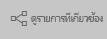

# เนื้อหาของคุณเป็นเวอร์ชันล่าสุด
ในฐานะ*ผู้ใช้*คุณโต้ตอบกับเนื้อหาที่ถูกสร้างขึ้นโดย*นักออกแบบ*และแชร์กับคุณ คุณอาจสงสัยว่าเนื้อหานั้นเป็นเวอร์ชันล่าสุดหรือไม่ หรือคุณอาจแค่ต้องการทราบว่าเนื้อหานั้นได้รับการรีเฟรชครั้งล่าสุดเมื่อใด เมื่อทราบว่าคุณกำลังทำงานกับเนื้อหาล่าสุด นั่นจะช่วยเพิ่มความมั่นใจให้กับคุณ  
 

การทำให้แน่ใจว่าคุณกำลังใช้งานข้อมูลล่าสุดมักเป็นเรื่องที่สำคัญอย่างยิ่งต่อการตัดสินใจให้ถูกต้อง คุณสามารถทำอะไรได้บ้างเพื่อให้แน่ใจว่าคุณกำลังใช้เนื้อหาล่าสุดอยู่ ในหลายกรณี คุณไม่จำเป็นต้องทำอะไรเลย แอปที่แชร์กับคุณจะรีเฟรชโดยอัตโนมัติ และอัปเดตตามกำหนดการที่กำหนดโดยนักออกแบบแอป เช่นเดียวกันสำหรับแดชบอร์ดและรายงานที่มีการแชร์กับคุณ - นักออกแบบต้องทำให้แน่ใจว่าเนื้อหานั้นใหม่ไม่ว่าจะดำเนินการด้วยตัวเอง หรือใช้การจัดกำหนดการการรีเฟรชอัตโนมัติ  

ถ้าคุณมีคำถามเกี่ยวกับความใหม่ของข้อมูล ติดต่อนักออกแบบ

## วิธีการค้นหาชื่อของนักออกแบบ

### แอป

หน้าจอแอปแสดงทั้งสองชื่อของผู้ออกแบบตลอดจนวันที่สร้างแอป  

1. จากแถบนำทางด้านซ้าย ให้เลือก**Apps**

    

    สำหรับแต่ละแอป คุณจะเห็นชื่อเรื่องและวันที่สร้าง 

2. เลื่อนเคอร์เซอร์เหนือแอปเพื่อแสดงชื่อของนักออกแบบ 

    

### แชร์กับฉัน
หน้าจอ**แชร์กับฉัน**แสดงชื่อของเจ้าของเนื้อหา ตลอดจนวันที่เนื้อหาถูกแชร์กับคุณ

 

## วิธีการค้นหาวันที่รีเฟรชล่าสุด
ถ้าสนใจ คุณสามารถค้นหาวันที่รีเฟรชล่าสุดสำหรับเนื้อหาส่วนใหญ่ 

### ไทล์แดชบอร์ด
สำหรับไทล์แดชบอร์ด ดูไทล์ในโหมดโฟกัสเพื่อดูการประทับเวลาการรีเฟรชล่าสุด

1. บนไทล์แดชบอร์ด เลือกจุดไข่ปลา (...) แล้วเลือก **เปิดในโหมดโฟกัส**

    

2. วันที่รีเฟรชล่าสุดแสดงอยู่ที่มุมบนขวา ถ้าคุณไม่เห็น ลองขยายเพื่อทำใหเบราว์เซอร์ของคุณ้กว้างขึ้น 

    

### จากแดชบอร์ดและรายงาน
อีกวิธีในการค้นหาวันที่รีเฟรชล่าสุดคือ การใช้**ดูรายการที่เกี่ยวข้อง**  **ดูรายการที่เกี่ยวข้อง**พร้อมใช้งานจากแถบเมนูด้านบนของ Power BI

บานหน้าต่าง**เนื้อหาที่เกี่ยวข้อง**แสดงข้อมูลรีเฟรชล่าสุดสำหรับชุดข้อมูลพื้นฐานของแดชบอร์ดหรือของรายงาน

## จะเกิดอะไรขึ้นถ้าแอปถูกลบโดยนักออกแบบ

ถ้านักออกแบบลบแอป แดชบอร์ดและรายงานที่เกี่ยวข้องกับแอปนั้นจะถูกลบจากพื้นที่ทำงาน Power BI ของคุณโดยอัตโนมัติได้เช่นกัน ซึ่งแดชบอร์ดและรายงานจะใช้งานไม่ได้อีกต่อไป และแอปจะไม่ปรากฏในบานหน้าต่างนำทาง

## สมัครใช้งานเพื่อดูการเปลี่ยนแปลง
อีกวิธีหนึ่งเพื่อคงข้อมูลให้เป็นปัจจุบันก็คือ การสมัครใช้งานไปยังรายงานหรือแดชบอร์ด แทนที่จะต้องเข้าสู่ระบบ และเปิดรายงานหรือแดชบอร์ด คุณสามารถแจ้ง Power BI เพื่อส่งสแนปช็อตตามกำหนดการที่คุณตั้งค่าไว้  สำหรับข้อมูลเพิ่มเติม ดู[สมัครใช้งานแดชบอร์ดและรายงาน](end-user-subscribe.md)

## ตั้งค่าการแจ้งเตือนข้อมูล
ต้องการรับการแจ้งเตือนถ้าข้อมูลเปลี่ยนแปลงเหนือหรือเกินขีดจำกัดที่คุณตั้งค่าไว้หรือไม่ [สร้างการแจ้งเตือนข้อมูล](end-user-alerts.md)  ถือเป็นเรื่องง่ายในการคงข้อมูลให้เป็นปัจจุบันโดยใช้การแจ้งเตือนข้อมูล ด้วยการแจ้งเตือนข้อมูล คุณสามารถแจ้ง Power BI ให้ส่งอีเมลถึงคุณถ้าค่าในรายงานผ่านเกณฑ์เฉพาะ  ตัวอย่างเช่น ถ้าสินค้าคงคลังลดลงต่ำกว่า 25 หน่วย หรือถ้ายอดขายเกินเป้าหมาย  

## ขั้นตอนถัดไป
[สร้างการแจ้งเตือนข้อมูล](end-user-alerts.md)    
[สมัครใช้งานแดชบอร์ดและรายงาน](end-user-subscribe.md)    
[ดูเนื้อหาที่เกี่ยวข้อง](end-user-related.md)    
