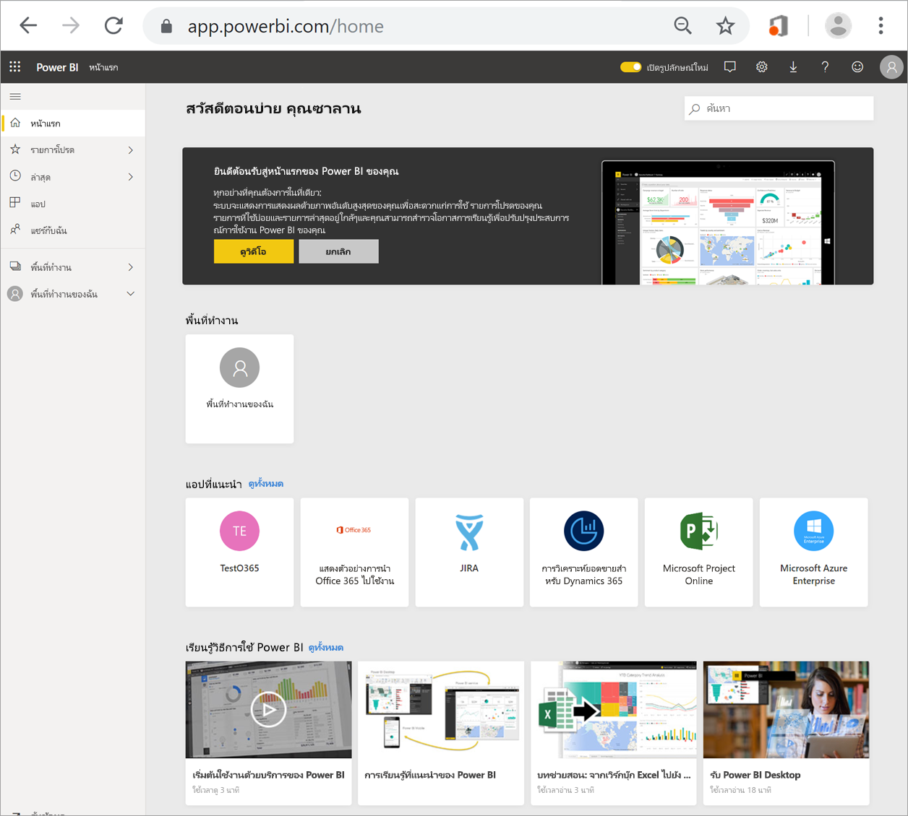
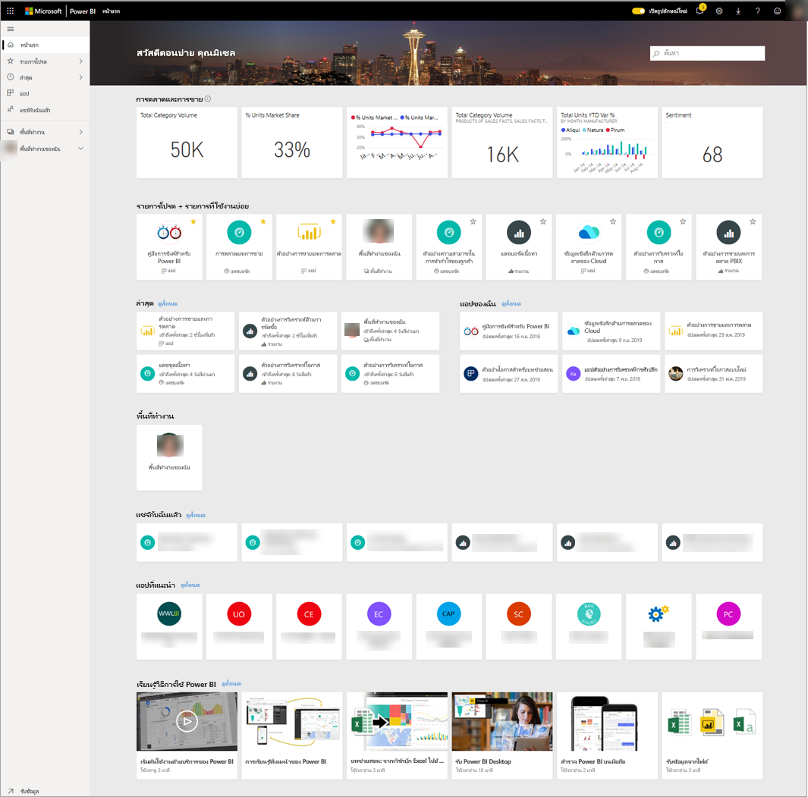
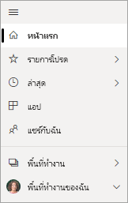
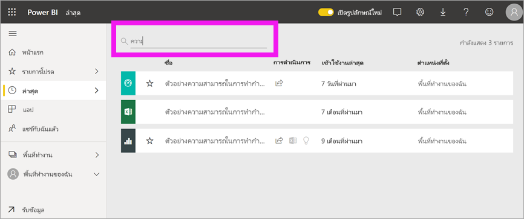

# ค้นหาแดชบอร์ด รายงาน และแอปของคุณ
ใน Power BI คำว่า*เนื้อหา*หมายถึงแอป แดชบอร์ด และรายงาน *ผู้ออกแบบ* Power BI จะสร้างเนื้อหาขึ้น ซึ่งจะใช้งานร่วมกับเพื่อนร่วมงานเช่นคุณ เนื้อหาของคุณสามารถเข้าถึงได้และดูได้จากบริการของ Power BI ซึ่งสถานที่ที่ดีที่สุดในการเริ่มต้นทำงานใน Power BI ก็คือจากหน้าแรกของคุณ

## สำรวจหน้าแรกของ Power BI
เมื่อคุณลงชื่อเข้าใช้ Power BI จะเปิดขึ้นและแสดงพื้นที่ทำงานของหน้าแรกของคุณดังที่แสดงในรูปต่อไปนี้
 

หน้าแรกของ Power BI จะมีในการค้นหาและดูเนื้อหาของคุณอยู่สามวิธี ทั้งสามวิธีจะเข้าสู่กลุ่มเนื้อหาเดียวกัน จะแตกต่างกันแค่วิธีในการรับเนื้อหานั้นเท่านั้น ในบางครั้ง การค้นหาจะเป็นวิธีที่ง่ายและรวดเร็วที่สุดในการค้นหาบางสิ่ง ในขณะที่บางครั้ง การเลือก*การ์ด* บนพื้นที่ทำงานของหน้าแรกจะเป็นตัวเลือกที่ดีที่สุดของคุณ

- พื้นที่ทำงานของหน้าแรกจะแสดงและจัดการเนื้อหาที่เป็นรายการโปรดและเนื้อหาล่าสุด รวมถึงเนื้อหาที่แนะนำและแหล่งข้อมูลการเรียนรู้ของคุณ แต่ละส่วนของเนื้อหาจะแสดงเป็น*การ์ด*ที่มีชื่อและไอคอนอยู่ การเลือกการ์ดจะเปิดเนื้อหานั้น
- ที่ด้านซ้ายจะเป็นบานหน้าต่างนำทาง ที่เรียกว่าบานหน้าต่างนำทาง ในหน้าต่างนี้ จะมีการจัดเรียงเนื้อหาเดิมของคุณในรูปแบบที่แตกต่างออกไปเล็กน้อย โดยจะเรียงเป็นรายการโปรด ล่าสุด แอป และแชร์กับฉัน จากที่นี่ คุณสามารถดูรายชื่อและเลือกเนื้อหาที่ต้องการเปิดได้
- ที่มุมขวาบน จะมีกล่องค้นหาส่วนกลางที่ช่วยให้คุณสามารถค้นหาเนื้อหาตามชื่อเรื่อง ชื่อ หรือคำสำคัญได้

หัวข้อต่อไปนี้จะเป็นการตรวจสอบตัวเลือกเหล่านี้แต่ละข้อเพื่อการค้นหาและการดูเนื้อหา

## พื้นที่ทำงานของหน้าหลัก
คุณจะสามารถเห็นเนื้อหาทั้งหมดที่คุณได้รับอนุญาตให้ใช้งานได้จากบนพื้นที่ทำงานของหน้าแรกนี้ สำหรับตอนแรก พื้นที่ทำงานของหน้าแรกของคุณอาจมีเนื้อหาไม่มากนัก (ดูภาพด้านบน) แต่พื้นที่นี้จะเปลี่ยนแปลงไปเมื่อคุณเริ่มใช้ Power BI กับเพื่อนร่วมงานของคุณ

พื้นที่ทำงานของหน้าแรกของคุณจะมีการอัปเดตเนื้อหาที่แนะนำและแหล่งข้อมูลการเรียนรู้ให้ด้วย 
 
เมื่อคุณทำงานในบริการของ Power BI คุณจะได้รับแดชบอร์ด รายงาน และแอปจากเพื่อนร่วมงาน จากนั้นหน้าแรกของคุณจะค่อย ๆ เต็มขึ้นเรื่อย ๆ เมื่อเวลาผ่านไป หน้าแรกอาจมีลักษณะดังนี้

 
หัวข้อถัดไปจะเป็นการศึกษาหน้าแรกอย่างใกล้ชิด ตั้งแต่ด้านบนลงจนถึงด้านล่าง

## เนื้อหาที่สำคัญที่สุดอยู่ใกล้เพียงปลายนิ้วของคุณ

### รายการโปรดและรายการที่ใช้บ่อย
ส่วนบนสุดนี้ประกอบด้วยลิงก์ไปยังเนื้อหาที่คุณเยี่ยมชมบ่อยที่สุดหรือเนื้อหาที่คุณแท็กไว้ว่าเป็นเนื้อหา[เด่นหรือรายการโปรด](end-user-favorite.md) โปรดสังเกตว่าการ์ดหลายใบจะมีดาวสีเหลืองอยู่ ซึ่งหมายความว่าคุณได้แท็กแอปทั้งสองแอปและแดชบอร์ดนั้นไว้เป็นรายการโปรด
 
### ล่าสุดและแอปของฉัน
ส่วนถัดไปจะแสดงเนื้อหาที่คุณเยี่ยมชมล่าสุด โปรดสังเกตประทับเวลาบนการ์ดแต่ละใบ ส่วน**แอปของฉัน**จะแสดงรายการแอปที่แชร์กับคุณหรือที่คุณได้[ดาวน์โหลดมาจาก AppSource](end-user-apps.md) ซึ่งจะแสดงแอปล่าสุดไว้ที่นี่ คุณสามารถเลือก**ดูทั้งหมด**เพื่อแสดงรายการแอปทั้งหมดที่แชร์กับคุณได้

### พื้นที่ทำงาน
ในฐานะ*ผู้ใช้*Power BI โดยทั่วไปแล้วคุณจะมีพื้นที่ทำงานเดียวนั่นคือ **พื้นที่ทำงานของฉัน** 

### แชร์กับฉันแล้ว
เพื่อนร่วมงานสามารถแชร์แอปกับคุณ รวมถึงสามารถแชร์แดชบอร์ดและรายงานของแต่ละคนได้ด้วย โปรดสังเกตว่าในส่วน**แชร์กับฉัน**จะมีแดชบอร์ดอยู่สามแดชบอร์ดและมีรายงานอยู่สามฉบับที่เพื่อนร่วมงานของคุณได้แชร์กับคุณ

### แอปที่แนะนำ
Power BI จะแสดงชุดของแอปที่แนะนำตามการตั้งค่ากิจกรรมและบัญชีของคุณ การเลือกการ์ดแอปจะเป็นการเปิดแอป
 
### แหล่งข้อมูลการเรียนรู้
ที่ด้านล่างของพื้นที่ทำงานของหน้าแรกคือชุดของแหล่งข้อมูลการเรียนรู้ แหล่งข้อมูลที่ถูกต้องตรงกันจะปรากฏขึ้นตามกับกิจกรรม การตั้งค่า และผู้ดูแลระบบ Power BI ของคุณ 
 
## สำรวจบานหน้าต่างนำทาง

ใช้บานหน้าต่างนำทางเพื่อค้นหาและย้ายระหว่างแดชบอร์ด รายงาน และแอป ในบางครั้ง การใช้บานหน้าต่างนำทางจะเป็นวิธีที่เร็วที่สุดในการเข้าถึงเนื้อหา
บานหน้าต่างนำทางจะมีอยู่เสมอเมื่อคุณเปิดหน้าแรกของคุณ และจะยังคงอยู่เช่นนั้นเมื่อคุณเปิดบริการของ Power BI ในพื้นที่อื่น
  
บานหน้าต่างนำทางจัดระเบียบเนื้อหาของคุณไว้เป็นคอนเทนเนอร์คล้ายกับที่คุณได้เห็นในพื้นที่ทำงานหน้าแรก: รายการโปรด ล่าสุด แอป และแชร์กับฉัน การใช้เมนูลอย (flyout) จะช่วยให้คุณสามารถดูได้เฉพาะเนื้อหาล่าสุดของแต่ละคอนเทนเนอร์เหล่านี้ หรือคุณสามารถนำทางไปยังรายการเนื้อหาเพื่อดูเนื้อหาทั้งหมดของแต่ละคอนเทนเนอร์ได้
 
- เมื่อต้องการเปิดหนึ่งในส่วนเนื้อหาเหล่านี้และแสดงรายการของหน่วยข้อมูลทั้งหมด ให้เลือกหัวเรื่อง
- หากต้องการดูเนื้อหาล่าสุดในแต่ละคอนเทนเนอร์ ให้เลือกเมนูลอย ( **>** )

    

 
บานหน้าต่างนำทางเป็นอีกวิธีหนึ่งในการค้นหาเนื้อหาที่คุณต้องการได้อย่างรวดเร็ว เนื้อหาจะถูกจัดเรียงไว้ในลักษณะที่คล้ายกับพื้นที่ทำงานของหน้าแรก แต่แสดงเป็นรายการแทนที่จะเป็นการ์ด 

## ค้นหาเนื้อหาทั้งหมดของคุณ
ในบางครั้ง วิธีที่เร็วที่สุดในการค้นหาเนื้อหาของคุณคือการค้นหาเนื้อหานั้น เช่น คุณอาจพบว่าแดชบอร์ดที่คุณไม่ได้ใช้งานมาสักพักหนึ่งหายไปจากพื้นที่ทำงานของคุณ หรือบางทีคุณอาจจำได้ว่า แอรอน เพื่อนร่วมงานของคุณแชร์เนื้อหานั้นกับคุณแต่คุณจำไม่ได้ว่าเนื้อหานั้นชื่ออะไรหรือไม่แน่ใจว่าชนิดของเนื้อหาที่เขาแชร์นั้นเป็นแดชบอร์ดหรือรายงาน
 
คุณสามารถใส่ชื่อเต็มหรือชื่อบางส่วนของแดชบอร์ดนั้นแล้วทำการค้นหาได้ นอกจากนี้ คุณยังสามารถใส่ชื่อของเพื่อนร่วมงานของคุณแล้วค้นหาเนื้อหาที่เขาแชร์กับคุณได้ การค้นหาจะจำกัดขอบเขตไว้เฉพาะการค้นหารายการที่ตรงกันในเนื้อหาทั้งหมดที่คุณเป็นเจ้าของหรือมีสิทธิ์เข้าถึงเท่านั้น

## ขั้นตอนถัดไป
ภาพรวมของ[แนวคิดพื้นฐานของ Power BI](end-user-basic-concepts.md)
