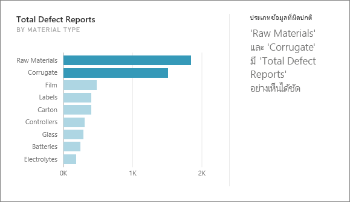
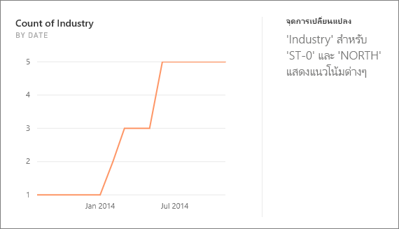
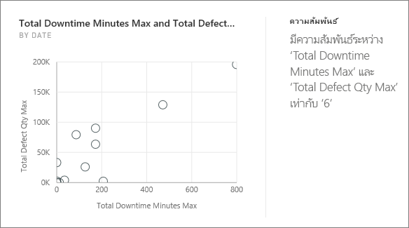
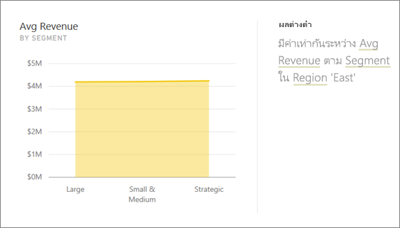
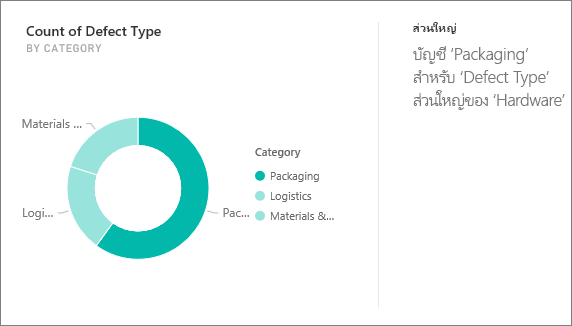
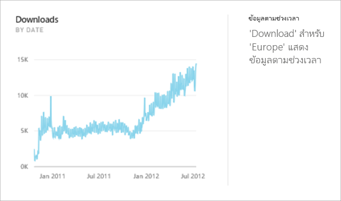
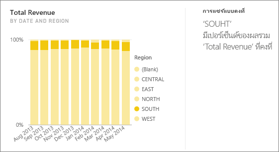
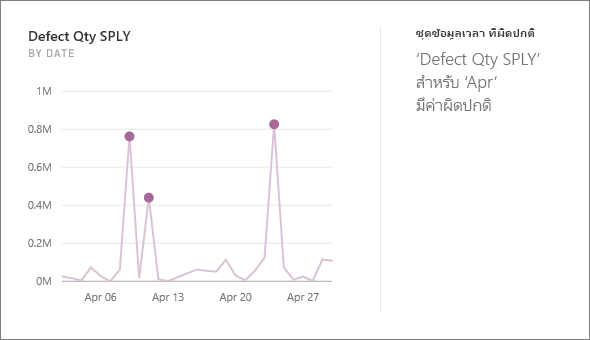

# ชนิดของข้อมูลเชิงลึกด่วนที่ได้รับการสนับสนุนโดย Power BI

[!INCLUDE[consumer-appliesto-yyny](../includes/consumer-appliesto-yyny.md)]

คุณสามารถขอให้ Power BI ค้นหาข้อมูลของคุณ และค้นหาแนวโน้มและรูปแบบที่น่าสนใจได้ แนวโน้มและรูปแบบเหล่านี้จะแสดงในรูปแบบของวิชวลที่เรียกว่า *ข้อมูลเชิงลึก* 

หากต้องการเรียนรู้วิธีการใช้ข้อมูลเชิงลึก โปรดดู [Power BI Insights](end-user-insights.md)

## ข้อมูลเชิงลึกทำงานอย่างไร
Power BI จะค้นหาชุดข้อมูลย่อยที่แตกต่างกันของคุณได้อย่างรวดเร็ว ในขณะที่ค้นหา Power BI จะใช้ชุดของอัลกอริทึมที่มีความซับซ้อนเพื่อค้นหาข้อมูลเชิงลึกที่น่าสนใจ *ผู้บริโภค* Power BI สามารถเรียกใช้ข้อมูลเชิงลึกบนไทล์แดชบอร์ดได้

## คำศัพท์บางคำ
Power BI ใช้อัลกอริทึมเชิงสถิติเพื่อเปิดเผยข้อมูลเชิงลึก อัลกอริทึมอยู่ในรายการและอธิบายไว้ในส่วนถัดไปของบทความนี้ ก่อนที่เราจะไปยังอัลกอริทึม ต่อไปนี้เป็นข้อกำหนดสำหรับคำศัพท์บางคำที่อาจไม่คุ้นเคย 

* **หน่วยวัด** - หน่วยวัดคือเขตข้อมูลเชิงปริมาณ (ตัวเลข) ที่สามารถใช้ในการคำนวณได้ การคำนวณทั่วไปคือ ผลรวม ค่าเฉลี่ย และต่ำสุด ตัวอย่างเช่น หากบริษัทของเราผลิตและขายสเก็ตบอร์ด หน่วยวัดของเราอาจเป็นจำนวนสเก็ตบอร์ดที่ขายและกำไรเฉลี่ยต่อปี  
* **มิติ** - มิติคือข้อมูลจัดกลุ่ม (ข้อความ) มิติจะอธิบายบุคคล วัตถุ รายการ ผลิตภัณฑ์ สถานที่ และเวลา ในชุดข้อมูล มิติเป็นวิธีการจัดกลุ่ม*หน่วยวัด*เป็นหมวดหมู่ที่มีประโยชน์ สำหรับบริษัทสเก็ตบอร์ดของเรา บางมิติอาจรวมถึงการดูยอดขาย (หน่วยวัด) ตามแบบจำลอง สี ประเทศ หรือแคมเปญการตลาด   
* **สหสัมพันธ์** - สหสัมพันธ์บอกให้เราทราบว่าพฤติกรรมของสิ่งต่างๆ มีความเกี่ยวข้องกันอย่างไร  ถ้ารูปแบบของการเพิ่มขึ้นและลดลงคล้ายกันแล้ว พวกเขาจะมีความสัมพันธ์เชิงบวก และถ้ารูปแบบของพวกเขาตรงกันข้าม พวกเขาจะมีความสัมพันธ์เชิงลบ ตัวอย่างเช่น ถ้ายอดขายของสเก็ตบอร์ดสีแดงของเราเพิ่มขึ้นแต่ละครั้งที่เราดำเนินแคมเปญการตลาดทางโทรทัศน์ หมายความว่ายอดขายของสเก็ตบอร์ดสีแดงและแคมเปญทางโทรทัศน์มีความสัมพันธ์เชิงบวกกัน
* **อนุกรมเวลา** - อนุกรมเวลาคือวิธีการแสดงเวลาเป็นจุดข้อมูลที่ต่อเนื่องกัน จุดข้อมูลเหล่านั้นอาจเพิ่มขึ้น เช่น วินาที ชั่วโมง เดือน หรือปี  
* **ตัวแปรต่อเนื่อง** - ตัวแปรแบบต่อเนื่องสามารถเป็นค่าใดก็ตามที่อยู่ระหว่างขีดจำกัดต่ำสุดและสูงสุด มิฉะนั้นจะเป็นตัวแปรที่ไม่ต่อเนื่อง ตัวอย่างคือ อุณหภูมิ น้ำหนัก อายุ และเวลา ตัวแปรแบบต่อเนื่องสามารถประกอบด้วยเศษหรือส่วนของตัวแปรได้ จำนวนสเก็ตบอร์ดสีน้ำเงินทั้งหมดที่ขายได้เป็นตัวแปรแบบไม่ต่อเนื่องเนื่องจากเราไม่สามารถขายสเก็ตบอร์ดครึ่งตัวได้  

## คุณสามารถพบข้อมูลเชิงลึกประเภทใดบ้าง?
นี่คืออัลกอริทึมที่ Power BI ใช้ 

### ประเภทข้อมูลที่ผิดปกติ (บน/ล่าง)
ไฮไลต์กรณีที่หนึ่งหรือสองหมวดหมู่มีค่ามากกว่าหมวดหมู่อื่น  

### เปลี่ยนจุดในชุดข้อมูลเวลา
ไฮไลต์เมื่อมีการเปลี่ยนแปลงที่สำคัญในแนวโน้มในชุดข้อมูลเวลา

### สหสัมพันธ์
ตรวจพบกรณีที่หน่วยวัดหลายตัวแสดงรูปแบบหรือแนวโน้มที่คล้ายกันเมื่อพล็อตกับหมวดหมู่หรือค่าในชุดข้อมูล

### ผลต่างต่ำ
ตรวจหากรณีที่จุดข้อมูลสำหรับมิติอยู่ไม่ไกลจากค่าเฉลี่ย ดังนั้น "ความแปรปรวน" จึงมีค่าต่ำ สมมติว่าคุณมีหน่วยวัด "ยอดขาย" และมิติ "ภูมิภาค" และเมื่อมองไปทั่วภูมิภาคคุณจะเห็นว่ามีจุดแตกต่างกันเล็กน้อยระหว่างจุดข้อมูลกับค่าเฉลี่ย (ของจุดข้อมูล) ข้อมูลเชิงลึกจะทริกเกอร์เมื่อความแปรปรวนของยอดขายในทุกภูมิภาคต่ำกว่าค่าเกณฑ์ กล่าวคือ เมื่อยอดขายใกล้เคียงกันในทุกภูมิภาค

### ส่วนหลัก (ปัจจัยหลัก)
ค้นหากรณีที่ส่วนใหญ่ของค่าทั้งหมดสามารถเกิดจากการคูณเดียวเมื่อแบ่งย่อยตามขนาดอื่น  

### แนวโน้มโดยรวมในชุดข้อมูลเวลา
ตรวจพบแนวโน้มขึ้น หรือลงในชุดข้อมูลเวลา

### กาลในชุดข้อมูลเวลา
ค้นหารูปแบบเป็นครั้งคราวในข้อมูลชุดข้อมูลเวลา เช่นกาลรายสัปดาห์ เดือน หรือรายปี

### การแชร์แบบคงที่
ไฮไลต์กรณีมีความสัมพันธ์หลัก-รองระหว่างใช้ร่วมกันของค่ารองสัมพันธ์กับค่าโดยรวมของค่าหลักระหว่างตัวแปรอย่างต่อเนื่อง ข้อมูลเชิงลึกเกี่ยวกับการแชร์แบบคงที่จะนำไปใช้กับบริบทของหน่วยวัด มิติ และมิติวันที่/เวลาอื่น ข้อมูลเชิงลึกนี้จะทริกเกอร์เมื่อมีค่ามิติเฉพาะเช่น "ภูมิภาคตะวันออกเฉียงเหนือ" มีเปอร์เซ็นต์คงที่ของยอดขายโดยรวมในมิติวันที่/เวลานั้น

ข้อมูลเชิงลึกเกี่ยวกับการแชร์แบบคงที่จะคล้ายกับข้อมูลเชิงลึกผลต่างต่ำเนื่องจากทั้งสองเกี่ยวข้องกับการขาดความแปรปรวนของค่าตลอดเวลา อย่างไรก็ตามข้อมูลเชิงลึกที่ใช้ร่วมกันจะวัดความแตกต่างของ**เปอร์เซ็นต์ของทั้งหมด**ในระหว่างช่วงเวลา ในขณะที่ข้อมูลเชิงลึกของผลต่างต่ำวัดความแปรปรวนของค่าหน่วยวัดแบบสัมบูรณ์ในมิติ

### ข้อมูลชุดเวลาที่ผิดปกติ
สำหรับข้อมูลทั่วทั้งชุดข้อมูลเวลา ตรวจพบเมื่อมีการระบุวันที่หรือเวลา ด้วยค่าที่แตกต่างอย่างมากจากค่าวันที่/เวลาอื่น ๆ

## ขั้นตอนถัดไป
[ข้อมูลเชิงลึกที่ power BI](end-user-insights.md)

มีคำถามเพิ่มเติมหรือไม่ [ลองไปที่ชุมชน Power BI](https://community.powerbi.com/)

