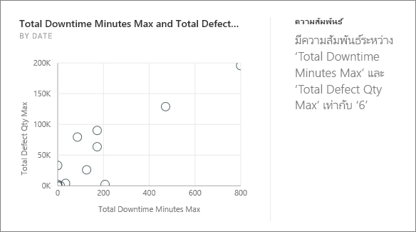
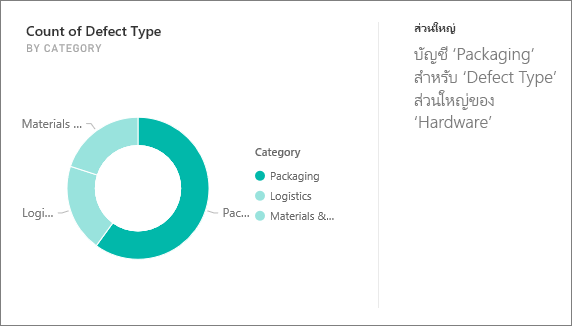
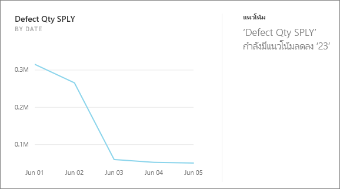
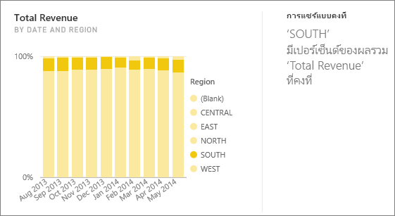
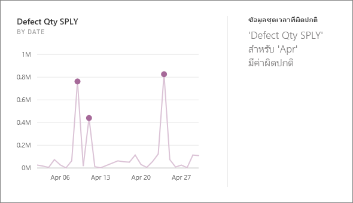

# ชนิดของข้อมูลเชิงลึกด่วนที่ได้รับการสนับสนุนโดย Power BI
## ข้อมูลเชิงลึกทำงานอย่างไร
Power BI จะค้นหาเซตย่อยของชุดข้อมูลของคุณในขณะที่มันกำลังใช้ชุดอัลกอริธึมที่ชาญฉลาดในการค้นพบแนวโน้มข้อมูลเชิงลึกที่น่าสนใจ Power BI สแกนของชุดข้อมูลที่เป็นไปได้มากในระยะเวลาที่กำหนด

คุณสามารถเรียกใช้ข้อมูลเชิงลึกกับชุดข้อมูลหรือแดชบอร์ดไทล์   

## เราสามารถพบข้อมูลเชิงลึกชนิดใด
ต่อไปนี้คือตัวอย่างของอัลกอริธึมที่เราใช้:

## ประเภทข้อมูลที่ผิดปกติ (บน/ล่าง)
ไฮไลต์กรณีที่ สำหรับหน่วยวัดในแบบจำลอง หนึ่ง หรือสองสมาชิกของมิติมีค่ามากขนาดใหญ่กว่าสมาชิกคนอื่น ๆ ของมิติ  

## เปลี่ยนจุดในชุดข้อมูลเวลา
ไฮไลต์เมื่อมีการเปลี่ยนแปลงที่สำคัญในแนวโน้มในชุดข้อมูลเวลา

## สหสัมพันธ์
ตรวจพบกรณีที่หลายหน่วยวัดแสดงความสัมพันธ์ระหว่างแต่ละคนเมื่อลงจุดตามขนาดในชุดข้อมูล

## ผลต่างต่ำ
ตรวจพบกรณีที่จุดข้อมูลไม่ใช่ far from ค่าเฉลี่ย

## ส่วนหลัก (ปัจจัยหลัก)
ค้นหากรณีที่ส่วนใหญ่ของค่าทั้งหมดสามารถเกิดจากการคูณเดียวเมื่อแบ่งย่อยตามขนาดอื่น  

## แนวโน้มโดยรวมในชุดข้อมูลเวลา
ตรวจพบแนวโน้มขึ้น หรือลงในชุดข้อมูลเวลา

## กาลในชุดข้อมูลเวลา
ค้นหารูปแบบเป็นครั้งคราวในข้อมูลชุดข้อมูลเวลา เช่นกาลรายสัปดาห์ เดือน หรือรายปี

## การแชร์แบบคงที่
ไฮไลต์กรณีมีความสัมพันธ์หลัก-รองระหว่างใช้ร่วมกันของค่ารองสัมพันธ์กับค่าโดยรวมของค่าหลักระหว่างตัวแปรอย่างต่อเนื่อง

## ข้อมูลชุดเวลาที่ผิดปกติ
สำหรับข้อมูลทั่วทั้งชุดข้อมูลเวลา ตรวจพบเมื่อมีการระบุวันที่หรือเวลา ด้วยค่าที่แตกต่างอย่างมากจากค่าวันที่/เวลาอื่น ๆ

## ขั้นตอนถัดไป
[ข้อมูลเชิงลึกที่ power BI](end-user-insights.md)

ถ้าคุณเป็นเจ้าของชุดข้อมูล[ปรับให้เหมาะสมสำหรับข้อมูลเชิงลึก](../service-insights-optimize.md)

คำถามเพิ่มเติมหรือไม่ [ลองไปที่ชุมชน Power BI](http://community.powerbi.com/)

