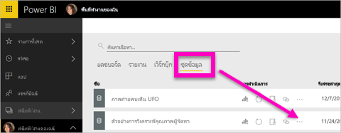
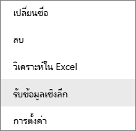
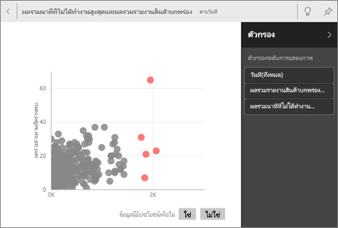

# ข้อมูลเชิงลึกข้อมูล ด้วย Power BI ที่สร้างโดยอัตโนมัติ
มีชุดข้อมูลใหม่ และไม่แน่ใจตำแหน่งที่จะเริ่มได้อย่างไร  จำเป็นต้องสร้างแดชบอร์ดอย่างรวดเร็วใช่ไหม  ต้องการค้นหาข้อมูลเชิงลึกที่คุณอาจพลาดไปใช่หรือไม่

เรียกใช้ข้อมูลเชิงลึกด่วนเพื่อสร้างการแสดงภาพแบบโต้ตอบที่น่าสนใจที่ยึดตามข้อมูลของคุณ สามารถถูกเรียกใช้ข้อมูลเชิงลึกด่วนเป็นชุดข้อมูลทั้งหมด (ข้อมูลเชิงลึกด่วน) หรือ บนไทล์แดชบอร์ดที่เฉพาะเจาะจง (ขอบเขตข้อมูลเชิงลึก) แม้ว่าคุณสามารถเรียกใช้ข้อมูลเชิงลึกบนข้อมูลเชิงลึก

> **หมายเหตุ**: ข้อมูลเชิงลึกไม่ทำงานกับ DirectQuery - ทำได้เฉพาะข้อมูลที่อัปโหลดไปยัง Power BI เท่านั้น
> 

ฟีเจอร์ข้อมูลเชิงลึกมีอยู่แล้วภายในการเติบโต[ชุดของอัลกอริทึมวิเคราะห์ขั้นสูง](end-user-insight-types.md)พัฒนาขึ้นร่วมกับ Microsoft ค้นคว้าที่เราจะยังคงใช้การอนุญาตให้บุคคลเพิ่มเติมเมื่อต้องการค้นหาข้อมูลเชิงลึกในข้อมูลของพวกเขาในด้วยวิธีใหม่ ๆ

## เรียกใช้ข้อมูลเชิงลึกด่วนบนชุดข้อมูล
ดู Amanda เรียกใช้ข้อมูลเชิงลึกด่วนบนชุดข้อมูล เปิดข้อมูลเชิงลึกในโหมดโฟกัส ข้อมูลเชิงลึกเหล่านี้อย่างใดอย่างหนึ่งปักหมุดเป็นไทล์บนแดชบอร์ดของเธอ และรับข้อมูลเชิงลึกสำหรับไทล์แดชบอร์ดแล้ว

<iframe width="560" height="315" src="https://www.youtube.com/embed/et_MLSL2sA8" frameborder="0" allowfullscreen></iframe>

ในตอนนี้จะเปิดใช้งานของคุณ สำรวจข้อมูลเชิงลึกด่วนโดยใช้ [ตัวอย่างการวิเคราะห์คุณภาพผู้จัดหา](../sample-supplier-quality.md)

1. จากแท็บ**ชุดข้อมูล**เลือกจุดไข่ปลา (...) แล้วเลือก**รับข้อมูลเชิงลึก**
   
    
   
    
2. Power BI ใช้[อัลกอริธึมต่าง ๆ](end-user-insight-types.md)เพื่อค้นหาแนวโน้มในชุดข้อมูลของคุณ
   
    
3. ภายในไม่กี่วินาที ข้อมูลเชิงลึกของคุณพร้อม  เลือก**ดูข้อมูลเชิงลึก**เพื่อแสดงภาพ
   
    
   
   > **หมายเหตุ**: ชุดข้อมูลบางอย่างไม่สามารถสร้างข้อมูลเชิงลึกได้เนื่องจากข้อมูลไม่มีนัยสำคัญทางสถิติได้  เมื่อต้องการเรียนรู้เพิ่มเติม ดู[ข้อมูลของคุณสำหรับข้อมูลเชิงลึกที่ปรับให้เหมาะสม](../service-insights-optimize.md)
   > 
   > 
1. แสดงภาพที่แสดงในพิเศษ**ข้อมูลเชิงลึกด่วน**ผืนผ้าใบกับบัตรข้อมูลเชิงลึกที่แยกต่างหาก 32 บัตรแต่ละใบมีแผนภูมิ หรือกราฟ และคำอธิบายสั้น ๆ
   
    

## โต้ตอบกับบัตรข้อมูลเชิงลึก
  

1. อีกทางหนึ่งคือ เลื่อนไปเหนือภาพแล้วเลือกไอคอนหมุดเพื่อเพิ่มการแสดงภาพไปยังแดชบอร์ด
2. โฮเวอร์เหนือบัตร เลือกจุดไข่ปลา (...) แล้วเลือก**ดูข้อมูลเชิงลึก** ซึ่งเปิดแบบเต็มหน้าจอข้อมูลเชิงลึก
   
    
3. ในโหมดโฟกัสคุณสามารถ:
   
   * กรองการแสดงภาพ  เมื่อต้องแสดงตัวกรอง ในมุมบนขวา เลือกลูกศรเมื่อต้องขยายบานหน้าต่างตัวกรอง
        
   * ปักหมุดบัตรข้อมูลเชิงลึกไปยังแดชบอร์ด โดยการเลือกปักหมุดที่ ไอคอน หรือ**ปักหมุดภาพ**
   * เรียกใช้ข้อมูลเชิงลึกบนบัตรเอง ซึ่งมักจะเรียกว่า**ขอบเขตข้อมูลเชิงลึก** ที่มุมบนขวา เลือกไอคอนหลอดไฟหรือ**รับข้อมูลเชิงลึก**
     
       
     
     ข้อมูลเชิงลึกแสดงทางด้านซ้าย และการ์ดใหม่ เท่านั้นตามข้อมูลในข้อมูลเชิงลึกที่เดียว แสดงตามแนวทางด้านขวา
     
       
4. เมื่อต้องการกลับไปยังต้นฉบับข้อมูลเชิงลึกพื้นที่ ที่มุมบนซ้าย เลือก**โหมดโฟกัสออกจาก**

## เรียกใช้ข้อมูลเชิงลึกบนไทล์แดชบอร์ด
แทนที่จะค้นหาข้อมูลเชิงลึกกับยังชุดข้อมูลทั้งหมด จำกัดขอบเขตการค้นหาของคุณไปยังข้อมูลที่ใช้เพื่อสร้างไทล์แดชบอร์ดเดียว ซึ่งมักจะเรียกว่า**ขอบเขตข้อมูลเชิงลึก**

1. เปิดแดชบอร์ด
2. เลื่อนไปเหนือไทล์ เลือกจุดไข่ปลา (...) แล้วเลือก**รับข้อมูลเชิงลึก** ไทล์เปิดขึ้นใน[โหมดโฟกัส](end-user-focus.md)ด้วยข้อมูลเชิงลึกการ์ดที่แสดงตามแนวทางด้านขวา    
   
        
4. ข้อมูลเชิงลึกกระตุ้นความสนใจของคุณหรือไม่ เลือกบัตรข้อมูลเชิงลึกเพื่อเจาะลึกเพิ่มเติม ข้อมูลเชิงลึกแสดงทางด้านซ้าย และการ์ดใหม่ เท่านั้นตามข้อมูลในข้อมูลเชิงลึกที่เดียว แสดงตามแนวทางด้านขวา    
6. ดำเนินต่อหลายชั้นเมื่อข้อมูลของคุณ และเมื่อคุณค้นหาข้อมูลเชิงลึกน่าสนใจ ปักหมุดลงในแดชบอร์ดของคุณ โดยการเลือก**ปักหมุดภาพ**จากมุมบนขวา

## ขั้นตอนถัดไป
ถ้าคุณเป็นเจ้าของชุดข้อมูล[ปรับให้เหมาะสมสำหรับข้อมูลเชิงลึกด่วน](../service-insights-optimize.md)

เรียนรู้เกี่ยวกับการ[ชนิดของข้อมูลเชิงลึกด่วนที่พร้อมใช้งาน](end-user-insight-types.md)

คำถามเพิ่มเติมหรือไม่ [ลองไปที่ชุมชน Power BI](http://community.powerbi.com/)

