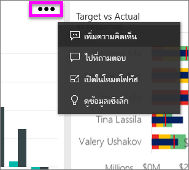
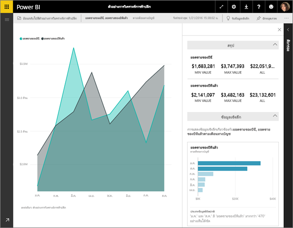
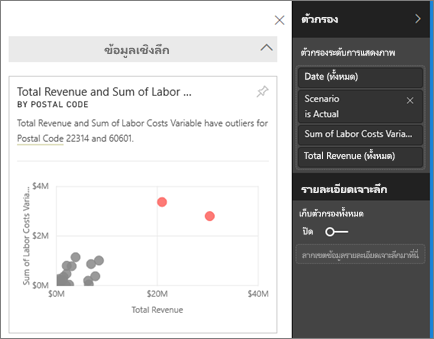
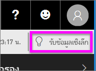
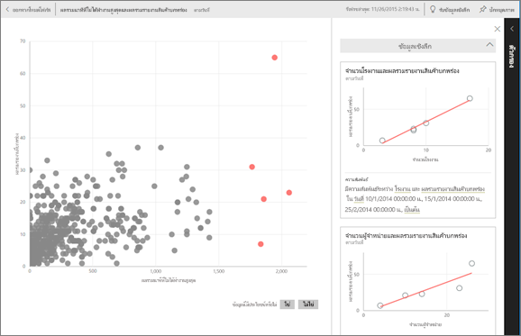

# ดูข้อมูลเชิงลึกบนไทล์แดชบอร์ดด้วย Power BI
แต่ละไทล์ของการแสดงภาพบนแดชบอร์ดของคุณคือ ประตูไปสู่การสำรวจข้อมูล เมื่อคุณเลือกไทล์ จะเปิดรายงานที่คุณสามารถกรองและจัดเรียง รวมถึงเจาะลึกลงไปในชุดข้อมูลหลังรายงาน และเมื่อคุณเรียกใช้ข้อมูลเชิงลึก Power BI จะสำรวจข้อมูลให้คุณ

เรียกใช้ข้อมูลเชิงลึกด่วนเพื่อสร้างการแสดงภาพแบบโต้ตอบที่น่าสนใจที่ยึดตามข้อมูลของคุณ สามารถเรียกใช้ข้อมูลเชิงลึกแบบด่วนบนไทล์ของแดชบอร์ดเฉพาะและคุณยังสามารถเรียกใช้ข้อมูลเชิงลึกในข้อมูลเชิงลึกได้!

ฟีเจอร์ข้อมูลเชิงลึกมีอยู่แล้วภายในการเติบโต[ชุดของอัลกอริทึมวิเคราะห์ขั้นสูง](end-user-insight-types.md)พัฒนาขึ้นร่วมกับ Microsoft ค้นคว้าที่เราจะยังคงใช้การอนุญาตให้บุคคลเพิ่มเติมเมื่อต้องการค้นหาข้อมูลเชิงลึกในข้อมูลของพวกเขาในด้วยวิธีใหม่ ๆ

## เรียกใช้ข้อมูลเชิงลึกบนไทล์แดชบอร์ด
เมื่อคุณเรียกใช้ข้อมูลเชิงลึกบนไทล์ของแดชบอร์ด Power BI จะค้นหาเฉพาะข้อมูลที่ใช้ในการสร้างไทล์ของแดชบอร์ดเดียว 

1. [เปิดแดชบอร์ด](end-user-dashboards.md)
2. เลื่อนไปเหนือไทล์ เลือกจุดไข่ปลา (...) แล้วเลือก**ดูข้อมูลเชิงลึก** 

    

3. ไทล์เปิดขึ้นใน[โหมดโฟกัส](end-user-focus.md)ด้วยข้อมูลเชิงลึกการ์ดที่แสดงตามแนวทางด้านขวา    
   
        
4. ข้อมูลเชิงลึกกระตุ้นความสนใจของคุณหรือไม่ เลือกบัตรข้อมูลเชิงลึกเพื่อเจาะลึกเพิ่มเติม ข้อมูลเชิงลึกแสดงทางด้านซ้าย และการ์ดใหม่ เท่านั้นตามข้อมูลในข้อมูลเชิงลึกที่เดียว แสดงตามแนวทางด้านขวา    

 ## โต้ตอบกับบัตรข้อมูลเชิงลึก
เมื่อคุณเปิดข้อมูลเชิงลึกแล้ว ให้สำรวจต่อไป

   * กรองวิชวลบนพื้นที่  แสดงตัวกรอง โดยเลือกลูกศรเพื่อขยายบานหน้าต่างตัวกรองในมุมบนขวา

     
   
   * เรียกใช้ข้อมูลเชิงลึกบนบัตรข้อมูลเชิงลึก ซึ่งมักจะเรียกว่า**ข้อมูลเชิงลึกที่เกี่ยวข้อง** ที่มุมบนขวา เลือกไอคอนหลอดไฟ   หรือ **รับข้อมูลเชิงลึก**
     
     
     
     ข้อมูลเชิงลึกแสดงทางด้านซ้าย และการ์ดใหม่ เท่านั้นตามข้อมูลในข้อมูลเชิงลึกที่เดียว แสดงตามแนวทางด้านขวา
     
     

ย้อนกลับไปยังพื้นที่ทำงานเดิมสำหรับข้อมูลเชิงลึก จากมุมบนซ้าย เลือก**ออกจากโหมดโฟกัส**

## ข้อควรพิจารณาและการแก้ไขปัญหา
- **ดูข้อมูลเชิงลึก** ใช้ไม่ได้กับ DirectQuery - จะใช้ได้กับข้อมูลที่อัปโหลดไปยัง Power BI เท่านั้น
- **ดูข้อมูลเชิงลึก**ใช้ไม่ได้กับชนิดไทล์ของแดชบอร์ดทั้งหมด เช่น ไม่สามารถใช้ได้กับการแสดงผลด้วยภาพที่กำหนดเอง<!--[custom visuals](end-user-custom-visuals.md)-->

## ขั้นตอนถัดไป
เรียนรู้เกี่ยวกับการ[ชนิดของข้อมูลเชิงลึกด่วนที่พร้อมใช้งาน](end-user-insight-types.md)

