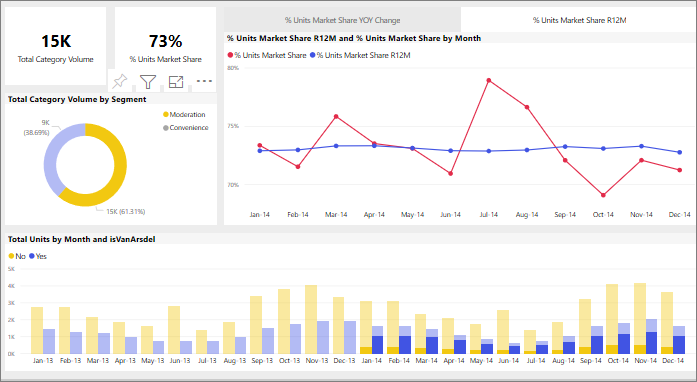

# วิธีการใช้วิชวลกรองข้ามกันในรายงาน Power BI
คุณลักษณะยอดเยี่ยมประการหนึ่งของ Power BI คือแนวทางที่ภาพทั้งหมดในหน้ารายงานเชื่อมโยงถึงกัน หากคุณเลือกจุดข้อมูลในภาพภาพหนึ่ง ภาพอื่นทั้งหมดบนหน้าที่มีข้อมูลที่เปลี่ยนไปนั้นตามการเลือกนั้น 

ตามค่าเริ่มต้นแล้ว การเลือกจุดข้อมูลในการแสดงภาพบนหน้ารายงานหนึ่งเพื่อกรองข้าม เน้นข้าม และดูรายละเอียดการแสดงภาพอื่นบนหน้า 

ซึ่งอาจเป็นประโยชน์ในการแสดงให้เห็นว่าค่าใด ๆ ในข้อมูลของคุณจะมีส่วนเกี่ยวข้องกับข้อมูลอื่นอย่างไร เช่น การเลือกเซกเมนต์การควบคุมในแผนภูมิโดนัท ไฮไลท์ความเกี่ยวข้องของเซ็กเมนต์นั้นที่มีต่อแต่ละคอลัมน์ในแผนภูมิจำนวนรวมตามเดือน และมีแผนภูมิเส้นที่ใช้ตัวกรองแล้วอยู่ทางด้านขวา

ดู[เกี่ยวกับการกรองและการเน้น](../power-bi-reports-filters-and-highlighting.md) 

*ผู้ออกแบบ*รายงานกำหนดการโต้ตอบของภาพบนหน้าไว้แท้จริงอย่างไร ผู้ออกแบบมีทางเลืองในการเปิดและปิดการโต้ตอบด้วยภาพ และเปลี่ยนการกรองข้าม การเน้นข้าม และการเจาะพฤติกรรมตามค่าเริ่มต้น 
  
> [!NOTE]
> คำศัพท์*ตัวกรองไขว้*และ*ไฮไลท์ข้าม*จะนำมาใช้เพื่อแยกความแตกต่างลักษณะการทำงานที่อธิบายไว้ที่นี่สำหรับสิ่งที่เกิดขึ้นเมื่อคุณใช้การพื้นที่**ตัวกรอง**เพื่อกรองและเน้นการแสดงภาพ  

## ข้อควรพิจารณาและการแก้ไขปัญหา
- หากรายงานของคุณมีการแสดงภาพที่สนับสนุน[การเข้าถึงรายละเอียด](../power-bi-visualization-drill-down.md)ตามค่าเริ่มต้น การเข้าถึงรายละเอียดข้อมูลแสดงภาพหนึ่งจะไม่มีผลกระทบต่อการแสดงภาพอื่น ๆ บนหน้ารายงานดังกล่าว     
- หากคุณใช้ภาพ A เพื่อโต้ตอบกับภาพ B แล้ว ตัวกรองระดับภาพในภาพ A จะถูกนำไปใช้กับภาพ B ด้วย

## ขั้นตอนถัดไป
[วิธีการใช้ตัวกรองรายงาน](../power-bi-how-to-report-filter.md)
