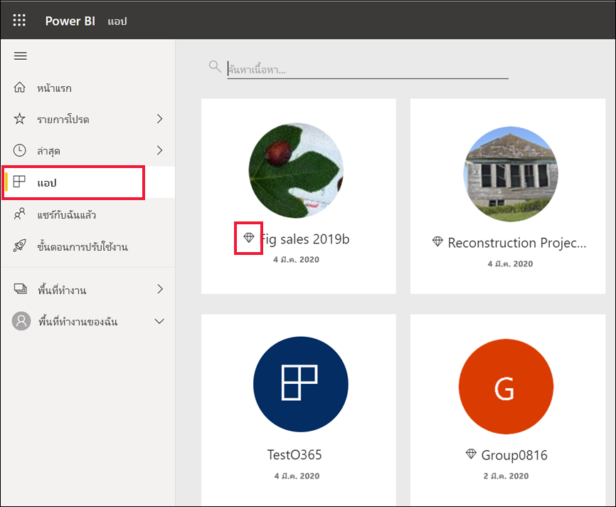
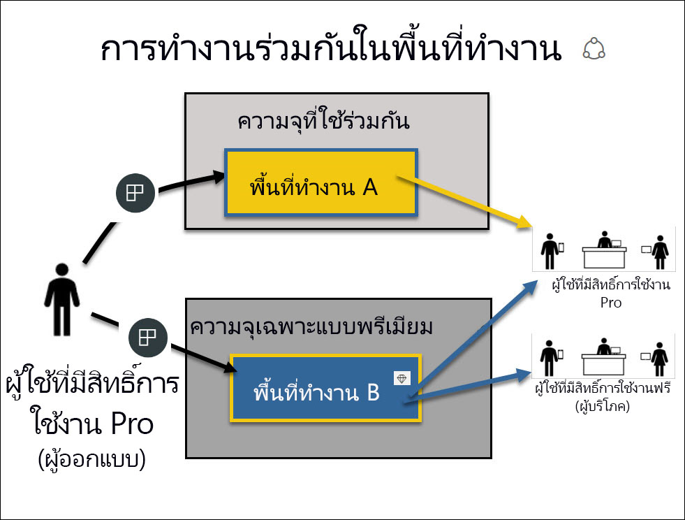

# สิทธิ์การใช้งานและการสมัครใช้งานสำหรับ *ผู้บริโภค*

[!INCLUDE[consumer-appliesto-ynnn](../includes/consumer-appliesto-ynnn.md)]

ในฐานะ[*ผู้บริโภค*](end-user-consumer.md) คุณใช้บริการ Power BI เพื่อสำรวจรายงานและแดชบอร์ดเพื่อใช้ในการข้อมูลช่วยตัดสินใจทางธุรกิจ หากคุณใช้ Power BI มาระยะหนึ่งแล้ว หรือกำลังคุยกับเพื่อนร่วมงานของคุณที่เป็น *ผู้ออกแบบ*  คุณอาจพบว่ามีคุณลักษณะบางอย่างที่ใช้งานได้เฉพาะเมื่อคุณมีสิทธิ์การใช้งาน การสมัครใช้งาน หรือการอนุญาตใช้งานบางประเภทเท่านั้น

ความสามารถในบริการของ Power BI ที่คุณสามารถใช้งานได้จะขึ้นอยู่กับสามสิ่งต่อไปนี้:
-    ประเภทของสิทธิการใช้งานและการสมัครสมาชิกที่คุณกำลังใช้
-    ที่จัดเก็บเนื้อหาและ
-    บทบาทและสิทธิ์ที่คุณได้รับมอบหมาย

ในบทความนี้ เราจะอธิบายความสามารถของสิทธิการใช้งานแต่ละประเภทและ *สถานที่เก็บเนื้อหา* สามารถส่งผลต่อ*สิ่งที่คุณสามารถทำได้*ได้อย่างไร และคุณยังจะได้เรียนรู้วิธีการค้นหาสิทธิการใช้งานและการสมัครใช้งานของคุณ รวมถึงคิดว่าคุณจัดเก็บเนื้อหาของคุณไว้ที่ไหน คุณสามารถดูข้อมูลเพิ่มเติมเกี่ยวกับบทบาทและสิทธิ์ได้ที่ [บทบาทของพื้นที่ทำงาน](end-user-workspaces.md)

## สิทธิ์การใช้งาน

ผู้ใช้บริการของ Power BI แต่ละรายมีสิทธิ์การใช้งานแบบ*ฟรี*หรือสิทธิ์การใช้งาน *Pro* หากคุณเป็น *ผู้บริโภค* ของ Power BI คุณอาจกำลังใช้สิทธิ์การใช้งานที่จัดการโดยผู้ดูแลระบบผู้เช่า Power BI ของคุณ

ซึ่งคุณสามารถมีสิทธิการใช้งานมากกว่าหนึ่งสิทธิในเวลาเดียวกัน  บริการจะมอบประสบการณ์การใช้งานตามสิทธิ์การใช้งานที่ดีที่สุดที่คุณมีคุณในปัจจุบันเสมอ

## ความจุ Power BI Premium

Premium คือการสมัครใช้งานเชิงองค์กรที่ใช้วิธีอื่นในการจัดเก็บเนื้อหา -- ในความจุเฉพาะ เมื่อใช้ Premium ทุกคนที่มีสิทธิ์ ไม่ว่าพวกเขาจะอยู่ภายในหรือภายนอกองค์กรของคุณ สามารถดูเนื้อหา Power BI ของคุณได้โดยไม่ต้องซื้อสิทธิ์การใช้งาน Power BI Pro เป็นรายบุคคล 

ความเป็นพรีเมียมช่วยให้ผู้ใช้แบบ Pro สามารถกระจายเนื้อหาได้อย่างกว้างขวางโดยผู้รับไม่ต้องมีใบอนุญาต Pro ในการดูเนื้อหา แต่ผู้สร้างเนื้อหายังคงต้องมีสิทธิการใช้งานแบบ Pro ผู้สร้างจะเชื่อมต่อกับแหล่งข้อมูล ข้อมูลแบบจำลอง และสร้างรายงานและแดชบอร์ดที่รวมเป็นแอปพื้นที่ทำงาน ผู้ใช้ที่ไม่มีสิทธิ์การใช้งานแบบ Pro ยังคงสามารถเข้าถึงพื้นที่ทำงานที่อยู่ในความจุ Power BI Premium ได้ ตราบใดที่พวกเขาได้รับมอบบทบาท [ ในพื้นที่ทำงานนั้น ](end-user-workspaces.md)

ภายในพื้นที่ทำงานเหล่านั้น นักออกแบบจะมอบหมายบทบาท เช่น **ผู้ชม** **ผู้สนับสนุน** **สมาชิก** และ**ผู้ดูแลระบบ** บทบาทเหล่านี้จะเป็นตัวกำหนดขอบเขตที่เพื่อนร่วมงานสามารถโต้ตอบกับเนื้อหาได้ สำหรับข้อมูลเพิ่มเติม โปรดอ่านที่[สิทธิ์และบทบาทของพื้นที่ทำงาน](end-user-workspaces.md) 

สำหรับข้อมูลเพิ่มเติมเกี่ยวกับความจุแบบพรีเมียม โปรดดูที่ [Microsoft Power BI Premium คืออะไร](../admin/service-premium-what-is.md)

## เพื่อดูว่าคุณมีสิทธิการใช้งานใดบ้าง

โปรดเยี่ยมชมหน้า [บัญชี Microsoft **ของฉัน**](https://portal.office.com/account) เพื่อดูว่ามีการมอบหมายสิทธิ์การใช้งานใดให้แก่คุณบ้าง  เลือกแท็บ**การสมัครใช้งาน**

Pradtanna ผู้ใช้รายแรกนี้มี Office 365 E5 ซึ่งรวมถึงสิทธิใช้งาน Power BI Pro

Zalan ผู้ใช้รายที่สองนี้มีสิทธิการใช้งาน Power BI ฟรี 

## เพื่อดูว่าคุณมีสิทธิ์เข้าถึงความจุแบบพรีเมียมหรือไม่

จากนั้นให้ตรวจสอบเพื่อดูว่าคุณเป็นส่วนหนึ่งขององค์กรที่มีความจุแบบพรีเมียมหรือไม่ ไม่ว่าจะเป็นผู้ใช้แบบ Pro หรือแบบฟรีก็สามารถเป็นบุคลกรขององค์กรที่มีสิทธิการใช้งานแบบพรีเมียมได้  โปรดตรวจสอบผู้ใช้รายที่สองของเรา Zalan  

เราสามารถตรวจสอบว่าองค์กรของ Zalan มีความจุแบบพรีเมียมหรือไม่ได้โดยการดูจำนวนที่เก็บข้อมูลที่พร้อมใช้งาน 

- ในบริการ Power BI ให้เลือก **พื้นที่ทำงานของฉัน** จากนั้นเลือกไอคอนฟันเฟืองจากมุมขวาบน เลือก**จัดการที่เก็บข้อมูลส่วนตัว**

    

    ถ้าคุณเห็นว่ามีมากกว่า 10 GB แสดงว่าคุณเป็นสมาชิกของบัญชีองค์กรที่มีสิทธิ์การสมัครใช้งานความจุแบบพรีเมียม รูปด้านล่างแสดงให้เห็นว่าองค์กรของ Zalan มีพื้นที่เก็บข้อมูลสูงสุดที่ 100 GB  

    

โปรดสังเกตว่าผู้ใช้ Pro ได้แชร์พื้นที่ทำงานกับ Zalan แล้ว ไอคอนรูปเพชรเป็นการแสดงให้เห็นว่าพื้นที่ทำงานนี้จัดเก็บไว้ในความจุแบบพรีเมียม 

## ค้นหาเนื้อหาที่โฮสต์อยู่ในความจุแบบพรีเมียม

อีกวิธีหนึ่งในการดูว่าองค์กรของคุณมีความจุแบบพรีเมียมหรือไม่ คือการค้นหาแอปและพื้นที่ทำงานของแอปที่มีไอคอนรูปเพชร ไอคอนรูปเพชรเป็นการแสดงให้เห็นว่าพื้นที่ทำงานนั้นจัดเก็บไว้ในความจุแบบพรีเมียม 

ดังรูปด้านล่างนี้ แอปสามแอปนี้จัดเก็บไว้ในความจุแบบพรีเมียม

ถ้าคุฯณเป็นเป็นผู้ใช้ที่มีสิทธิ์การใช้งานฟรี ตราบใดที่ *นักออกแบบ* วางพื้นที่ทำงานในความจุเฉพาะของแบบพรีเมียม คุณยังสามารถทำงาน**ภายในพื้นที่ทำงานนั้น**เพื่อดูเนื้อหาที่แชร์ ทำงานร่วมกับเพื่อนร่วมงาน ทำงานด้วยแอป แดชบอร์ด รายงาน และอื่นๆ อีกมากมายได้ ขอบเขตของสิทธิ์ของคุณจะขึ้นอยู่กับการตั้งค่าโดยผู้ดูแลระบบ Power BI และผู้ออกแบบเนื้อหาของคุณ

## ภาพรวมทั้งหมด

เมื่อองค์กรสมัครใช้งานความจุแบบพรีเมียมไว้ ผู้ดูแลระบบจะกำหนดสิทธิการใช้งานแบบ Pro ให้กับพนักงานที่ทำงาน สร้าง และแชร์เนื้อหาด้วยความจุแบบพรีเมียม ผู้ใช้ Pro สร้าง[พื้นที่ทำงาน](end-user-workspaces.md)และเพิ่มเนื้อหา (แดชบอร์ดรายงานแอป) ไปยังพื้นที่ทำงานเหล่านั้น เพื่อให้ผู้ใช้ฟรีสามารถทำงานร่วมกันในพื้นที่ทำงานเหล่านั้นได้ ผู้ดูแลระบบหรือผู้ใช้งานแบบ Pro จะกำหนดพื้นที่ทำงานไว้ใน*ความจุเฉพาะ*  

|ประเภทสิทธิการใช้งาน  |ความจุที่ใช้ร่วมกัน  |ความจุเฉพาะ  |
|---------|---------|---------|
|**แบบฟรี**     |  การใช้เป็น sandbox ส่วนบุคคลที่คุณสร้างเนื้อหาสำหรับตัวคุณเองและโต้ตอบกับเนื้อหานั้น สิทธิ์การใช้งานฟรีเป็นวิธีที่ยอดเยี่ยมในการทดลองใช้บริการของ Power BI คุณไม่สามารถใช้เนื้อหาจากบุคคลอื่นหรือแชร์เนื้อหาของคุณกับผู้อื่นได้ 1     |   โต้ตอบกับเนื้อหาที่มอบหมายให้ในความจุเฉพาะและใช้งานร่วมกันกับคุณ ผู้ใช้ทั้งแบบฟรีและปบบ Pro สามารถทำงานร่วมกันได้โดยไม่จำเป็นต้องให้ผู้ใช้แบบฟรีใช้งานบัญชี Pro      |
|**แบบ Pro**     |  ช่วยให้สามารถทำงานร่วมกับผู้ใช้ Pro รายอื่น ๆ ได้โดยการสร้างและแชร์เนื้อหา        |  ช่วยให้สามารถทำงานร่วมกับผู้ใช้แบบฟรีและแบบ Pro ได้โดยการสร้างและแชร์เนื้อหา       |

1 อ่านข้อมูลเพิ่มเติมที่[ข้อควรพิจารณาและการแก้ไขปัญหา](#considerations-and-troubleshooting)

ในไดอะแกรมด้านล่าง ด้านซ้ายจะแสดงผู้ใช้ Pro ที่สร้างและแชร์เนื้อหาในพื้นที่ทำงานแอป

- **พื้นที่ทำงาน A**ขององค์กรที่ไม่มีความจุแบบพรีเมียม

- **พื้นที่ทำงาน B** ถูกสร้างขึ้นในองค์กรที่ไม่มีการสมัครใช้งานแบบพรีเมียม พื้นที่ทำงานถูกบันทึกไว้ในความจุเฉพาะ พื้นที่ทำงานนี้มีไอคอนรูปเพชร  

    

*ผู้ออกแบบ* Power BI Pro สามารถแชร์และทำงานร่วมกับผู้ใช้แบบ Pro รายอื่นๆ ในพื้นที่ทำงานใดก็ได้ แต่วิธีเดียวที่ผู้ใช้ Power BI Pro สามารถแชร์และทำงานร่วมกันกับผู้ใช้แบบฟรีได้คือการใช้พื้นที่ทำงาน B ซึ่งอยู่ในความจุเฉพาะของแบบพรีเมียม  ภายในพื้นที่ทำงาน นักออกแบบจะกำหนดบทบาทให้ผู้ร่วมงานดังนี้: บทบาทของคุณกำหนดว่าการดำเนินการใดบ้างที่คุณสามารถใช้ได้ภายในพื้นที่ทำงาน *ผู้บริโภค* Power BI มักได้รับมอบหมายบทบาท*ผู้ชม* หากต้องการเรียนรู้เพิ่มเติมเกี่ยวกับบทบาท โปรดดู[พื้นที่ทำงานสำหรับผู้บริโภค Power BI](end-user-workspaces.md)

## ข้อควรพิจารณาและการแก้ไขปัญหา

- ซึ่งคุณอาจมีสิทธิการใช้งาน Power BI มากกว่าหนึ่งสิทธิ บริการของ Power BI จะมอบประสบการณ์การใช้งานตามสิทธิการใช้งานที่ดีที่สุดที่คุณมีคุณในปัจจุบันเสมอ เช่น ถ้าคุณมีสิทธิ์การใช้งานทั้งในแบบ Pro และแบบฟรี บริการของ Power BI จะใช้สิทธิการใช้งานแบบ Pro

- ถ้าคุณต้องการสร้างและแชร์เนื้อหา (แดชบอร์ด รายงาน แอป) หรือเปิดเนื้อหาที่บุคคลอื่นแชร์กับคุณ คุณจะต้องมีสิทธิ์การใช้งานผู้ใช้แบบ Pro คุณสามารถลงทะเบียนเพื่อทดลองใช้งาน Power BI Pro แบบ 60 วันโดยไม่เสียค่าใช้จ่าย เลือกกล่องโต้ตอบการอัปเกรดที่ปรากฏในบริการของ Power BI เมื่อคุณใช้คุณลักษณะแบบ Pro

    

  เมื่อการทดลองใช้ 60 วันหมดอายุ สิทธิการใช้งานของคุณจะเปลี่ยนกลับเป็นสิทธิ์การใช้งาน Power BI แบบฟรี หลังจากสิทธิ์การใช้งานกลับสู่สภาพเดิม คุณจะไม่สามารถเข้าถึงคุณลักษณะที่จำเป็นต้องมีสิทธิ์การใช้งาน Power BI Pro ได้ หากคุณต้องการใช้สิทธิ์การใช้งานแบบ Pro ต่อไป โปรดติดต่อผู้ดูแลระบบ หรือฝ่ายความช่วยเหลือด้าน IT ของคุณเพื่อการซื้อสิทธิ์การใช้งาน Power BI Pro ถ้าคุณไม่มีผู้ดูแลระบบหรือฝ่ายความช่วยเหลือด้าน IT โปรดเยี่ยมชม [หน้าแสดงรายการราคาของ Power BI](https://powerbi.microsoft.com/pricing/)

- ถ้าคุณลงทะเบียนสำหรับสิทธิ์การใช้งานฟรีด้วยตัวคุณเองโดยการเลือกปุ่มประเภท *ลองใช้ฟรี* สิทธิ์นั้นจะไม่มีวันหมดอายุ ดังนั้น ถ้าคุณอัปเกรดเป็น Pro รุ่นทดลองใช้ หรือองค์กรของคุณให้สิทธิ์การใช้งานแบบ Pro แก่คุณ แล้วช่วงทดลองใช้สิ้นสุดลง หรือองค์กรของคุณถอดสิทธิ์การใช้งานแบบ Pro ของคุณออก คุณจะยังคงกลับไปใช้สิทธิ์การใช้งานฟรีได้ - เว้นเสียแต่ว่าคุณจะยกเลิกสิทธิ์การใช้งาน

- 1 สิทธิการใช้งานผู้ใช้ Power BI แบบฟรีเหมาะสำหรับผู้ที่ต้องการดูหรือใช้สำหรับการวิเคราะห์ข้อมูลส่วนบุคคลและการแสดงภาพโดยใช้ **พื้นที่ทำงานของฉัน** ผู้ใช้ฟรีแบบสแตนด์อโลนไม่ต้องใช้ Power BI เพื่อทำงานร่วมกับเพื่อนร่วมงาน ผู้ใช้ฟรีแบบสแตนด์อโลนไม่สามารถดูเนื้อหาที่แชร์โดยผู้อื่น หรือแชร์เนื้อหาของตนเองกับผู้ใช้ Power BI รายอื่นได้

    

## ขั้นตอนถัดไป

- [ฉันเป็น*ผู้บริโภค*ของ Power BI หรือไม่](end-user-consumer.md)    
- [เรียนรู้เพิ่มเติมเรื่องพื้นที่ทำงาน](end-user-workspaces.md)    
- [ดูคุณลักษณะของ Power BI สำหรับผู้บริโภคตามประเภทสิทธิการใช้งาน](end-user-features.md)
