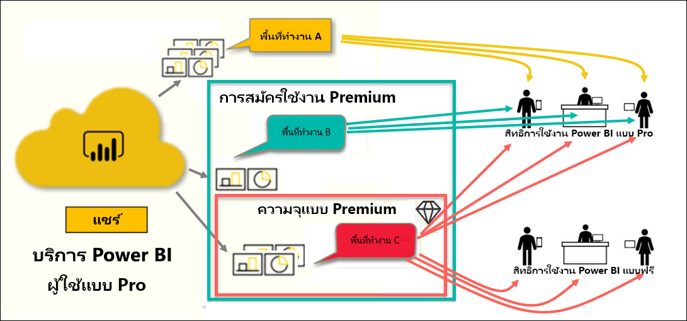

# ประเภทของสิทธิการใช้งาน Power BI

[!INCLUDE[consumer-appliesto-ynnn](../includes/consumer-appliesto-ynnn.md)]

ในฐานะ *ผู้บริโภค* คุณใช้บริการ Power BI เพื่อสำรวจรายงานและแดชบอร์ดเพื่อตัดสินใจทางธุรกิจ หากคุณใช้ Power BI มาระยะหนึ่งแล้ว หรือกำลังคุยกับเพื่อนร่วมงานของคุณที่เป็น *ผู้ออกแบบ*  คุณอาจพบว่ามีคุณลักษณะบางอย่างที่ใช้งานได้เฉพาะเมื่อคุณมีสิทธิ์การใช้งานหรือการสมัครใช้งานบางประเภทเท่านั้น 

บทความนี้อธิบายความแตกต่างระหว่างใบอนุญาตของผู้ใช้และการสมัครใช้งานขององค์กร รวมถึงวิธีการทำงานร่วมกัน: ความจุฟรี แบบ Pro แบบ Premium และความจุแบบพรีเมียม นอกจากนี้คุณยังจะได้เรียนรู้วิธีการพิจารณาว่าส่วนผสมของสิทธิ์การใช้งานและการสมัครใช้งานใดที่คุณใช้อยู่  

เราจะเริ่มต้นด้วยการดูสิทธิ์การใช้งานสองประเภท - สิทธิ์การใช้งานต่อหนึ่งผู้ใช้ และสิทธิ์การใช้งานองค์กร จุดเริ่มต้นของเราจะเป็นความสามารถเริ่มต้นที่พร้อมใช้งานในแต่ละสิทธิ์การใช้งาน จากนั้นเราจะดูว่าผู้ดูแลระบบ Power BI ของคุณและเจ้าของเนื้อหาสามารถใช้บทบาทและสิทธิ์ในการปรับเปลี่ยนความสามารถของสิทธิ์การใช้งานและการสมัตรใช้งานเริ่มต้นได้อย่างไร 

ตัวอย่างเช่น แม้ว่าสิทธ์การใช้งานของคุณอนุญาตให้ผู้ดูแลของคุณสามารถจำกัดความสามารถในการทำสิ่งต่างๆ เช่น ส่งออกข้อมูล ใช้คิวรีถามตอบแบบภาษาธรรมชาติ หรือเผยแพร่ทางเว็บ และเมื่อ *ผู้ออกแบบ* รายงาน กำหนดเนื้อหาไปยัง [พื้นที่ทำงาน](end-user-workspaces.md) พวกเขาสามารถมอบหมายให้คุณไปยังบทบาทพื้นที่ทำงานได้ บทบาทจะกำหนดสิ่งที่คุณสามารถและไม่สามารถทำได้ภายในพื้นที่ทำงานนั้น *นักออกแบบ*สามารถปรับขีดจำกัดของสิทธิ์การใช้งานของคุณได้โดยการตั้งค่าสิทธิ์ หรืออีกนัยหนึ่งคือ... เป็นเรื่องยุ่งยาก หวังว่าบทความนี้จะทำให้เกิดความเข้าใจได้มากที่สุดถ้าไม่ใช่ทั้งหมดจากความสับสน

## สิทธิ์การใช้งานของผู้ใช้
สิทธิ์การใช้งานชนิดแรกคือสิทธิ์การใช้งาน**ต่อผู้ใช้** ผู้ใช้ Power BI แต่ละรายมีสิทธิ์การใช้งานฟรีหรือสิทธิ์การใช้งาน Pro คุณลักษณะบางอย่างจะถูกสงวนไว้สำหรับผู้ใช้ที่มีใบอนุญาต Pro  

- **สิทธิ์การใช้งาน Power BI Pro (ไม่มีการสมัครใช้งานแบบพรีเมียม)** ช่วยให้ผู้ใช้สามารถทำงานร่วมกับผู้ใช้ Pro รายอื่นๆ ได้โดยการสร้างและแชร์เนื้อหา เฉพาะผู้ใช้ที่มีสิทธิการใช้งาน Pro เท่านั้นที่สามารถเผยแพร่รายงาน สมัครรับข้อมูลแดชบอร์ดและรายงาน และทำงานร่วมกับเพื่อนร่วมงานในพื้นที่ทำงาน 

    

    Power BI Pro เป็นสิทธิ์การใช้งานของผู้ใช้ส่วนบุคคล ที่อนุญาตให้ผู้ใช้อ่านและโต้ตอบกับรายงานและแดชบอร์ดที่ผู้ใช้อื่นเผยแพร่ไปยังบริการของ Power BI ผู้ใช้ที่มีสิทธิ์การใช้งานประเภทนี้สามารถแชร์เนื้อหาและทำงานร่วมกับผู้ใช้ Power BI Pro คนอื่นๆ ได้ เฉพาะผู้ใช้ที่มีสิทธิ์การใช้งาน Power BI Pro เท่านั้นที่สามารถเผยแพร่หรือแชร์เนื้อหากับผู้ใช้รายอื่นหรือนำเนื้อหาที่สร้างโดยผู้ใช้รายอื่นไปใช้ได้ ยกเว้นว่าเนื้อหานั้นโฮสต์อยู่ในความจุ Power BI Premium ข้อยกเว้นนี้คือเนื้อหาที่โฮสต์ใน[ความจุ Power BI Premium ](#understanding-premium-and-premium-capacity) สำหรับข้อมูลเพิ่มเติม โปรดดู [ความจุ Power BI Premium](#understanding-premium-and-premium-capacity) ด้านล่าง โดยทั่วไปแล้วสิทธิ์การใช้งานแบบ Pro จะใช้โดย*นักออกแบบ*รายงาน นักพัฒนา นักวิเคราะห์ และผู้ดูแลระบบ 

- **สิทธิ์ใช้งานฟรีของ Power BI แบบสแตนด์อโลน (ไม่มีการสมัครใช้งานแบบพรีเมียม)** ยังมีประสิทธิภาพ สำหรับผู้ใช้ที่เริ่มต้นใช้งาน Power BI หรือผู้ใช้ที่สร้างเนื้อหาด้วยตนเอง ดู [ลงทะเบียนใช้งานบริการ Power BI เป็นรายบุคคล](../service-self-service-signup-for-power-bi.md)   

    สิทธิการใช้งานผู้ใช้แบบฟรีเหมาะสำหรับคนที่ใช้ตัวอย่างของ Microsoft เพื่อเรียนรู้ Power BI ผู้ใช้ที่มีสิทธิการใช้งานแบบฟรีไม่สามารถดูเนื้อหาที่แชร์โดยผู้อื่นหรือแชร์เนื้อหาของตนเองกับผู้ใช้ Power BI อื่นได้ 

    

    ลูกค้าทั้งหมดที่มีสิทธิ์การใช้งานฟรี แบบสแตนด์อโลนสามารถอัพเกรดเป็น [การทดลองใช้สิทธิ์ Power BI Pro ฟรี](../service-self-service-signup-for-power-bi.md) การทดลองใช้งานจะให้คุณได้เข้าถึงการทำงานและฟังก์ชันทั้งหมดแบบผู้ใช้ Power BI Pro

    

- **สิทธิ์การใช้งาน Power BI ฟรีที่มีการสมัครใช้งานแบบพรีเมียม** เมื่อองค์กรมีการสมัครใช้งาน Premium ผู้ดูแลระบบและผู้ใช้ Pro สามารถกำหนดพื้นที่ทำงานให้ *ความจุแบบพรีเมียม* และให้สิทธิ์การเข้าถึงผู้ใช้ฟรีไปยังพื้นที่ทำงานเหล่านั้น พื้นที่ทำงานในความจุพรีเมียมคือช่องว่างที่ผู้ใช้ Pro สามารถแชร์และทำงานร่วมกับผู้ใช้ฟรี โดยไม่ต้องมีผู้ใช้ฟรีที่มีบัญชี Pro ภายในพื้นที่ทำงานเหล่านั้น ผู้ใช้ฟรีมีสิทธิ์การยกระดับ พวกเขาสามารถทำงานร่วมกันและแบ่งปัน ส่งออกข้อมูล สมัครสมาชิก โต้ตอบกับตัวกรอง และอื่นๆ ได้อีกมากมาย 

จนถึงตอนนี้คุณเข้าใจชัดเจนดีไหม  เอาล่ะ ลองมาดู **ความจุแบบพรีเมียม** อย่างละเอียดกันเถอะ

## เข้าใจการใช้งาน Premium และความจุแบบพรีเมียม
Premium คือการสมัครใช้งานแบบ**องค์กร** คิดว่าเหมือนเป็นการเพิ่มเลเยอร์ของฟีเจอร์และฟังก์ชันการทำงานที่ด้านบนของใบอนุญาตในองค์กร Power BI **ต่อผู้ใช้** 

เมื่อองค์กรซื้อสิทธิ์การใช้งาน Premium ผู้ดูแลระบบจะกำหนดสิทธิ์การใช้งาน Pro ให้กับพนักงานที่จะสร้างและแชร์เนื้อหา และผู้ดูแลระบบกำหนดสิทธิการใช้งานฟรีให้กับทุกคนที่จะใช้เนื้อหานั้น ผู้ใช้ Pro สร้าง [พื้นที่ทำงานแอป](end-user-workspaces.md) และเพิ่มเนื้อหา (แดชบอร์ด รายงาน แอป) ไปยังพื้นที่ทำงานเหล่านั้น เพื่อให้ผู้ใช้ฟรีสามารถทำงานร่วมกันในพื้นที่ทำงานเหล่านั้น ผู้ดูแลระบบหรือผู้ใช้ Pro จะบันทึกพื้นที่ทำงานใน *ความจุแบบพรีเมียม* 

เมื่อองค์กรซื้อสิทธิ์การใช้งานความจุพรีเมียม พวกเขาจะได้รับความจุในบริการ Power BI ที่จัดสรรให้โดยเฉพาะ ไม่มีการใช้งานร่วมกันโดยองค์กรอื่น ความจุได้รับการสนับสนุนโดยฮาร์ดแวร์ที่จัดการโดย Microsoft แต่เพียงผู้เดียว องค์กรสามารถเลือกที่จะใช้ความจุเฉพาะของตนหรือจัดสรรให้กับพื้นที่ทำงานเฉพาะได้ องค์กรอาจมีพื้นที่ทำงานทั้งหมดหรือบางส่วนเท่านั้น คุณสามารถระบุพื้นที่ทำงานในความจุแบบพรีเมียมด้วยไอคอนเพชร .  พื้นที่ทำงานในความจุพรีเมียมคือช่องว่างที่ผู้ใช้ Pro สามารถแชร์และทำงานร่วมกับผู้ใช้ฟรี โดยไม่ต้องมีผู้ใช้ฟรีที่มีบัญชี Pro 

ในความจุแบบพรีเมียม สิทธิ์การใช้งาน Pro จะยังคงจำเป็นสำหรับนักออกแบบเนื้อหา ผู้ออกแบบจะสร้างแอปและพื้นที่ทำงาน จะเชื่อมต่อกับแหล่งข้อมูล ข้อมูลแบบจำลอง และจะสร้างรายงานและแดชบอร์ดที่ใช้ร่วมกันได้โดยตรง หรือรวมกันและแชร์เป็นแอป ผู้ใช้ที่ไม่มีสิทธิ์การใช้งาน Pro ยังคงสามารถเข้าถึงพื้นที่ทำงานแอปที่อยู่ใน Power BI Premium ได้ตราบใดที่พื้นที่ทำงานนั้นอยู่ใน *ความจุ* แบบพรีเมียม และตราบใดที่เจ้าของพื้นที่ทำงานให้สิทธิ์การใช้งาน

ในไดอะแกรมด้านล่าง ด้านซ้ายจะแสดงผู้ใช้ Pro ที่สร้างและแชร์เนื้อหาในพื้นที่ทำงานแอป 

- **พื้นที่ทำงาน A** ถูกสร้างขึ้นในองค์กรที่ไม่มีการสมัครใช้งานแบบพรีเมียม 

- **พื้นที่ทำงาน B** ถูกสร้างขึ้นในองค์กรที่มีการสมัครใช้งานแบบพรีเมียม แม้จะไม่มีการบันทึกพื้นที่ทำงานเฉพาะนี้ในความจุแบบพรีเมียม ถ้าพื้นที่ทำงานไม่มีไอคอนรูปข้าวหลามตัด

- **พื้นที่ทำงาน B** ถูกสร้างขึ้นในองค์กรที่มีการสมัครใช้งานแบบพรีเมียม และมีการบันทึกในความจุแบบพรีเมียม ถ้าพื้นที่ทำงานไม่มีไอคอนรูปข้าวหลามตัด  

*ผู้ออกแบบ* Power BI Pro สามารถแชร์และทำงานร่วมกับผู้ใช้ Pro รายอื่นๆ โดยใช้พื้นที่ทำงานใดก็ได้ในสามแบบนั้น ตราบใดที่ตัวออกแบบแชร์พื้นที่ทำงานกับทั้งองค์กรหรือกำหนดบทบาทพื้นที่ทำงานให้กับผู้ใช้ Pro 

ผู้ใช้ Power BI Pro สามารถแชร์และทำงานร่วมกันกับผู้ใช้ฟรีโดยใช้พื้นที่ทำงาน C เท่านั้น ต้องกำหนดพื้นที่ทำงานให้กับความจุพรีเมียมสำหรับผู้ใช้ฟรีเพื่อให้สามารถเข้าถึงพื้นที่ทำงานได้ ภายในพื้นที่ทำงาน นักออกแบบจะกำหนดบทบาทให้ผู้ร่วมงานดังนี้: *ผู้ชม* *สมาชิก* *ผู้สนับสนุน* หรือ*ผู้ดูแลระบบ* บทบาทของคุณกำหนดว่าการดำเนินการใดบ้างที่คุณสามารถใช้ได้ภายในพื้นที่ทำงาน *ผู้บริโภค* Power BI มักได้รับมอบหมายบทบาท*ผู้ชม* หากต้องการเรียนรู้เพิ่มเติม โปรดดู[พื้นที่ทำงาน สำหรับผู้บริโภค Power BI](end-user-workspaces.md)

## ค้นหาใบอนุญาตและการสมัครใช้งานที่คุณมี
มีหลายวิธีในการค้นหาข้อมูลสิทธิการใช้งาน Power BI ของคุณ 

ก่อนอื่นให้พิจารณาว่าสิทธิการใช้งาน **ผู้ใช้** แบบใด

- Microsoft Office บางเวอร์ชันมีสิทธิการใช้งาน Power BI Pro  เมื่อต้องการดูว่า Office เวอร์ชันของคุณมี Power BI หรือไม่ ให้เยี่ยมชม [พอร์ทัล Office](https://portal.office.com/account) และเลือก**การสมัครใช้งาน**

    Pradtanna ผู้ใช้รายแรกนี้มี Office 365 E5 ซึ่งรวมถึงสิทธิใช้งาน Power BI Pro

    

    Zalan ผู้ใช้รายที่สองนี้มีสิทธิการใช้งาน Power BI ฟรี 

    

ถัดไป ตรวจสอบเพื่อดูว่าบัญชีของคุณมีสิทธิการใช้งานความจุแบบพรีเมียมหรือไม่ ผู้ใช้รายใดรายหนึ่งข้างต้น Pro หรือฟรี อาจเป็นคนขององค์กรที่มีสิทธิการใช้งานแบบพรีเมียม  โปรดตรวจสอบผู้ใช้รายที่สองของเรา Zalan  

- ในบริการ Power BI ให้เลือก **พื้นที่ทำงานของฉัน** จากนั้นเลือกไอคอนฟันเฟืองจากมุมขวาบน เลือก**จัดการที่เก็บข้อมูลส่วนตัว**

    

    สิทธิ์การใช้งาน**ต่อผู้ใช้** Pro หรือฟรีมอบพื้นที่เก็บข้อมูลขนาด 10 GB ในระบบคลาวด์ที่สามารถใช้สำหรับโฮสต์รายงาน Power BI หรือเวิร์กบุ๊ก Excel ได้ ถ้าคุณเห็นมากกว่า 10 GB แสดงว่าคุณเป็นสมาชิกของบัญชีองค์กรที่มีสิทธิ์การใช้งานความจุแบบพรีเมียม

    

    โปรดจำไว้ว่าบนหน้าพอร์ทัล Office การสมัครสมาชิกผู้ใช้ของ Zalan คือเป็นสำหรับ Power BI (ฟรี) แต่เนื่องจากองค์กรของเขาซื้อสิทธิ์การใช้งาน Premium ในบริการของ Power BI Zalan ไม่ได้จำกัดเฉพาะการจัดเก็บข้อมูล10GB เขามี100GB ที่พร้อมใช้งาน ในฐานะที่เป็น*ผู้บริโภค*ในองค์กรที่มีสิทธิ์การใช้งานแบบ Premium ตราบใดที่*นักออกแบบ*วางพื้นที่ดำเนินการในความจุพรีเมียม Zalan มีความสามารถในการดูเนื้อหาที่แชร์ทำงานร่วมกับผู้ร่วมสร้างที่ใช้กับแอปและอื่นๆ อีกมากมาย ขอบเขตของสิทธิ์ของเขาได้รับการตั้งค่าโดยผู้ดูแลระบบ Power BI ของเขา โปรดสังเกตว่าผู้ใช้ Pro ได้แชร์พื้นที่ทำงานกับ Zalan แล้ว ไอคอนรูปข้าวหลามตัดช่วยให้เขาทราบว่าพื้นที่ทำงานนี้จะถูกจัดเก็บไว้ในความจุพรีเมียม 

   
## การทำความเข้าใจบทบาทพื้นที่ทำงาน
ดังนั้นเราจึงได้ตรวจทานสิทธิ์การใช้งานสำหรับแต่ละคนใบอนุญาต Premium และความจุพรีเมียม ตอนนี้มาดูที่บทบาท*พื้นที่ทำงาน*กัน

เนื่องจากนี่เป็นบทความสำหรับ*ผู้บริโภค* Power BI เรามีสถานการณ์สมมติต่อไปนี้:

-  คุณเป็นผู้ใช้*ฟรี*ภายในองค์กรที่มีสิทธิ์การใช้งาน Power BI Premium 
- ผู้ใช้ Power BI Pro สร้างคอลเลกชันของแดชบอร์ดและรายงานและเผยแพร่คอลเลกชันนี้เป็น*แอป*ไปยังทั้งองค์กรของคุณ  
- มีแอปที่อยู่ภายใน*พื้นที่ทำงาน*และพื้นที่ดำเนินการอยู่ในความจุพรีเมียม    
- พื้นที่ทำงานของแอปนี้มีหนึ่งแดชบอร์ดและสองรายงาน
- ผู้ใช้ Pro ได้กำหนดบทบาท**บทบาท**ให้กับเรา

### บทบาทผู้ชม
บทบาทช่วยให้คุณจัดการว่าใครสามารถทำอะ*ไรในพื้นที่ทำงาน* เพื่อให้ทีมสามารถทำงานร่วมกัน หนึ่งในบทบาทเหล่านั้นคือ**ผู้ชม** 

เมื่อพื้นที่ทำงานอยู่ในความจุ Power BI Premium ผู้ใช้ที่ มีบทบาทเป็นผู้ชมสามารถเข้าถึงพื้นที่ทำงานได้แม้ว่าพวกเขาไม่มีสิทธิ์การใช้งาน Power BI Pro แต่เนื่องจากบทบาทผู้ชมไม่สามารถเข้าถึงหรือส่งออกข้อมูลเบื้องต้นเป็นวิธีที่ปลอดภัยในการโต้ตอบกับแดชบอร์ดรายงานและแอป

> [!TIP]
> หากต้องการเรียนรู้เกี่ยวกับบทบาทอื่นๆ (ผู้ดูแลระบบ สมาชิก และผู้สนับสนุน) โปรดดู[สร้างพื้นที่ทำงานใหม่](../service-new-workspaces.md)

## ขั้นตอนถัดไป
[ฉันเป็น*ผู้บริโภค*ของ Power BI หรือไม่](end-user-consumer.md)    
เรียนรู้เพิ่มเติมเกี่ยวกับ [พื้นที่ทำงาน](end-user-workspaces.md)    
<!--[View Power BI features by license type](end-user-features.md) -->

