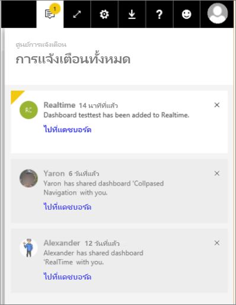

# ดูการแจ้งเตือน Power BI

[!INCLUDE [power-bi-service-new-look-include](../includes/power-bi-service-new-look-include.md)]

ศูนย์การแจ้งเตือนคือ ตัวดึงข้อมูลตามลำดับที่เกี่ยวข้องกับประสบการณ์การใช้งาน Power BI ของคุณ เปิดเพื่อดูข้อความเกี่ยวกับแดชบอร์ดใหม่ที่มีการแชร์กับคุณ รายละเอียดเกี่ยวกับเหตุการณ์และการประชุมใน Power BI การแจ้งเตือนที่คุณได้ตั้งค่า และอื่น ๆ คุณสามารถเลือก[ตั้งค่าการแจ้งเตือนในบริการ Power BI](end-user-alerts.md)ได้ รวมถึงในแอปฯมือถือ Power BI ได้เช่นกัน

ดูการตรวจสอบ การจัดการ และการตอบสนองต่อการแจ้งเตือนของ Amanda จากนั้นทำตามคำแนะนำในวิดีโอด้านล่างทีละขั้นเพื่อลองทำด้วยตนเอง    

> [!NOTE]
> วิดีโอนี้แสดงบริการ Power BI รุ่นเก่า 

<iframe width="560" height="315" src="https://www.youtube.com/embed/bZMSv5KAlcE" frameborder="0" allowfullscreen></iframe>

## ดูการแจ้งเตือนของคุณ
1. เมื่อคุณเข้าสู่ระบบ Power BI การแจ้งเตือนใหม่ใด ๆ ที่ถูกส่งถึงคุณในขณะที่คุณออฟไลน์ จะถูกเพิ่มเข้าไปยังตัวดึงข้อมูลของคุณด้วย ถ้าคุณมีการแจ้งเตือนใหม่ Power BI แสดงฟองอากาศสีเหลืองด้วยจำนวนของรายการใหม่
   
   
2. จากแถบเมนู Power BI เลือกไอคอน**การแจ้งให้ทราบ**
   
   
3. การแจ้งเตือนจะแสดงรายการล่าสุดที่ด้านบนสุด รวมถึงไฮไลท์ข้อความที่ยังไม่ได้อ่าน การแจ้งเตือนจะถูกเก็บไว้เป็น 90 วัน เว้นแต่ว่าคุณลบเร็วกว่านั้น หรือถึงขีดจำกัดสูงสุด 100 การแจ้งเตือน
   
   
4. เมื่อต้องการปิดการแจ้งเตือน เลือกไอคอน X

## ขั้นตอนถัดไป
* [การแจ้งเตือนข้อมูลในบริการของ Power BI](end-user-alerts.md)
* [ตั้งค่าการแจ้งเตือนข้อมูลในแอปบน iPhone (Power BI สำหรับ iOS)](mobile/mobile-set-data-alerts-in-the-mobile-apps.md)
* [ตั้งค่าการแจ้งเตือนข้อมูลในแอปฯมือถือ Power BI สำหรับ Windows 10](mobile/mobile-set-data-alerts-in-the-mobile-apps.md)
* มีคำถามเพิ่มเติมหรือไม่ [ลองไปที่ชุมชน Power BI](https://community.powerbi.com/)

