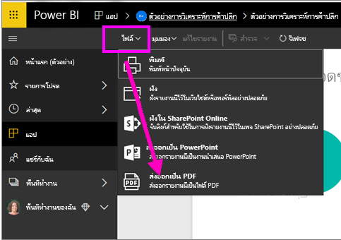
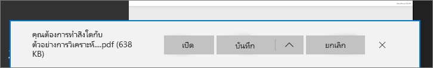

# ส่งออกรายงานจาก Power BI เป็น PDF
ด้วย Power BI คุณสามารถเผยแพร่รายงานของคุณเป็นรูปแบบ PDF และสร้างเอกสารโดยตามยึดรายงาน Power BI ของคุณ เมื่อคุณ**ส่งออกเป็น PDF**แต่ละหน้าในรายงาน Power BI จะกลายเป็นหน้าใดหน้าหนึ่งในเอกสาร PDF ของคุณ

## วิธีการส่งออกรายงาน Power BI ของคุณเป็น PDF
ในบริการของ Power BI เลือกรายงานที่จะแสดงบนพื้นที่ คุณยังสามารถเลือกรายงานจากหน้าแรก หน้าเพจ แอป หรือส่วนอื่น ๆ บนแถบนำทางด้านซ้ายของคุณได้

1. เลือก**แฟ้ม** > **ส่งออกเป็น PDF**จากแถบเมนู

    

    แถบความคืบหน้าแสดงอยู่ที่มุมบนขวา การส่งออกอาจใช้เวลาสักครู่ และคุณสามารถทำงานต่อใน Power BI ขณะที่กำลังส่งออกรายงาน

    

    เมื่อเสร็จสมบูรณ์ แบนเนอร์การแจ้งเตือนจะเปลี่ยนให้คุณทราบว่า Power BI service ได้เสร็จสิ้นกระบวนการส่งออกแล้ว

2. ไฟล์ของคุณพร้อมแล้วในเบราว์เซอร์ที่แสดงไฟล์ที่ดาวน์โหลด ในรูปต่อไปนี้ จะแสดงเป็นแบนเนอร์ดาวน์โหลดชิดด้านล่างของหน้าต่างเบราว์เซอร์

    

และมีแค่นั้น คุณสามารถดาวน์โหลดไฟล์ และเปิดไฟล์นั้นกับตัวแสดง PDF เช่นเดียวกับที่มีอยู่ใน Microsoft Edge

## ข้อจำกัดและข้อควรพิจารณา
มีข้อควรพิจารณาและข้อจำกัดสองสามข้อที่ควรทราบเมื่อทำงานร่วมกับคุณสมบัติ**ส่งออกเป็น PDF**

- ในเซสชันโต้ตอบเช่น การไฮไลท์และการคัดกรอง การดูรายละเอียดแนวลึก และอื่นๆ จะยังไม่รองรับเมื่อส่งออกเป็น PDF PDF ที่ส่งออกจะแสดงภาพต้นฉบับเมื่อบันทึกไว้ในรายงาน ถ้าคุณได้ใช้ตัวกรองหรือตัวแบ่งส่วนข้อมูล และต้องการเก็บข้อมูลเหล่านี้ไว้เพื่อการส่งออก ให้คุณบันทึกรายงาน และจากนั้นทำการส่งออก

* **ภาพ R**ไม่มีการรองรับในปัจจุบัน ใน PDF ภาพเหล่านี้จะว่างเปล่า และแสดงข้อความข้อผิดพลาด  

* **ภาพวิชวลแบบกำหนดเอง**ที่ได้รับการ**รับรอง**นั้นได้การสนับสนุน สำหรับข้อมูลเพิ่มเติมเกี่ยวกับภาพวิชวลแบบกำหนดเองที่ได้การรับรอง รวมถึงวิธีการรับภาพวิชวลแบบกำหนดเองที่ได้รับการรับรอง ให้ดู[รับภาพวิชวลแบบกำหนดเองที่ได้รับการรับรอง](../power-bi-custom-visuals-certified.md) ไม่สนับสนุนภาพแบบกำหนดเองที่ไม่ได้รับการรับรอง ใน PDF ภาพเหล่านี้จะแสดงพร้อมด้วยข้อความข้อผิดพลาด   

* รายงานที่มีหน้ารายงานเกิน 30 หน้าไม่สามารถส่งออกได้ในขณะนี้

* ขั้นตอนการส่งออกรายงานเป็น PDF อาจใช้เวลาสักครูจนกว่าจะเสร็จสมบูรณ์ ดังนั้นโปรดรอสักครู่ ปัจจัยที่สามารถส่งผลกระทบต่อเวลาจำเป็นต้องมีโครงสร้างของรายงาน และมีการโหลดบน Power BI service ปัจจุบัน

* หากรายการเมนู**ส่งออกเป็น PDF** ไม่พร้อมใช้งานในบริการของ Power BI อาจเป็นไปได้ว่าผู้ดูแลระบบผู้เช่าของคุณได้ปิดใช้งานคุณสมบัตินี้ ติดต่อผู้ดูแลระบบผู้เช่าของคุณสำหรับรายละเอียด

* ภาพพื้นหลังจะถูกตัดรูปด้วยพื้นที่ที่กำหนดขอบเขตของแผนภูมิ ขอแนะนำให้ลบรูปพื้นหลังก่อนที่ส่งออกเป็น PDF

* รายงานที่มีเจ้าของเป็นผู้ใช้ภายนอกโดเมนผู้เช่า Power BI ของคุณ (เช่น รายงานที่มีบุคคลภายนอกองค์กรของคุณเป็นเจ้าของ และถูกแชร์ให้คุณ) ไม่สามารถเผยแพร่เป็น PDF ได้

* ถ้าคุณแชร์แดชบอร์ดกับบุคคลภายนอกองค์กรของคุณ (และดังนั้น ผู้ใช้ที่ไม่อยู่ในผู้เช่า Power BI ของคุณ) ผู้ใช้รายนั้นจะไม่สามารถส่งรายงานที่เกี่ยวข้องของแดชบอร์ดที่แชร์เป็น PDF ได้ ตัวอย่างเช่น ถ้าคุณเป็นเช่นนั้น aaron@contoso.comคุณสามารถแชร์ให้cassie@cohowinery.comได้ แต่cassie@cohowinery.comไม่สามารถส่งรายงานที่เกี่ยวข้องเป็น PDF ได้

* บริการของ Power BI ใช้การตั้งค่าภาษาของ Power BI เป็นภาษาสำหรับการส่งออกเป็น PDF เพื่อดูหรือตั้งค่าการกำหนดลักษณะภาษาของคุณ ให้เลือกไอคอนรูปเฟือง **การตั้งค่า** > **ทั่วไป** > **ภาษา**

## ขั้นตอนถัดไป
[พิมพ์หน้ารายงาน](end-user-print.md)