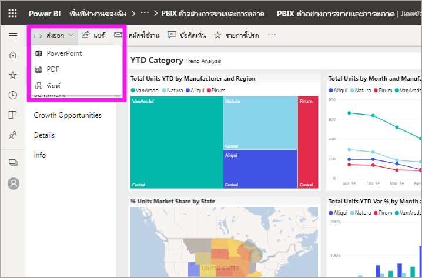
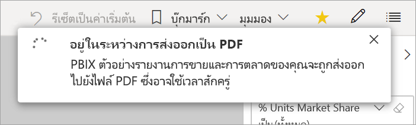

# ส่งออกรายงานจาก Power BI เป็น PDF

[!INCLUDE [power-bi-service-new-look-include](../includes/power-bi-service-new-look-include.md)]

ขณะใช้ Power BI คุณสามารถเผยแพร่รายงานของคุณเป็นเอกสาร PDF และจัดทำเอกสารได้ง่าย ๆ ตามรายงาน Power BI ของคุณ เมื่อคุณส่งออกเป็น PDF แต่ละหน้าในรายงาน Power BI จะกลายเป็นหน้าใดหน้าหนึ่งในเอกสาร PDF ของคุณ

## ส่งออกรายงาน Power BI ของคุณเป็น PDF
ในบริการ Power BI เลือกรายงานที่จะแสดงบนพื้นที่ คุณยังสามารถเลือกรายงานจาก**หน้าแรก** หน้าเพจ **แอป** หรือคอนเทนเนอร์อื่นจากบนบานหน้าต่างนำทางได้

1. เลือก**ส่งออก** > **PDFจาก**แถบเมนู

    

    ป็อปอัพจะปรากฏในที่ซึ่งคุณมีตัวเลือกที่จะเลือก**ค่าปัจจุบัน** หรือ**ค่าเริ่มต้น** **ค่าปัจจุบัน**ส่งออกรายงานในสถานะปัจจุบัน ซึ่งรวมถึงการเปลี่ยนแปลงที่ใช้งานอยู่ที่คุณทำกับตัวแบ่งส่วนข้อมูลและตัวกรอง ผู้ใช้งานส่วนใหญ่เลือกตัวเลือกนี้ ในทางกลับกัน การเลือก**ค่าเริ่มต้น**จะส่งออกรายงานในสถานะดั้งเดิม(ตามที่*ผู้เขียน*แบ่งปันข้อมูล) และไม่มีผลต่อการเปลี่ยนแปลงใดๆ ที่คุณทำกับสถานะดั้งเดิมนั้น
    
    นอกจากนี้ ยังมีกล่องกาเครื่องหมายเพื่อเลือกว่าจะส่งออกแท็บที่ซ่อนรายงานไว้หรือไม่ เลือกช่องทำเครื่องหมายนี้หากคุณต้องการส่งออกเฉพาะแท็บรายงานที่ปรากฏขึ้นสำหรับคุณในเบราเซอร์ หากต้องการรับแท็บซ่อนทั้งหมดเป็นส่วนหนึ่งในข้อมูลส่งออก คุณจะต้องไม่ทำเครื่องหมายในช่องนี้ ถ้ากล่องกาเครื่องหมายเป็นสีเทา แสดงว่าไม่มีแท็บที่ซ่อนอยู่ในรายงาน เมื่อคุณได้ทำการเลือกของคุณแล้ว เลือก**ส่งออก**เพื่อดำเนินต่อ
    
    แถบความคืบหน้าแสดงอยู่ที่มุมบนขวา การส่งออกนี้อาจใช้เวลาสักครู่ คุณสามารถทำงานใน Power BI ในขณะที่กำลังส่งออกรายงาน

    

    หลังจากบริการ Power BI สิ้นสุดการส่งออก แบนเนอร์แจ้งเตือนจะเปลี่ยนไปเพื่อแจ้งให้คุณทราบ

2. ไฟล์ของคุณพร้อมแล้วในเบราว์เซอร์ที่แสดงไฟล์ที่ดาวน์โหลด ในรูปต่อไปนี้ จะแสดงเป็นแบนเนอร์ดาวน์โหลดชิดด้านล่างของหน้าต่างเบราว์เซอร์

    

และมีแค่นั้น คุณสามารถดาวน์โหลดไฟล์ และเปิดไฟล์นั้นกับตัวแสดง PDF เช่นเดียวกับที่มีอยู่ใน Microsoft Edge

## ข้อจำกัดและข้อควรพิจารณา
มีข้อควรพิจารณาและข้อจำกัดสองสามข้อที่ควรทราบเมื่อทำงานร่วมกับคุณสมบัติ**ส่งออกเป็น PDF**

* ส่วนแสดงผล R ปัจจุบันไม่รองรับ ใน PDF ภาพเหล่านี้จะว่างเปล่า และแสดงข้อความข้อผิดพลาด 
* รองรับส่วนแสดงผลกำหนดเองที่ผ่านการรับรองแล้ว สำหรับข้อมูลเพิ่มเติมเกี่ยวกับภาพวิชวลแบบกำหนดเองที่ได้การรับรอง รวมถึงวิธีการรับภาพวิชวลแบบกำหนดเองที่ได้รับการรับรอง ให้ดู[รับภาพวิชวลแบบกำหนดเองที่ได้รับการรับรอง](../developer/power-bi-custom-visuals-certified.md) ไม่สนับสนุนภาพแบบกำหนดเองที่ไม่ได้รับการรับรอง ใน PDF ภาพเหล่านี้จะแสดงพร้อมด้วยข้อความข้อผิดพลาด 
* รายงานที่มีหน้ารายงานเกิน 30 หน้าไม่สามารถส่งออกได้ในขณะนี้
* ขั้นตอนการส่งออกรายงานเป็น PDF อาจใช้เวลาสักครูจนกว่าจะเสร็จสมบูรณ์ ดังนั้นโปรดรอสักครู่ ปัจจัยที่สามารถส่งผลกระทบต่อเวลาจำเป็นต้องมีโครงสร้างของรายงาน และมีการโหลดบน Power BI service ปัจจุบัน
* หากรายการเมนู**ส่งออกเป็น PDF** ไม่พร้อมใช้งานในบริการของ Power BI อาจเป็นไปได้ว่าผู้ดูแลระบบผู้เช่าของคุณได้ปิดใช้งานคุณสมบัตินี้ ติดต่อผู้ดูแลระบบผู้เช่าของคุณสำหรับรายละเอียด
* ภาพพื้นหลังจะถูกตัดรูปด้วยพื้นที่ที่กำหนดขอบเขตของแผนภูมิ แนะนำให้คุณลบภาพพื้นหลังก่อนส่งออกเป็นไฟล์ PDF
* รายงานที่มีเจ้าของเป็นผู้ใช้ภายนอกโดเมนผู้เช่า Power BI ของคุณ เช่น รายงานที่มีบุคคลภายนอกองค์กรของคุณเป็นเจ้าของ และถูกแชร์ให้คุณ ไม่สามารถเผยแพร่เป็น PDF ได้
* ถ้าคุณแชร์แดชบอร์ดกับบุคคลภายนอกองค์กรของคุณ (และดังนั้น ผู้ใช้ที่ไม่อยู่ในผู้เช่า Power BI ของคุณ) ผู้ใช้รายนั้นจะไม่สามารถส่งรายงานที่เกี่ยวข้องของแดชบอร์ดที่แชร์เป็น PDF ได้ ตัวอย่างเช่น ถ้าคุณเป็นเช่นนั้น aaron@contoso.comคุณสามารถแชร์ให้cassie@cohowinery.comได้ แต่cassie@cohowinery.comไม่สามารถส่งรายงานที่เกี่ยวข้องเป็น PDF ได้
* ขณะส่งออกเป็นไฟล์ PDF พร้อมรายงานที่มีภาพพื้นหลัง คุณอาจพบภาพปผิดเพี้ยนในผลงานส่งออกหากใช้ **ปกติ** หรือ **เติม** สำหรับ **พื้นหลังหน้าเอกสาร** เพื่อให้ได้ผลลัพธ์ดีที่สุด ใช้ตัวเลือก **ปรับพอดี** เพื่อป้องกันปัญหากับเอกสารที่คุณส่งออก
* บริการของ Power BI ใช้การตั้งค่าภาษาของ Power BI เป็นภาษาสำหรับการส่งออกเป็น PDF ดูหรือตั้งค่าภาษาของคุณโดยเลือกไอคอนรูปเฟือง  > **การตั้งค่า** > **ทั่วไป** > **ภาษา**
* ตัวกรอง URL จะไม่ถูกนำมาพิจารณาหากคุณเลือก **ค่าปัจจุบัน** สำหรับการส่งออกของคุณ
* รายงานที่มีขนาดหน้ากระดาษแบบกำหนดเองที่ไม่ปกติอาจประสบปัญหาในสถานการณ์การส่งออก เพื่อให้ได้ผลลัพธ์ที่ดีที่สุด ให้ลองสลับไปยังขนาดหน้ากระดาษมาตรฐานสำหรับรายงานของคุณ
* เมื่อส่งออกเป็น PDF แล้ว รายงานที่ใช้ธีมที่มีแบบอักษรที่กำหนดเองจะมีการแทนที่แบบอักษรที่กำหนดเองด้วยแบบอักษรเริ่มต้น
* ในขณะที่เรากำลังมองหาประสบการณ์ที่สอดคล้องกัน เราไม่สามารถรับประกันว่า PDF ที่ส่งออกจากบริการของ Power BI จะตรงกับ PDF ที่ส่งออกจากไฟล์ Power BI Desktop ภายในเครื่องเสมอ

## ขั้นตอนถัดไป
[พิมพ์หน้ารายงาน](end-user-print.md)
