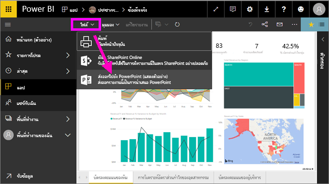
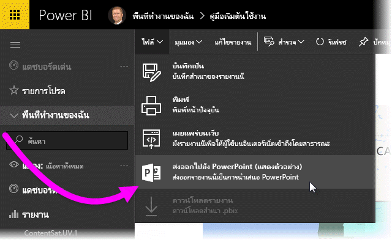
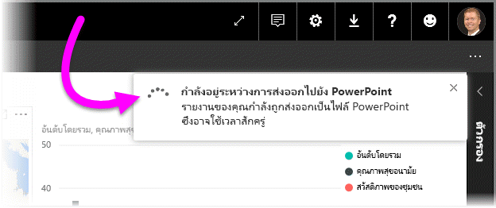
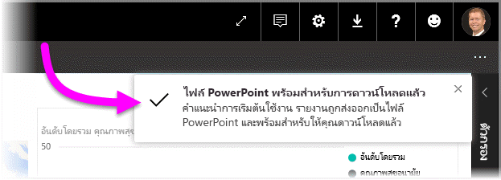
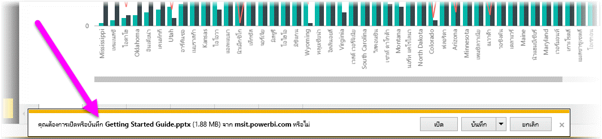
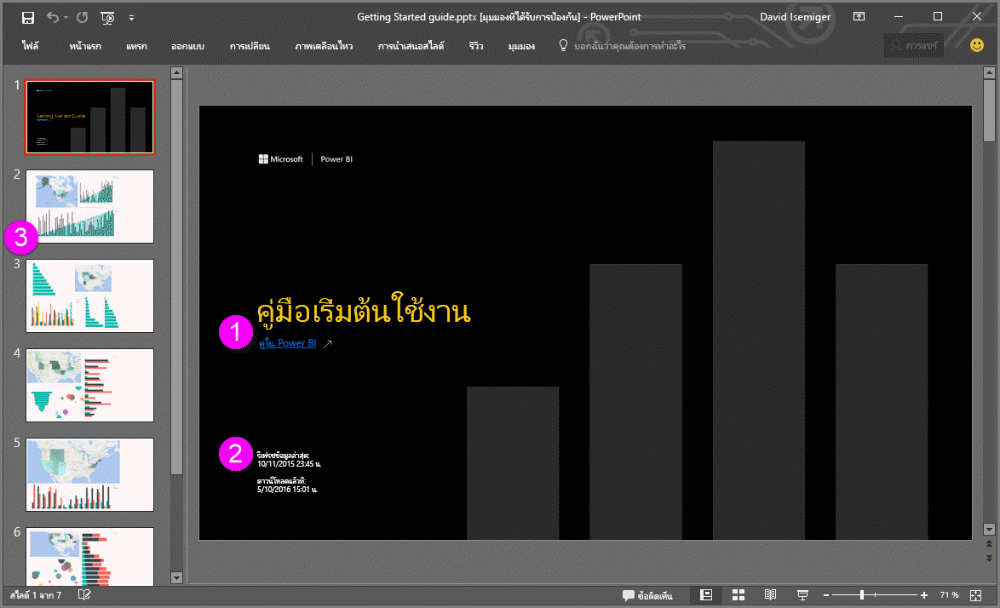
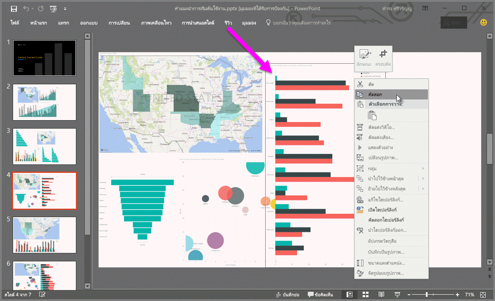

# ส่งออกรายงานจาก Power BI ไปยัง PowerPoint
ด้วย Power BI คุณสามารถเผยแพร่รายงานของคุณไปยัง**Microsoft PowerPoint**และสร้างชุดสไลด์ที่ยึดตามรายงาน Power BI ของคุณอย่างง่ายดายได้ เมื่อคุณ**ส่งออกไปยัง PowerPoint** สิ่งต่อไปนี้เกิดขึ้น

* แต่ละหน้าในรายงาน Power BI กลายเป็นแต่ละสไลด์ใน PowerPoint
* แต่ละหน้าในรายงาน Power BI จะถูกส่งออกเป็นรูปภาพความละเอียดสูงหนึ่งรูปใน PowerPoint <!-- * The filters and slicers settings that you added to the report are preserved. -->
* ลิงก์ถูกสร้างขึ้นใน PowerPoint ที่เชื่อมโยงไปยังรายงาน Power BI 

รับ**รายงาน Power BI**ของคุณ ที่ถูกส่งออกเป็น**PowerPoint**อย่างรวดเร็ว ทำตามขั้นตอนที่แสดงในส่วนถัดไป

## วิธีการส่งออกรายงาน Power BI ของคุณไปยัง PowerPoint
ในบริการ Power BI เลือกรายงานที่จะแสดงบนพื้นที่ คุณยังสามารถเลือกรายงานจาก**หน้าแรก**หน้าเพจ**แอป**หรือส่วนอื่น ๆ บนแถบนำทางด้านซ้ายของคุณได้

เมื่อรายงานที่คุณต้องการส่งออกไปยัง PowerPoint ถูกแสดงอยู่บนพื้นที่แก้ไข ให้เลือก**ไฟล์ > ส่งออกไปยัง PowerPoint** จากแถบเมนูในบริการ Power BI

คุณจะเห็นแบนเนอร์การแจ้งเตือนในมุมบนขวาของหน้าต่างเบราว์เซอร์ของ Power BI service ซึ่ง รายงานจะส่งออกไปยัง PowerPoint ซึ่งอาจใช้เวลาสักครู่ และคุณสามารถทำงานใน Power BI ในขณะที่กำลังส่งออกรายงาน

เมื่อเสร็จสมบูรณ์ แบนเนอร์การแจ้งเตือนจะเปลี่ยนให้คุณทราบว่า Power BI service ได้เสร็จสิ้นกระบวนการส่งออกแล้ว

ไฟล์ของคุณพร้อมแล้วในเบราว์เซอร์ที่แสดงไฟล์ที่ดาวน์โหลด ในรูปต่อไปนี้ จะแสดงเป็นแบนเนอร์ดาวน์โหลดชิดด้านล่างของหน้าต่างเบราว์เซอร์

และมีแค่นั้น คุณสามารถดาวน์โหลดไฟล์ ให้เปิดมันด้วย PowerPoint และปรับเปลี่ยนหรือปรับปรุงเหมือนกับที่คุณต้องการชุด PowerPoint ใดๆ

## กำลังเช็คเอาท์ไฟล์ PowerPoint ที่คุณส่งออก
เมื่อคุณเปิดไฟล์ PowerPoint ที่ส่งออก Power BI คุณจะพบองค์ประกอบที่ยอดเยี่ยม และมีประโยชน์บางอย่าง ดูที่รูปภาพต่อไปนี้ จากนั้นเช็คเอาท์องค์ประกอบที่ลำดับเลขที่ด้านล่างซึ่งอธิบายฟีเจอร์ยอดเยี่ยมเหล่านั้นบางอย่าง

1. หน้าแรกของชุดสไลด์มีชื่อของรายงานของคุณ และลิงก์เพื่อให้คุณสามารถดูรายงาน  **Power BI** ที่ยึดตามชุดสไลด์
2. คุณได้รับข้อมูลที่เป็นประโยชน์บางอย่างเกี่ยวกับรายงาน เช่นกัน รวมถึงการ*รีเฟรชข้อมูลล่าสุด*บนที่ที่รายงานถูกส่งออก และ*ดาวน์โหลด*เวลาและวัน ซึ่งเป็นเวลาและวันเมื่อ รายงาน Power BI ส่งออกเป็นไฟล์ PowerPoint
3. แต่ละหน้ารายงานคือ สไลด์แยกต่างหาก ดังที่แสดงในบานหน้าต่างนำทางด้านซ้าย 
4. รายงานที่คุณเผยแพร่แล้วจะแสดงในภาษาตามการตั้งค่า Power BI ของคุณ หรือจากการตั้งค่าตำแหน่งที่ตั้งของเบราว์เซอร์ของคุณ เพื่อดูหรือตั้งค่าการกำหนดลักษณะภาษาของคุณ ให้เลือกไอคอนรูปเฟือง  **การตั้งค่า > ทั่วไป > ภาษา** สำหรับข้อมูลของพื้นที่ ให้ดู[ภาษาที่รองรับและประเทศ/ภูมิภาคสำหรับ Power BI](../supported-languages-countries-regions.md)
5. งานนำเสนอ PowerPoint มีภาพนิ่งรวมทั้งปกกับเวลาส่งออกในโซนเวลาถูกต้อง

เมื่อคุณไปยังแต่ละสไลด์ คุณจะสังเกตเห็นว่า แต่ละหน้ารายงานคือรูปภาพที่แยกจากกัน

>[!NOTE]
> โดยที่มีรูปหนึ่งรูปสำหรับแต่ละหน้ารายงานพฤติกรรมการทำงานแบบใหม่ พฤติกรรมการทำงานก่อนหน้า ซึ่งกำหนดรูปภาพแบบอิสระสำหรับแต่ละภาพวิชวล ไม่มีการใช้อีกแล้ว 
 

สิ่งที่คุณทำกับชุด PowerPoint ของคุณจากที่นั่น หรือจากรูปภาพที่มีความละเอียดสูงใด ขึ้นอยู่กับคุณ

## ข้อจำกัด
มีข้อควรพิจารณาและข้อจำกัดสองสามตัวที่ควรทราบเมื่อทำงานกับฟีเจอร์**ส่งออกไปยัง PowerPoint**

* ในเซสชันโต้ตอบเช่นการไฮไลท์และการกรอง ดริลดาวน์ และอื่นๆ จะยังรองรับเมื่อส่งออกไปยัง PowerPoint PowerPoint ที่ส่งออก แสดงภาพต้นฉบับเมื่อพวกเขาจะถูกบันทึกไว้ในรายงาน ถ้าคุณได้ใช้ตัวกรองหรือตัวแบ่งส่วนข้อมูล และต้องการเก็บข้อมูลเหล่านี้ไว้เพื่อการส่งออก ให้คุณบันทึกรายงาน และจากนั้น ทำการส่งออก
* **ภาพ R**ไม่มีการรองรับในปัจจุบัน ภาพดังกล่าวจะถูกส่งออกเป็นรูปแบบว่างเปล่าลงใน PowerPoint ด้วยข้อผิดพลาดที่ระบุว่าภาพวิชวลแบบนี้ไม่รับการรองรับ
* **ภาพวิชวลแบบกำหนดเอง**ที่ได้รับการ**รับรอง**นั้นได้การสนับสนุน สำหรับข้อมูลเพิ่มเติมเกี่ยวกับภาพวิชวลแบบกำหนดเองที่ได้การรับรอง รวมถึงวิธีการรับภาพวิชวลแบบกำหนดเองที่ได้รับการรับรอง ให้ดู[รับภาพวิชวลแบบกำหนดเองที่ได้รับการรับรอง](../power-bi-custom-visuals-certified.md) ภาพวิชวลแบบกำหนดเองที่ยังไม่ได้รับรองจะยังใช้ไม่ได้ จะถูกส่งออกเป็นรูปแบบว่างเปล่าลงใน PowerPoint ด้วยข้อผิดพลาดที่ระบุว่าภาพวิชวลแบบนี้ไม่รับการรองรับ
* รายงานที่มีหน้ารายงานเกิน 30 หน้าไม่สามารถส่งออกได้ในขณะนี้
* กระบวนการในการส่งรายงานไปยัง PowerPoint อาจใช้เวลาสักครูจนกว่าจะเสร็จสมบูรณ์ ดังนั้นโปรดรอสักครู่ ปัจจัยที่สามารถส่งผลกระทบต่อเวลาจำเป็นต้องมีโครงสร้างของรายงาน และมีการโหลดบน Power BI service ปัจจุบัน
* หากรายการเมนู**ส่งออกไปยัง PowerPoint** ไม่พร้อมใช้งานในบริการของ Power BI อาจเป็นไปได้ว่าผู้ดูแลระบบผู้เช่าของคุณได้ปิดใช้งานคุณลักษณะนี้ ติดต่อผู้ดูแลระบบของผู้เช่าของคุณสำหรับรายละเอียด
* ภาพพื้นหลังจะถูกตัดรูปด้วยพื้นที่ที่กำหนดขอบเขตของแผนภูมิ ขอแนะนำให้ลบรูปพื้นหลังก่อนที่ส่งออกไปยัง PowerPoint
* หน้าใน PowerPoint จะถูกสร้างขึ้นในขนาดมาตรฐาน 9:16 เสมอ โดยไม่คำนึงถึงขนาดหน้าเดิมหรือมิติในรายงาน Power BI
* รายงานที่มีเจ้าของเป็นผู้ใช้ภายนอกโดเมนผู้เช่า Power BI ของคุณ (เช่น รายงานที่มีบุคคลภายนอกองค์กรของคุณเป็นเจ้าของ และถูกแชรให้คุณ) ไม่สามารถเผยแพร่ไปยัง PowerPoint ได้
* ถ้าคุณแชร์แดชบอร์ดกับบุคคลภายนอกองค์กรของคุณ (และดังนั้น ผู้ใช้ที่ไม่อยู่ในผู้เช่า Power BI ของคุณ) ผู้ใช้รายนั้นจะไม่สามารถส่งรายงานที่เกี่ยวข้องของแดชบอร์ดที่แชร์ไปยัง PowerPoint ได้ ตัวอย่างเช่น ถ้าคุณเป็นเช่นนั้น aaron@contoso.comคุณสามารถแชร์ให้david@cohowinery.comได้ แต่david@cohowinery.comไม่สามารถส่งรายงานที่เกี่ยวข้องกับ PowerPoint ได้
* ตามที่ระบุไว้ก่อนหน้านี้ แต่ละหน้ารายงานจะถูกส่งออกเป็นรูปภาพหนึ่งรูปในไฟล์ PowerPoint
* Power BI service ใช้การตั้งค่าภาษาของ Power BI ของคุณเป็นภาษาสำหรับการส่งออกไปยัง PowerPoint เพื่อดูหรือตั้งค่าการกำหนดลักษณะภาษาของคุณ ให้เลือกไอคอนรูปเฟือง  **การตั้งค่า > ทั่วไป > ภาษา**
* เวลาการ**ดาวน์โหลดใน**สไลด์ปกของไฟล์ PowerPoint ที่ถูกส่งออก ถูกตั้งค่าเป็นโซนเวลาของคอมพิวเตอร์ของคุณในเวลาของการส่งออก

## ขั้นตอนถัดไป
[พิมพ์หน้ารายงาน](end-user-print.md)