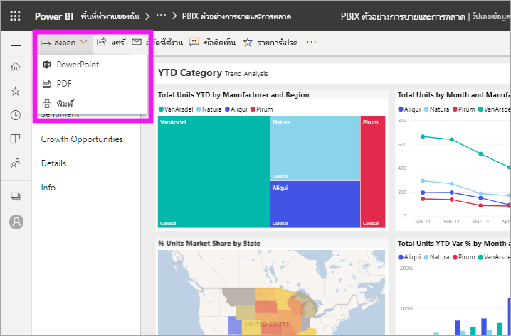
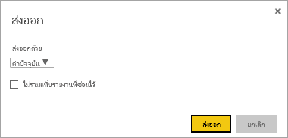
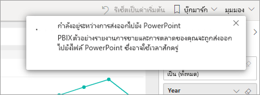

# ส่งออกรายงานจาก Power BI ไปยัง PowerPoint

[!INCLUDE [power-bi-service-new-look-include](../includes/power-bi-service-new-look-include.md)]

ด้วย Power BI คุณสามารถเผยแพร่รายงานของคุณไปยัง Microsoft PowerPoint และสร้างชุดสไลด์ที่ยึดตามรายงาน Power BI ของคุณอย่างง่ายดายได้ ขณะส่งออกเป็น PowerPoint กรณีต่อไปนี้จะเกิดขึ้น:

* แต่ละหน้าในรายงาน Power BI กลายเป็นแต่ละสไลด์ใน PowerPoint
* แต่ละหน้าในรายงาน Power BI จะถูกส่งออกเป็นรูปภาพความละเอียดสูงหนึ่งรูปใน PowerPoint
* ค่าตัวกรองและตัวแบ่งส่วนข้อมูลที่คุณเพิ่มไปยังรายงานจะถูกเก็บรักษาไว้
* ลิงก์ถูกสร้างขึ้นใน PowerPoint ที่เชื่อมโยงไปยังรายงาน Power BI

รับ**รายงาน Power BI**ของคุณ ที่ถูกส่งออกเป็น**PowerPoint**อย่างรวดเร็ว ทำตามขั้นตอนที่แสดงในส่วนถัดไป

## ส่งออกรายงาน Power BI ของคุณไปยัง PowerPoint
ในบริการ Power BI เลือกรายงานที่จะแสดงบนพื้นที่ คุณยังสามารถเลือกรายงานจาก**หน้าแรก** หน้าเพจ **แอป** หรือคอนเทนเนอร์อื่น ๆ จากบนแถบคำสั่งสำหรับสืบค้นเนื้อหาด้านซ้าย

ขณะที่รายงานที่คุณต้องการส่งออกเป็น PowerPoint ปรากฏขึ้น ให้เลือก **ส่งออก** > **PowerPoint** จากแถบเมนู

ป็อปอัพจะปรากฏในที่ซึ่งคุณมีตัวเลือกที่จะเลือก**ค่าปัจจุบัน** หรือ**ค่าเริ่มต้น** **ค่าปัจจุบัน**ส่งออกรายงานในสถานะปัจจุบัน ซึ่งรวมถึงการเปลี่ยนแปลงที่ใช้งานอยู่ที่คุณทำกับตัวแบ่งส่วนข้อมูลและตัวกรอง ผู้ใช้งานส่วนใหญ่เลือกตัวเลือกนี้ หรือเลือก **ค่าเริ่มต้น** เพื่อส่งออกรายงานในสถานะดั้งเดิมตามที่*ผู้จัดทำ*แชร์ไว้ โดยไม่ครอบคลุมการเปลี่ยนแปลงใด ๆ ที่คุณทำไว้กับสถานะเริ่มต้น

 
นอกจากนี้ ยังมีกล่องกาเครื่องหมายเพื่อเลือกว่าจะส่งออกแท็บที่ซ่อนรายงานไว้หรือไม่ เลือกช่องทำเครื่องหมายนี้หากคุณต้องการส่งออกเฉพาะแท็บรายงานที่ปรากฏขึ้นสำหรับคุณในเบราเซอร์ หากต้องการรับแท็บซ่อนทั้งหมดเป็นส่วนหนึ่งในข้อมูลส่งออก คุณจะต้องไม่ทำเครื่องหมายในช่องนี้ ถ้ากล่องกาเครื่องหมายเป็นสีเทา แสดงว่าไม่มีแท็บที่ซ่อนอยู่ในรายงาน เมื่อคุณได้ทำการเลือกของคุณแล้ว เลือก**ส่งออก**เพื่อดำเนินต่อ

คุณจะเห็นแบนเนอร์การแจ้งเตือนในมุมบนขวาของหน้าต่างเบราว์เซอร์ของ Power BI service ซึ่ง รายงานจะส่งออกไปยัง PowerPoint การส่งออกนี้อาจใช้เวลาสักครู่ คุณสามารถทำงานใน Power BI ในขณะที่กำลังส่งออกรายงาน

หลังจากบริการ Power BI สิ้นสุดกระบวนการส่งออก แบนเนอร์แจ้งเตือนจะเปลี่ยนไปเพื่อแจ้งข้อมูลให้คุณทราบ ไฟล์ของคุณพร้อมแล้วในเบราว์เซอร์ที่แสดงไฟล์ที่ดาวน์โหลด ในรูปต่อไปนี้ จะแสดงเป็นแบนเนอร์ดาวน์โหลดชิดด้านล่างของหน้าต่างเบราว์เซอร์

และมีแค่นั้น คุณสามารถดาวน์โหลดไฟล์ ให้เปิดมันด้วย PowerPoint และปรับเปลี่ยนหรือปรับปรุงเหมือนกับที่คุณต้องการชุด PowerPoint ใดๆ

## เช็คเอาท์ไฟล์ PowerPoint ที่คุณส่งออก
เมื่อคุณเปิดไฟล์ PowerPoint ที่ส่งออก Power BI คุณจะพบองค์ประกอบที่ยอดเยี่ยม และมีประโยชน์บางอย่าง ดูที่รูปภาพต่อไปนี้ จากนั้นเช็คเอาท์องค์ประกอบที่ลำดับเลขที่ซึ่งอธิบายฟีเจอร์ยอดเยี่ยมเหล่านั้นบางอย่าง

1. หน้าแรกของชุดสไลด์มีชื่อของรายงานของคุณ และลิงก์เพื่อให้คุณสามารถดูรายงาน  **Power BI** ที่ยึดตามชุดสไลด์
2. คุณจะได้รับข้อมูลที่เป็นประโยชน์เกี่ยวกับรายงานนี้ด้วยเช่นกัน **รีเฟรชข้อมูลล่าสุด** ใช้เพื่อแสดงวันที่และเวลาสำหรับรายงานที่ส่งออก **ดาวน์โหลดที่** ใช้เพื่อแสดงวันที่และเวลาเมื่อส่งออกรายงาน Power BI เป็นไฟล์ PowerPoint
3. แต่ละหน้ารายงานคือ สไลด์แยกต่างหาก ดังที่แสดงในบานหน้าต่างนำทางด้านซ้าย 
4. รายงานที่คุณเผยแพร่แล้วจะแสดงในภาษาตามการตั้งค่า Power BI ของคุณ หรือจากการตั้งค่าตำแหน่งที่ตั้งของเบราว์เซอร์ของคุณ ดูหรือตั้งค่าภาษาของคุณโดยเลือกไอคอนรูปเฟือง  > **การตั้งค่า** > **ทั่วไป** > **ภาษา** สำหรับข้อมูลของพื้นที่ ให้ดู[ภาษาที่รองรับและประเทศหรือภูมิภาคสำหรับ Power BI](../supported-languages-countries-regions.md)
5. งานนำเสนอ PowerPoint มีภาพนิ่งรวมทั้งปกกับเวลาส่งออกในโซนเวลาถูกต้อง

เมื่อคุณไปยังแต่ละสไลด์ คุณจะสังเกตเห็นว่า แต่ละหน้ารายงานคือรูปภาพที่แยกจากกัน

>[!NOTE]
> โดยที่มีรูปหนึ่งรูปสำหรับแต่ละหน้ารายงานพฤติกรรมการทำงานแบบใหม่ พฤติกรรมการทำงานก่อนหน้า ซึ่งกำหนดรูปภาพแบบอิสระสำหรับแต่ละภาพวิชวล ไม่มีการใช้อีกแล้ว 
 

สิ่งที่คุณทำกับชุด PowerPoint ของคุณจากที่นั่น หรือจากรูปภาพที่มีความละเอียดสูงใด ขึ้นอยู่กับคุณ

## ข้อจำกัด
มีข้อควรพิจารณาและข้อจำกัดสองสามตัวที่ควรทราบเมื่อทำงานกับฟีเจอร์**ส่งออกไปยัง PowerPoint**

* ส่วนแสดงผล R ปัจจุบันไม่รองรับ ภาพดังกล่าวจะถูกส่งออกเป็นรูปแบบว่างเปล่าลงใน PowerPoint ด้วยข้อผิดพลาดที่ระบุว่าภาพวิชวลแบบนี้ไม่รับการรองรับ
* รองรับส่วนแสดงผลกำหนดเองที่ผ่านการรับรองแล้ว สำหรับข้อมูลเพิ่มเติมเกี่ยวกับภาพวิชวลแบบกำหนดเองที่ได้การรับรอง รวมถึงวิธีการรับภาพวิชวลแบบกำหนดเองที่ได้รับการรับรอง ให้ดู[รับภาพวิชวลแบบกำหนดเองที่ได้รับการรับรอง](../power-bi-custom-visuals-certified.md) ไม่สนับสนุนภาพแบบกำหนดเองที่ไม่ได้รับการรับรอง ภาพดังกล่าวจะถูกส่งออกเป็นรูปแบบว่างเปล่าลงใน PowerPoint ด้วยข้อผิดพลาดที่ระบุว่าภาพวิชวลแบบนี้ไม่รับการรองรับ
* รายงานที่มีหน้ารายงานเกิน 30 หน้าไม่สามารถส่งออกได้ในขณะนี้
* กระบวนการในการส่งรายงานไปยัง PowerPoint อาจใช้เวลาสักครูจนกว่าจะเสร็จสมบูรณ์ ดังนั้นโปรดรอสักครู่ ปัจจัยที่สามารถส่งผลกระทบต่อเวลาจำเป็นต้องมีโครงสร้างของรายงาน และมีการโหลดบน Power BI service ปัจจุบัน
* หากรายการเมนู**ส่งออกไปยัง PowerPoint** ไม่พร้อมใช้งานในบริการของ Power BI อาจเป็นไปได้ว่าผู้ดูแลระบบผู้เช่าของคุณได้ปิดใช้งานคุณลักษณะนี้ ติดต่อผู้ดูแลระบบผู้เช่าของคุณสำหรับรายละเอียด
* ภาพพื้นหลังจะถูกตัดรูปด้วยพื้นที่ที่กำหนดขอบเขตของแผนภูมิ แนะนำให้คุณลบภาพพื้นหลังก่อนส่งออกเป็นไฟล์ PowerPoint
* หน้าใน PowerPoint จะถูกสร้างขึ้นในขนาดมาตรฐาน 9:16 เสมอ โดยไม่คำนึงถึงขนาดหน้าเดิมหรือมิติในรายงาน Power BI
* รายงานที่มีเจ้าของเป็นผู้ใช้ภายนอกโดเมนผู้เช่า Power BI ของคุณ เช่น รายงานที่มีบุคคลภายนอกองค์กรของคุณเป็นเจ้าของ และถูกแชรให้คุณ ไม่สามารถเผยแพร่ไปยัง PowerPoint ได้
* ถ้าคุณแชร์แดชบอร์ดกับบุคคลภายนอกองค์กรของคุณ (และดังนั้น ผู้ใช้ที่ไม่อยู่ในผู้เช่า Power BI ของคุณ) ผู้ใช้รายนั้นจะไม่สามารถส่งรายงานที่เกี่ยวข้องของแดชบอร์ดที่แชร์เป็น PowerPoint ได้ ตัวอย่างเช่น ถ้าคุณเป็นเช่นนั้น aaron@contoso.comคุณสามารถแชร์ให้david@cohowinery.comได้ แต่ david@cohowinery.com ไม่สามารถส่งออกรายงานที่เชื่อมโยงไปยังไฟล์ PowerPoint
* ส่งออกอาจไม่ทำงานกับ PowerPoint เวอร์ชันที่เก่ากว่า
* ตามที่ระบุไว้ก่อนหน้านี้ แต่ละหน้ารายงานจะถูกส่งออกเป็นรูปภาพหนึ่งรูปในไฟล์ PowerPoint
* Power BI service ใช้การตั้งค่าภาษาของ Power BI ของคุณเป็นภาษาสำหรับการส่งออกไปยัง PowerPoint ดูหรือตั้งค่าภาษาของคุณโดยเลือกไอคอนรูปเฟือง  > **การตั้งค่า** > **ทั่วไป** > **ภาษา**
* เวลาการ**ดาวน์โหลดใน**สไลด์ปกของไฟล์ PowerPoint ที่ถูกส่งออก ถูกตั้งค่าเป็นโซนเวลาของคอมพิวเตอร์ของคุณในเวลาของการส่งออก
* ตัวกรอง URL จะไม่ถูกนำมาพิจารณาหากคุณเลือก **ค่าปัจจุบัน** สำหรับการส่งออกของคุณ

## ขั้นตอนถัดไป
[พิมพ์หน้ารายงาน](end-user-print.md)
