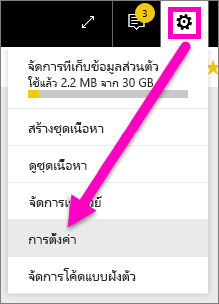
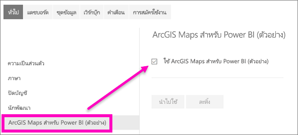

# เลือกใช้ฟีเจอร์ตัวอย่างของบริการ Power BI

[!INCLUDE[consumer-appliesto-yynn](../includes/consumer-appliesto-yynn.md)]

## อะไรคือ*ฟีเจอร์ตัวอย่าง*
ขณะที่เราปรับปรุงบริการของ Power BI เราจะปล่อยฟังก์ชันใหม่บางอย่างที่เป็น *ฟีเจอร์ตัวอย่าง* ฟีเจอร์ตัวอย่างสามารถเปิดและปิด ทำให้คุณมีโอกาสในการลองได้

ฟีเจอร์ตัวอย่างบางอย่างสามารถสลับเปิดและปิดจากแดชบอร์ด Power BI ของคุณ หน้าแรก หรือรายงาน

   

ในขณะที่ฟีเจอร์ตัวอย่างอื่น ๆ จะสามารถใช้งานได้จากเมน *การตั้งค่า* ของคุณ บทความนี้จะแสดงวิธีการเข้าถึงฟีเจอร์ตัวอย่างผ่านเมนูการตั้งค่า

## แสดงตัวอย่างการค้นหา และเปิดใช้งาน(และปิด)
1. เปิดเมนูการตั้งค่าของคุณ โดยการเลือกไอคอนรูปเฟืองที่มุมขวาบนของหน้าจอ Power BI ของคุณ แล้วเลือก**ตั้งค่า**
   
   .
2. เลือกคำแท็บ**ทั่วไป** ถ้ามีการแสดงตัวอย่าง คุณจะเห็นตัวเลือกสำหรับ**ฟีเจอร์ตัวอย่าง**หรือคุณจะเห็นเป็นฟีเจอร์การแสดงตัวอย่างที่แสดงอยู่ทางด้านซ้าย  ในตัวอย่างนี้ ไม่มีการแสดงตัวอย่างที่แสดงรายการของ ArcGIS Maps 
   
   
3. เลือกปุ่มตัวเลือก**เปิด** หรือทำเครื่องหมายในกล่อง เพื่อลองใช้ประสบการณ์การใช้งานใหม่ แล้ว เลือก**นำไปใช้**
4. เมื่อต้องการปิดใช้งานฟีเจอร์ตัวอย่าง ให้ปฏิบัติตามขั้นตอนที่ 1-3 ด้านบน โดยในขั้นตอนที่ 3 เลือก**ปิด**หรือลบเครื่องหมายถูกออกไป แล้วเลือก**ใช้**

มีคำถามหรือคำติชมหรือไม่ [เยี่ยมชมฟอรั่มชุมชน Power BI](https://community.powerbi.com/t5/Navigation-Preview-Forum/bd-p/NavigationPreview)

