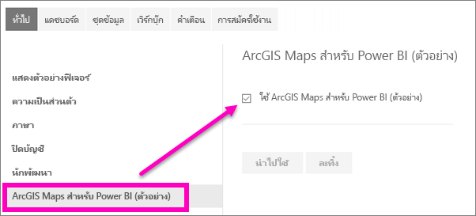

# เข้าร่วมสำหรับคุณลักษณะตัวอย่างของบริการ Power BI
## อะไรคือ*ฟีเจอร์ตัวอย่าง*
ขณะที่เราปรับปรุงไปยังบริการ Power BI เราจะปล่อยฟังก์ชันใหม่บางอย่างเป็น*คุณลักษณะตัวอย่าง* ฟีเจอร์ตัวอย่างสามารถเปิดและปิด ทำให้คุณมีโอกาสในการลองได้

## แสดงตัวอย่างการค้นหา และเปิดใช้งาน(และปิด)
1. เปิดเมนูการตั้งค่าของคุณ โดยการเลือกไอคอนรูปเฟืองมุมขวาบนของหน้าจอของคุณ Power BI แล้วเลือก**ตั้งค่า**
   
   .
2. เลือกคำแท็บ**ทั่วไป** ถ้ามีการแสดงตัวอย่าง คุณจะเห็นตัวเลือกสำหรับ**ฟีเจอร์ตัวอย่าง**หรือคุณจะเห็นเป็นฟีเจอร์การแสดงตัวอย่างที่แสดงอยู่ทางด้านซ้าย  ในตัวอย่างนี้ ไม่มีการแสดงตัวอย่างที่แสดงรายการของ ArcGIS Maps 
   
   
3. เลือกปุ่มตัวเลือก**เปิด** หรือทำเครื่องหมายในกล่อง เพื่อลองใช้ประสบการณ์การใช้งานใหม่ แล้ว เลือก**นำไปใช้**
4. เมื่อต้องปิดคุณลักษณะตัวอย่าง ทำตามขั้นตอนที่ 1-3 ด้านบน และในขั้นตอนที่ 3 เลือก**ปิด**หรือลบเครื่องหมายถูก และเลือก**นำไปใช้**

มีคำถามหรือคำติชมหรือไม่ [เยี่ยมชมฟอรั่มชุมชน Power BI](http://community.powerbi.com/t5/Navigation-Preview-Forum/bd-p/NavigationPreview)

