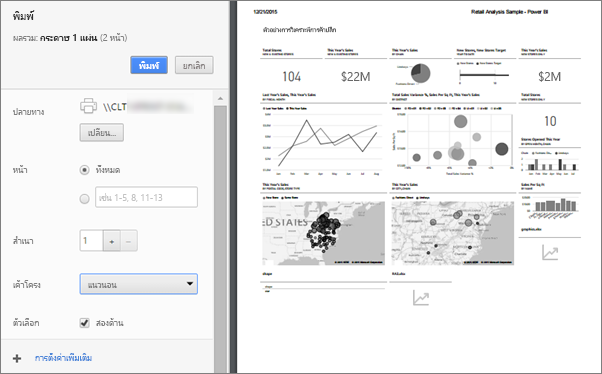

# พิมพ์จากบริการ Power BI
พิมพ์ทั้งแดชบอร์ด ไทล์แดชบอร์ด หน้ารายงาน หรือรูปรายงานจากบริการ Power BI รายงานสามารถพิมพ์ออกมาทีละหน้าในแต่ละครั้งเท่านั้น -- คุณไม่สามารถพิมพ์รายงานทั้งหมดในครั้งเดียว

   > [!NOTE]
   > คุณเห็นกล่องโต้ตอบเกี่ยวกับการพิมพ์ ซึ่งจะขึ้นอยู่กับเบราว์เซอร์ที่คุณกำลังใช้
   > 
## พิมพ์แดชบอร์ด
1. เปิดแดชบอร์ดที่คุณต้องการพิมพ์
2. ในมุมบนซ้าย เลือกส่งออก และเลือก**พิมพ์หน้านี้**
   
    
3. หน้าต่างการพิมพ์สำหรับเบราว์เซอร์ของคุณเปิดขึ้น เลือกตั้งค่าและปลายทางของการพิมพ์ และเลือก**พิมพ์**
   

   
    

## พิมพ์แดชบอร์ดไทล์
1. เปิดแดชบอร์ดใน[โหมดเต็มหน้าจอ](end-user-focus.md)โดยเลือกไอคอนเต็มหน้าจอจากแถบเมนูด้านบน
3. [เปิดไทล์ในโหมดโฟกัส](end-user-focus.md)โดยโฮเวอร์เพื่อแสดงจุดไข่ปลา (...) แล้วเลือก**เปิดในโหมดโฟกัส**หรือไอคอนโฟกัส
   
    
4. ลากเคอร์เซอร์เหนือไทล์เพื่อเปิดเมนูตัวเลือก
   
    
4. เลือกไอคอนพิมพ์     
   

## พิมพ์หน้ารายงาน
รายงานสามารถพิมพ์ออกมาหนึ่งหน้าในแต่ละครั้ง

1. เปิดรายงานและเลือก**ส่งออก** > **พิมพ์**เพื่อพิมพ์หน้ารายงานปัจจุบัน
   
    
3. หน้าต่างการพิมพ์สำหรับเบราว์เซอร์ของคุณเปิดขึ้น
   

## พิมพ์รูปแบบรายงาน
1. [เปิดภาพในโหมดโฟกัส](end-user-focus.md)โดยลากเคอร์เซอร์เหนือไทล์ แล้วเลือกไอคอนโฟกัสจากมุมบนขวา

2. จากมุมบนซ้าย เลือก**ส่งออก** > **พิมพ์**เมื่อต้องพิมพ์ภาพ

    

## ข้อควรพิจารณาและการแก้ไขปัญหา

* Q: ฉันไม่สามารถพิมพ์หน้ารายงานทั้งหมดในครั้งเดียวได้    
* A: ถูกต้องแล้ว หน้ารายงานพิมพ์ได้เพียงหนึ่งหน้ากระดาษต่อการพิมพ์แต่ละครั้ง
* Q: ฉันไม่สามารถแปลงเป็นไฟล์ PDF ได้    
* A: คุณจะเห็นตัวเลือกนี้ต่อเมื่อได้กำหนดค่าไดรเวอร์ PDF ในเบราว์เซอร์ของคุณไว้แล้วเท่านั้น    
* Q: สิ่งที่ฉันต้องการ **พิมพ์** ไม่ตรงกับสิ่งที่กำลังแสดงอยู่ตอนนี้    
* A: หน้าจอสั่งพิมพ์จะแตกต่างกันไปตามเบราว์เซอร์และรุ่นของซอฟต์แวร์
* Q: ขนาดของสิ่งที่ฉันต้องการพิมพ์ไม่ถูกต้อง  แดชบอร์ดของฉันไม่พอดีกับหน้า คำถามอื่นๆ เกี่ยวกับอัตราส่วนและทิศทาง    
* A: เราไม่สามารถรับประกันได้ว่า สำเนาที่พิมพ์จะตรงเดียวกัน ตามที่ปรากฏในบริการ Power BI สิ่งต่าง ๆ เช่นมาตราส่วน ระยะขอบ รายละเอียดรูป วางแนว และขนาดจะไม่ถูกควบคุมโดย Power BI สำหรับความช่วยเหลือเกี่ยวกับปัญหาดังนี้ ให้อ้างอิงถึงเอกสารประกอบของเบราว์เซอร์ของคุณ      

## ขั้นตอนถัดไป
[แชร์แดชบอร์ดและรายงานกับเพื่อนร่วมงานและผู้อื่น](../service-share-dashboards.md)

มีคำถามเพิ่มเติมหรือไม่ [ลองไปที่ชุมชน Power BI](http://community.powerbi.com/)

