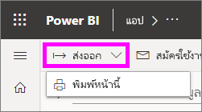
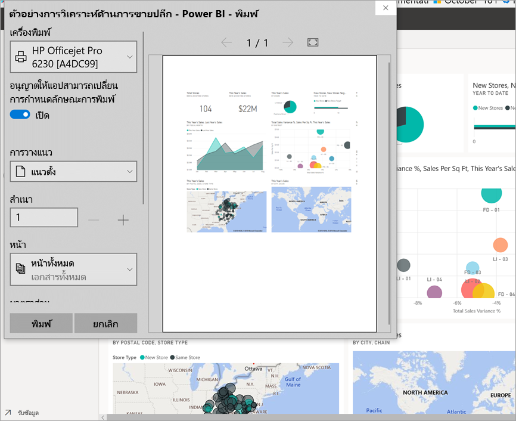
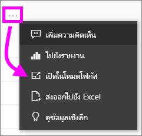
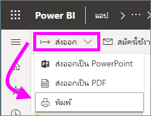

# การพิมพจากบริการของ Power BI

[!INCLUDE[consumer-appliesto-yynn](../includes/consumer-appliesto-yynn.md)]
## สิ่งที่สามารถพิมพ์ได้
[!INCLUDE [power-bi-service-new-look-include](../includes/power-bi-service-new-look-include.md)]

พิมพ์ทั้งแดชบอร์ด ไทล์ของแดชบอร์ หน้ารายงาน หรือภาพรายงานจากบริการของ Power BI หากรายงานของคุณมีมากกว่าหนึ่งหน้า คุณจะต้องพิมพ์แต่ละหน้าแยกกัน 

## ข้อควรพิจารณาเกี่ยวกับการพิมพ์

แดชบอร์ดและรายงานของ Power BI ส่วนใหญสร้างขึ้นโดย*นักออกแบบ*รายงาน เพื่อใช้งานออนไลน์และเพื่อให้ดูน่าทึ่งเมื่อแสดงบนอุปกรณ์ต่าง ๆ เมื่อคุณพิมพ์รายงาน วิธีในการแสดงเนื้อหาในกระดาษนั้นควบคุมโดยเบราว์เซอร์ของคุณ 

โดยมีการตั้งค่าเบราว์เซอร์ที่คุณสามารถใช้เพื่อปรับรูปแบบการพิมพ์ ถึงกระนั้นคุณอาจจะไม่ได้รับสิ่งที่คุณต้องการ พิจารณาการ[ส่งออกเป็น PDF](end-user-pdf.md) ก่อน แล้วจึงพิมพ์ PDF แทน 

## ปรับการตั้งค่าการพิมพ์ของเบราว์เซอร์ของคุณ
เมื่อคุณพิมพ์จาก Power BI ให้เบราว์เซอร์ของคุณเปิดหน้าต่างพิมพ์ หน้าต่างพิมพ์ของแต่ละเบราว์เซอร์นั้นแตกต่างกัน แต่คุณจะพบว่าเบราว์เซอร์มีตัวเลือกที่คล้ายกัน เพื่อให้คุณใช้ควบคุมลักษณะของงานพิมพ์ของคุณ 

นี่คือเคล็ดลับด่วนที่คุณสามารถใช้ปรับรูปแบบงานพิมพ์ของคุณ

   > 
1. หากแดชบอร์ด รายงาน หรือการแสดงผลของคุณมีความกว้างมากกว่าความสูง เลือกใช้เค้าโครง**แนวนอน** 

   

2. เพื่อให้พอดีกับหน้าพิมพ์ ให้ปรับระยะของและสเกล 

    

ทดสอบกับการตั้งค่าเบราว์เซอร์เฉพาะของคุณจนกระทั้งคุณได้ลักษณะที่คุณต้องการ บางเบราว์เซอร์ยังมีตัวเลือกพิมพ์กราฟิกพื้นหลัง 

## พิมพ์แดชบอร์ด
1. เปิดแดชบอร์ดที่คุณต้องการพิมพ์
2. ที่มุมบนซ้าย เลือกส่งออกแล้วเลือก**พิมพ์หน้านี้**
   
    

3. หน้าต่างการพิมพ์สำหรับเบราว์เซอร์ของคุณเปิดขึ้น เลือกการตั้งค่า สำหรับตัวอย่าง หากแดชบอร์ดของคุณกว้างกว่าวามสูง คุณอาจจะต้องเปลี่ยนเค้าโครงเป็น**แนวนอน** เลือก **พิมพ์**
   
    

## พิมพ์แดชบอร์ดไทล์
1. เปิดแดชบอร์ดใน[โหมดเต็มหน้าจอ](end-user-focus.md)โดยการเลือกไอคอนเต็มหน้าจอจากแถบเมนูด้านบน

3. [เปิดไทล์ในโหมดโฟกัส](end-user-focus.md)โดยการเลื่อนเมาส์ลอยไว้ด้านบนเพื่อเผย**ตัวเลือกเพิ่มเติม** (...) แล้วเลือก**เปิดในโหมดโฟกัส** หรือเลือกไอคอนโฟกัส
   
    

4. ลากเคอร์เซอร์เหนือไทล์เพื่อเปิดเมนูตัวเลือก
   
    

4. เลือกไอคอนพิมพ์ .     

5. หน้าต่างการพิมพ์สำหรับเบราว์เซอร์ของคุณเปิดขึ้น เลือกการตั้งค่า สำหรับตัวอย่าง หากไทล์ของคุณไม่พอดีกับหน้า คุณอาจจะต้องเปลี่ยนสเกลเป็น 75% เลือก **พิมพ์**

     

> [!TIP]
> หากคุณทำตามขั้นตอนเหล่านี้ แต่ไทล์ของยังคงไม่แสดงตามที่คุณต้องการ ให้ลองขั้นตอนต่อไปนี้
> 1. เปิดหน้าต่างพิมพ์และเปลี่ยนการตั้งค่าการพิมพ์ที่คุณคิดว่าจะทำให้งานพิมพ์ออกมาดีที่สุด ตัวอย่างเช่น เปลี่ยนเค้าโครง ระยะของ และสเกล 
> 2. แต่แทนที่จะพิมพ์ ให้เลือก **ยกเลิก** 
> 3. ดำเนินการตามขั้นตอน 1-5 อีกครั้ง ไทล์ของคุณจะปรับเป็นการตั้งค่าหน้าต่างพิมพ์ใหม่และพร้อมที่จะพิมพ์

## พิมพ์หน้ารายงาน
รายงานสามารถพิมพ์ออกมาหนึ่งหน้าในแต่ละครั้ง

1. เปิดรายงานแล้วเลือก**ส่งออก** > **พิมพ์**เพื่อพิมพ์หน้ารายงานปัจจุบัน
   
    
2. หน้าต่างการพิมพ์สำหรับเบราว์เซอร์ของคุณเปิดขึ้น

3. ทำตามขั้นตอนการพิมพ์จาก **พิมพ์แดชบอร์ด** ข้างต้น
   

## พิมพ์รูปแบบรายงาน
1. [เปิดภาพในโหมดโฟกัส](end-user-focus.md)โดยลากเคอร์เซอร์เหนือไทล์ แล้วเลือกไอคอนโฟกัสจากมุมบนขวา

2. จากมุมบนซ้ายเลือก**ส่งออก** > **พิมพ์**เพื่อพิมพ์การแสดงผลด้วยภาพ

    

3. ทำตามขั้นตอนการพิมพ์จาก **พิมพ์แดชบอร์ด** ข้างต้น

## ข้อควรพิจารณาและการแก้ไขปัญหา

* Q: ฉันไม่สามารถพิมพ์หน้ารายงานทั้งหมดในครั้งเดียวได้    
* A: ถูกต้องแล้ว หน้ารายงานพิมพ์ได้เพียงหนึ่งหน้ากระดาษต่อการพิมพ์แต่ละครั้ง
* Q: ฉันไม่สามารถแปลงเป็นไฟล์ PDF ได้    
* A: คุณจะเห็นตัวเลือกนี้ต่อเมื่อได้กำหนดค่าไดรเวอร์ PDF ในเบราว์เซอร์ของคุณไว้แล้วเท่านั้น    
* Q: สิ่งที่ฉันต้องการ **พิมพ์** ไม่ตรงกับสิ่งที่กำลังแสดงอยู่ตอนนี้    
* A: หน้าจอสั่งพิมพ์จะแตกต่างกันไปตามเบราว์เซอร์และรุ่นของซอฟต์แวร์
* Q: ขนาดของสิ่งที่ฉันต้องการพิมพ์ไม่ถูกต้อง  แดชบอร์ดของฉันไม่พอดีกับหน้า คำถามอื่นๆ เกี่ยวกับอัตราส่วนและทิศทาง    
* A: เราไม่สามารถรับประกันได้ว่าสำเนาที่พิมพ์ออกมานั้นจะตรงตามที่ปรากฏในบริการของ Power BI อย่างไม่ผิดเพี้ยน สิ่งต่าง ๆ เช่นมาตราส่วน ระยะขอบ รายละเอียดรูป วางแนว และขนาดจะไม่ถูกควบคุมโดย Power BI ลองปรับการตั้งค่าการพิมพ์ที่เบราว์เซอร์ของคุณ เบราว์เซอร์บางตัวเราแนะนำการวางแนวกระดาษ (แนวตั้ง หรือ แนวนอน) ขนาดระยะขอบ และสเกล หากการดำเนินการดังกล่าวไม่ได้ช่วยให้ดีขึ้น ให้อ้างอิงถึงเอกสารประกอบของเบราว์เซอร์ของคุณ      
* Q: เมื่อฉันจะพิมพ์โหมดเต็มหน้าจอ ฉันไม่เห็นตัวเลือกการพิมพ์เมื่อฉันเลื่อนเมาส์เหนือการแสดงผล   
* A: ย้อนกลับไปที่แดชบอร์ดหรือรายงานในมุมมองเริ่มต้น แล้วเปิดการแสดงผลโหมดโฟกัสและโหมดเต็มหน้าจอตามลำดับ 

## ขั้นตอนถัดไป
[แชร์แดชบอร์ดและรายงานกับเพื่อนร่วมงานและผู้อื่น](../collaborate-share/service-share-dashboards.md)

มีคำถามเพิ่มเติมหรือไม่ [ลองไปที่ชุมชน Power BI](https://community.powerbi.com/)
