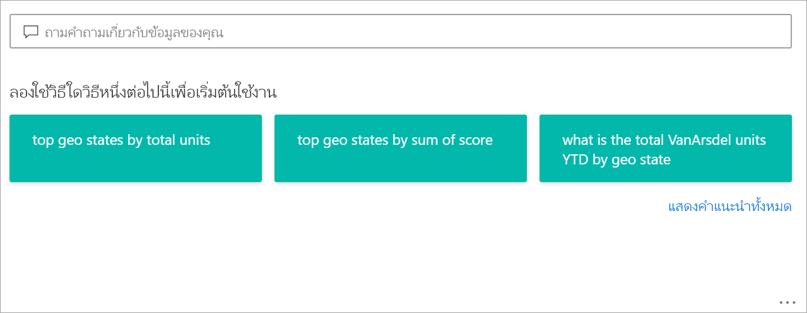
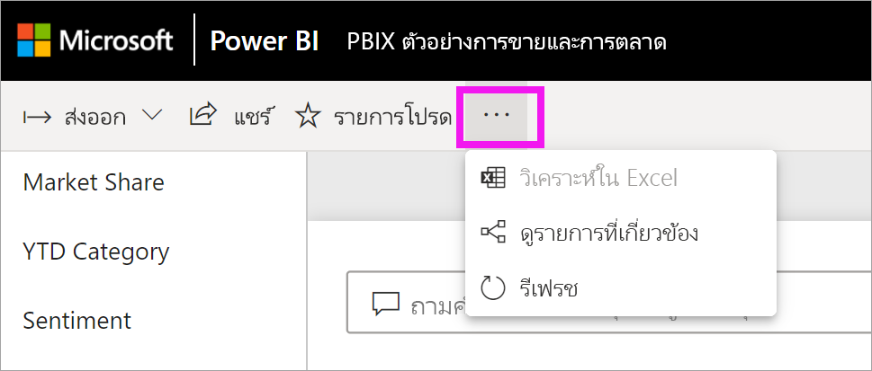
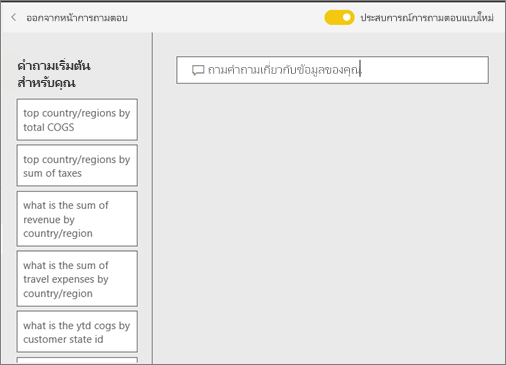
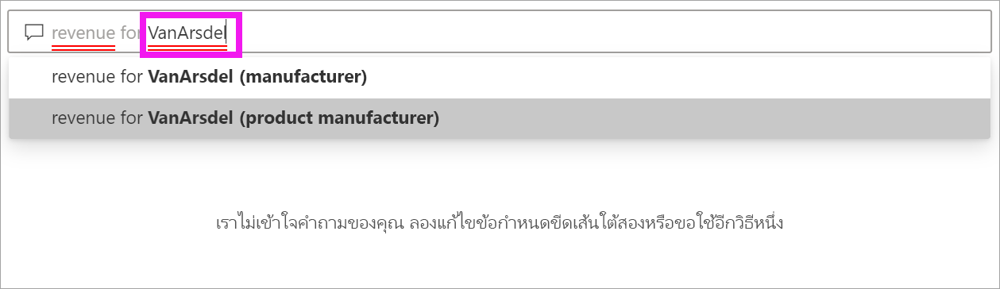
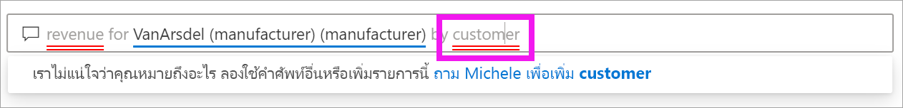
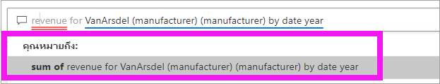
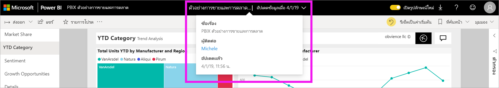

# Q&A สำหรับ**ลูกค้า** Power BI

[!INCLUDE [power-bi-service-new-look-include](../includes/power-bi-service-new-look-include.md)]

## Q&A คืออะไร
ในบางครั้ง วิธีที่เร็วที่สุดในการให้ได้คำตอบจากข้อมูลของคุณคือ การถามคำถามโดยใช้ภาษาธรรมชาติ ตัวอย่างเช่น "ยอดขายรวมปีที่แล้วเป็นเท่าไหร่"

ใช้ Q&A เพื่อสำรวจข้อมูลของคุณโดยใช้การอนุมาน ความสามารถภาษาธรรมชาติ และรับคำตอบในรูปแบบของแผนภูมิและกราฟ Q&A แตกต่างจากโปรแกรมค้นหา Q&A เพียงแค่แสดงผลลัพธ์เกี่ยวกับข้อมูลใน Power BI

## การแสดงภาพแบบใดที่ Q&A ใช้
Q&A เลือกการแสดงภาพที่ดีที่สุดที่ยึดตามข้อมูลที่ถูกแสดง บางครั้งข้อมูลในชุดข้อมูลพื้นฐานถูกกำหนดเป็นชนิดหรือประเภทบางอย่าง และวิธีนี้ช่วยให้ระบบถามตอบรู้ว่าจะแสดงอย่างไร ตัวอย่างเช่น ถ้าข้อมูลถูกกำหนดเป็นชนิดวัน โดยแสดงเป็นแผนภูมิเส้น ข้อมูลที่ถูกจัดประเภทเป็นเมือแสดงบนแผนที่

คุณยังสามารถบอก Q&A ว่าต้องการใช้การแสดงผลด้วยภาพใด ด้วยการเพิ่มคำถามของคุณ แต่โปรดทราบว่าอาจจะไม่เป็นไปได้เสมอ ที่ Q&A จะแสดงข้อมูลในรูปแบบของการแสดงผลด้วยภาพชนิดที่คุณร้องขอ Q&A จะพร้อมท์ให้คุณทราบถึงรายการประเภทการแสดงผลด้วยภาพที่สามารถทำงานได้

## ฉันสามารถใช้ Q&A ได้จากที่ไหน?
คุณจะพบ Q&A บนหน้าแดชบอร์ดในบริการ Power BI และที่ด้านล่างของแดชบอร์ดใน Power BI mobile เว้นแต่ว่ผู้ออกแบบได้ให้สิทธิ์การแก้ไข คุณจะไม่สามารถใช้ Q&A เพื่อสำรวจข้อมูลแต่จะไม่สามารถบันทึกการแสดงภาพใดๆ ที่สร้างขึ้น ด้วย Q&A

นอกจากนี้คุณยังจะได้พบกับระบบถามตอบในรายงานถ้า *ผู้ออกแบบ* รายงานเพิ่ม [วิชวลถามตอบ](../visuals/power-bi-visualization-q-and-a.md) ไว้แล้ว   

## ระบบถามตอบบนแดชบอร์ด

**Power BI Q&A** พร้อมใช้งานสิทธิ์การใช้งานระดับ Pro และ Premium  [Q&A ในแอป Power BI สำหรับอุปกรณ์เคลื่อนที่ ](mobile/mobile-apps-ios-qna.md)และ[ Q&A ที่มี Power BI Embedded](../developer/qanda.md) ครอบคลุมในบทความต่างหาก ในปัจจุบัน **Power BI Q&A** สนับสนุนการสอบถามภาษาธรรมชาติที่ถามเป็นภาษาอังกฤษเท่านั้น แม้ว่าจะมีตัวอย่างสำหรับภาษาสเปนที่สามารถเปิดใช้งานโดยผู้ดูแลระบบ Power BI ของคุณ

การถามคำถามเป็นเพียงการเริ่มต้น  สนุกกับการเดินทางผ่านข้อมูลของคุณ เพื่อปรับแต่งหรือขยายคำถามของคุณ ค้นพบข้อมูลใหม่ที่น่าเชื่อถือ และให้ความสำคัญกับรายละเอียดและซูมออกเพื่อให้ได้มุมมองที่กว้างขึ้น คุณจะรู้สึกยินดีกับข้อมูลเชิงลึกและการค้นพบที่คุณทำ

ประสบการณ์การใช้งานเป็นแบบโต้ตอบอย่างแท้จริง... และรวดเร็ว รับการสนับสนุนโดยการเก็บข้อมูลในหน่วยความจำ ตอบสนองได้เกือบทันที

## ใช้ Q&A บนแดชบอร์ดในบริการของ Power BI
ในบริการของ Power BI (app.powerbi.com) แดชบอร์ดประกอบด้วย ไทล์ที่ปักหมุดจากชุดข้อมูลหนึ่งหรือหลายชุด ดังนั้นคุณสามารถถามคำถามเกี่ยวกับข้อมูลที่มีอยู่ในชุดข้อมูลใดๆ เหล่านั้น หากต้องการดูว่ารายงานและชุดข้อมูลใดที่นำมาใช้ในการสร้างแดชบอร์ด ให้เลือก **ดูรายการที่เกี่ยวข้อง** จากรายการดรอปดาวน์ **การดำเนินการเพิ่มเติม**

## ฉันจะเริ่มต้นอย่างไร?
ขั้นแรก ทำความคุ้นเคยกับเนื้อหา ดูที่การแสดงผลด้วยภาพบนแดชบอร์ดและในรายงาน รับทราบประเภทและช่วงของข้อมูลที่พร้อมใช้งาน 

ตัวอย่างเช่น:

* ถ้าป้ายชื่อแกนและค่าของการแสดงผลด้วยภาพมีการรวม "ยอดขาย" "บัญชี" "เดือน" และ "โอกาส" คุณจะสามารถสอบถามในเรื่องต่อไปนี้ได้: "*บัญชี*ใดมี*โอกาส*สูงสุด หรือแสดง*ยอดขาย*ต่อเดือนในแผนภูมิแท่ง"

* ถ้าคุณมีข้อมูลประสิทธิภาพการทำงานเว็บไซต์ใน Google Analytics คุณสามารถถาม Q&A เกี่ยวกับเวลาที่ใช้ในเว็บเพจ จำนวนการเยี่ยมชมหน้าเฉพาะและอัตราการมีส่วนร่วมของผู้ใช้ หรือ ถ้าคุณกำลังทำคิวรี่ข้อมูลประชากร คุณอาจถามคำถามเกี่ยวกับอายุและรายไดในครัวเรือนตามท้องถิ่น

เมื่อคุณคุ้นเคยกับข้อมูลแล้ว ให้กลับไปที่แดชบอร์ดและวางเคอร์เซอร์ของคุณในกล่องคำถาม ซึ่งจะเปิดหน้าจอ Q&A

 

ถึงแม้ว่าคุณยังไม่เริ่มพิมพ์ ถามตอบจะแสดงหน้าจอใหม่ ด้วยคำแนะนำเพื่อช่วยคุณสร้างคำถามของคุณ คุณเห็นวลีและคำถามที่ประกอบด้วยชื่อของตารางในชุดข้อมูลพื้นฐาน และอาจเห็นคำถาม *แนะนำ* ที่สร้างขึ้นโดยเจ้าของชุดข้อมูล

คุณสามารถเลือกรายการเหล่านี้เพื่อเพิ่มลงในกล่องคำถาม และจากนั้นปรับปรุงการค้นหาคำตอบเฉพาะ 

อีกวิธีหนึ่งที่ระบบถามตอบช่วยให้คุณในการตั้งคำถามคือด้วยการพร้อมท์ การกรอกข้อมูลอัตโนมัติ และสัญลักษณ์วิชวล 

<!--  -->

## วิชวลถามตอบ

วิชวลถามตอบช่วยให้คุณสามารถถามคำถามที่เป็นภาษาธรรมชาติและรับคำตอบในรูปแบบของวิชวลได้ วิชวลถามตอบทำงานเหมือนกับวิชวลอื่น ๆ ซึ่งสามารถทำการกรองข้าม/การไฮไลต์แบบเชื่อมโยง และยังสนับสนุนบุ๊กมาร์กและความคิดเห็นด้วย 

คุณสามารถระบุวิชวลถามตอบโดยใช้กล่องคำถามที่อยู่ด้านบน นี่คือบริเวณที่คุณจะป้อนหรือพิมพ์คำถามโดยใช้ภาษาธรรมชาติ วิชวลถามตอบสามารถใช้ซ้ำแล้วซ้ำอีกเพื่อถามคำถามเกี่ยวกับข้อมูลของคุณ เมื่อคุณออกจากรายงาน วิชวลถามตอบจะรีเซ็ตเป็นค่าเริ่มต้น 

## ใช้วิชวลถามตอบ
หากต้องการใช้วิชวลถามตอบ เลือกคำถามที่แนะนำอย่างใดอย่างหนึ่งหรือพิมพ์คำถามภาษาธรรมชาติของคุณเอง 

### สร้างวิชวลถามตอบโดยใช้คำถามที่แนะนำ

ที่นี่ เราได้เลือก **สถานะทางภูมิศาสตร์ยอดนิยมตามหน่วยทั้งหมด** Power BI พยายามอย่างดีที่สุดเพื่อเลือกชนิดวิชวลที่จะใช้ ในกรณีนี้ คือแผนที่

แต่คุณสามารถบอก Power BI ว่าจะใช้วิชวลชนิดใดโดยการเพิ่มลงในคิวรีภาษาธรรมชาติของคุณ โปรดทราบว่าไม่ใช่วิชวลทุกชนิดที่จะทำงานหรือเข้ากับข้อมูลของคุณ ตัวอย่างเช่น ข้อมูลนี้จะไม่สร้างแผนภูมิแบบกระจายที่มีความหมาย แต่จะใช้เป็นแผนที่แบบเติม

### สร้างวิชวลถามตอบโดยการพิมพ์คิวรีภาษาธรรมชาติ

ถ้าคุณไม่แน่ใจว่าคำถามชนิดใดที่ต้องถามหรือคำศัพท์ใดที่จะใช้ ให้ขยาย **แสดงคำแนะนำทั้งหมด** หรือดูวิชวลอื่นในรายงาน การดำเนินการนี้จะทำให้คุณคุ้นเคยกับศัพท์และเนื้อหาของชุดข้อมูล

1. พิมพ์คำถามของคุณลงในเขตข้อมูลถามตอบโดยใช้ภาษาธรรมชาติ ในขณะที่คุณพิมพ์คำถามของคุณ Power BI จะช่วยคุณด้วยการกรอกข้อมูลอัตโนมัติ การให้คำแนะนำ และคำติชม

    - ขีดเส้นใต้สีแดงสำหรับคำที่ Power BI ไม่รู้จัก เมื่อใดก็ตามที่เป็นไปได้ Power BI จะช่วยคุณกำหนดคำเหล่านี้ หากคุณเห็นคำจำกัดความที่ถูกต้อง ให้เลือกจากดรอปดาวน์  

        

    - หากไม่มีคำจำกัดความที่ถูกต้อง ให้ลองคำศัพท์อื่นหรือเลือกคำที่ขีดเส้นใต้สีแดงเพื่อขอให้เจ้าของรายงานเพิ่มคำนั้น

        

    - ในขณะที่คุณพิมพ์คำถามเพิ่มเติม Power BI ช่วยให้คุณทราบถ้าระบบไม่เข้าใจคำถาม และพยายามช่วยเหลือ ในตัวอย่างด้านล่าง Power BI จะถามคุณว่า "คุณหมายถึง ..." และแสดงให้เห็นวิธีการที่แตกต่างกันในการตั้งคำถามของคุณโดยใช้ศัพท์จากชุดข้อมูลของคุณ 

        

2. หลังจากเลือกการแก้ไขของ Power BI ผลลัพธ์ของคุณจะแสดงเป็นแผนภูมิเส้น 

    

3. แต่คุณสามารถเปลี่ยนแผนภูมิเส้นไปเป็นวิชวลชนิดอื่นได้  

    

## ข้อควรพิจารณาและการแก้ไขปัญหา

**คำถาม**: ฉันไม่เห็น Q&A บนแดชบอร์ดนี้    
**คำตอบที่ 1**: หากคุณไม่เห็นกล่องคำถาม โปรดตรวจสอบการตั้งค่าของคุณ เมื่อต้องการทำเช่นนี้ ให้เลือกไอคอนฟันเฟืองที่มุมขวาบนของแถบเครื่องมือ Power BI   

แล้ว เลือก**ตั้งค่า** > **แดชบอร์ด** ตรวจสอบว่ามีเครื่องหมายถูกอยู่ติดกับ **แสดงช่องค้นหา Q&A บนแดชบอร์ดนี้** หรือไม่    
  

**คำตอบที่ 2**: ในบางครั้งคุณจะไม่สามารถเข้าถึงการตั้งค่าได้ ถ้า*ผู้ออกแบบ*แดชบอร์ด หรือผู้ดูแลระบบของคุณได้ปิดระบบถามตอบแล้ว ให้ตรวจสอบกับพวกเขาเพื่อดูว่าสามารถเปิดใช้งานอีกครั้งได้หรือไม่   

**คำถาม**: ฉันไม่ได้รับผลลัพธ์ที่ฉันต้องการเห็นขณะพิมพ์คำถาม    
**คำตอบ**: เลือกตัวเลือกเพื่อติดต่อเจ้าของรายงานหรือแดชบอร์ด คุณสามารถทำสิ่งนี้ได้โดยตรงจากหน้าแดชบอร์ดของระบบถามตอบ หรือวิชวลถามตอบ หรือคุณสามารถค้นหาเจ้าของได้จากส่วนหัวของ Power BI  มีหลายสิ่งที่ผู้ออกแบบสามารถทำได้เพื่อปรับปรุงผลลัพธ์ของ Q&A ตัวอย่างเช่น ผู้ออกแบบสามารถเปลี่ยนชื่อคอลัมน์ในชุดข้อมูลเพื่อใช้คำที่เข้าใจได้ง่าย (`CustomerFirstName`แทน`CustFN`) เนื่องจากผู้ออกแบบรู้จักชุดข้อมูลนั้นเป็นดี ผู้ออกแบบจึงมีคำถามที่เป็นประโยชน์และเพิ่มลงในคำถามที่แนะนำของระบบถามตอบ

## ขั้นตอนถัดไป
หากต้องการเรียนรู้วิธีสร้างและจัดการวิชวลถามตอบโดย*ผู้ออกแบบ*รายงาน ให้ดู [ประเภทของวิชวลถามตอบ](../visuals/power-bi-visualization-q-and-a.md)
