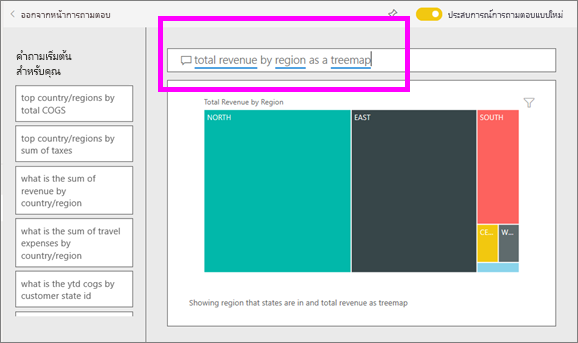

# Q&A สำหรับ**ลูกค้า** Power BI
## Q&A คืออะไร
ในบางครั้ง วิธีที่เร็วที่สุดในการให้ได้คำตอบจากข้อมูลของคุณคือ การถามคำถามโดยใช้ภาษาธรรมชาติ ตัวอย่างเช่น "ยอดขายรวมปีที่แล้วเป็นเท่าไหร่"

ใช้ Q&A เพื่อสำรวจข้อมูลของคุณโดยใช้การอนุมาน ความสามารถภาษาธรรมชาติ และรับคำตอบในรูปแบบของแผนภูมิและกราฟ Q&A แตกต่างจากโปรแกรมค้นหา Q&A เพียงแค่แสดงผลลัพธ์เกี่ยวกับข้อมูลใน Power BI

**Power BI Q&A** พร้อมใช้งานสิทธิ์การใช้งานระดับ Pro และ Premium  [Q&A ในแอป Power BI สำหรับอุปกรณ์เคลื่อนที่ ](mobile/mobile-apps-ios-qna.md)และ[ Q&A ที่มี Power BI Embedded](../developer/qanda.md) ครอบคลุมในบทความต่างหาก ในปัจจุบัน **Power BI Q&A** สนับสนุนการสอบถามภาษาธรรมชาติที่ถามเป็นภาษาอังกฤษเท่านั้น แม้ว่าจะมีตัวอย่างสำหรับภาษาสเปนที่สามารถเปิดใช้งานโดยผู้ดูแลระบบ Power BI ของคุณ

การถามคำถามเป็นเพียงการเริ่มต้น  สนุกกับการเดินทางผ่านข้อมูลของคุณ เพื่อปรับแต่งหรือขยายคำถามของคุณ ค้นพบข้อมูลใหม่ที่น่าเชื่อถือ และให้ความสำคัญกับรายละเอียดและซูมออกเพื่อให้ได้มุมมองที่กว้างขึ้น คุณจะรู้สึกยินดีกับข้อมูลเชิงลึกและการค้นพบที่คุณทำ

ประสบการณ์การใช้งานเป็นแบบโต้ตอบอย่างแท้จริง... และรวดเร็ว รับการสนับสนุนโดยการเก็บข้อมูลในหน่วยความจำ ตอบสนองได้เกือบทันที

## ฉันสามารถใช้ Q&A ได้จากที่ไหน?
คุณจะพบ Q&A บนหน้าแดชบอร์ดในบริการ Power BI และที่ด้านล่างของแดชบอร์ดใน Power BI mobile เว้นแต่ว่ผู้ออกแบบได้ให้สิทธิ์การแก้ไข คุณจะไม่สามารถใช้ Q&A เพื่อสำรวจข้อมูลแต่จะไม่สามารถบันทึกการแสดงภาพใดๆ ที่สร้างขึ้น ด้วย Q&A

## ใช้ Q&A บนแดชบอร์ดในบริการของ Power BI
ในบริการของ Power BI (app.powerbi.com) แดชบอร์ดประกอบด้วย ไทล์ที่ปักหมุดจากชุดข้อมูลหนึ่งหรือหลายชุด ดังนั้นคุณสามารถถามคำถามเกี่ยวกับข้อมูลที่มีอยู่ในชุดข้อมูลใดๆ เหล่านั้น เพื่อดูว่ารายงานและชุดข้อมูลใดถูกใช้ในการสร้างแดชบอร์ด เลือก **ดูรายการที่เกี่ยวข้อง** จากแถบเมนู

## ฉันจะเริ่มต้นอย่างไร?
ขั้นแรก ทำความคุ้นเคยกับเนื้อหา ดูที่การแสดงผลด้วยภาพบนแดชบอร์ดและในรายงาน รับทราบประเภทและช่วงของข้อมูลที่พร้อมใช้งาน 

ตัวอย่างเช่น:

* ถ้าป้ายชื่อแกนและค่าของการแสดงผลด้วยภาพมีการรวม "ยอดขาย" "บัญชี" "เดือน" และ "โอกาส" คุณจะสามารถสอบถามในเรื่องต่อไปนี้ได้: "*บัญชี*ใดมี*โอกาส*สูงสุด หรือแสดง*ยอดขาย*ต่อเดือนในแผนภูมิแท่ง"

* ถ้าคุณมีข้อมูลประสิทธิภาพการทำงานเว็บไซต์ใน Google Analytics คุณสามารถถาม Q&A เกี่ยวกับเวลาที่ใช้ในเว็บเพจ จำนวนการเยี่ยมชมหน้าเฉพาะและอัตราการมีส่วนร่วมของผู้ใช้ หรือ ถ้าคุณกำลังทำคิวรี่ข้อมูลประชากร คุณอาจถามคำถามเกี่ยวกับอายุและรายไดในครัวเรือนตามท้องถิ่น

เมื่อคุณคุ้นเคยกับข้อมูลแล้ว ให้กลับไปที่แดชบอร์ดและวางเคอร์เซอร์ของคุณในกล่องคำถาม ซึ่งจะเปิดหน้าจอ Q&A

 

ถึงแม้ว่าคุณยังไม่เริ่มพิมพ์ ถามตอบจะแสดงหน้าจอใหม่ ด้วยคำแนะนำเพื่อช่วยคุณสร้างคำถามของคุณ คุณเห็นวลีและคำถามที่ประกอบด้วยชื่อของตารางในชุดข้อมูลเบื้องต้น และอาจเห็นคำถาม *โดดเด่น** ที่สร้างขึ้นโดยเจ้าของชุดข้อมูล

คุณสามารถเลือกรายการเหล่านี้เพื่อเพิ่มลงในกล่องคำถาม และจากนั้นปรับปรุงการค้นหาคำตอบเฉพาะ 

อีกวิธีหนึ่ง Q&A ช่วยให้คุณตั้งคำถามเป็นพร้อมท์ กรอกข้อมูลอัตโนมัติ และภาพงานนำเสนอ 

 

### การแสดงภาพแบบใดที่ Q&A ใช้
Q&A เลือกการแสดงภาพที่ดีที่สุดที่ยึดตามข้อมูลที่ถูกแสดง ในบางครั้งข้อมูลในชุดข้อมูลภายในที่ถูกกำหนดเป็นชนิดหรือประเภทบางอย่าง และวิธีนี้ช่วยให้ Q&A รู้ว่าจะแสดงอย่างไร ตัวอย่างเช่น ถ้าข้อมูลถูกกำหนดเป็นชนิดวัน โดยแสดงเป็นแผนภูมิเส้น ข้อมูลที่ถูกจัดประเภทเป็นเมือแสดงบนแผนที่

คุณยังสามารถบอก Q&A ว่าต้องการใช้การแสดงผลด้วยภาพใด ด้วยการเพิ่มคำถามของคุณ แต่โปรดทราบว่าอาจจะไม่เป็นไปได้เสมอ ที่ Q&A จะแสดงข้อมูลในรูปแบบของการแสดงผลด้วยภาพชนิดที่คุณร้องขอ Q&A จะพร้อมท์ให้คุณทราบถึงรายการประเภทการแสดงผลด้วยภาพที่สามารถทำงานได้

## ข้อควรพิจารณาและการแก้ไขปัญหา
**คำถาม**: ฉันไม่เห็น Q&A บนแดชบอร์ดนี้    
**คำตอบที่ 1**: หากคุณไม่เห็นกล่องคำถาม โปรดตรวจสอบการตั้งค่าของคุณ เมื่อต้องการทำเช่นนี้ ให้เลือกไอคอนฟันเฟืองที่มุมขวาบนของแถบเครื่องมือ Power BI   

แล้ว เลือก**ตั้งค่า** > **แดชบอร์ด** ตรวจสอบว่ามีเครื่องหมายถูกอยู่ติดกับ **แสดงช่องค้นหา Q&A บนแดชบอร์ดนี้** หรือไม่    
  

**คำตอบที่ 2**: ในบางครั้ง *ผู้ออกแบบ*แดชบอร์ดหรือผู้ดูแลระบบอาจปิดการใช้งาน Q&A เอาไว้ ตรวจสอบดูว่าสามารถเปิดใช้งานได้หรือไม่   

**คำถาม**: ฉันไม่ได้รับผลลัพธ์ที่ฉันต้องการเห็นขณะพิมพ์คำถาม    
**คำตอบ**: โปรดสอบถาม*ผู้ออกแบบ*แดชบอร์ด มีหลายสิ่งที่ผู้ออกแบบสามารถทำได้เพื่อปรับปรุงผลลัพธ์ของ Q&A ตัวอย่างเช่น ผู้ออกแบบสามารถเปลี่ยนชื่อคอลัมน์ในชุดข้อมูลเพื่อใช้คำที่เข้าใจได้ง่าย (`CustomerFirstName`แทน`CustFN`) เนื่องจากผู้ออกแบบรู้จักชุดข้อมูลนั้นดี ผู้ออกแบบจึงมีคำถามที่เป็นประโยชน์และเพิ่มลงในพื้นที่ทำงาน Q&A ได้

## ขั้นตอนถัดไป
[เคล็ดลับ Q&A สำหรับลูกค้า Power BI](end-user-q-and-a.md)
