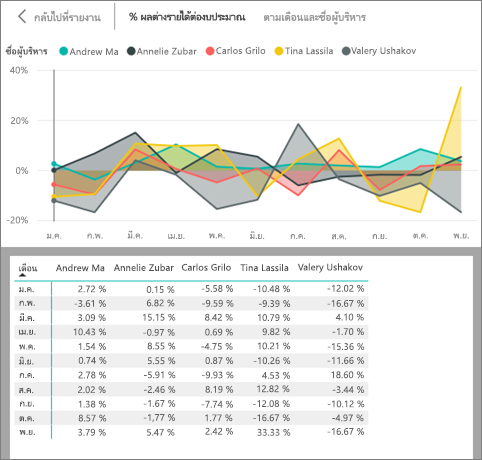

<!-- once the sample apps are live, change this so consumers can follow along -->
# เริ่มต้นใช้งานด่วน: เรียนรู้เกี่ยวกับความสามารถ Power BI สำหรับ***ผู้บริโภค***
ในเริ่มต้นใช้งานด่วนนี้ คุณจะได้เรียนรู้วิธีการโต้ตอบกับ Power BI เพื่อค้นหาข้อมูลธุรกิจเชิงลึก บทความนี้ไม่ได้มีวัตถุประสงค์ที่จะเจาะลึก แต่เป็นการสำรวจแบบรวดเร็วผ่านการดำเนินการหลายอย่างที่พร้อมให้**ผู้บริโภค** Power BI ใช้งาน

ถ้าคุณไม่ได้ลงทะเบียน Power BI ให้[ลงทะเบียนรุ่นทดลองใช้ฟรี](https://app.powerbi.com/signupredirect?pbi_source=web)ก่อนที่คุณจะเริ่มต้นใช้งาน

## ข้อกำหนดเบื้องต้น
- บริการ power BI (app.powerbi.com)
<!-- app from AppSource -->

## มุมมองการอ่าน
มุมมองการอ่านพร้อมให้*ผู้บริโภค*ใช้งานในบริการของ Power BI สำหรับรายงาน เมื่อเพื่อนร่วมงานแชร์รายงานกับคุณ คุณสามารถใช้มุมมองการอ่านเพื่อสำรวจและโต้ตอบกับรายงาน 

โหมดรายงานบริการของ Power BI อีกแบบหนึ่งคือ [มุมมองการแก้ไข](../service-interact-with-a-report-in-editing-view.md)ซึ่งมีให้*นักออกแบบ*รายงาน  

มุมมองการอ่านเป็นวิธีปลอดภัยและมีประสิทธิภาพในการสำรวจแดชบอร์ดและรายงานของคุณ ในขณะที่คุณแบ่งแดชบอร์ดและรายงานที่แชร์กับคุณ ชุดข้อมูลพื้นฐานยังคงเหมือนเดิม และไม่เปลี่ยนแปลง 

ในมุมมองการอ่าน คุณสามารถทำสิ่งต่าง ๆ เช่น ภาพไฮไลต์แบบเชื่อมโยง และภาพตัวกรองแบบเชื่อมโยงบนเพจได้  เพียงแค่ไฮไลต์หรือเลือกค่าในภาพหนึ่ง และดูผลกระทบของการเลือกนั้นบนภาพอื่นได้ทันที ใช้บานหน้าต่าง ตัวกรอง เพื่อเพิ่มและปรับเปลี่ยนตัวกรองบนเพจรายงาน และเปลี่ยนวิธีการเรียงลำดับค่าในการแสดงภาพ ต่อไปนี้คือความสามารถบางอย่างของ*ผู้บริโภค*ใน Power BI  อ่านเพื่อเรียนรู้เกี่ยวกับสิ่งเหล่านี้และอื่น ๆ

 
### ดูแอป
ใน Power BI *แอป*จะรวมแดชบอร์ดและรายงานที่เกี่ยวข้องเข้าด้วยกัน ทั้งหมดในที่เดียว

1. เลือก**แอป**  > **รับแอป** 
   
     
2. ใน AppSource ภายใต้ **องค์กรของฉัน** ค้นหาผลให้แคบลงและหาแอปที่คุณกำลังมองหา
   
     
3. เลือก**รับทันที**เพื่อเพิ่มลงในที่เก็บแอปของคุณ 

### ดูแดชบอร์ด
แอปนี้จะเปิดไปยังแดชบอร์ด ***แดชบอร์ด*** Power BI เป็นแบบหน้าเดียว ซึ่งมักเรียกว่าพื้นที่ว่างเปล่าที่ใช้การแสดภาพเพื่อบอกเล่าเรื่องราวหนึ่ง ๆ ได้ เนื่องจากจำกัดอยู่เพียงหนึ่งหน้า แดชบอร์ดทีี่ออกแบบมาอย่างดีจะประกอบด้วยองค์ประกอบที่สำคัญที่สุดของเรื่องราวเท่านั้น

การแสดงภาพที่คุณเห็นบนแดชบอร์ดเรียกว่า*ไทล์* และจะถูก*ปักหมุด*ไปยังแดชบอร์ดจากรายงาน

### สมัครใช้งานแดชบอร์ด (หรือรายงาน)
ไม่จำเป็นต้องเปิด Power BI เพื่อตรวจสอบแดชบอร์ด  คุณสามารถสมัครใช้งานแทนได้ และ Power BI จะส่งสแนปช็อตของแดชบอร์ดนั้นตามเวลาที่คุณตั้งค่าถึงคุณทางอีเมล 

.

1. จากแถบเมนูด้านบน ให้เลือก**สมัครใช้งาน**หรือเลือกไอคอนซองจดหมาย
   
   

3. ใช้แถบเลื่อนสีเหลืองเพื่อเปิดการสมัครใช้งานและปิด  หรือเพิ่มรายละเอียดข้อความอีเมล 

    ในภาพถ่ายหน้าจอด้านล่างนี้ โปรดสังเกตว่า เมื่อคุณสมัครใช้งานรายงานหนึ่ง จริง ๆ แล้วคุณกำลังสมัครใช้งานไปยัง*หน้า*รายงาน  เมื่อต้องการสมัครใช้งานมากกว่าหนึ่งหน้าในรายงาน ให้เลือก**เพิ่มการสมัครใช้งานอื่น**และเลือกหน้าอื่น 
      
   
   
    การรีเฟรชหน้ารายงานจะไม่รีเฟรชชุดข้อมูล เฉพาะเจ้าของชุดข้อมูลเท่านั้นที่สามารถรีเฟรชชุดข้อมูลได้ด้วยตนเอง ค้นหาชื่อของชุดข้อมูลเบื้องต้น โดยเลือก**มุมมองที่เกี่ยวข้อง**จากแถบเมนูด้านบน

### ดูเนื้อหาที่เกี่ยวข้อง
บานหน้าต่าง**เนื้อหาที่เกี่ยวข้อง**แสดงว่าเนื้อหาPower BI service แดชบอร์ด รายงาน และชุดข้อมูลของคุณเชื่อมต่อกันอย่างไร ไม่เพียงไม่บานหน้าต่างแสดงเนื้อหาที่เกี่ยวข้อง ยังอนุญาตให้คุณดำเนินการกับเนื้อหา และเปิดเนื้อหาที่เกี่ยวข้องได้อย่างง่ายดาย

จากแดชบอร์ดหรือรายงาน ให้เลือก**มุมมองที่เกี่ยวข้อง**จากแถบเมนูด้านบน

### ใช้ ถามตอบ เพื่อถามคำถามโดยใช้ภาษาธรรมชาติ
ในบางครั้ง วิธีที่เร็วที่สุดในการให้ได้คำตอบจากข้อมูลของคุณคือ การถามคำถามโดยใช้ภาษาธรรมชาติ กล่องคำถามของ ถามตอบ จะพร้อมใช้งานที่ด้านบนของแดชบอร์ดของคุณ ตัวอย่างเช่น "แสดงให้ฉันเห็นถึงโอกาสในการขายตามระยะการขายเป็นแผนภูมิกรวย" 

### แดชบอร์ดรายการโปรด
เมื่อคุณทำให้เนื้อหาเป็น*รายการโปรด* คุณจะสามารถเข้าถึงได้รายการโปรดนั้นได้จากแถบนำทางด้านซ้าย แถบการนำทางด้านซ้ายจะมองเห็นได้จากทุก ๆ ส่วนของ Power BI รายการโปรดโดยทั่วไปมักเป็นแดชบอร์ด หน้ารายงาน และแอปที่คุณเยี่ยมชมบ่อยที่สุด

1. ออกจาก ถามตอบ เพื่อกลับไปยังแดชบอร์ด    
2. จากมุมบนขวา Power BI service ให้เลือก**รายการโปรด**หรือรูปดาวไอคอน
   
   

### เปิดและดูรายงานรวมถึงเพจรายงาน
รายงานเป็นภาพอย่างน้อยหนึ่งหน้า รายงานจะสร้างขึ้นโดย*นักออกแบบรายงาน* Power BI และ[ใช้ร่วมกันกับ*ผู้บริโภค*โดยตรง](end-user-shared-with-me.md)หรือในฐานะเป็นส่วนหนึ่งของ[แอป](end-user-apps.md) 

สามารถเปิดรายงานได้จากแดชบอร์ด ไทล์แดชบอร์ดส่วนใหญ่มีการ*ปักหมุด*จากรายงาน เลือกไทล์เปิดรายงานที่ใช้เพื่อสร้างไทล์ 

1. เปิดแดชบอร์ด แล้วเลือกไทล์ ในตัวอย่างนี้ เราได้เลือกไทล์แผนภูมิคอลัมน์ "รายได้"

    

2.  เปิดรายงานที่เกี่ยวข้อง โปรดสังเกตว่า เรากำลังอยู่ในเพจ "ภาพรวมรายได้" นี่คือหน้ารายงานที่มีแผนภูมิคอลัมน์ที่เราเลือกจากแดชบอร์ด

    

### ปรับขนาดการแสดง
รายงานจะดูได้บนหลายอุปกรณ์ ที่มีขนาดหน้าจอและอัตราส่วนกว้างยาวแตกต่างกัน  การแสดงภาพตามค่าเริ่มต้นอาจไม่ใช่สิ่งที่คุณต้องการดูบนอุปกรณ์ของคุณ  

1. หากต้องการปรับ ให้เลือก**มุมมอง**จากแถบเมนูด้านบน

    

2.  เลือกตัวเลือกการแสดงผลแบบใดแบบหนึ่ง ในตัวอย่างนี้ เราได้เลือก**พอดีกับหน้า**

        

### ใช้บานหน้าต่างตัวกรองรายงาน
ถ้าผู้สร้างรายงานเพิ่มตัวกรองไปยังหน้าในรายงาน คุณสามารถโต้ตอบกับตัวกรองเหล่านั้นและบันทึกการเปลี่ยนแปลงในรายงาน

1. เลือกไอคอน**ตัวกรอง**ทางมุมขวาบน
   
     

2. เลือกการแสดงภาพเพื่อเปิดใช้งาน คุณจะเห็นตัวกรองทั้งหมดที่นำไปใช้กับภาพนั้น (ตัวกรองระดับภาพ) ในหน้ารายงานทั้งหน้า (ตัวกรองระดับหน้า) และทั่วทั้งรายงาน (ตัวกรองระดับรายงาน)
   
   

3. วางเมาส์เหนือตัวกรอง และขยายโดยเลือกลูกศรลง
   
   

4. ทำการเปลี่ยนแปลงตัวกรอง และดูว่าภาพได้รับผลกระทบอย่างไร  
   
     
     

### ดูว่าภาพทั้งหมดในหน้าเว็บเชื่อมต่อระหว่างกันอย่างไร
ไฮไลต์แบบเชื่อมโยงและกรองแบบเชื่อมโยงการแสดงภาพข้อมูลที่เกี่ยวข้องบนเพจ การแสดงภาพข้อมูลบนหน้ารายงานหนึ่งจะ "เชื่อมต่อ" กันทั้งหมด  นั่นหมายความว่า ถ้าคุณเลือกค่าอย่างน้อยหนึ่งค่าในภาพหนึ่ง ภาพอื่น ๆ ที่ใช้ค่านั้นจะเปลี่ยนไปตามสิ่งที่คุณเลือก

> 
### แสดงรายละเอียดในภาพ
วางเมาส์เหนือองค์ประกอบภาพเพื่อดูรายละเอียด

### เรียงลำดับการแสดงภาพ
สามารถเรียงลำดับภาพต่าง ๆ ในหน้ารายงานและบันทึกภาพต่าง ๆ ที่คุณทำการเปลี่ยนแปลง 

1. วางเมาส์เหนือภาพเพื่อใช้งาน    
2. เลือกจุดไข่ปลา (...) เมื่อต้องเปิดตัวเลือกการเรียงลำดับ

     

###  เปิดบานหน้าต่าง**ส่วนที่เลือก**
สามารถเคลื่อนย้ายไปมาระหว่างภาพต่าง ๆ ในหน้ารายงานได้อย่างง่ายดาย 

1. เลือก**มุมมอง > บานหน้าต่างส่วนที่เลือก** เพื่อเปิดบานหน้าต่างส่วนที่เลือก สลับ**บานหน้าต่างส่วนที่เลือก**เป็น เปิด

    

2. บานหน้าต่างส่วนที่เลือกเปิดขึ้นบนพื้นที่รายงานของคุณ เลือกภาพจากรายการเพื่อใช้งาน

    

### ซูมขยายภาพต่าง ๆ
เวางเมาส์เหนือภาพ และเลือก**ไอคอน**โหมดโฟกัส  เมื่อคุณดูภาพในโหมดโฟกัส ภาพจะขยายเต็มพื้นที่รายงานทั้งหมดตามที่แสดงด้านล่าง

เมื่อต้องแสดงภาพเดียวกันโดยปราศจากการรบกวนของแถบเมนู บานหน้าต่างตัวกรอง และโครมอื่น ๆ ให้เลือกไอคอน**โหมดเต็มหน้าจอ**จากแถบเมนูด้านบน 

### แสดงข้อมูลที่ใช้เพื่อสร้างการแสดงภาพ
ภาพ Power BI จะสร้างขึ้นโดยใช้ข้อมูลจากชุดข้อมูลเบื้องต้น หากคุณสนใจที่เห็นเบื้องหลัง Power BI ให้คุณสามารถ*แสดง*ข้อมูลที่กำลังกำลังมีการใช้เพื่อสร้างภาพดังกล่าว เมื่อคุณเลือก**แสดงข้อมูล** Power BI แสดงข้อมูลด้านล่าง (หรือถัดจาก) การแสดงภาพ

1. ในบริการของ Power BI ให้เปิดรายงานแล้วเลือกภาพ  
2. เมื่อต้องแสดงข้อมูลของภาพ ให้เลือกจุดไข่ปลา (...) แล้วเลือก**แสดงข้อมูล**
   
   

สิ่งที่บรรยายข้างต้นเป็นภาพรวมของเพียงบางสิ่งที่**ผู้บริโภค**สามารถทำได้ด้วยบริการของ Power BI  

## เพิ่มพื้นที่ทรัพยากร
- ถ้าคุณเชื่อมต่อกับแอป จากแถบนำทางด้านซ้าย ให้เลือก**แอป**เพื่อเปิดรายการเนื้อหาแอป วางเมาส์เหนือแอป แล้วเลือกไอคอนถังขยะ

- ถ้าคุณนำเข้าหรือเชื่อมต่อกับรายงานตัวอย่าง Power BI จากแถบนำทางด้านซ้าย ให้เปิด**พื้นที่ทำงานของฉัน** ใช้แท็บที่ด้านบน เพื่อค้นหาแดชบอร์ด รายงาน และชุดข้อมูล และเลือกไอคอนถังขยะสำหรับแต่ละรายการ

## ขั้นตอนถัดไป

